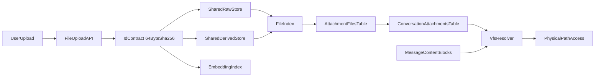

# 会话文件存储迁移方案

## 目标与范围

- 本期迁移只覆盖聊天附件，不调整 workspace 物理目录：
  - **附件存储迁移**：从当前 `user_data/<user_id>/uploads` 逐步迁移到 `user_data/<user_id>/shared/uploads/{raw,derived}`；先统一附件块 `id` 语义，保持 64 位 SHA256 并兼容 `kb_file_chunk_embeddings.file_id`；新增 `storage_key` 承载 `raw/<sha>.pdf`、`raw/<sha>.jpg`、`derived/<sha>.md` 等相对存储路径。
  - **会话挂载迁移**：新增数据库索引表记录附件文件实体与会话挂载关系，以 `conversation_id` 关联各会话附件；只作用于附件 uploads，不改变 `workspaces/<workspace_id>` 目录。
- 在消息 `content_blocks` 中，从“旧 `url` 引用”演进为“新 storage-key `url + storage_key + storage_version` 双轨兼容”；附件块现有 `id` 作为文件内容 ID。
- 新 `url` 使用 storage key 路径：
  - `/api/file/preview/<user_id>/raw/<sha>.pdf`
  - `/api/file/preview/<user_id>/raw/<sha>.jpg`
  - `/api/file/preview/<user_id>/derived/<sha>.md`
- 保证历史会话可读、上传不中断、迁移可灰度可回滚。

## 当前基线（代码现状）

- 上传入口在 [backend/app/api/file.py](/Users/apple/Desktop/code/chat-agent/backend/app/api/file.py)：`/upload` 返回 `AttachmentBlock`，当前 `/preview/{user_id}/{filename}` 走旧 uploads 磁盘路径；目标扩展为 `/preview/{user_id}/{storage_key:path}`。
- 附件路径与 URL 组装在 [backend/app/services/chat_upload/attachment.py](/Users/apple/Desktop/code/chat-agent/backend/app/services/chat_upload/attachment.py)：
  - `get_user_upload_dir()` 固定到 `.../user_data/<uid>/uploads`
  - `build_attachment_preview_url()` 当前固定旧 URL 形态，目标改为基于 `storage_key` 生成新 URL
- PDF/图片上传分别在：
  - [backend/app/services/chat_upload/pdf.py](/Users/apple/Desktop/code/chat-agent/backend/app/services/chat_upload/pdf.py)
  - [backend/app/services/chat_upload/image.py](/Users/apple/Desktop/code/chat-agent/backend/app/services/chat_upload/image.py)
- 消息持久化模型在 [backend/app/models/message_db.py](/Users/apple/Desktop/code/chat-agent/backend/app/models/message_db.py)：`content_blocks` 为 JSON，可直接做兼容字段扩展。
- 块结构在 [backend/app/schemas/chat.py](/Users/apple/Desktop/code/chat-agent/backend/app/schemas/chat.py)：`ImageBlock/PdfBlock/MarkdownBlock` 目前核心引用字段是 `url`。
- 当前 PDF 上传在 [backend/app/services/chat_upload/pdf.py](/Users/apple/Desktop/code/chat-agent/backend/app/services/chat_upload/pdf.py) 中使用原始 PDF 内容 SHA-256：
  - `PdfBlock.id = content_hash`
  - `MarkdownBlock.id = content_hash`
  - 物理文件为 `<content_hash>.pdf` 与 `<content_hash>.md`
- 当前 RAG/embedding 依赖 64 位 SHA256：
  - [backend/app/models/kb_file_chunk_embedding_db.py](/Users/apple/Desktop/code/chat-agent/backend/app/models/kb_file_chunk_embedding_db.py)：`file_id` 为 `String(64)`
  - [backend/app/utils/multimodal.py](/Users/apple/Desktop/code/chat-agent/backend/app/utils/multimodal.py)：从 `PdfBlock.id`、`MarkdownBlock.id` 收集候选附件 ID
  - [backend/app/services/chat/kb_rag_context_service.py](/Users/apple/Desktop/code/chat-agent/backend/app/services/chat/kb_rag_context_service.py)：按 `user_id + 附件 ID` 检索，并从旧 uploads 目录读取 `{id}.md`
- 当前 workspace 链路保持原状，不纳入本期迁移：
  - [backend/app/mcp/mcp_servers/agent_skills_mcp/utils.py](/Users/apple/Desktop/code/chat-agent/backend/app/mcp/mcp_servers/agent_skills_mcp/utils.py)：`get_workspace_root()` 固定到 `workspaces/<workspace_id>`
  - [backend/app/api/workspace.py](/Users/apple/Desktop/code/chat-agent/backend/app/api/workspace.py)：文件树、文件内容、下载、预览均复用 `resolve_workspace_path()`
  - [backend/app/prompts/prompt_utils.py](/Users/apple/Desktop/code/chat-agent/backend/app/prompts/prompt_utils.py)：系统提示里的 `workspace_dir` 固定展示 `data/user_data/<user_id>/workspaces/<workspace_id>`
  - [frontend/src/pages/ChatPage/components/BlockPreviewPanel/ProjectPreview/index.tsx](/Users/apple/Desktop/code/chat-agent/frontend/src/pages/ChatPage/components/BlockPreviewPanel/ProjectPreview/index.tsx)：ProjectPreview 通过 `/api/workspaces` 链路读取与预览 workspace
  - 本期不修改上述文件与目录结构。

## 目标架构

说明：
- **第一层：附件存储迁移**。附件块 `id` 是稳定业务标识，必须优先兼容现有 embedding/RAG；`storage_key` 是相对 `shared/uploads` 的存储 key，用目录表达 raw/derived 语义。
- **第二层：会话挂载迁移**。会话与附件的关系通过数据库挂载表表达，不引入新的路径协议；workspace 仍沿用旧 `workspaces/<workspace_id>` 目录。
- 真实文件位置只在服务端解析，Agent/前端通过 `url`、`id`、`storage_key` 这类受控引用访问附件。

## 分阶段实施

### Phase 0：id 合约与兼容读取先行（不改现网写入）

- 明确附件块 `id` 合约：
  - `id` 是业务层稳定文件标识，优先保持当前 64 位 SHA256，兼容 `kb_file_chunk_embeddings.file_id String(64)`。
  - `storage_key` 是存储层物理标识，使用相对路径表达文件类别：`raw/<sha>.pdf`、`raw/<sha>.jpg`、`derived/<sha>.md`。
  - 对 PDF，现有 `content_hash` 继续作为 `id`；Markdown 派生物可共享原 PDF `id`，并通过 `derived_kind`、`storage_key` 区分。
  - 对图片，需先定义哈希输入：建议以处理后实际落盘 bytes 的 SHA256 作为 `id`，避免同一原图因转码/压缩后物理文件与展示内容不一致。
- 新增统一解析层（VFS Resolver）：支持解析以下引用输入并返回真实路径与权限校验结果：
  - 旧 `url`（`/api/file/preview/{user_id}/{filename}`）
  - 新 storage-key `url`（`/api/file/preview/{user_id}/{storage_key:path}`）
  - 附件块 `id`
  - 新 `storage_key`（仅服务端解析，不作为 embedding/RAG 的候选 ID）
- 保留旧预览接口；新增 storage-key URL 预览入口，后续可再补充按 `id` 查询的内部解析能力。
- 验证点：历史会话附件可正常预览，行为与当前一致。

### Phase 1：附件上传链路升级为“shared + 会话挂载”

- `upload` 接口增加 `conversation_id`（先可选，灰度后改必填）。
- 写入策略：
  - 原始文件写入 `shared/uploads/raw/<sha>.<ext>`
  - 衍生文件写入 `shared/uploads/derived/<sha>.md`
  - 写入或复用 `attachment_files` 文件实体记录，并在 `conversation_attachments` 中新增会话挂载记录
- 返回结构：`url` 切换为新 storage-key 预览 URL，新增 `storage_key`、`storage_version=2`。
- PDF 上传后的 URL 约定：
  - PDF 原文：`/api/file/preview/<user_id>/raw/<sha>.pdf`
  - Markdown 派生：`/api/file/preview/<user_id>/derived/<sha>.md`
- `kb_file_chunk_embeddings.file_id` 继续写入 64 位附件块 `id`，不得写入 `raw/<sha>.pdf` 这类 storage key。
- 验证点：新消息中 `content_blocks` 同时包含旧新字段；前端无感。

### Phase 2：会话挂载与历史数据回填（离线任务，幂等）

- 扫描 `messages.content_blocks` 中附件块（`image/pdf/markdown`），递归处理 `PdfBlock.markdown`。
- 解析旧 URL 得到 `{user_id, filename}`，兼容相对 URL、绝对 URL、历史 `/api/file/preview/...` 与 `/api/file/image/preview/...` 形态。
- 结合消息 `conversation_id` 建挂载关系，并保证历史文件可通过新 `storage_key` 访问：
  - 推荐将旧文件复制或硬链接到 `user_data/<user_id>/shared/uploads/<storage_key>`。
  - 若暂不迁移物理文件，则 `attachment_files.legacy_source` 需记录旧路径来源，resolver 对新 storage-key URL 可回退到旧 `uploads` 文件。
- 回填块字段：`storage_key`、`storage_version`，并将数据库 `content_blocks` 内的 `url` 改写为新 storage-key URL。
- `id` 回填规则：
  - PDF/Markdown 历史 `id` 已是 PDF 内容 SHA256，保持不变；Markdown 回填 `derived_from_id` 与 `derived_kind`。
  - 图片历史 `id` 保持现有 UUID，不重新计算；`storage_key` 使用旧文件名映射为 `raw/<existing_image_id>.<ext>`。
- 失败项（缺文件、非法 URL、非法扩展名、迁移/挂载失败）写入迁移失败清单，支持重试。
- 验证点：抽样历史会话，附件 `url` 已改为新 URL；已迁移记录可通过 `storage_key` 读取，未迁移记录可通过旧 URL fallback 读取。

### Phase 3：切流与收口

- 附件读取优先级切为：`storage_key/id resolver > 旧 url fallback`。
- 上传接口将 `conversation_id` 改必填。
- 旧 URL 预览接口保留 1~2 个版本窗口后评估下线。
- 引入清理策略：会话卸载、无引用文件延迟删除、回收站策略。

## 文件级改造清单

- [backend/app/schemas/chat.py](/Users/apple/Desktop/code/chat-agent/backend/app/schemas/chat.py)
  - 为 `ImageBlock/PdfBlock/MarkdownBlock` 增加可选字段：`storage_key`、`storage_version`。
  - PDF 派生 Markdown 增加可选 `derived_from_id`、`derived_kind`；注意这些字段进入前端后会 camelCase。
  - 过渡期保留 `url`。
- [backend/app/api/file.py](/Users/apple/Desktop/code/chat-agent/backend/app/api/file.py)
  - `upload` 新增 `conversation_id` 参数（先可选）。
  - 将预览入口扩展为支持 `/preview/{user_id}/{storage_key:path}`，同时保留旧 `/preview/{user_id}/{filename}` 兼容解析。
- [backend/app/services/chat_upload/attachment.py](/Users/apple/Desktop/code/chat-agent/backend/app/services/chat_upload/attachment.py)
  - 抽离路径构建与引用生成逻辑，接入 shared 目录与 resolver。
  - 新增 `id` 与 `storage_key` 构建工具，禁止将带目录/扩展名的 storage key 写入 embedding 关联列。
  - `build_attachment_preview_url()` 改为生成 `/api/file/preview/<user_id>/<storage_key>`。
- [backend/app/services/chat_upload/image.py](/Users/apple/Desktop/code/chat-agent/backend/app/services/chat_upload/image.py)
  - 上传后按处理后 bytes 计算图片 `id`，生成 `storage_key` 并挂载到会话。
- [backend/app/services/chat_upload/pdf.py](/Users/apple/Desktop/code/chat-agent/backend/app/services/chat_upload/pdf.py)
  - 继续使用原始 PDF SHA256 作为 `id`；PDF 与 Markdown 分别生成 raw/derived `storage_key` 并建立派生关系。
  - embedding 写入和 RAG 候选仍使用 64 位 `id`。
- [backend/app/models/message_db.py](/Users/apple/Desktop/code/chat-agent/backend/app/models/message_db.py)
  - 无需立刻改表结构；`content_blocks` JSON 可直接承载新增字段。
- [backend/app/models/attachment_file_db.py](/Users/apple/Desktop/code/chat-agent/backend/app/models/attachment_file_db.py)
  - 新增附件文件实体表 `attachment_files`，记录 `user_id/content_id/storage_key/kind/mime/size/display_name/derived_from_id/derived_kind/legacy_source/storage_version`。
  - 对 `(user_id, storage_key)` 建唯一约束，对 `(user_id, content_id)` 建普通索引用于按内容 ID 查询。
- [backend/app/models/conversation_attachment_db.py](/Users/apple/Desktop/code/chat-agent/backend/app/models/conversation_attachment_db.py)
  - 新增会话挂载表 `conversation_attachments`，记录 `conversation_id/user_id/attachment_file_id/storage_key`。
  - 对 `(conversation_id, storage_key)` 建唯一约束，保证上传与历史回填可幂等重跑。
- [backend/app/alembic/versions](/Users/apple/Desktop/code/chat-agent/backend/app/alembic/versions)
  - 增加建表迁移；如果 Alembic 目录实际路径不同，以项目现有迁移目录为准。
- [backend/app/models/kb_file_chunk_embedding_db.py](/Users/apple/Desktop/code/chat-agent/backend/app/models/kb_file_chunk_embedding_db.py)
  - 不改现有 `file_id String(64)` 数据库列；该列继续存附件块 `id`。
- [backend/app/utils/multimodal.py](/Users/apple/Desktop/code/chat-agent/backend/app/utils/multimodal.py)
  - 附件候选继续从 `id` 收集；无需新增或优先读取额外字段。
- [backend/app/services/chat/kb_rag_context_service.py](/Users/apple/Desktop/code/chat-agent/backend/app/services/chat/kb_rag_context_service.py)
  - 短文档全文读取改由 resolver 找到 Markdown 派生文件，不能继续硬编码旧 uploads 目录。
- [frontend/src/services/file.ts](/Users/apple/Desktop/code/chat-agent/frontend/src/services/file.ts)
  - 上传接口支持可选 `conversationId`；注意 multipart 请求不会被全局 snakecase 自动转换，需要显式传 `conversation_id`。
- [frontend/src/interfaces/contentBlock.ts](/Users/apple/Desktop/code/chat-agent/frontend/src/interfaces/contentBlock.ts)
  - 补充 `storageKey`、`storageVersion`、`derivedFromId`、`derivedKind` 等字段。
- 本期不改 workspace 相关链路：
  - [backend/app/mcp/mcp_servers/agent_skills_mcp/utils.py](/Users/apple/Desktop/code/chat-agent/backend/app/mcp/mcp_servers/agent_skills_mcp/utils.py)
  - [backend/app/api/workspace.py](/Users/apple/Desktop/code/chat-agent/backend/app/api/workspace.py)
  - [backend/app/prompts/prompt_utils.py](/Users/apple/Desktop/code/chat-agent/backend/app/prompts/prompt_utils.py)
  - [frontend/src/pages/ChatPage/components/BlockPreviewPanel/ProjectPreview/index.tsx](/Users/apple/Desktop/code/chat-agent/frontend/src/pages/ChatPage/components/BlockPreviewPanel/ProjectPreview/index.tsx)

## 数据与安全策略

- 权限校验强制在 resolver 层完成：`user_id + conversation_id + mount relation`。
- 禁止外部直接传物理路径；仅接受 `url/id/storage_key` 这类受控引用。
- 防路径穿越：保留并扩展现有 `Path.resolve + startswith` 安全校验。
- 文件实体与挂载关系使用数据库存储，不再使用 `manifest.json`。这样可以依赖事务、唯一约束和索引处理并发上传、历史回填幂等、权限校验与跨实例部署。
- 真实文件仍位于 `user_data/<user_id>/shared/uploads/<storage_key>`；数据库只记录文件元数据、存储 key、legacy source 与挂载关系，不存放文件内容。
- 预览接口安全策略：
  - 旧 `/api/file/preview/{user_id}/{filename}` 在兼容期保留，但不扩大能力范围。
  - 新 `/api/file/preview/{user_id}/{storage_key:path}` 预览可先沿用现有无需登录的预览兼容策略，但服务端必须通过 resolver 限制 `storage_key` 只能落在该用户 `shared/uploads` 或旧 `uploads` 允许范围内。
  - 若后续启用强权限模式，新 `id/storage_key` 预览必须登录，并校验 `conversation.user_id == auth.user_id` 与挂载关系。

## 会话挂载与数据库索引约定

- 物理存储路径：
  - `user_data/<user_id>/shared/uploads/<storage_key>`
  - 典型值：`storage_key=raw/<sha>.pdf`、`raw/<sha>.jpg`、`derived/<sha>.md`
- 附件文件实体表：`attachment_files`
  - 核心字段：`id`（表主键）、`user_id`、`content_id`（对应 ContentBlock.id）、`storage_key`、`kind`、`mime`、`size`、`display_name`、`storage_version`。
  - 派生字段：`derived_from_id`、`derived_kind`，用于表达 PDF 与 Markdown 的同源关系。
  - 兼容字段：`legacy_source`，用于历史文件尚未迁入 shared 时回退旧 `uploads` 路径。
  - 约束建议：`UNIQUE(user_id, storage_key)`；索引建议：`INDEX(user_id, content_id)`。
- 会话挂载表：`conversation_attachments`
  - 核心字段：`id`、`conversation_id`、`user_id`、`attachment_file_id`、`storage_key`、`created_at`。
  - 约束建议：`UNIQUE(conversation_id, storage_key)`；索引建议：`INDEX(user_id, conversation_id)`、`INDEX(attachment_file_id)`。
- Resolver 处理流程：
  1. 从 `url` 或显式 `storage_key` 得到相对存储路径，并由 `storage_key` 首段识别 `kind=raw|derived`。
  2. 查询 `conversation_attachments`，确认 `(conversation_id, storage_key)` 已挂载到当前会话，并关联 `attachment_files` 反查 `content_id` 与文件元数据。
  3. 执行 `user_id + conversation_id + mount relation` 权限校验。
  4. 优先将 `storage_key` 映射到 `shared/uploads/<storage_key>`；若文件未迁入 shared 且 `legacy_source` 存在，则回退旧 `uploads` 路径。
  5. 对最终路径执行 `Path.resolve + startswith` 校验后再开放读取。
- 消息持久化以 `id + storage_key + storage_version` 为准。

## 预览 URL 约定

- 新 URL 统一由 `storage_key` 生成：
  - `storage_key=raw/<sha>.pdf` -> `/api/file/preview/<user_id>/raw/<sha>.pdf`
  - `storage_key=raw/<sha>.jpg` -> `/api/file/preview/<user_id>/raw/<sha>.jpg`
  - `storage_key=derived/<sha>.md` -> `/api/file/preview/<user_id>/derived/<sha>.md`
- 旧 URL 兼容：
  - `/api/file/preview/<user_id>/<sha>.pdf`
  - `/api/file/preview/<user_id>/<sha>.md`
  - `/api/file/preview/<user_id>/<uuid>.<image_ext>`
- 新上传只返回新 URL；历史回填会改写数据库 `messages.content_blocks` 中的 `url` 字段。
- 旧 URL 只作为 resolver fallback，不再作为迁移后的规范落库形态。

## id、storage_key 与文件命名规范

- `id` 统一约束：
  - 业务含义：文件内容标识，用于消息引用、会话挂载、RAG 候选、embedding 查询。
  - 格式约束：优先保持 64 位 SHA256 十六进制字符串，兼容 `kb_file_chunk_embeddings.file_id String(64)`。
  - 不允许把 `raw/<sha>.pdf`、`derived/<sha>.md` 写入 `id`。
- `storage_key` 统一约束：
  - 存储含义：相对 `shared/uploads` 的物理路径或对象 key，用于 resolver 映射磁盘路径。
  - 使用目录区分原始文件与派生文件：`raw/<sha256>.pdf`、`raw/<sha256>.jpg`、`derived/<sha256>.md`。
- PDF 原始文件：
  - `id=<pdf_sha256>`
  - `storage_key=raw/<pdf_sha256>.pdf`
- PDF 派生 Markdown：
  - `id=<pdf_sha256>`（保持与原 PDF 同源，兼容当前 RAG）
  - `storage_key=derived/<pdf_sha256>.md`
  - `derived_from_id=<pdf_sha256>`
  - `derived_kind=pdf_to_markdown`
- 图片：
  - 建议 `id=<processed_image_sha256>`，以实际落盘 bytes 计算。
  - `storage_key=raw/<processed_image_sha256>.<ext>`
- 关系约束：
  - 衍生文件必须记录 `derived_from_id` 与 `derived_kind`。
  - 同一 `id` 可对应多个 `storage_key`，但同一会话挂载表中 `storage_key` 应唯一。
- 兼容策略：过渡期 resolver 继续识别旧 `url`，但新上传与历史回填后的持久化 `url` 统一使用 storage-key URL。

## 非本期范围：Workspace 目录迁移

- 当前目录：`user_data/<user_id>/workspaces/<workspace_id>`，其中 `workspace_id` 在聊天里实际等于 `conversation_id`。
- 本期不迁移到 `user_data/<user_id>/conversations/<conversation_id>/workspace`。
- 本期不改 `agent_skills_mcp/utils.py`、`api/workspace.py`、`prompt_utils.py` 与前端 ProjectPreview 链路。
- 后续如果要统一会话产物目录，可单独立项：
  - 新增 workspace resolver，但默认仍返回旧 `workspaces/<workspace_id>`。
  - 单独验证 MCP 文件工具、ProjectPreview 文件树、文件内容、下载 zip、HTML 预览。
  - 完成数据搬迁和只读兼容窗口后，再考虑切换物理目录。

## 灰度、回滚与验收

- 灰度顺序：
  1. `id/storage_key` 合约与读兼容上线
  2. 新上传双写字段上线
  3. 会话挂载与历史附件回填
  4. 读优先级切换与旧路径收口
- 回滚策略：
  - 任一阶段可退回“旧 URL 解析优先”的读取逻辑。
  - 新增字段均为可选，不影响旧数据反序列化。
- 验收标准：
  - 历史消息附件可用率 >= 99.9%
  - 新消息 `content_blocks` 新字段覆盖率 = 100%（`id/storage_key/storage_version`）
  - `kb_file_chunk_embeddings.file_id` 保持 64 位 SHA256，RAG 检索命中率无明显下降
  - PDF 与 Markdown 的同源关系可追溯率 = 100%（`derived_from_id` 完整）
  - 无跨用户/跨会话越权读取
  - 上传与预览接口 P95 延迟无显著回归

## 实施注意事项

- 迁移任务必须幂等（可重跑、可断点续跑）。
- 迁移期间不要删除旧 `uploads` 目录内容。
- 本期不移动、不删除、不重命名旧 `workspaces` 目录内容。
- `id` 与 `storage_key` 的分工必须先定稿再改上传链路，避免污染 embedding/RAG 数据。
- 先完成可观测性（迁移进度、失败率、回退次数）再推进最终收口。

## 具体迁移执行计划（Runbook）

### 里程碑与发布节奏

- M0（第 1 周前半）：定稿 `id/storage_key` 合约，补齐 schema 与 resolver 设计。
- M1（第 1 周后半）：完成附件 Resolver 与双格式读取，开启灰度读流量 10%。
- M2（第 2 周）：上线上传双写（新 storage-key `url + id + storage_key`），新写入覆盖率达到 100%。
- M3（第 3 周）：启动历史回填，按批次推进并完成全量回填。
- M4（第 4 周）：切读优先级到新字段，旧 URL 保留只读兼容窗口（1~2 个版本）。

### Phase 0 详细步骤（id 合约与读兼容）

1. 定义并冻结 `id/storage_key` 合约：
   - `id` 保持 64 位 SHA256。
   - `storage_key` 承载 `raw/<sha>.pdf`、`raw/<sha>.<image_ext>`、`derived/<sha>.md`。
   - PDF/Markdown 同源关系用 `derived_from_id` 与 `derived_kind` 表达。
2. 新增 `resolve_file_ref(ref, user_id, conversation_id)`，支持旧 `url`、新 storage-key `url`、`id`、`storage_key` 输入，并通过数据库挂载表校验会话权限。
3. 预览链路统一先走 resolver，再映射物理路径。
4. 增加观测字段：
   - `resolve_source=url|id|storage_key`
   - `storage_key`
   - `resolve_fallback=true|false`
   - `resolve_failed_reason`
5. 灰度策略：
   - 先在内部环境全量验证。
   - 线上按用户分组灰度 10% -> 30% -> 100%。
6. 验收门槛：
   - 附件预览成功率不低于基线。
   - P95 延迟回归 < 10%。

### Phase 1 详细步骤（上传双写）

1. `upload` 接口增加 `conversation_id`（可选），缺省时仍写旧路径并打告警日志。
2. 新上传写入：
   - 原始文件：`shared/uploads/raw/<sha>.<ext>`
   - 衍生文件：`shared/uploads/derived/<sha>.md`
   - 文件实体：写入或复用 `attachment_files`
   - 会话挂载：写入 `conversation_attachments`
3. 返回与落库：
   - 响应带新 storage-key `url` + `id/storage_key/storage_version`。
   - PDF 原文 `url=/api/file/preview/<user_id>/raw/<sha>.pdf`。
   - Markdown 派生 `url=/api/file/preview/<user_id>/derived/<sha>.md`。
   - `content_blocks` 同步写入新旧字段。
   - 前端字段为 `id/storageKey/storageVersion`，并由请求层转换成后端 snake_case。
4. 验收门槛：
   - 新上传记录中 `storage_version=2` 覆盖率 100%。
   - embedding 新写入仍使用 64 位 `id`。
   - 数据库挂载写入失败率 < 0.1%（失败需有补偿重试）。

### Phase 2 详细步骤（历史回填）

1. 回填对象：
   - `messages.content_blocks` 中 `type in (image,pdf,markdown)` 且仅有旧 `url` 的记录。
   - `PdfBlock.markdown` 嵌套块必须递归处理。
2. 批处理策略：
   - 按 `messages.id` 升序分页，`batch_size=500`（默认）。
   - 每批事务提交，失败不阻塞下一批。
   - 进度断点持久化：`last_processed_message_id`。
3. 单条处理逻辑（幂等）：
   - 解析旧 URL -> `(user_id, filename)`，兼容相对 URL、绝对 URL、`/api/file/preview/...` 与历史 `/api/file/image/preview/...`。
   - 根据块类型与旧文件名生成 `storage_key`，并将旧文件复制或硬链接到 `shared/uploads/<storage_key>`；若暂不移动物理文件，则在 `attachment_files.legacy_source` 记录旧路径来源，供 resolver 从新 storage-key URL 回退到旧 `uploads`。
   - 写入或复用 `attachment_files` 文件实体记录。
   - 根据 `conversation_id` 生成/复用 `conversation_attachments` 挂载记录，按 `(conversation_id, storage_key)` 幂等去重。
   - 回填 `storage_key/storage_version`，并把旧 `url` 改写为新 storage-key URL。
   - PDF 旧文件名若为 `<sha>.pdf`，保留 `id=<sha>`，生成 `storage_key=raw/<sha>.pdf`、`url=/api/file/preview/<user_id>/raw/<sha>.pdf`。
   - Markdown 旧文件名若为 `<sha>.md` 且同 stem 存在 PDF，保留 `id=<sha>`，生成 `storage_key=derived/<sha>.md`、`url=/api/file/preview/<user_id>/derived/<sha>.md`，回填 `derived_from_id` 与 `derived_kind`。
   - 图片旧文件名若为 `<uuid>.<ext>`，保留现有 `id=<uuid>`，不重新计算图片 ID；生成 `storage_key=raw/<uuid>.<ext>` 与新 `url`。
   - 若已存在 `storage_version=2` 则跳过（幂等保障）。
4. 失败分流：
   - 文件不存在、URL 非法、扩展名非法、迁移失败、权限异常写入失败清单（含 message_id、原因、重试次数）。
5. 回填验收：
   - 成功率 >= 99.9%。
   - 失败清单全部可解释（丢文件/脏数据）。

### Phase 3 详细步骤（切流与收口）

1. 附件读优先级切换：`storage_key/id resolver > 旧 url fallback`。
2. 上传接口参数收口：`conversation_id` 改为必填。
3. 保留旧 `preview/{user_id}/{filename}` 只读兼容窗口 1~2 个版本。
4. 清理策略启用：
   - 仅卸载会话挂载，不删除 shared 原文件。
   - 无挂载引用且超过保留期才物理删除。

### 迁移任务运维与告警

- 核心指标：
  - `migration_processed_total`
  - `migration_success_total`
  - `migration_failed_total`
  - `migration_retry_total`
  - `new_ref_coverage_ratio`
  - `embedding_id_format_error_total`
- 告警建议：
  - 15 分钟窗口内失败率 > 1% 触发告警。
  - 连续 3 个批次失败率 > 5% 自动暂停任务。
  - embedding 写入出现非 64 位 `id` 立即告警。
- 每日输出迁移日报：
  - 累计进度、当日失败原因 TopN、预计完成时间。

### 回滚触发条件与动作

- 触发条件（任一满足）：
  - 线上附件可用率下降超过 0.5% 且持续 15 分钟。
  - 读链路 P95 延迟上升超过 20% 且持续 30 分钟。
  - 新上传双写失败率 > 1% 且无法自动恢复。
- 回滚动作：
  1. 读路径立即切回 `url` 优先。
  2. 暂停历史回填任务（保留断点）。
  3. 上传接口继续写旧字段，保留新字段但不依赖。
  4. 故障修复后从断点恢复回填。
