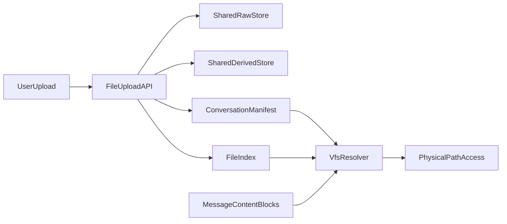

# 会话文件存储与虚拟路径迁移方案

## 目标与范围

- 将附件存储从当前 `user_data/<user_id>/uploads` 逐步迁移为：
  - `user_data/<user_id>/shared/uploads/raw`
  - `user_data/<user_id>/shared/uploads/derived`
  - `user_data/<user_id>/conversations/<conversation_id>/{workspace,artifacts}`（会话级产物）
- 在消息 `content_blocks` 中，从“仅 `url` 引用”演进为“`url + file_id + storage_version` 双轨兼容”（`vpath` 不持久化）。
- 保证历史会话可读、上传不中断、迁移可灰度可回滚。

## 当前基线（代码现状）

- 上传入口在 [backend/app/api/file.py](/Users/apple/Desktop/code/chat-agent/backend/app/api/file.py)：`/upload` 返回 `AttachmentBlock`，`/preview/{user_id}/{filename}` 走磁盘路径。
- 附件路径与 URL 组装在 [backend/app/services/chat_upload/attachment.py](/Users/apple/Desktop/code/chat-agent/backend/app/services/chat_upload/attachment.py)：
  - `get_user_upload_dir()` 固定到 `.../user_data/<uid>/uploads`
  - `build_attachment_preview_url()` 固定旧 URL 形态
- PDF/图片上传分别在：
  - [backend/app/services/chat_upload/pdf.py](/Users/apple/Desktop/code/chat-agent/backend/app/services/chat_upload/pdf.py)
  - [backend/app/services/chat_upload/image.py](/Users/apple/Desktop/code/chat-agent/backend/app/services/chat_upload/image.py)
- 消息持久化模型在 [backend/app/models/message_db.py](/Users/apple/Desktop/code/chat-agent/backend/app/models/message_db.py)：`content_blocks` 为 JSON，可直接做兼容字段扩展。
- 块结构在 [backend/app/schemas/chat.py](/Users/apple/Desktop/code/chat-agent/backend/app/schemas/chat.py)：`ImageBlock/PdfBlock/MarkdownBlock` 目前核心引用字段是 `url`。

## 目标架构

说明：
- `conversation/uploads` 实现为“虚拟视图（挂载关系）”，不做文件拷贝。
- 真实文件位置只在服务端解析，Agent/前端只接触虚拟引用。

## 分阶段实施

### Phase 0：兼容读取先行（不改现网写入）

- 新增统一解析层（VFS Resolver）：支持解析以下引用输入并返回真实路径与权限校验结果：
  - 旧 `url`（`/api/file/preview/{user_id}/{filename}`）
  - 新 `file_id`
- `vpath` 作为动态输出能力（可选），不作为持久化输入依赖。
- 保留旧预览接口；新增基于 `file_id` 的预览入口。
- 验证点：历史会话附件可正常预览，行为与当前一致。

### Phase 1：上传链路升级为“shared + 会话挂载”

- `upload` 接口增加 `conversation_id`（先可选，灰度后改必填）。
- 写入策略：
  - 原始文件写入 `shared/uploads/raw`
  - 衍生文件写入 `shared/uploads/derived`
  - 在 `conversations/<cid>/manifest.json` 新增挂载记录
- 返回结构：保持 `url`，新增 `file_id`、`storage_version=2`；`vpath` 如需展示由服务端动态生成。
- 验证点：新消息中 `content_blocks` 同时包含旧新字段；前端无感。

### Phase 2：历史数据回填（离线任务，幂等）

- 扫描 `messages.content_blocks` 中附件块（`image/pdf/markdown`）。
- 解析旧 URL 得到 `{user_id, filename}`，结合消息 `conversation_id` 建挂载关系。
- 回填块字段：`file_id`、`storage_version`（保留 `url`）；不回填持久化 `vpath`。
- 失败项（缺文件、非法 URL）写入迁移失败清单，支持重试。
- 验证点：抽样历史会话，附件读取优先走新引用并可回退旧 URL。

### Phase 3：切流与收口

- 读取优先级切为：`file_id > url`（`vpath` 仅展示，不参与持久化读取判定）。
- 上传接口将 `conversation_id` 改必填。
- 旧 URL 预览接口保留 1~2 个版本窗口后评估下线。
- 引入清理策略：会话卸载、无引用文件延迟删除、回收站策略。

## 文件级改造清单

- [backend/app/schemas/chat.py](/Users/apple/Desktop/code/chat-agent/backend/app/schemas/chat.py)
  - 为 `ImageBlock/PdfBlock/MarkdownBlock` 增加可选字段：`file_id`、`storage_version`。
  - `vpath` 如保留，仅作为响应动态字段，不写入持久化数据。
  - 过渡期保留 `url`。
- [backend/app/api/file.py](/Users/apple/Desktop/code/chat-agent/backend/app/api/file.py)
  - `upload` 新增 `conversation_id` 参数（先可选）。
  - 新增按 `file_id` 预览接口。
- [backend/app/services/chat_upload/attachment.py](/Users/apple/Desktop/code/chat-agent/backend/app/services/chat_upload/attachment.py)
  - 抽离路径构建与引用生成逻辑，接入 shared 目录与 resolver。
- [backend/app/services/chat_upload/image.py](/Users/apple/Desktop/code/chat-agent/backend/app/services/chat_upload/image.py)
  - 上传后生成新引用字段并挂载到会话。
- [backend/app/services/chat_upload/pdf.py](/Users/apple/Desktop/code/chat-agent/backend/app/services/chat_upload/pdf.py)
  - 统一使用 shared raw/derived 目录并生成挂载关系。
- [backend/app/models/message_db.py](/Users/apple/Desktop/code/chat-agent/backend/app/models/message_db.py)
  - 无需立刻改表结构；`content_blocks` JSON 可直接承载新增字段。

## 数据与安全策略

- 权限校验强制在 resolver 层完成：`user_id + conversation_id + mount relation`。
- 禁止外部直接传物理路径；仅接受 `url/file_id`（`vpath` 仅作为可选展示输出）。
- 防路径穿越：保留并扩展现有 `Path.resolve + startswith` 安全校验。
- 建议补充 `file_index` 与 `mount_index`（可先文件 manifest，后续再数据库化）。

## file_id 与文件命名规范

- 原始文件命名：`file_<sha256>.pdf`
- 衍生 Markdown 命名：`drv_<sha256>.md`
- 统一约束：`<sha256>` 一律使用原始 PDF 文件内容的 SHA-256（而非 Markdown 内容哈希）。
- 关系约束：
  - 衍生文件需记录 `derived_from_file_id=file_<sha256>.pdf`
  - 衍生类型建议记录 `derived_kind=pdf_to_markdown`
- 兼容策略：过渡期继续保留旧 `url`，新逻辑优先依赖 `file_id` 与派生关系字段。

## 灰度、回滚与验收

- 灰度顺序：
  1. 读兼容上线
  2. 新上传双写字段上线
  3. 历史回填
  4. 读优先级切换
- 回滚策略：
  - 任一阶段可退回“仅依赖 `url`”读取逻辑。
  - 新增字段均为可选，不影响旧数据反序列化。
- 验收标准：
  - 历史消息附件可用率 >= 99.9%
  - 新消息 `content_blocks` 新字段覆盖率 = 100%
  - PDF 与 Markdown 的同源关系可追溯率 = 100%（`derived_from_file_id` 完整）
  - 无跨用户/跨会话越权读取
  - 上传与预览接口 P95 延迟无显著回归

## 实施注意事项

- 迁移任务必须幂等（可重跑、可断点续跑）。
- 迁移期间不要删除旧 `uploads` 目录内容。
- 先完成可观测性（迁移进度、失败率、回退次数）再推进最终收口。

## 具体迁移执行计划（Runbook）

### 里程碑与发布节奏

- M1（第 1 周）：完成 Resolver 与双格式读取，开启灰度读流量 10%。
- M2（第 2 周）：上线上传双写（`url + file_id`），新写入覆盖率达到 100%。
- M3（第 3 周）：启动历史回填，按批次推进并完成全量回填。
- M4（第 4 周）：切读优先级到新字段，旧 URL 保留只读兼容窗口（1~2 个版本）。

### Phase 0 详细步骤（读兼容）

1. 新增 `resolve_file_ref(ref, user_id, conversation_id)`，支持 `url/file_id` 两种输入。
2. 预览链路统一先走 resolver，再映射物理路径。
3. 增加观测字段：
   - `resolve_source=url|file_id`
   - `resolve_fallback=true|false`
   - `resolve_failed_reason`
4. 灰度策略：
   - 先在内部环境全量验证。
   - 线上按用户分组灰度 10% -> 30% -> 100%。
5. 验收门槛：
   - 附件预览成功率不低于基线。
   - P95 延迟回归 < 10%。

### Phase 1 详细步骤（上传双写）

1. `upload` 接口增加 `conversation_id`（可选），缺省时仍写旧路径并打告警日志。
2. 新上传写入：
   - 原始文件：`shared/uploads/raw`
   - 衍生文件：`shared/uploads/derived`
   - 会话挂载：`conversations/<cid>/manifest.json`
3. 返回与落库：
   - 响应带 `url`（旧）+ `file_id/storage_version`（新）。
   - `content_blocks` 同步写入新旧字段。
4. 验收门槛：
   - 新上传记录中 `storage_version=2` 覆盖率 100%。
   - `manifest` 写入失败率 < 0.1%（失败需有补偿重试）。

### Phase 2 详细步骤（历史回填）

1. 回填对象：
   - `messages.content_blocks` 中 `type in (image,pdf,markdown)` 且仅有旧 `url` 的记录。
2. 批处理策略：
   - 按 `messages.id` 升序分页，`batch_size=500`（默认）。
   - 每批事务提交，失败不阻塞下一批。
   - 进度断点持久化：`last_processed_message_id`。
3. 单条处理逻辑（幂等）：
   - 解析旧 URL -> `(user_id, filename)`。
   - 根据 `conversation_id` 生成/复用挂载记录。
   - 回填 `file_id/storage_version`，保留旧 `url`。
   - 若命中 `.md` 且同 stem 存在 `.pdf`，回填 `derived_from_file_id` 与 `derived_kind`。
   - 若已存在 `storage_version=2` 则跳过（幂等保障）。
4. 失败分流：
   - 文件不存在、URL 非法、权限异常写入失败清单（含 message_id、原因、重试次数）。
5. 回填验收：
   - 成功率 >= 99.9%。
   - 失败清单全部可解释（丢文件/脏数据）。

### Phase 3 详细步骤（切流与收口）

1. 读优先级切换：`file_id > url`。
2. 上传接口参数收口：`conversation_id` 改为必填。
3. 保留旧 `preview/{user_id}/{filename}` 只读兼容窗口 1~2 个版本。
4. 清理策略启用：
   - 仅卸载会话挂载，不删除 shared 原文件。
   - 无挂载引用且超过保留期才物理删除。

### 迁移任务运维与告警

- 核心指标：
  - `migration_processed_total`
  - `migration_success_total`
  - `migration_failed_total`
  - `migration_retry_total`
  - `new_ref_coverage_ratio`
- 告警建议：
  - 15 分钟窗口内失败率 > 1% 触发告警。
  - 连续 3 个批次失败率 > 5% 自动暂停任务。
- 每日输出迁移日报：
  - 累计进度、当日失败原因 TopN、预计完成时间。

### 回滚触发条件与动作

- 触发条件（任一满足）：
  - 线上附件可用率下降超过 0.5% 且持续 15 分钟。
  - 读链路 P95 延迟上升超过 20% 且持续 30 分钟。
  - 新上传双写失败率 > 1% 且无法自动恢复。
- 回滚动作：
  1. 读路径立即切回 `url` 优先。
  2. 暂停历史回填任务（保留断点）。
  3. 上传接口继续写旧字段，保留新字段但不依赖。
  4. 故障修复后从断点恢复回填。
