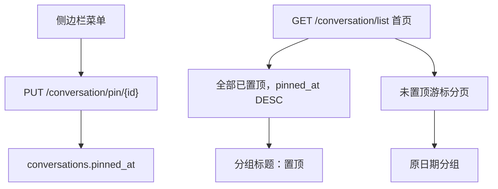

# 会话置顶 / 取消置顶

侧边栏菜单（[frontend/src/components/Layout/hooks.tsx](frontend/src/components/Layout/hooks.tsx) 第 59–75 行）增加「置顶」/「取消置顶」。置顶状态写入数据库，刷新和换设备后仍保留。多个会话可同时置顶；后置顶的排在「置顶」组最上面。未置顶会话仍按最后消息时间落入「今天 / 昨天 / …」。

## 后端

在 [backend/app/models/conversation_db.py](backend/app/models/conversation_db.py) 增加可空字段 `pinned_at: datetime | None`。`None` 表示未置顶。新增 Alembic 迁移（`down_revision` 接当前 head，先用 `uv run alembic heads` 确认），`upgrade` / `downgrade` 可回滚。

新接口 `PUT /conversation/pin/{conversation_id}`，请求体 `{ pinned: bool }`，校验归属用户后：

- 置顶：`pinned_at = now()`（再次置顶会刷新时间，从而排到最前）
- 取消：`pinned_at = null`

返回完整 `ConversationInfo`（`model_dump` 已带上新字段，经 camelCase 变成 `pinnedAt`）。流式 `refresh_conversation` 走同一模型序列化，新消息不会把置顶状态冲掉。

列表分页 [get_conversations_paginated](backend/app/services/conversation/conversation_db.py) 调整，避免置顶会话只出现在某一页、或和日期列表重复：

- 无 cursor 的首页：先取该用户全部 `pinned_at IS NOT NULL` 的会话（`pinned_at DESC`），再接一页 `pinned_at IS NULL` 的未置顶会话（沿用现有 `(last_message_created_at DESC, id DESC)` 游标）
- 有 cursor 的后续页：只返回未置顶会话
- `has_more` / `next_cursor` 只针对未置顶页；首页条数可以大于 `limit`

在 [backend/tests/services/conversation/test_conversation_list_cursor.py](backend/tests/services/conversation/test_conversation_list_cursor.py) 补用例：多条置顶按 `pinned_at` 新的在前、首页不含重复、续页不再返回已置顶项。现有未置顶用例保持通过（`pinned_at` 默认为空）。

## 前端

- [frontend/src/interfaces/conversation.ts](frontend/src/interfaces/conversation.ts)：`ConversationInfo.pinnedAt: string | null`
- [frontend/src/services/conversation.ts](frontend/src/services/conversation.ts) 与 [frontend/src/store/slices/conversationSlice.ts](frontend/src/store/slices/conversationSlice.ts)：`pinConversation`，成功后用返回值更新列表和当前会话（与重命名同一套就地更新）
- [frontend/src/components/Layout/hooks.tsx](frontend/src/components/Layout/hooks.tsx)：
  - 菜单第一项：已置顶显示「取消置顶」，否则「置顶」，图标 `PushpinOutlined`
  - 组装 `items` 时先放已置顶（`pinnedAt` 降序，`group: "置顶"`），再放未置顶（仍用 `getConversationGroup`）
  - `@ant-design/x` 的 `Conversations` 按 items 里分组首次出现的顺序渲染，置顶项放在数组前面后，「置顶」组就在日期组之上；没有置顶会话时不出现该组
  - 分组标题沿用现有 `groupable.label`，文案即为分组名「置顶」

未置顶会话在视图里按 `lastMessageCreatedAt` 降序排列，取消置顶后回到对应日期组，而不是留在原来的数组下标。
