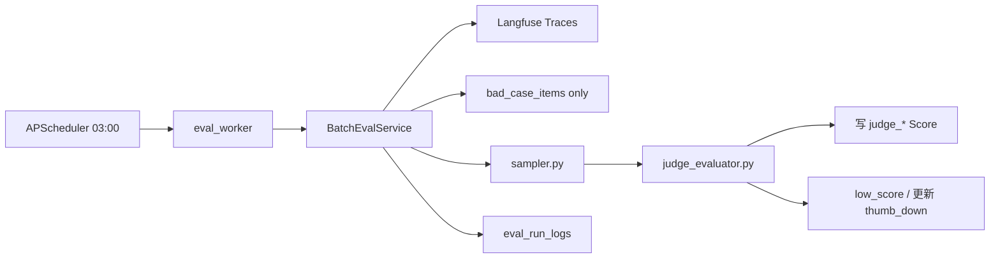
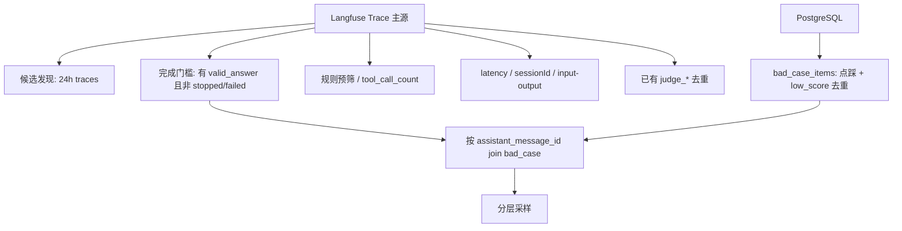

# 分层采样评估 Worker 实现计划

按 [backend/docs/batch_eval_worker_design.md](backend/docs/batch_eval_worker_design.md) 落地；特殊场景 **仅实现方案 A**：用户点踩 / 快速追问(<30s) / 高延迟(>30s) → 100% 采样。embedding 聚类与 bad case 相似度匹配明确不做。

## 架构

## 数据读取来源（已确认：混合读取）

**结论：Langfuse Trace 为主源 + 仅 join `bad_case_items`；不读 `messages` 表（含 `status` / `feedback` / `message_metadata`）。**

两类 metadata 不要混：

| 概念 | 是什么 | Worker 是否用 |
|------|--------|---------------|
| **Langfuse Trace metadata** | `propagate_attributes` 写入：`conversation_id`、`assistant_message_id`、`agent_mode` 等 | **用**：关联主键、风险分层（补写 `called_tools` 后） |
| **`messages.message_metadata`** | 请求侧配置快照（如 `source_config` / `think_mode`） | **不用** |

### 如何摆脱 `messages.status`

现有链路事实（[`chat_orchestrator.py`](backend/app/services/chat/chat_orchestrator.py)）：

- **成功完成**才会跑 `evaluate_and_score` → Trace 上有 `valid_answer` 等规则分
- **stopped / failed** 只 `root_span.update(metadata={"status": ...})`，**不写规则分**

因此 Worker 用 Trace 自身信号过滤终态，无需查 `messages.status`：

1. **硬排除**：`metadata.status in ("stopped", "failed")`
2. **完成门槛（主信号）**：必须存在规则分 `valid_answer`（兼容历史未写 `status=done` 的 Trace）
3. **必做加固**：成功路径在规则评估后写 `metadata.status=done`（与 stopped/failed 对称，便于人读与排查）

实现位置：[`chat_orchestrator.py`](backend/app/services/chat/chat_orchestrator.py) 成功收尾处（已有 `root_span.update(output=...)`）一并写入 `metadata={"status": MessageStatus.DONE.value}`；过滤仍以规则分为准，`status=done` 作显式终态标签。

字段级来源分工：

| 信号 | 来源 | 原因 |
|------|------|------|
| 过去 24h 候选池 | Langfuse Trace | 评估天然挂在 Trace |
| 是否可评（替代 status） | Trace：有 `valid_answer` + 非 stopped/failed | 规则分仅成功路径写入 |
| 规则预筛 / 风险分层 | Langfuse scores + metadata.`called_tools` | 补写后无需查库 |
| 高延迟 / 快速追问 | Langfuse latency / sessionId | Trace 自带 |
| 用户点踩（含理由） | **`bad_case_items`** `source=thumb_down` | 入队已带理由 |
| 已评 / low_score 去重 | Langfuse `judge_*` + bad_case | 双保险 |
| query/answer 正文 | Trace input/output | 不回落 messages |

点踩与去重：

- `thumb_down` 且尚无 `judge_*` / 有效 `judge_scores` → 100% 送裁判
- 去重排除：已有 `judge_*`、已有 `low_score`、未过完成门槛（无规则分或 stopped/failed）
- 裁判后：回写 Langfuse；更新该 thumb_down 行的 `judge_scores`，不重复 enqueue `low_score`

## 关键对接修正（相对设计文档）

| 设计假设 | 现状 | 处理 |
|---------|------|------|
| `metadata.message_id` | Langfuse 为 `assistant_message_id` | 用其 join bad_case |
| `metadata.called_tools` | 未写入 | `rule_evaluator` 补写到 Langfuse metadata |
| 点踩看 Trace score | 未写 Langfuse | 从 **`bad_case_items(source=thumb_down)`** 读 |
| `message.status == stopped` | 设计读 DB | **不读 messages**：用 `metadata.status` + **必须有 `valid_answer` 规则分** |
| 成功无 `status=done` | 仅 stop/fail 写 status | **必做**：成功路径写 `metadata.status=done` |
| Step2 空回答入 `rule_fail` | 实时链路已入队 | Worker 只跳过 |

## 实现步骤

### 1. 模型与迁移：`eval_run_logs`

- 新增 [`backend/app/models/eval_run_log_db.py`](backend/app/models/eval_run_log_db.py)（字段对齐设计 §四）
- 在 models 导出处注册；Alembic 迁移建表
- 扩展 [`backend/app/schemas/eval.py`](backend/app/schemas/eval.py)：`EvalRunLogResponse` 等（供后续 API/脚本打印；本期可不挂 REST）

### 2. Trace 侧补齐：`called_tools` + `status=done`

- [`rule_evaluator.py`](backend/app/evaluators/rule_evaluator.py)：算出 `called_tools` 后写入 span metadata（失败静默）；无工具写空列表
- [`chat_orchestrator.py`](backend/app/services/chat/chat_orchestrator.py)：成功收尾 `root_span.update` 时写入 `metadata={"status": MessageStatus.DONE.value}`（与 stopped/failed 对称）

### 3. 分层采样器

新增 [`backend/app/evaluators/sampler.py`](backend/app/evaluators/sampler.py)：

- `RiskLevel` + `HIGH_RISK_TOOLS` / `MED_RISK_TOOLS` / `SAMPLE_RATES`（可从配置覆盖）
- `classify_risk`：优先 `called_tools`；否则 `tool_call_count > 0` → MEDIUM
- `is_effective_answer`：排除 `valid_answer=false` / 极短(<10) / 纯闲聊(无工具且 <50 字)
- `detect_special_signals`：**仅** thumb_down / follow_up / latency>30
- `stratified_sample`：特殊全量 + 高 40% / 中 15% / 低 5%

单测 [`backend/tests/evaluators/test_sampler.py`](backend/tests/evaluators/test_sampler.py)：mock Trace 验证分桶比例与跳过逻辑。

### 4. 裁判封装

新增 [`backend/app/evaluators/judge_evaluator.py`](backend/app/evaluators/judge_evaluator.py)：

- 线上批量路径默认用 **无 gold** prompt（对比 `retrieved_contexts`）；保留 with-gold 供评估集复用
- 解析容错、`JudgeResult` dataclass
- LLM caller 注入（与设计一致）；worker 用 `resolve_scenario("summarization")` + AsyncOpenAI
- Prompt 字段名尽量与现有 [`scripts/run_judge_eval.py`](backend/scripts/run_judge_eval.py) 的 `correctness_score`/`completeness_score` 兼容（解析时两者都认）

单测：解析器与失败路径（mock llm_caller）。

### 5. 批量编排服务

新增 [`backend/app/services/eval/batch_eval_service.py`](backend/app/services/eval/batch_eval_service.py)：

1. 拉 24h Trace（分页 `fetch_traces`）
2. 完成门槛过滤：排除 `metadata.status in (stopped, failed)`；**无 `valid_answer` 规则分的 Trace 直接跳过**（替代 messages.status）
3. 按 `assistant_message_id` **批量查** `bad_case_items`（点踩信号 + low_score 去重）
4. 去重：已有 `judge_*` / 已有 `low_score`
5. 采样：无裁判分的 thumb_down + follow_up + latency→100%；其余按风险分层
6. 并发裁判（Semaphore，默认 5；`asyncio.wait_for` 单条超时）
7. 写 `judge_*`；低分 → enqueue `low_score`；已是 thumb_down 则只更新其 `judge_scores`
8. 全程更新 `EvalRunLog`

`rule_scores` 入队时尽量从 Trace scores 快照带上。

### 6. Worker + 手动脚本 + 配置

- [`backend/eval_worker/main.py`](backend/eval_worker/main.py)：AsyncIOScheduler，默认 `0 3 * * *` Asia/Shanghai；优雅退出
- [`backend/eval_worker/config.py`](backend/eval_worker/config.py)：薄封装读 settings
- [`backend/scripts/run_batch_eval.py`](backend/scripts/run_batch_eval.py)：`--hours` / `--dry-run`（只采样不调裁判）
- [`backend/app/schemas/config.py`](backend/app/schemas/config.py) 新增 `EvalWorkerConfig`；挂到 `Settings.eval_worker`
- `pyproject.toml` 增加 `apscheduler` 依赖

### 7. Docker Compose

[`docker-compose.yml`](docker-compose.yml) 增加 `evaluator` 服务：`uv run python -m eval_worker.main`，复用 backend 镜像与 `.env`，`DATABASE__HOST=postgres`，资源限制按设计。

### 8. 明确不做（本期）

- 新 query embedding 聚类 / bad case 相似度 100% 采样
- 点踩事件驱动实时调裁判（现状只 enqueue；无裁判分的 thumb_down 由 Worker 补评）
- 依赖 `messages` 表（status / feedback / message_metadata）做评估信号
- 裁判人工校准 50 条（运维流程，非代码）
- `/api/eval` 增加 run-log REST（可后续加）

## 验证

1. `uv run pytest tests/evaluators/test_sampler.py tests/evaluators/test_judge_evaluator.py -q`
2. 本地 `uv run python scripts/run_batch_eval.py --dry-run` 看采样分布
3. 小窗口 `--hours 2` 实跑一轮，确认 Langfuse score + `bad_case_items` source=`low_score` + `eval_run_logs` 落库
4. `make lint` 相关改动无回归

## 主要改动文件

- 新增：`eval_run_log_db.py`、`sampler.py`、`judge_evaluator.py`、`batch_eval_service.py`、`eval_worker/*`、`scripts/run_batch_eval.py`、迁移、测试
- 修改：`rule_evaluator.py`（写 called_tools）、`schemas/config.py` + `core/config.py`、`schemas/eval.py`、`pyproject.toml`、`docker-compose.yml`
