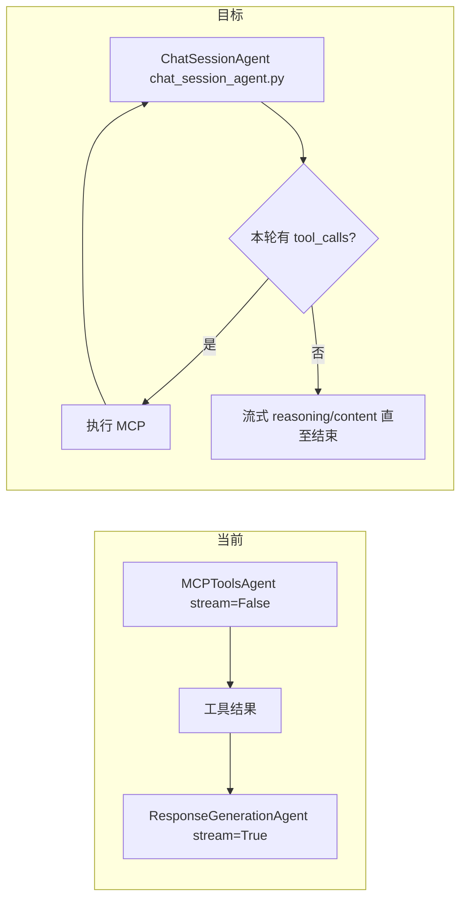

# 合并 MCP 与最终应答为单会话 Agent（流式工具 + 工具阶段深度思考）

## 现状（关键结论）

- 编排入口：[backend/app/services/chat/chat_service.py](backend/app/services/chat/chat_service.py) 中 `stream_message` **顺序**调用 `MCPToolsAgent.stream_execute`，再调用 `ResponseGenerationAgent.stream_execute`；持久化汇总在 `get_collected_response()`：正文/顶层 `reasoning` 来自应答 Agent，`tool_calls` 来自 MCP Agent。
- 工具轮次 LLM 调用：[backend/app/agents/mcp_tools_agent.py](backend/app/agents/mcp_tools_agent.py) 的 `_call_llm_with_mcp_tools` 使用 `**stream=False`**（约 662–669 行），每轮只在拿到完整 `choices[0].message` 后才 `yield ToolUseMessage`；因此**没有 token/增量级流式**，`reasoning_content` 虽写入 `ToolUseMessage`，但**不会**像最终应答那样走 `reasoning` SSE。
- 最终应答流式与深度思考：[backend/app/agents/response_generation_agent.py](backend/app/agents/response_generation_agent.py) 的 `_stream_final_response` 处理 `delta.reasoning_content` → SSE `reasoning`，`delta.content` → SSE `content`。
- 前端：[frontend/src/hooks/chat.ts](frontend/src/hooks/chat.ts) 中 `mcp_tool_call` 走 `appendMcpToolCallToLastMessage`，`reasoning` 走 `appendReasoningToLastMessage`；工具时间线已支持 `reasoningContent`（见 [frontend/src/interfaces/tooCall.ts](frontend/src/interfaces/tooCall.ts)）。

## 目标架构

1. **单会话（单条 API 消息线程）**：在同一 `messages` 列表上循环——system + 历史 + 当前用户问题 →（多轮）assistant(tool_calls) + tool → … → 最终 assistant 仅输出自然语言（无 tool_calls）。**不再**在工具结束后用 `get_user_message_combine_tool_calls` 拼一大段「伪用户消息」再走第二次独立 completion（当前应答阶段逻辑，见 [response_generation_agent.py](backend/app/agents/response_generation_agent.py) 68–87 行）。
2. **工具调用流式**：每个「工具决策轮」使用 `call_llm_api(..., stream=True, tools=...)`，对 `ChatCompletionChunk` 增量累积：
  - `delta.reasoning_content`（若存在且 `think_mode`）
  - `delta.tool_calls`（按 OpenAI 惯例用 `index` 合并 `id` / `function.name` / `function.arguments` 片段）
  - 可选的 `delta.content`（部分模型在出工具前会有说明性文本）
3. **工具阶段深度思考**：在累积完成并 `yield` 完整 `ToolUseMessage` 之前，将 `reasoning_content` **增量**通过 SSE 下发（见下方「前后端协议」）。

## 模型与配置（已拍板）

- **决策**：合并后的单会话 Agent **统一使用 `settings.response_model`**（`LLMConfig`），工具轮与最终应答共用同一客户端、同一 `model_name` / `think_model_name`（由 `think_mode` 切换），不再在会话主链路中使用 `tool_call_model`。
- **实现要点**：[chat_service.py](backend/app/services/chat/chat_service.py) 中合并 Agent 构造入参改为传入 `llm_config=settings.response_model`；`TitleGenerationAgent` 等**非**本会话主链路的调用可继续单独使用 `tool_call_model`（若标题生成仍希望用便宜模型），与计划范围无关的保持现状即可。
- **前提与验证**：须在目标供应商上确认 `response_model` 同时支持 **tools**、**stream**、以及思考模式下的 `**reasoning_content`**（或等价字段）；若某环境不满足，用配置开关回退「工具轮非流式」而非改回双模型双 completion。

## 提示词与上下文

- **System**：合并「MCP 使用规则」（来自 [get_prompt_with_mcp_servers](backend/app/prompts/__init__.py) 相关逻辑）与「最终回答风格 / 记忆 / 窗口外摘要」（来自 [get_system_prompt_for_response_generation](backend/app/agents/utils/response_generation.py) 与 prompts）。注意：原 MCP 阶段里对「最后一条 user」打补丁的逻辑（`[_update_user_message_with_tool_hints](backend/app/agents/mcp_tools_agent.py)`）在单会话中仍需要等价能力：可改为每轮迭代前追加一条 **ephemeral system** 或 **developer/user 后缀**，避免污染持久化历史语义，但要保持与现网行为一致（迭代上限、禁用工具提示等）。
- **历史**：继续通过 `process_history_messages` / `_compose_messages` 提供；工具轮产生的 assistant/tool 消息只存在于**本次请求**的 `messages` 中，并最终进入 `output_messages` 供落库（与现网一致）。
- **无 MCP 工具**：`get_tools_for_llm` 为空时，应**直接**进入流式应答（等价于当前仅应答阶段），不要空跑工具循环。

## 模块落点：新建 `chat_session_agent.py`（已拍板）

- **主实现**：新建 [backend/app/agents/chat_session_agent.py](backend/app/agents/chat_session_agent.py)，定义 `**ChatSessionAgent`**（继承 `BaseAgent`），作为**唯一**会话主链路编排类，合并原 `MCPToolsAgent` + `ResponseGenerationAgent` 的职责。
- **自 [mcp_tools_agent.py](backend/app/agents/mcp_tools_agent.py) 迁入/复用**：MCP 工具列表、迭代与 hints（`_update_user_message_with_tool_hints` 等）、单工具执行与并行执行、结果压缩（`ContextCompactor` / Tavily 等）——可**先复制再删旧文件**，或抽成 `agents/mcp_tool_runner.py` 等私有模块由 `ChatSessionAgent` 组合调用，避免单文件过大。
- **自 [response_generation_agent.py](backend/app/agents/response_generation_agent.py) 迁入**：最终轮 `reasoning`/`content` 的 chunk 循环建议抽到 `**agents/streaming_llm.py`（或同目录小模块）** 中的纯函数/小类，供 `ChatSessionAgent` 调用；**删除**或保留极薄壳的 `ResponseGenerationAgent` 仅当别处仍引用（grep 后无引用则删文件并从 [agents/**init**.py](backend/app/agents/__init__.py) 导出中移除）。
- **注册**：`ChatService` 仅构造 `ChatSessionAgent(mcp_manager=..., llm_config=settings.response_model, ...)`，不再构造 `MCPToolsAgent` / `ResponseGenerationAgent`。

## 流式工具调用的实现要点（后端，均在 ChatSessionAgent 内）

- 在 `ChatSessionAgent` 中实现 `_stream_one_tool_round`：
  - 消费 `AsyncStream[ChatCompletionChunk]`，直到 `finish_reason` 为 `tool_calls` 或 `stop`。
  - **tool_calls**：参考 OpenAI 文档，用 `index` 聚合；`arguments` 需拼接 JSON 字符串后再 `json.loads` 校验；聚合完成后再 `yield` 与现网结构一致的 `ToolUseMessage`（并写入 `output_messages`），再并行执行工具（逻辑从原 `MCPToolsAgent` 迁入）。
  - **reasoning**：边收边 `yield` SSE（见下）；轮次结束后将完整 `reasoning_content` 写入 `ToolUseMessage`，供 DB/前端时间线展示。
  - **无 tool_calls**：调用共享的「最终应答流式」逻辑（由原 `response_generation_agent.py` 132–211 行抽取），输出 `reasoning` / `content` SSE；**注意**：`done` 仍由 [chat_service.stream_response](backend/app/services/chat/chat_service.py) 统一发送，Agent 内不重复发 `done`。
- **错误与兼容**：若供应商在 `stream=True` 且带 `tools` 时行为异常（无 `tool_calls` 增量、finish_reason 不准），需要特性开关或回退 `stream=False` 单轮（可配置），避免生产全挂。
- **parallel_tool_calls**：流式下仍尽量保持与现网一致；若某供应商不支持，在配置中关闭。

## 前后端协议（深度思考展示）

优先 **少改前端** 的路径：

- **工具轮次中的 reasoning 增量**：通过现有 `mcp_tool_call` 事件携带**同一 assistant 步骤**的 `reasoningContent` 片段（或新增 `reasoningDelta` 字段，由 reducer 拼到当前 tool 时间线条目）。需在 [chatSlice.ts](frontend/src/store/slices/chatSlice.ts) 的 `appendMcpToolCallToLastMessage` 中支持「更新最后一条 assistant 工具消息」而不仅是追加新条目（若当前实现只在整条消息到达时写入，则要扩展）。
- **最终回答的 reasoning**：保持现有 SSE `reasoning` + `content`（与现网一致）。若工具轮已用 `mcp_tool_call` 推思考，最终轮仍用顶层 `reasoning`，则同一条助手消息会同时有「工具条内思考」和「最终思考」——与 DeepSeek 类产品行为接近，一般可接受。

`CollectedResponse`（[chat_service.py](backend/app/services/chat/chat_service.py) 546–552 行）需改为从 `**ChatSessionAgent`** 实例读取 `content` / `reasoning` / `tool_calls`（与现网两 Agent 汇总等价字段）。

## 涉及文件（预期）

| 区域        | 文件                                                                                                                                                                                                                                                                     |
| --------- | ---------------------------------------------------------------------------------------------------------------------------------------------------------------------------------------------------------------------------------------------------------------------- |
| 编排        | [backend/app/services/chat/chat_service.py](backend/app/services/chat/chat_service.py)：`ChatSessionAgent` 单入口、`get_collected_response` 改读新实例                                                                                                                           |
| Agent 主文件 | **新建** [backend/app/agents/chat_session_agent.py](backend/app/agents/chat_session_agent.py)：`ChatSessionAgent`                                                                                                                                                         |
| Agent 清理  | **删除或瘦身** [backend/app/agents/mcp_tools_agent.py](backend/app/agents/mcp_tools_agent.py)、[backend/app/agents/response_generation_agent.py](backend/app/agents/response_generation_agent.py)（逻辑迁出后）；更新 [backend/app/agents/**init**.py](backend/app/agents/__init__.py) |
| 共享流式      | **新建（可选）** `backend/app/agents/streaming_llm.py`（或等价）：从原 `response_generation_agent` 抽取最终轮 chunk 循环                                                                                                                                                                    |
| 提示词       | `backend/app/prompts/` 下合并 system 文案                                                                                                                                                                                                                                   |
| 前端        | [frontend/src/store/slices/chatSlice.ts](frontend/src/store/slices/chatSlice.ts)、必要时 [frontend/src/hooks/chat.ts](frontend/src/hooks/chat.ts) / [tooCall.ts](frontend/src/interfaces/tooCall.ts)                                                                       |
| 文档        | 若需同步 [backend/docs/RETRIEVAL_SYSTEM.md](backend/docs/RETRIEVAL_SYSTEM.md) / [COMPONENT_TOOLS_PRD.md](backend/docs/COMPONENT_TOOLS_PRD.md) 中与两阶段 Agent 矛盾的描述（仅在被要求或明显过时再改）                                                                                              |

## 测试建议

- 后端：对「流式 chunk 聚合 tool_calls」做单测（构造多 chunk、多 index、arguments 分片）。
- 集成：在 `think_mode=true` 下走一轮带工具与一轮无工具，确认 SSE 顺序与落库字段（`reasoning`、`tool_calls`）完整。
- 回归：`mcp_auto_mode=false`、无可用 MCP、仅闲聊路径。

## 风险

- 不同 OpenAI 兼容网关对流式 `tool_calls` / `reasoning_content` 组合支持不一致；合并后完全依赖 `response_model` 具备该组合能力，需在该模型上先验证再默认开启流式工具轮。
