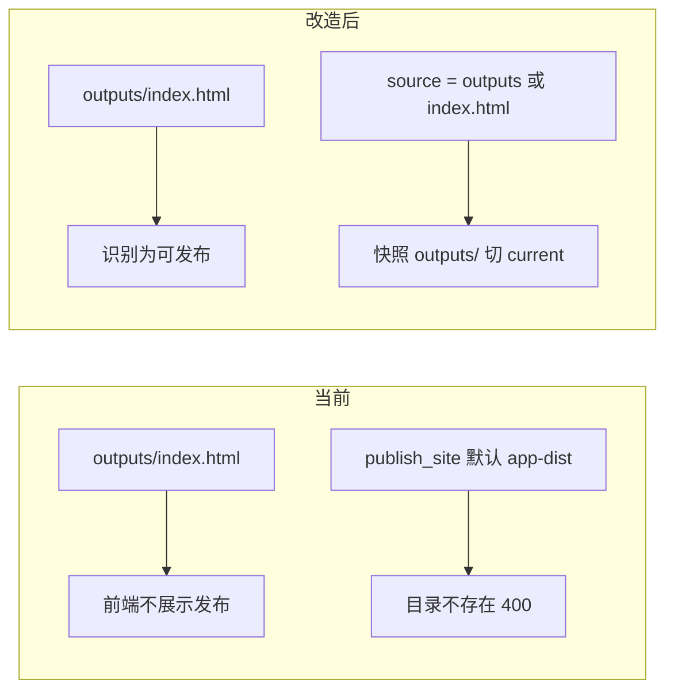

# 支持发布简单单页 HTML（outputs/index.html）

## 现状为何发不出去

发布链路按 Vite 产物设计，入口被写死为 `outputs/app-dist/`：

- 后端 [`_resolve_source_dir`](backend/app/services/site_publish_service.py) 要求 `source` 是 **outputs 下已存在的目录**，且目录内有 `index.html`。现有测试 [`test_publish_rejects_file_and_missing_source`](backend/tests/services/test_site_publish_service.py) 明确拒绝 `.../outputs/index.html`（文件不是目录）。
- 默认 source 是 [`DEFAULT_SITE_SOURCE = "/mnt/user-data/outputs/app-dist"`](backend/app/schemas/sites.py)。MCP / REST / 前端未传 source 时都走这个值。
- 前端 [`isSiteDistPath`](frontend/src/pages/ChatPage/components/BlockPreviewPanel/ProjectPreview/sitePaths.ts) 只认 `outputs/app-dist`，[`showSiteUi`](frontend/src/pages/ChatPage/components/BlockPreviewPanel/ProjectPreview/index.tsx) 因此对 `outputs/index.html` 不展示「发布 / 运行预览」。[`sitesAPI.publish`](frontend/src/services/sites.ts) 也不会改 source。

注意：若调用方把 source 设为 **`/mnt/user-data/outputs`（目录）** 且其中有 `index.html`，后端目录校验其实已经能过。缺口是默认值、文件路径、以及前端门闸。

## 设计选择

**站点根用 `outputs/`，不是只拷单个 html 文件。**

- 同级的 `style.css`、图片、子目录才能一起被 nginx 提供。
- 实现上复用现有 `_copy_snapshot`（递归拷目录），不新增快照格式。
- 副作用：`outputs/` 里其它交付物（如 pdf）会一并公开。有体积上限（`max_size_bytes`）。Vite 站仍优先 `app-dist`，互不影响。

优先级：`outputs/app-dist/index.html` 存在 → 仍发 app-dist；否则若有 `outputs/index.html` → 发 `outputs/`。

## 后端

改 [`site_publish_service.py`](backend/app/services/site_publish_service.py) 的 `_resolve_source_dir`：

1. **允许 `index.html` / `index.htm` 文件路径**：解析后取其父目录作为 `source_dir`（因此 MCP 可传 `/mnt/user-data/outputs/index.html`）。
2. **默认 source 回退**：当 source 为默认 `.../app-dist`（或该目录不存在）且 `outputs/index.html` 存在时，回退到 `outputs/`。Agent 不传 source 时 FastMCP 仍会填默认 app-dist，必须在服务端兜底。
3. 其它显式错误路径（workspace、不存在的自定义目录）保持 400，不误回退。

MCP：更新 [`publish_site.py`](backend/app/mcp/mcp_servers/file_mcp/publish_site.py) 与 [`server.py`](backend/app/mcp/mcp_servers/file_mcp/server.py) 的 description，写明两种布局：

- SPA：`/mnt/user-data/outputs/app-dist`
- 单页：`/mnt/user-data/outputs` 或 `.../outputs/index.html`

[`webapp-building/SKILL.md`](backend/skills/public/webapp-building/SKILL.md) 的 Vite 流程不用改；可在 Step C 补一句「若产物是 `outputs/index.html`，source 用 outputs 根」。

会话内预览候选 [`_PREVIEW_ENTRY_CANDIDATES`](backend/app/api/user_data.py) 增加 `outputs/index.html`（插在 app-dist 之后）。

测试（[`test_site_publish_service.py`](backend/tests/services/test_site_publish_service.py)）：

- 新增：`outputs/index.html` 可发布；source 为文件路径可发布；默认 app-dist 缺失时回退到 outputs。
- 修改：原先「拒绝文件 source」改为「index.html 文件可发布，非 html 文件仍拒绝」。
- 保留：workspace source 仍拒绝；显式不存在的子目录仍 400。

## 前端

[`sitePaths.ts`](frontend/src/pages/ChatPage/components/BlockPreviewPanel/ProjectPreview/sitePaths.ts)：

- 增加 `SITE_OUTPUTS_INDEX = "outputs/index.html"`。
- `isPublishableSitePath`：`app-dist/**` 或 `outputs` 根下的 html（不含误伤的其它目录约定即可：`outputs/*.html` 以及 `outputs/` 本身）。
- `resolvePublishSource({ hasAppDist, hasOutputsIndex })` → 虚拟路径 `/mnt/user-data/outputs/app-dist` 或 `/mnt/user-data/outputs`。
- `outputsTreeHasIndexHtml`：depth=1 列表里是否有 `outputs/index.html` 文件。

[`index.tsx`](frontend/src/pages/ChatPage/components/BlockPreviewPanel/ProjectPreview/index.tsx)：

- 与 `hasAppDistDir` 并行探测 `hasOutputsIndexHtml`。
- `showSiteUi` 在「已有站点 / app-dist / outputs/index.html / 当前选中可发布路径」任一成立时打开。
- `publish` / `republish` 传入 `resolvePublishSource(...)`，不要再写死 app-dist。
- 文案从「把 outputs/app-dist 发布」改为同时覆盖单页 HTML。

[`htmlPreview.ts`](frontend/src/pages/ChatPage/components/BlockPreviewPanel/ProjectPreview/htmlPreview.ts) 的 `getPublishedHtmlPreviewUrl`：

- `outputs/app-dist/**`：维持现有映射。
- `outputs/index.html`、`outputs/about.html` 等（非 app-dist）：相对 `outputs/` 映射到站点 URL。

[`sites.ts`](frontend/src/services/sites.ts)：去掉「未传 source 就填 app-dist」的强制默认，让调用方显式传入；后端仍有自己的默认 + 回退。

补测：`htmlPreview.test.ts` 覆盖 `outputs/index.html` → `{origin}/`；`sitePaths` 的 source 解析与路径判定。

## 不改动的部分

- nginx `sites` 容器、slug、快照目录、`ln -sfn current`：单页与 SPA 都是「根上有 index.html」的静态站。
- `published_sites` 表：无需新字段。
- Vite / `webapp-building` 主路径：app-dist 仍优先。
