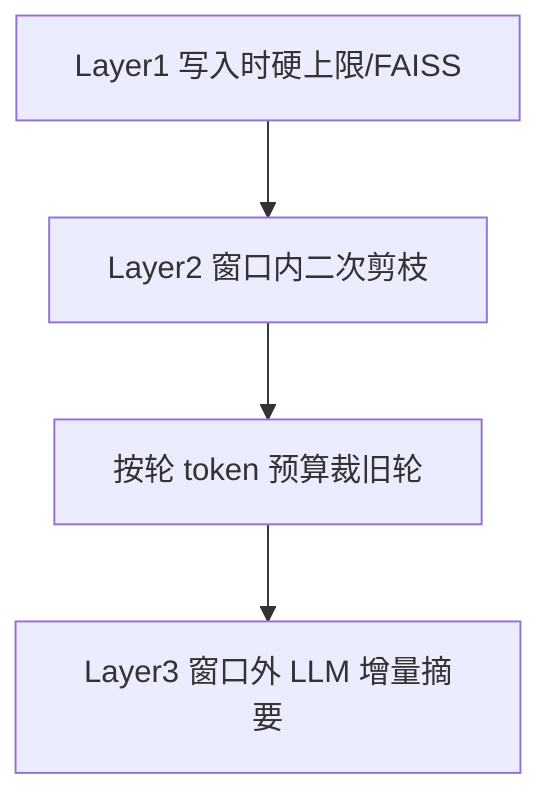

# 历史工具参数与返回内容：建议做法

## 结论（建议采用的策略）

采用与 hermes / opencode 接近、但贴合 chat-agent 现有管道的 **三层压缩**，且 **只改组装进 LLM 的副本，不改 DB 原文**：

| 层级 | 时机 | 对象 | 建议 |
|---|---|---|---|
| L1 | 工具刚返回 | 当前轮 `tool_result` | 保持现有硬上限落盘 + FAISS（已有） |
| L2 | 组装历史窗口 | **非最新轮**的 `tool_use` + `tool_result` | **新增/加强**（本次重点） |
| L3 | 挤出窗口 | 整轮历史 | 保持现有增量摘要（已有） |

**边界规则（固定）**：最新 1 轮（最后一条 user + assistant，即现有 `len-2` 逻辑）的 tool 参数与结果 **完整保留**；更早轮才剪枝。

---

## 对 `tool_result`（窗口内旧轮）

当前：有 `summary` 用 summary；否则超 2000 tokens **从头截断**。问题：无 summary 时中间/尾部关键信息丢失；大量「略小于 2000」的旧结果仍原样堆叠。

**建议改为优先级链（仅非最新轮）**：

1. **有 `summary`** → 用 `summary`（与现网一致，Tavily 等受益）
2. **无 summary 且 content 超阈值** → **头尾截断**（替代纯 head-only）
   - 默认：`message_summary_threshold_tokens = 2000`
   - 截断形态：`head(~60%) + "\n…[中间已省略，共 N tokens]…\n" + tail(~40%)`
   - 理由：shell/日志/搜索结果尾部常含结论或错误；对齐 deer-flow/codex，比只留头部更稳
3. **已含落盘提示**（硬上限写入的 preview + 路径）→ 不再二次放大，可整段保留 preview（通常已短）

**不建议立刻做**：把旧结果压成 hermes 式「1 行摘要」——丢信息太狠，且你已有落盘重读路径；也不建议对窗口内再跑 LLM 摘要（贵、慢、与 L3 重复）。

---

## 对 `tool_use` 参数（窗口内旧轮）

当前：**完全不处理**；`arguments_text` 经 [`base.py`](backend/app/agents/base.py) 原样进 LLM，`write_file` 大代码会永久占 context。

**建议（借鉴 hermes，阈值略宽）**：

- 仅处理 **非最新轮** 的 `ToolUseBlock`
- 解析 `arguments_text` → JSON object
- 对每个 **字符串 value**：若 `len > 500`，改为 `value[:200] + f"... [{len(v)} chars, truncated]"`，再 `json.dumps` 写回 `arguments_text`，并同步清空/更新 `arguments_json`
- 解析失败：对整段 `arguments_text` 若超 2000 字符，做同样头+标记截断，保证不炸
- **保留**：`name` / `tool_call_id` / 非大字符串字段（path、命令短参数等）

实现落点：扩展 [`HistoryContextService.compress_history_messages`](backend/app/services/chat/history_context_service.py)，在遍历 `content_blocks` 时同时处理 `ToolUseBlock`（不要只跳过非 `ToolResultBlock`）。

---

## 明确不做（本阶段）

- **不改 DB / 前端展示原文**（只动 `prepare_history_messages` 输出）
- **不上** opencode 独立 40K prune、claude 60min microcompact、反抖动（作为后续 P1，见下）
- **不**对最新轮做任何工具字段裁剪（避免影响正在进行的多步工具链）

---

## 配置建议

在现有 [`ToolResultCompressionConfig`](backend/app/schemas/config.py) 旁扩展或同级增加（名称可微调）：

- `message_summary_threshold_tokens: 2000`（沿用，用于 result）
- `tool_arg_max_chars: 500` / `tool_arg_keep_chars: 200`（新增，用于 use）
- `result_truncate_mode: "head_tail"`（固定采用头尾，避免再分叉）

历史窗口 `max_rounds=20`、`token_ratio=0.25` 先不动；L2 剪枝后再走现有 [`truncate_in_window_by_round_tokens`](backend/app/utils/history_truncate.py)。

---

## 实现顺序（落地时）

1. 在 `compress_history_messages` 增加旧轮 `ToolUseBlock` 参数截断
2. 将旧轮 `ToolResultBlock` 的超阈值截断从 head-only 改为 head+tail
3. 补单测：无 summary 大结果、有 summary、最新轮豁免、大 `write_file` 参数、非法 JSON 参数
4. 文档同步一句到 [`docs/context-management-comparison.md`](docs/context-management-comparison.md) 的 chat-agent「窗口内工具」行（可选）

## 后续 P1（建议记着，本次不排期）

- 窗口内工具输出 **总量预算**（如从尾保留 ~40K tokens，更早强制压到 stub）——对齐 opencode prune
- 时间触发清理闲置 tool_result——对齐 claude microcompact
- 摘要过长时的「摘要再压缩」——对齐文档 P1-1

---

## 关键改动文件

- [`backend/app/services/chat/history_context_service.py`](backend/app/services/chat/history_context_service.py) — 核心剪枝逻辑
- [`backend/app/schemas/config.py`](backend/app/schemas/config.py) — 参数截断配置
- [`backend/app/utils/token.py`](backend/app/utils/token.py) — 若尚无 head+tail 按 token 截断 helper 则小幅补充
- `backend/tests/...` — 覆盖上述用例（当前无 `compress_history_messages` 测试）
