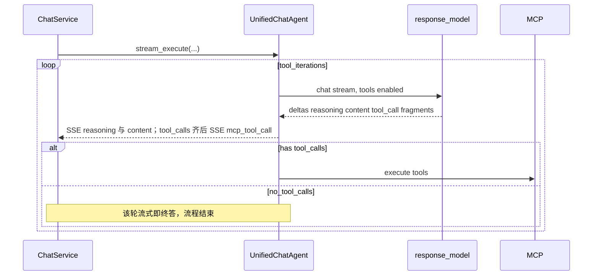

# 合并 MCP 工具与最终应答为单会话 Agent

## 现状（简要）

- `[chat_service.py](backend/app/services/chat/chat_service.py)` 中 `stream_message` 分两阶段：先 `mcp_tools_agent.stream_execute`（SSE `mcp_tool_call`），再 `response_generation_agent.stream_execute`（`reasoning` / `content`）。
- 工具阶段使用 `[settings.tool_call_model](backend/app/core/config.py)` + `[get_prompt_with_mcp_servers](backend/app/prompts/prompt_utils.py)`（`[system_prompt_for_tool_calls_template](backend/app/prompts/system_prompt.py)` + `[user_message_for_tool_call_template](backend/app/prompts/user_prompt.py)`）。用户提示**明确禁止最终答案**（「你只负责调用工具…回复 finish」）。
- 应答阶段使用 `[settings.response_model](backend/app/core/config.py)` + `[get_system_prompt_for_response_generation](backend/app/prompts/prompt_utils.py)`，并把工具结果 **flatten** 进用户消息（`[get_user_message_combine_tool_calls](backend/app/prompts/prompt_utils.py)`，见 `[get_mcp_tool_items](backend/app/agents/utils/response_generation.py)` 注释：避免模型模仿 function-call 格式）。
- 工具循环在 `[MCPToolsAgent._call_llm_with_mcp_tools](backend/app/agents/mcp_tools_agent.py)` 中：当 `not tool_calls` 时**直接 return**，该轮 assistant 正文**丢弃**，因此最终可见回答**必定**来自第二阶段。

## 目标架构（你选择的单线程方案）

要点：

1. **一条消息线程**：`system`（合并后的统一 system）+ 历史 + 当前用户消息 + 多轮 `assistant(tool_calls)` / `tool` 与现逻辑一致（继续用 `[format_tool_call_messages_for_llm](backend/app/utils/message.py)` 拼进请求）。
2. **工具轮（流式）**：每一轮对 LLM 使用 `**stream=True` + `tools` + `parallel_tool_calls`**（与 `[LLMService.call_llm_api](backend/app/services/base_service/llm_service.py)` 能力对齐）。在 async 迭代中：
  - 按 OpenAI 兼容约定**增量合并** `delta.tool_calls`（按 `index` 拼接 `id` / `function.name` / `function.arguments`，并行多工具时常见多条 index）；
  - **硬性要求**：流式过程中对 `reasoning_content` 与 `content` delta **一律转发**，SSE 形态与 `[ResponseGenerationAgent._stream_final_response](backend/app/agents/response_generation_agent.py)` 一致（`reasoning` / `content` 的 start、continue、done 语义），使用户在工具执行前即可看到模型说明或计划；**多轮工具则每轮 assistant 流式段按时间顺序接续**（与前端当前按 `delta` 追加正文的行为对齐，见验证项）。
  - **流结束**（`finish_reason` 或迭代器结束）后得到完整 assistant 消息：若有 `tool_calls` 则解析为 `ChatCompletionMessageFunctionToolCall` 列表，再走现有 `_should_continue_tool_calls`、并行执行 MCP、yield `mcp_tool_call`；若无 `tool_calls` 则进入下方「结束条件」。
3. **结束条件（唯一路径：始终无二次 LLM）**：当某轮流式结束且 **无 `tool_calls`** 时，**该轮已通过 SSE 推送的 `reasoning`/`content` 即本轮对用户的最终输出**；`CollectedResponse.content` 为**整次助手回复中所有已流式 `content` 的拼接**，与前端同一条气泡一致。**即使**终局轮 `content` 为空（例如仅 `reasoning_content`），**也不**再追加 user/system 或发起无 `tools` 的第二次请求；靠提示词降低空正文概率，并接受边界情况下正文为空的产品行为。
4. **无可用 MCP 工具**（`get_tools_for_llm` 为空）：**一次** `stream=True` 且不带 tools（或 `tool_choice: "none"`）即可，等价于直接进入终局；无需先跑「空工具列表」的 tools 轮（需覆盖原 `MCPToolsAgent` 早退行为）。
5. **上下文对齐**：统一 system 中一次性注入「工具策略 + 应答风格 + `[user_context_system_fragment_template](backend/app/prompts/system_prompt.py)`（记忆、窗口外摘要）」，使工具决策与最终回答共享同一用户画像/摘要（解决当前工具轮看不到记忆/摘要的问题）。
6. **单一模型配置**：**工具调用与最终回答均使用 `settings.response_model`**（`[ChatService](backend/app/services/chat/chat_service.py)` 构造 `UnifiedChatAgent` 时不再传入 `tool_call_model`）。标题生成等其它链路若仍用 `tool_call_model` 可保持不变。注意工具轮 prompt 更长（含 tools 定义），需在 `response_model` 的上下文上限内评估费用与延迟。

### 工具轮流式实现要点（实现清单）

- 在 `[mcp_tools_agent.py](backend/app/agents/mcp_tools_agent.py)` 或 Unified 内联实现 `_call_llm_with_mcp_tools_stream`：消费 `AsyncIterator` chunk，维护 `accumulated_tool_calls` 与 **每轮** assistant 的 `reasoning`/`content` 全文（写入 `ToolUseMessage` 等），并**边收边 yield** SSE。
- **arguments JSON**：必须等每个 index 的片段拼完再 `json.loads`；对畸形/截断要有日志与降级（跳过该 tool 或整轮报错策略与现网一致）。
- **Token 统计**：整次用户消息仅多轮流式调用，可**全部计入** `mcp_tools`（或等价单一阶段），`response_generation` 可置空；若需与旧前端字段兼容，可将「无工具时的单次流式」与「多轮工具流式」都归入 `mcp_tools` 或拆分行内约定，**不再**存在独立「补全轮」统计。

### 全流程思考持久化（硬性）

- **产品要求**：数据库中助手消息的 `reasoning` 字段须保存**全流程思考**，即：**每一次工具轮流式**（含终局「无 tool_calls」轮）的 `reasoning_content` 全文按时间顺序**拼接**（建议段间用固定分隔符，如 `\n\n---\n\n`）。
- **实现落点**：`[CollectedResponse.reasoning](backend/app/schemas/chat.py)` 由 `UnifiedChatAgent` 在流式过程中**累加**（与当前仅 `ResponseGenerationAgent` 收集不同）；`[get_collected_response](backend/app/services/chat/chat_service.py)` → `update_assistant_message`（`[message_db](backend/app/services/message/message_db.py)`）沿用现有 `assistant_payload.reasoning` 写入逻辑即可，**无需改表结构**。
- **与 SSE 一致**：前端已按事件追加 `lastMessage.reasoning`，后端持久化字符串应与用户所见推理内容一致（同序、同文；若某轮无推理则跳过该段）。

## 提示词改动（核心）

- 新增 **统一 system** 构建函数（例如 `get_unified_chat_system_prompt(...)`），合并：
  - 原工具 system 中的约束（选工具、防重复、与问题相关）；
  - 原应答 system 中的「自然语言直接回答用户」；
  - `user_memories` / `window_out_summary` 片段。
- **重写工具阶段 user 模板**（或新模板）：删除「只负责调用工具 / finish」；改为「在需要外部信息时调用工具；信息已足够时不要再调用工具，并**在同一对话线程内用自然语言直接回答用户**」。工具轮中的说明与终局轮正文均可经 `content` 流式展示；**当不再调用工具时，必须在同轮输出完整、可引用的答复**（**无**第二次 LLM，空正文无补救）。可选：在 system 中约束中间轮说明宜简、终局轮宜完整。
- 清理各处「回复 `finish`」的 hint（`[mcp_tools_agent.py](backend/app/agents/mcp_tools_agent.py)` 中 `_should_continue_tool_calls`、`_update_user_message_with_tool_hints`、`web_pages_extract` 等硬编码字符串），改为「停止调用工具」语义，与新的结束条件一致。

## 代码结构与职责

| 动作                                                                     | 说明                                                                                                                                                                                      |
| ---------------------------------------------------------------------- | --------------------------------------------------------------------------------------------------------------------------------------------------------------------------------------- |
| 新增 `[unified_chat_agent.py](backend/app/agents/unified_chat_agent.py)` | 工具循环流式 + 终局无 `tool_calls` 即结束，无二次 LLM；对外单一 `stream_execute`；签名含 `window_out_summary`、`user_memories` 等。                                                                                 |
| 修改 `[ChatService](backend/app/services/chat/chat_service.py)`          | 仅持有 `UnifiedChatAgent`（及 `TitleGenerationAgent`）；`stream_message` 单次 `async for`；`get_collected_response` 从统一 agent 取 `content`/`reasoning`/`output_messages`/`duration`/`token_stats`。 |
| Token 统计                                                               | 整次对话仅多轮流式，按约定填入 `TotalTokenStats`（可仅 `mcp_tools` 或拆分字段以保持前端兼容）；前端 `[token.ts](frontend/src/interfaces/token.ts)` 可不变。                                                                   |
| 导出                                                                     | 更新 `[app/agents/__init__.py](backend/app/agents/__init__.py)`；`MCPToolsAgent` / `ResponseGenerationAgent` 可保留文件供过渡期引用或删除未用导出（以 linter/引用为准）。                                            |

### 前端（`[frontend/src/hooks/chat.ts](frontend/src/hooks/chat.ts)` 等）

- **是否必须改**：**一般不需要**。当前 `messageHandlers` 已对 `reasoning`、`content` 做 `appendReasoningToLastMessage` / `appendContentToLastMessage`（见约 224–247 行），**不区分**事件来自工具轮还是最终轮；只要后端仍用同名 SSE 且 `reasoning` 带 `status`（start/continue/done）、`content` 带增量文本，多轮工具 + 最终轮会**按时间顺序拼在同一条最后一条 assistant 消息**上，与产品预期一致。
- **可选优化（非阻塞）**：
  - **reasoningDuration**：`setReasoningDuration` 写在 `[chatSlice.ts](frontend/src/store/slices/chatSlice.ts)` 上为**覆盖**最后一条 assistant 的 `reasoningDuration`。若工具轮与最终轮各发一段 `reasoning` 的 `done`+`duration`，**只会保留最后一次**。若需要「总思考时长」或分段展示，再改 reducer 或协议（例如累加、或多字段）。
  - **ReasoningDone**：每段 reasoning 结束都会 `emitter.emit` 一次；若某组件假设「整轮只触发一次」，需单独排查（多数场景仅影响动画/折叠一次，可接受则不动）。
- **若后端改用新 event 类型**区分「工具轮正文」与「最终正文」，才需要同步改 `StreamMessageHandlerMap` 与展示组件；当前计划沿用现有 `reasoning`/`content`，故不依赖此类改动。

## 深度推理模式（think_mode）下的正确性

`think_mode` 为真时，`[LLMService](backend/app/services/base_service/llm_service.py)` 使用 `think_model_name` 且 `[get_model_extra_body(True)](backend/app/utils/model.py)` 打开 `enable_thinking` / DeepSeek `thinking.type=enabled`。计划里「工具轮流式转发 reasoning/content」在思路上可行，但**不能原样照搬** `[ResponseGenerationAgent._stream_final_response](backend/app/agents/response_generation_agent.py)` 的收尾逻辑，否则在深度推理下会出错：

1. **占位正文污染工具轮（严重）**
  参考现网 `[_stream_final_response](backend/app/agents/response_generation_agent.py)`（约 218–225 行）：流结束时若仍处于 `reasoning` 且从未收到 `content`，会补发占位 `content`。该逻辑**不得**用于**工具轮**（将产生 `tool_calls` 的轮次）：仅在 `reasoning` 的 done 收尾，**禁止**在执行 MCP 前注入占位正文。
   **终局无 `tool_calls` 轮**：计划**不**再二次请求 LLM，也**不**要求在该轮流式末尾自动注入占位；若仅有推理、无 `content`，界面可仅展示思考区，正文为空由提示词尽量避免。
2. **流内出现 tool_calls delta 时的阶段**
  若提供商在推理尚未「逻辑结束」时就下发 `tool_calls` 片段，应在**首次收到 tool_call 相关 delta**时视情况结束 reasoning 段（发 `reasoning` done），避免长时间停留在 `reasoning` 导致结束时误判。实现时需同时消费 `delta.tool_calls`，不能只盯 `reasoning_content`/`content`。
3. **多段推理与时长**
  每一轮工具迭代 + 最终轮都可能各有一段 `reasoning`。**持久化**：须按上文「全流程思考持久化」**累加**各段后再写入 DB。前端 `reasoningDuration` 仍可能只反映**最后一次** reasoning 段的 `done` 耗时（可选后续再改为累加或分段展示）。
4. **单一 response_model**
  工具与回答共用 `response_model`，`think_mode` 下仅对应**一套** `think_model_name`，回归与排障更简单；须在目标环境实测「深度推理 + 流式 + 并行 tool_calls」是否稳定（若某模型不擅长工具调用，需换模型或回退配置策略，属产品/运维决策）。

**总结**：存在 `tool_calls` 的轮次禁止「仅推理无 content → 占位正文」。**不存在**二次补全 LLM；终局无 `tool_calls` 时也不强制占位正文（与现网 `_stream_final_response` 占位行为脱钩）。

## 风险与缓解

- **深度推理 + 工具轮流式收尾错误**：见上文「深度推理模式」节；工具轮禁止复用「仅推理无 content → 占位正文」逻辑。
- **同气泡多段正文**：用户可能在一条 assistant 消息中看到多轮工具阶段的说明性 `content` 与终局轮完整答复的拼接；靠提示词约束中间轮宜简、终局宜完整；若需视觉区分可后续加 SSE 类型或前端样式。
- **流式 tool_calls 聚合错误**：严格按 `index` 合并片段；单测或 fixture 覆盖并行多 `tool_call`；日志打印完整聚合结果便于排障。
- **提供商差异**：若 DeepSeek/OpenAI 兼容层在流式下 `tool_calls` 字段与标准不一致，需在 `[llm_service.py](backend/app/services/base_service/llm_service.py)` 或 agent 内做适配分支。
- **终局仅有推理、无正文**：无二次 LLM 补救，须用提示词约束模型在同轮输出可见 `content`；否则用户可能只看到思考、正文为空。
- **成本**：相对「工具轮 + 必接独立应答轮」的旧方案，通常**少一次**完整 LLM 调用；工具轮流式仍可能多轮迭代。
- **统一 response_model**：若该模型在「长 system + 大 tools 定义」下质量或稳定性不如原 `tool_call_model`，需通过换模型或压缩工具列表缓解；计划假定业务已接受单一模型。

## 验证

- `cd backend && make lint`；`make test`（排除需 key 的目录按 AGENTS.md）。
- 手工：无 MCP / 有 MCP 多轮工具 / 仅记忆+摘要 / think 模式开闭；确认 **全程无第二次 LLM**，`CollectedResponse.content` 为全量流式 `content` 拼接；`**reasoning` 全流程落库**与界面一致。
- **think 模式专项**：工具轮（将出 `tool_calls`）不得出现占位正文；终局无 `tool_calls` 且无 `content` 时**不**再请求补全、**不**强制占位（与现网 `_stream_final_response` 不同，属本计划取舍）。
