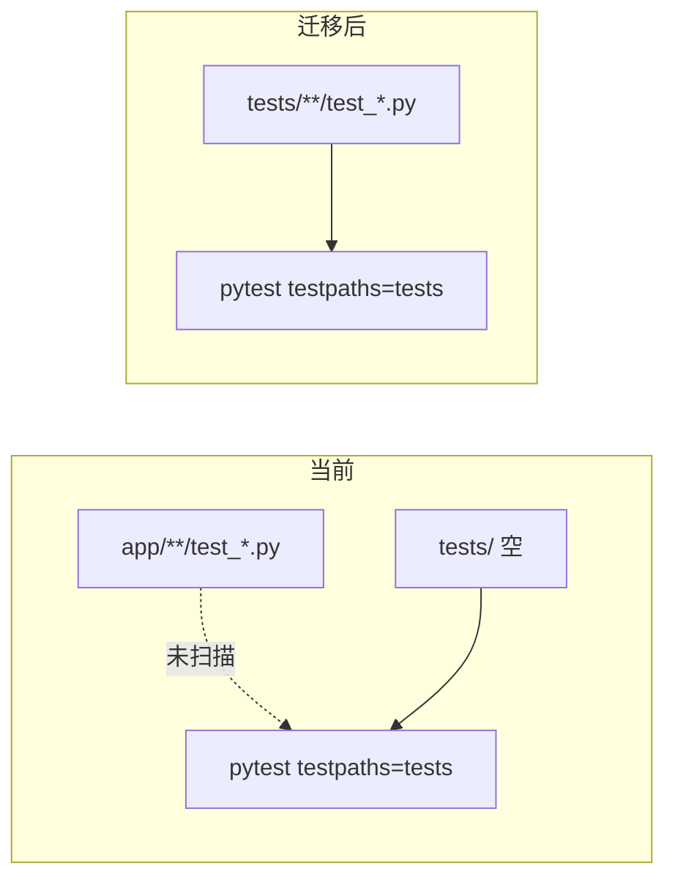

# 后端测试迁移至 tests/ 目录

## 现状

| 项 | 说明 |
|---|---|
| 测试文件 | [`backend/app`](backend/app) 下 **14** 个 `test*.py` |
| 目标目录 | [`backend/tests`](backend/tests) **为空** |
| pytest 配置 | [`pyproject.toml`](backend/pyproject.toml) 已设 `testpaths = ["tests"]`、`pythonpath = ["."]` |
| 实际影响 | `make test` / `uv run pytest` **当前收集 0 个测试**；显式指定 `pytest app/` 可收集 **120** 个 |



## 目标目录结构（镜像 app 模块）

```
backend/tests/
├── agents/test_tool_executor.py
├── agent_skills/test_registry.py
├── vfs/
│   ├── test_paths.py
│   ├── test_resolver.py
│   ├── test_resolver_skills.py
│   └── test_user_data_v4_migration.py
├── utils/test_avatar.py
├── sandbox/test_docker_availability.py
└── mcp/mcp_servers/
    ├── shell_mcp/
    │   ├── test_command_audit.py   # 合并后唯一 audit 测试文件
    │   ├── test_shell_tool.py
    │   └── test_virtual_paths.py
    ├── time_mcp/test_server.py
    └── file_mcp/test_server.py
```

**不迁移** `shell_mcp/test_server.py`（合并进 `test_command_audit.py` 后删除）。

## 迁移步骤

### 1. 合并 shell_mcp audit 测试（用户选择：去重合并）

保留并增强 [`test_command_audit.py`](backend/app/mcp/mcp_servers/shell_mcp/test_command_audit.py)，吸收 [`test_server.py`](backend/app/mcp/mcp_servers/shell_mcp/test_server.py) 中**未被 parametrized 覆盖**的用例：

| test_server 用例 | test_command_audit 覆盖情况 | 处理 |
|---|---|---|
| `test_audit_empty_command` (`""`) | 仅有空白 `"   "` | 在 `TestAuditCommand` 增加 `""` |
| `test_audit_git_allowed` | 无 `git` | 加入 safe/pass parametrize 或单测 |
| `test_audit_python_allowed` | 无 `python --version` | 同上 |
| `test_audit_vite_scaffold_allowed` | 仅有短 `npx create-vite` | 增加完整 `&&` 链式脚手架用例 |
| `test_audit_curl_allowed` | 有类似 curl pass | 可选保留 `audit_command` 断言（低优先级） |
| 其余 rm/pipe/fork/pip/compound | 已被 parametrize / `TestAuditCommand` 覆盖 | **不重复添加** |

合并后删除 `app/.../shell_mcp/test_server.py`。

### 2. 使用 `git mv` 迁移其余 12 个文件

保持文件内容与 `from app.xxx import ...` 导入不变（`pythonpath = ["."]` 无需修改 import）。

| 源路径 | 目标路径 |
|---|---|
| `app/agents/test_tool_executor.py` | `tests/agents/test_tool_executor.py` |
| `app/agent_skills/test_registry.py` | `tests/agent_skills/test_registry.py` |
| `app/vfs/test_*.py` (4) | `tests/vfs/test_*.py` |
| `app/utils/test_avatar.py` | `tests/utils/test_avatar.py` |
| `app/sandbox/test_docker_availability.py` | `tests/sandbox/test_docker_availability.py` |
| `app/mcp/mcp_servers/shell_mcp/test_shell_tool.py` | `tests/mcp/mcp_servers/shell_mcp/...` |
| `app/mcp/mcp_servers/shell_mcp/test_virtual_paths.py` | 同上 |
| `app/mcp/mcp_servers/time_mcp/test_server.py` | `tests/mcp/mcp_servers/time_mcp/...` |
| `app/mcp/mcp_servers/file_mcp/test_server.py` | `tests/mcp/mcp_servers/file_mcp/...` |
| 合并后的 `test_command_audit.py` | `tests/mcp/mcp_servers/shell_mcp/test_command_audit.py` |

### 3. 更新配置与文档

**[`backend/mypy.ini`](backend/mypy.ini)**

- 删除已无用的 `[mypy-app.mcp.mcp_servers.*.test_server]` 段（测试迁出 app 后不再需要）
- 删除 `[mypy-app.tests.*]`（app 内无 tests 子包）
- 保留 `[mypy-tests.*] ignore_errors = true`（测试目录统一豁免）

**[`backend/app/mcp/mcp_servers/time_mcp/test_server.py`](backend/app/mcp/mcp_servers/time_mcp/test_server.py) 文件头 docstring**

迁移后更新运行/调试示例路径，例如：

```text
pytest tests/mcp/mcp_servers/time_mcp/test_server.py -v
```

**[`backend/AGENTS.md`](backend/AGENTS.md)**（可选小改）

- 类型检查例外列表中移除 `app.mcp.mcp_servers.*.test_server` 条目
- 确认「运行测试」示例仍指向 `tests/`

**不改动** [`pyproject.toml`](backend/pyproject.toml) 的 `testpaths`（已正确）。Ruff 已 `exclude = ["tests"]`，行为不变。

### 4. 验证

```bash
cd backend
uv run pytest --collect-only    # 应收集 ~120 个（合并后略少几个重复项）
uv run pytest -q                # 全量通过
uv run pytest tests/mcp/mcp_servers/shell_mcp/ -v  # shell 子集
```

关注含 `@pytest.mark.asyncio` 的文件（`time_mcp`、`file_mcp`、`test_shell_tool`），确认迁移后 asyncio 测试仍正常（当前无 `asyncio_mode` 配置但已在 app 下可运行）。

## 风险与说明

- **无 import 路径变更**：测试继续 `from app...` 引用业务代码，仅物理位置变化。
- **历史计划文档**（`.cursor/plans/*.md`、`docs/`）中旧路径 `app/.../test_*.py` 不批量修改，避免无关 diff；必要时后续单独清理。
- **context7 README** 引用的 `test_server` 模块本仓库不存在，不在本次范围。
- 根目录 [`AGENTS.md`](AGENTS.md) 提到的 `tests/mcp_demo/` 尚不存在，与本次迁移无关。

## 预期结果

- `app/` 内不再包含 `test_*.py`，业务与测试目录分离
- `make test` 默认执行全部单元测试
- shell audit 测试集中在单一文件，避免 `test_server` / `test_command_audit` 重复维护
