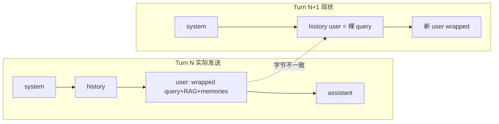
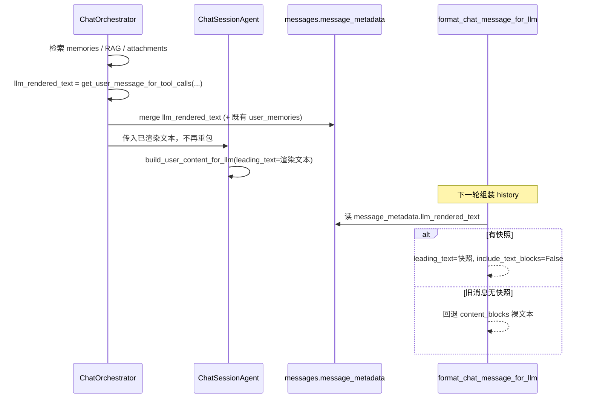

# 固化 llm_rendered_text 提升跨轮前缀缓存

## 问题

当前 turn 发给 LLM 的 user 是包装后的 [`get_user_message_for_tool_calls()`](backend/app/prompts/prompt_utils.py) 结果（query + RAG + memories + datetime + 附件清单）。落库的 `content_blocks` 仍是客户端原文。

下一轮 [`format_chat_message_for_llm()`](backend/app/protocols/chat_messages.py) 只从 `content_blocks` 抽裸文本，**不**还原包装。于是第 N+1 轮在「上一轮 user」处字节级分叉，前缀缓存从该点起全部 miss。



目标：历史回放逐字复现当时发出的 user 文本；memories/RAG 只在当轮渲染一次，之后以固化文本留在历史。

## 数据流



## 实施

### 1. 当轮渲染后立刻落库

在 [`chat_orchestrator.py`](backend/app/services/chat/chat_orchestrator.py) 的 `run_chat_turn`，memories/RAG/attachments 齐备后、进入 `stream_turn_events` 前：

- 调用已有的 `get_user_message_for_tool_calls(...)` 得到 `llm_rendered_text`
- 与 `user_memories` **合并成一次** `update_user_message_metadata`（即使 memories 为空也要写快照）
- 把 `llm_rendered_text` 传入 `stream_turn_events` → `stream_session_events`，Agent **不再**自己调 `get_user_message_for_tool_calls`

写入时机必须在首次 LLM 调用之前，避免流中断后下一轮丢快照。

字段约定：`message_metadata.llm_rendered_text: str`（即 `_tool_guided_user_message` 字符串，不含图片 part）。无需 DB 迁移（JSON 列已有）。

`user_memories` 仍保留，供 eval replay；不改前端展示用的 `content_blocks`。

### 2. 历史回放优先用快照

改 [`format_chat_message_for_llm()`](backend/app/protocols/chat_messages.py) 的 user 分支：

```python
rendered = (metadata or {}).get("llm_rendered_text")
if role == "user" and isinstance(rendered, str) and rendered.strip():
    content = build_user_content_for_llm(
        normalized_blocks,
        leading_text=rendered.strip(),
        include_text_blocks=False,  # 与当轮一致，避免 query 重复
    )
elif role == "user" and has_image_block(normalized_blocks):
    content = build_user_content_for_llm(..., include_text_blocks=True)
else:
    content = collect_content_from_block_payloads(...)
```

图片仍从 `content_blocks` 现读 data URL，与当轮 [`build_user_content_for_llm`](backend/app/utils/multimodal.py) 行为对齐。

无快照的旧消息走现有裸文本路径（兼容，不 backfill）。

抽取小 helper（建议放 `chat_messages.py`）：`resolve_user_llm_rendered_text(message) -> str | None`，format 与 token 计数共用。

### 3. 历史 token 预算按「实际发给 LLM 的文本」计

[`count_chat_message_tokens()`](backend/app/utils/history_truncate.py) 当前对整条 `ChatMessage.model_dump()` 计 token，只看 `content_blocks`，**不会**计入 metadata 里的 RAG/memories。固化后若不改，窗口会低估历史、过晚触发守卫。

对 `role == "user"`：用 `format_chat_message_for_llm(msg)` 的结果计 token；assistant 保持现有 dump 逻辑（工具块仍在 content_blocks 里）。

### 4. API 剥离 llm_rendered_text

仅在对外边界剥掉，内部 history 加载必须保留：

- 剥：[`ConversationDbService.get_messages()`](backend/app/services/conversation/conversation_db.py)（消息列表 API）
- 不剥：[`MessageDbService.get_history_messages_by_ids()`](backend/app/services/message/message_db.py)（LLM 回放）

ACK 发生在 metadata 写入之前，直播流不会带上该字段。`full_content=true` 的 eval 消息列表同样剥离，避免把完整 prompt 打到前端；eval 需要时走 DB / Langfuse。

### 5. 测试

新增/补强：

- `format_chat_message_for_llm`：有快照优先；无快照回退裸文本；图片 + 快照时 `include_text_blocks=False` 且带 image_url
- orchestrator：渲染后 metadata 含 `llm_rendered_text`；memories 为空也写入
- `count_chat_message_tokens`：user 有大段 RAG 快照时 token > 裸 query
- `get_messages`：响应 metadata 无 `llm_rendered_text`，history 加载仍有

## 明确不做

- 不把 RAG/memories 写进 `content_blocks`（前端气泡仍是用户原文）
- 不 backfill 历史消息
- 不改 trailing hints（本 turn 尾部追加，不进快照）
- 不把 `<current_datetime>` 挪到 system（已验证会把命中率打到 0%）
- 不改 `window_out_summary` 进 system 的机制

## 剩余缓存破坏点（本方案解决不了）

守卫触发后仍会从更早位置 miss，这是正确性优先：

- system 因窗口外摘要更新而变化
- `compress_history_tool_results` 改写历史 tool 结果
- 窗口外消息被摘掉，history 前缀缩短

未触达上下文上限的多轮对话：前缀可从 system 续到上一轮 assistant 结束，仅新 user 及之后为 miss。
