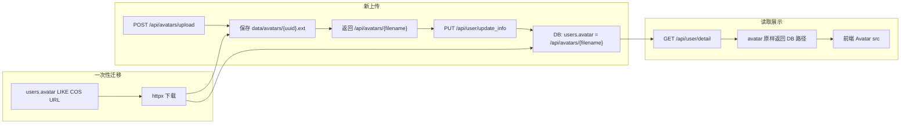

# 用户头像本地化与 COS 迁移方案

## 目标数据流



## 1. 改造本地上传（替代 COS）

**核心文件**：[`backend/app/services/base_service/file_service.py`](backend/app/services/base_service/file_service.py)

当前逻辑用 [`TempFileManager`](backend/app/utils/file.py) 写临时文件后上传 COS，并在退出上下文时**删除**本地文件。需改为：

- 确保目录 `settings.storage.avatar_dir`（默认 `./data/avatars`）存在
- 生成 `filename = f"{uuid.uuid4()}{file_ext}"`（与现有 `TempFileManager` 命名一致）
- 直接 `write_file_async(avatar_dir / filename, file)`，**不删除**
- `upload_avatar` 返回 **GET 访问路径** `/api/avatars/{filename}`（磁盘仍用 `filename` 存盘），不再调用 [`ObjectStorageService`](backend/app/services/base_service/object_storage_service.py)

`ObjectStorageService` 目前仅被头像使用，改造后可从 `file_service` 移除依赖（类本身可保留供将来其他用途）。

## 2. 头像独立路由模块（上传 + 读取）

新建 [`app/api/avatars.py`](backend/app/api/avatars.py)，在 [`main.py`](backend/app/main.py) 注册 `prefix="/api/avatars"`。读写统一归属头像域，不再使用 `/api/file/upload_avatar`。

| 方法 | 路径 | 说明 |
|------|------|------|
| `POST` | `/api/avatars/upload` | 需登录；multipart `file`；保存到 `data/avatars/`；返回 **`/api/avatars/{filename}`** |
| `GET` | `/api/avatars/{filename}` | 无需登录；返回图片文件 |

**路由顺序**：在 `avatars.py` 中先注册 `POST /upload`，再注册 `GET /{filename}`，避免 `upload` 被当成 `filename` 匹配。

**上传**（`POST /upload`）：

- 调用改造后的 `FileService.upload_avatar`（或迁至 `avatar_service`）
- 需 `Depends(require_auth)`，与旧 [`upload_avatar`](backend/app/api/file.py) 一致

**读取**（`GET /{filename}`，参考 [`preview_chat_attachment`](backend/app/api/file.py)）：

- 从 `settings.storage.avatar_dir` 解析物理路径
- **安全校验**：`filename` 必须匹配 `^[0-9a-fA-F-]{36}\.(jpg|jpeg|png|gif|webp)$`，拒绝 `..`、`/` 等
- 文件不存在返回 404
- `FileResponse` + 扩展名 `media_type`

**清理**：删除 [`file.py`](backend/app/api/file.py) 中的 `POST /upload_avatar` 及 `FileService` 在 file 路由上的引用；文档中旧路径 `/api/file/upload_avatar` 一并更新。

与 Vite 代理 `/api` → `localhost:8000` 兼容。

## 3. DB 存 GET 路径 `/api/avatars/{filename}`

本地头像在 **`users.avatar` 存完整访问路径**（如 `/api/avatars/3f2a1b4c-....png`），与前端 `Avatar` 的 `src` 一致，**读取接口无需再拼 URL**。

**新增工具模块**（建议 `backend/app/utils/avatar.py`）：

| 函数 | 职责 |
|------|------|
| `AVATAR_URL_PREFIX` | 常量 `/api/avatars/` |
| `avatar_storage_path(filename)` | `{uuid}.png` → `/api/avatars/{uuid}.png` |
| `avatar_filename_from_storage(value)` | 从 DB 路径 `/api/avatars/{filename}` 解析磁盘文件名（供 GET 读盘、迁移脚本用） |
| `is_cos_avatar_url(value)` | 腾讯云 COS 外链（`myqcloud.com` 且路径含 `/avatars/`） |
| `normalize_avatar_for_storage(value)` | **写入校验/归一化**（仅新数据）：`http(s)://`（微信）原样；`/api/avatars/{合法filename}` 原样；其它格式（裸文件名、COS URL、历史 `/api/file/avatars/...`）拒绝或 400 |

**不实现** `avatar_display_url` 及任何读取侧旧数据转换；迁移脚本执行后，DB 中本地头像应全部为 `/api/avatars/...`。

**写入**（[`update_user_info`](backend/app/services/user/user_db.py)）：

- `update_info.avatar` 经 `normalize_avatar_for_storage` 后入库
- 上传接口返回的路径可直接写入，无需前端再拼接

**读取**（[`user.py`](backend/app/api/user.py)、[`auth.py`](backend/app/api/auth.py)）：

- **直接返回 `UserDb.avatar`**，不做额外转换

**微信头像**：继续存完整 `http(s)://` 外链，不走 `/api/avatars/`。

**磁盘与 DB 分离**：

- 磁盘：`data/avatars/{filename}`
- DB：`/api/avatars/{filename}`

## 4. 前端改动

| 文件 | 改动 |
|------|------|
| [`frontend/src/services/file.ts`](frontend/src/services/file.ts) 或新建 `avatars.ts` | `uploadAvatar` 请求改为 `POST /avatars/upload`（baseURL 已为 `/api`） |
| [`frontend/src/components/Layout/components/AccountManage.tsx`](frontend/src/components/Layout/components/AccountManage.tsx) | `onUploadComplete` 将 upload 返回的 **`/api/avatars/...`** 写入 `updateUserInfo({ avatar })` |

上传接口已返回完整路径，`AvatarUploader` 的 `src` 可直接使用，无需再拼 URL。

同步更新 README / [`docs/requirements.md`](docs/requirements.md) 等文档中的旧接口路径。

## 5. 一次性 COS → 本地迁移脚本

**新建**：`backend/scripts/migrate_cos_avatars_to_local.py`（不放入 Alembic：需网络下载与写盘，适合运维手动执行）

逻辑：

1. 连接 DB（复用 `app.core.db` / `Session`）
2. 查询 `users` 中 `avatar IS NOT NULL` 且 `is_cos_avatar_url(avatar)` 的记录
3. 对每条记录：
   - 从 URL 解析 COS key（路径最后一段，通常为 `avatars/` 后的 `{uuid}.ext`）；本地文件名优先复用该段，否则 `uuid4 + ext`
   - `httpx`/`aiohttp` GET 下载到 `data/avatars/{filename}`（已存在可跳过下载）
   - `UPDATE users SET avatar = '/api/avatars/{filename}' WHERE id = :id`（用 `avatar_storage_path` 生成）
4. 支持 `--dry-run`（只打印 user_id、COS URL、目标 DB 路径、磁盘文件名）
5. 失败记录写入日志/汇总，不中断整批（单用户失败可重跑）

**识别 COS URL 示例**（与当前配置一致）：

- 主机含 `myqcloud.com`
- 路径含 `/avatars/`
- 可选：bucket 名 `ai-chat-1258352625`（配置在 [`TencentCOSConfig`](backend/app/schemas/config.py)）

**不处理**：微信 CDN、已是 `/api/avatars/...` 的记录。

运行示例：

```bash
cd backend && uv run python scripts/migrate_cos_avatars_to_local.py --dry-run
cd backend && uv run python scripts/migrate_cos_avatars_to_local.py
```

## 6. 配置与部署

- [`StorageConfig.avatar_dir`](backend/app/schemas/config.py) 保持 `./data/avatars`；Docker 部署需保证 [`backend/data`](backend/data) 卷挂载包含 `avatars`（与现有 `-v $(pwd)/data:/app/data` 一致）
- [`backend/.gitignore`](backend/.gitignore) 已忽略 `/data/`，头像不会进 git

## 7. 测试与验证

| 场景 | 验证方式 |
|------|----------|
| 新上传 | 磁盘 `data/avatars/{uuid}.ext`；DB 为 `/api/avatars/{uuid}.ext`；详情接口原样返回；页面可显示 |
| 迁移脚本 dry-run | 列出待迁移用户，不写盘不改库 |
| 迁移脚本执行 | COS 用户 avatar 变为 `/api/avatars/...`；磁盘有文件；`GET` 与页面展示正常 |
| 微信用户 | avatar 仍为外链；展示正常 |
| 安全 | `GET .../avatars/../../../etc/passwd` 返回 400/404 |

后端：`cd backend && make lint`；可对 `avatar` 工具加单元测试（路径解析、`normalize`、COS URL 识别）。

**前置条件**：上线前须先跑完 COS 迁移脚本，确保不存在裸文件名或 COS URL 的本地头像记录（微信外链除外）。

## 8. 明确不在本次范围

- 删除 COS 上旧对象（可选后续清理）
- 迁移微信外链头像
- 修改 `users.avatar` 列类型（文件名远短于 COS URL，无需 migration）
- 上传新头像时删除旧本地文件（可选增强，未要求）
