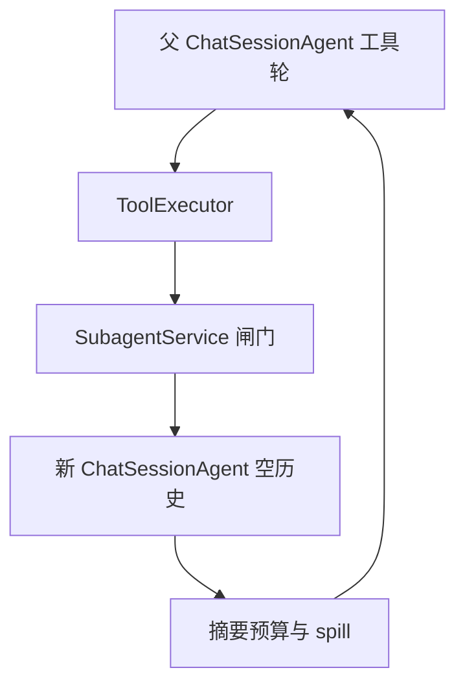

# 子 Agent 执行能力（Phase 0 + Phase 1）

规格以 [docs/multiple_agent/subagent-system-design.md](docs/multiple_agent/subagent-system-design.md) 为准：模型通过 `delegate_task` 委派一次性子任务，子 agent 零历史、共享会话 VFS，只把受预算约束的摘要回给父 agent。本期不做批量 `tasks`、`output_schema`、请求内异步（文档 Phase 2 / 3）。

## 相对设计稿必须改的假设

这些点按文档原文实现会失败或污染父会话。

- **90 秒批超时会杀掉子任务。** [backend/app/agents/tool_executor.py](backend/app/agents/tool_executor.py) 用一个 `wait_for(90s)` 包住整批工具。子任务墙钟是 600 秒。改成两组并行、各自计时：不含 `delegate_task` 的调用仍走 90 秒；`delegate_task` 单独 `wait_for(subagent.timeout_seconds)`。普通工具的超时语义不变。
- **`delegate_task` 不限定父对话的 `agent_mode`。** 设计稿要求 server 只进 `agent_mode_servers`，并在启动时拒绝 `subagent ∈ normal_mode_servers`。改为：`subagent.enabled` 为真时，普通模式与 Agent 模式的工具面都追加 `subagent`；为假时两种模式都不出现。不因写入 `normal_mode_servers` 拒绝启动。
- **子工具面跟随父请求，不强制子级 `agent_mode > 0`。** 子级 server 列表用父请求 `_resolve_request_mcp_servers` 的结果（普通模式或 Agent 模式），再只按 `excluded_tools` 做减法，保证子面是父面的子集。不做代码级硬剔除。迭代预算单独覆盖为 `subagent.max_iterations`（默认 10），避免父在 Agent 模式时子级吃到 90 轮。
- **防递归与交付工具都走配置。** 设计稿对 `delegate_task`、`present_files` 做代码级永久剔除，配置无法解除。改为默认 `excluded_tools: ["subagent_*", "file_present_files"]`。清空或改写该列表即可让子级保留委派或交付工具。
- **子提示词不能走父模板。** `stream_session_events` 在 `agent_mode > 0` 时加载技能清单并调用 `get_system_prompt_for_chat_session`。为本 turn 增加粘性的 `system_prompt_override`：使用附录 A，不注入技能清单、用户记忆、父历史。`unified_context_guard` 里的 `_refresh_system_prompt` 不得把覆盖写回父模板。
- **工具结果会进入后续轮次。** 历史回放经 `BaseAgent._format_history_message_for_llm` 展开 `ToolResultBlock.content`。文档里「中间过程天然只在当轮」不成立。`delegate_task` 的 handler 必须在返回前完成 8000 字裁剪，落库的就是摘要。单条硬上限默认 30000，8000 字摘要不会被再截一次。
- **不能复用父 agent 实例。** `ChatService` 持有的 `ChatSessionAgent` 有 `session_output` 与 SSE 聚合。`SubagentService` 另建实例，排空 `stream_session_events`，不经过 `ChatOrchestrator`，因此子循环不落 `MessageDb`、不把子 SSE 推给前端。
- **子任务历史必须是空列表。** `unified_context_guard` 在窗口外消息非空时会 `upsert` 会话摘要。空历史不会走到这一步，避免子循环改写父会话的窗口摘要。
- **断 SSE 不会取消子任务。** 只有显式 stop 取消 producer，`CancelledError` 才会传到正在 `await` 的子循环。验收按 stop 语义写，不按「浏览器断开即取消」写。
- **`subagent_execution` 不是启动必填场景。** 缺省回落到本轮父模型的 `LLMConfig`。配了该场景才走独立模型。避免现有 Nacos 配置因缺场景无法启动。

## 组件与改动点

- **配置** [backend/app/schemas/config.py](backend/app/schemas/config.py) + [backend/app/core/config.py](backend/app/core/config.py)：`SubagentConfig`（`enabled=false`、`excluded_tools` 默认 `["subagent_*", "file_present_files"]`、`max_tasks_per_call=4`、`max_iterations=10`、`timeout_seconds=600`、`summary_max_chars=8000`、`scenario=subagent_execution`）。`subagent` 写入 `mcp_servers`。`enabled=false` 时不注册、也不出现在任一模式的工具面。`enabled=true` 时 `_resolve_request_mcp_servers` 在普通模式与 Agent 模式都追加 `subagent`。不校验、不拒绝 `subagent` 出现在 `normal_mode_servers`。`excluded_tools` 的规范名 / `"{server}_*"` 校验放在 MCP 初始化之后（那时才有工具路由）；bare 名启动失败，未知名告警保留。
- **MCP** `backend/app/mcp/mcp_servers/subagent_mcp/`：照 `skill_manager_mcp`（`server.py` + 工具模块）。Phase 1 入参是单个 `goal`（必填）+ 可选 `context`，不接 `tasks` 数组。工具描述写明：适合互相独立、会淹没主上下文的子任务；单步改文件、需要用户确认的不要委派；子 agent 看不到当前对话。
- **服务** `backend/app/services/subagent/`：闸门（开关、空 goal、`TODO` 模板、任务数）→ 新 `ChatSessionAgent` → 过滤工具面 → `asyncio.wait_for` → 75% 头 + 25% 尾裁剪 → spill 到会话 workspace `.subagent/<task_id>/full.txt` → 返回带不可信前缀的摘要 JSON（`status`、`summary`、`tool_trace` 元数据、`tokens`、`spill_path`）。工具面 = 父请求已解析的 server 列表展开后，只按 `excluded_tools` 做减法（规范名精确匹配，或 `"{server}_*"` 按 server 名整组排除）。没有单独的硬剔除名单。父在普通模式时，子级同样没有 file/shell。默认配置会排除 `subagent_*` 与 `file_present_files`。
- **提示词** [backend/app/prompts/subagent_prompt.py](backend/app/prompts/subagent_prompt.py)：附录 A。`goal` 作为子 agent 的第一条 user 消息，不进系统提示词。
- **审计** 用 contextvar 收集 `subagent_runs`（`goal` 只存 sha256，不存原文）。[backend/app/services/chat/chat_orchestrator.py](backend/app/services/chat/chat_orchestrator.py) 在落 assistant 消息时并入 `message_metadata`，与现有 `iteration_checkpoint` 同一时机。
- **观测** 在父 `chat-turn` span 下加 `subagent-task` span；input 只记 goal 前 200 字。日志字段 `subagent_task_id`、`parent_conversation_id`。

## 验收

- `enabled=false`：普通模式与 Agent 模式的工具面都没有 `delegate_task`。
- `enabled=true`：`agent_mode=0` 与 `agent_mode>0` 都有 `delegate_task`。
- `subagent` 写入 `normal_mode_servers`：不拒绝启动。
- 默认 `excluded_tools` 下，子工具面不含 `delegate_task` / `present_files`；改配置后这两项可以出现。`excluded_tools` 只减不加，代码里没有第二份黑名单。
- 手工委派一次多文件调研：父工具结果不超过 8000 字，只有 tool_trace 元数据；超限时 spill 文件可用 `read_file` 读到全文。
- 子循环最多 10 轮工具；超过 `timeout_seconds` 返回 `status=timeout`，同批其它工具仍受 90 秒约束。
- 显式 stop 能取消正在跑的子任务。
- `make lint` 与 `make test --ignore=tests/mcp_demo` 通过。默认关闭，现有评估集行为不变。
