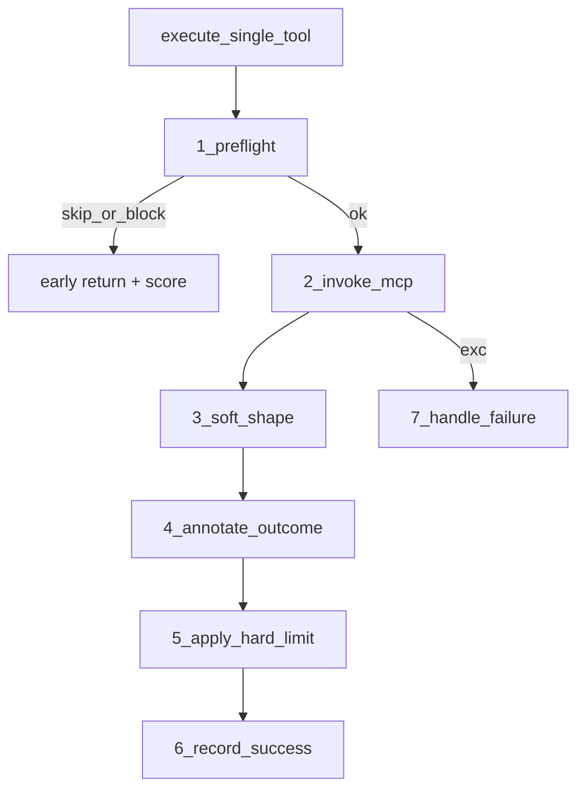

# execute_single_tool 轻量分层重构

## 结论

**可以优化，且值得做**——当前问题不是软压缩与硬上限「逻辑重复」，而是 **编排层过长**：预检短路、护栏、MCP、FAISS/Tavily、Shell 展示、告警、outcome、观测打点、硬上限全挤在一个 ~260 行的 `try` 里，读起来像散文，后续改一层容易误伤另一层。

**不做**：通用 middleware / 责任链框架（过度设计）。
**做**：同文件内按阶段抽私有方法，主函数变成清晰流水线。

## 目标分层

与现有计划文档（软层 → 硬层）对齐，把「调用生命周期」也显式拆开：



| 阶段 | 职责 | 对应现有代码 |
|------|------|----------------|
| **1. Preflight** | 解析 JSON；`web_pages_extract` URL 去重（可短路）；`guardrail.before_call`（可短路） | L185–246 |
| **2. Invoke** | `call_tool` + `format_mcp_result` → 初始 `ToolResultMessage` | L248–265 |
| **3. Soft shape** | skip / Tavily / FAISS；Shell `structured_content_for_display` | L266–300 |
| **4. Annotate** | warnings 前缀；`_resolve_tool_outcome`；guardrail suffix | L302–333 |
| **5. Hard limit** | `apply_hard_limit`（成功路径末尾，顺序不变） | L377–384 |
| **6. Observe** | span update、score、`on_arguments_recorded`、日志 | L334–376 |
| **7. Failure** | 现有 `except` 抽成 `_handle_tool_failure` | L385–431 |

关键约束（行为不变）：

- 硬上限仍在 **成功路径最后**（告警 / guardrail suffix 计入长度后再截断）。
- 异常路径 **仍不走** `apply_hard_limit`（与现状一致）。
- `tool_call_attempted` 语义保留：仅真正发起 MCP 后，失败才 `on_arguments_recorded(..., False)`。
- Preflight 短路（URL 全跳过 / guardrail block）的返回形状与打分保持一致。

## 建议方法签名（同文件）

在 [`backend/app/agents/tool_executor.py`](backend/app/agents/tool_executor.py) 中新增私有方法，例如：

- `_preflight_tool_call(...)` → `tuple[dict, ToolResultMessage | None]`（后者非空表示短路返回）
- `_invoke_mcp_tool(...)` → `(result, call_warnings, ToolResultMessage, server_name)`
- `_soft_shape_tool_result(...)` → `ToolResultMessage`
- `_annotate_tool_result(...)` → `(ToolResultMessage, success, error_type, outcome_meta)`
- `_record_tool_success_observation(...)` / `_handle_tool_failure(...)`

`execute_single_tool` 缩成约 40–60 行编排：

```python
async def execute_single_tool(...):
    with observation_span(...) as tool_span:
        tool_call_attempted = False
        try:
            arguments, early = await self._preflight_tool_call(...)
            if early is not None:
                return early
            tool_call_attempted = True
            result, warnings, msg, server = await self._invoke_mcp_tool(...)
            msg = await self._soft_shape_tool_result(...)
            msg, success, error_type, meta = self._annotate_tool_result(...)
            self._record_tool_success_observation(...)
            on_arguments_recorded(...)
            return apply_hard_limit(msg, ...)
        except Exception as exc:
            return self._handle_tool_failure(...)
```

## 明确不改动的部分

- [`tool_result_hard_limit.py`](backend/app/utils/tool_result_hard_limit.py)、[`context_compactor.py`](backend/app/utils/context_compactor.py) 算法与配置不动。
- 不合并软压缩与硬上限（职责仍分离）。
- 不新开模块文件（除非后续 soft shape 继续膨胀再拆）。

## 验证

- 现有 [`backend/tests/agents/test_tool_executor.py`](backend/tests/agents/test_tool_executor.py) 与 [`backend/tests/utils/test_tool_result_hard_limit.py`](backend/tests/utils/test_tool_result_hard_limit.py) 应全部通过，无需为行为加新用例。
- 若有针对 URL 去重 / guardrail / compaction skip 的单测，确认仍覆盖主路径。
