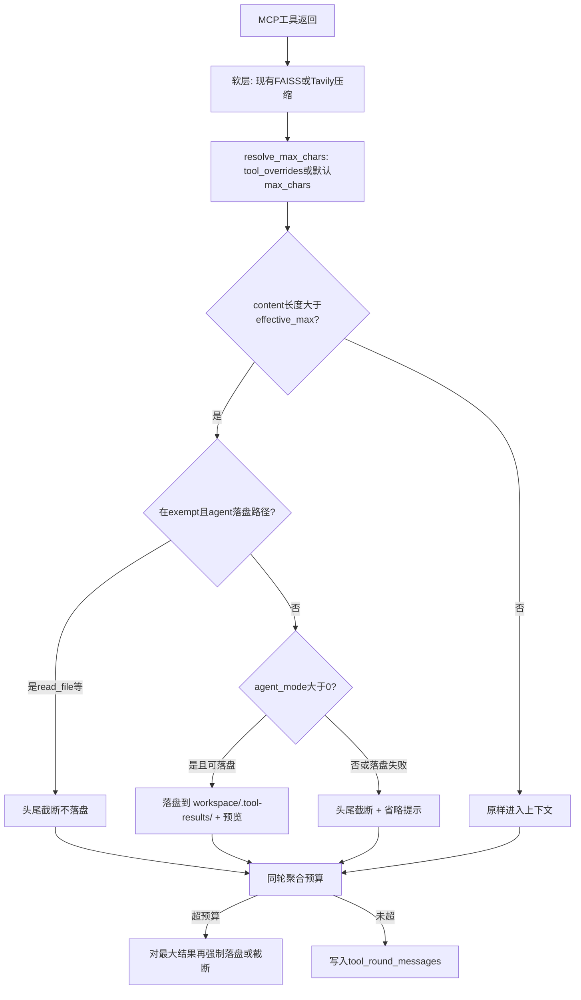

# 工具返回结果超长处理方案

## 依据

### 为什么必须区分 `agent_mode`

| 模式 | 暴露的 MCP | 对超长结果意味着什么 |
|------|-----------|---------------------|
| `agent_mode=0` | time / weather / tavily / code / context7 / zread（**无 file/shell**） | 模型**无法**再读磁盘文件；落盘预览只会变成死路径 |
| `agent_mode=1` | file / shell / skill_manager / tavily / … | 模型可用 `read_file` 按需回读；落盘是正确主策略 |

来源：[backend/docs/MCP_CONFIG_ANALYSIS.md](backend/docs/MCP_CONFIG_ANALYSIS.md)、[backend/docs/VFS_AND_SANDBOX.md](backend/docs/VFS_AND_SANDBOX.md)。

### 决策：不为「方案简单」给 `agent_mode=0` 开 `read_file`

**结论：没必要，本期不做。**

表面上看，给普通模式也挂 `file`（或只挂 `read_file`）可以让两模式统一走「落盘 + 预览」，少一个 `if agent_mode` 分支。但代价不对等：

| 维度 | 统一落盘（给 0 开 read_file） | 保持分流（0 截断 / 1 落盘） |
|------|------------------------------|---------------------------|
| 硬上限代码 | 少一个分支（约十几行） | 多一个分支，仍很薄 |
| 产品边界 | 普通对话开始能读 workspace/uploads，与「轻量问答、附件走 RAG」定位冲突 | 维持现有 `normal_mode_servers` 设计 |
| 工具面 / prompt | 多一整组 file 工具 schema，误调、多一轮 read 成本上升 | 不变 |
| 安全与会话目录 | 需保证 0 模式也建好 workspace、权限与路径提示 | 0 模式甚至不必写盘 |
| 真实收益 | 普通模式工具以 tavily/code 为主，FAISS + 头尾截断通常够用；回读完整 shell 日志不是 0 模式场景 | Agent 模式才是大输出 + 回读的主战场 |

「简单」应优先保证**产品语义简单**（0=轻量、1=可操作文件），而不是消灭一个配置分支。硬上限模块里 `agent_mode > 0 → persist else truncate` 足够清晰。

若未来强诉求是「普通模式也能回读超长搜索原文」，再单独评估「仅暴露只读 file 子集」；**不作为本期简化手段**。

### 为什么不直接照搬某一家

- **claude-code / deer-flow / opencode**：落盘 + 预览优秀，但前提是「模型能读文件」→ 只适合 `agent_mode=1`
- **codex**：`truncate_middle`、不落盘 → 适合 `agent_mode=0`（无回读能力）
- **hermes**：工具内截断 → 单条 persist → 同轮 turn budget → 历史 prune；分层清晰，可借鉴「单条硬上限 + 同轮聚合预算」
- **现有 FAISS**（[context_compactor.py](backend/app/utils/context_compactor.py)）：对 Tavily 等 markdown 结果仍有价值，应保留为软层，而不是被硬截断替代

### 当前缺口（对照文档 P0-1 / P0-2）

1. `file` / `shell` 跳过 FAISS（`SKIP_TOOL_RESULT_COMPACTION_SERVERS`），50K shell 输出可直接进 context
2. 无单条结果硬上限兜底；单结果过大时要等下一轮 `_check_round_context_budget` 才停工具，可能已撑爆 API
3. 无同轮多工具聚合预算

### 是否按工具类型区分处理？

#### chat-agent 现状（已上线）

**有部分区分，但不统一、也不够：**

| 层级 | 是否按工具区分 | 说明 |
|------|----------------|------|
| MCP 工具内部 | 是 | shell 50k、read_file 200k、search_files 50k 等各自硬截断 |
| 调用后软压缩 | 是 | Tavily → `TavilyResultProcessor`；`file`/`shell` → **跳过** FAISS；其余 → 通用 FAISS markdown |
| 硬上限 / 落盘 | **无** | 不存在统一硬上限，故也无 per-tool 策略 |
| 历史组装 | 弱区分 | 只按「是否最近一轮」用 summary/截断，不按工具名 |

#### 本方案（本期）

**主分流仍是 `agent_mode`；工具维本期纳入 `tool_overrides` + `read_file` 豁免（对齐 deer-flow）：**

| 行为 | 按工具？ | 说明 |
|------|----------|------|
| 落盘 vs 头尾截断 | 否（按 mode） | `agent_mode>0` 落盘，否则截断 |
| 单条触发阈值 | **是（tool_overrides）** | 默认 `max_chars`；可按工具覆盖 |
| `read_file` 豁免落盘 | **是** | 防 persist→read→persist；豁免后改头尾截断（仍受该工具阈值约束） |
| 截断形态 | 否（全局） | 统一 head+tail；不做 shell-tail / read-head 分形态 |
| 保留现有软层 | 是（沿用） | Tavily / FAISS / skip file·shell 不变 |

#### 其他框架（源码核对）

| 框架 | 是否区分工具 | 区分方式 |
|------|--------------|----------|
| **deer-flow** | **是** | `exempt_tools`（默认 `read_file`）；`tool_overrides` 可改每工具 `externalize_min_chars`；sandbox 内 bash/ls/read 各自上限与截断形态不同 |
| **hermes-agent** | **是** | 工具注册 `max_result_size_chars`；`read_file` persist 阈值 = inf；terminal 工具内 40/60 头尾截断；prune 摘要按工具名格式化一行 |
| **claude-code** | **是** | 每工具 `maxResultSizeChars`（Read 可为 `Infinity` 永不 persist）；microcompact 仅清理指定 compactable 工具集（Read/Bash/Grep/…） |
| **opencode** | **是** | Shell → **tail** + 流式落盘；Read → 行/字节/单行自管后跳过二次 Truncate；Glob/Grep 结果数上限；通用路径走 `Truncate.output` |
| **codex** | **是** | 每工具 `TruncationPolicy::Bytes/Tokens`；MCP 默认很紧（如 `Bytes(1024)`）；Exec 与 MCP 封装路径不同，算法同为 middle truncate |

**共性**：几乎都区分「读文件类」与「命令/搜索类」——读文件常豁免二次外部化或自带分页；命令输出用更激进的截断/落盘。
**差异**：有的按**阈值数字**区分（claude / deer-flow overrides），有的按**截断形态**区分（opencode shell tail vs read head），有的按**策略对象**区分（codex per-tool policy）。

#### 对本方案的含义

- 本期硬上限 = **全局默认 + `tool_overrides` 按工具覆盖阈值 + `exempt` 防循环 + `agent_mode` 决定动作（落盘/截断）**。
- **不做**按工具切换截断形态（shell-tail vs read-head）；形态统一 head+tail，仅阈值可配，避免配置面过大。

---

## 目标分层（本期只做返回值，不做参数截断）



- **Layer 0（已有）**：shell/file MCP 内部字符上限
- **Layer 1（已有）**：FAISS / Tavily 语义压缩（`file`/`shell` 仍跳过）
- **Layer 2（新增）**：单条硬上限 = `resolve_max_chars(tool)` + 按 `agent_mode` / exempt 分流动作
- **Layer 3（新增）**：同轮聚合预算（`execute_tool_calls_parallel` 全部完成后）

本期**不做** tool_call 参数截断（文档 P0-3），留后续。

---

## 具体策略

### 配置（新增 `ToolResultHardLimitConfig`，挂在 `chat_context`）

建议默认值（与对比文档 / deer-flow 对齐，可配置）：

- `enabled: true`
- `max_chars: 30_000` — 单条进 LLM 的**默认**硬上限
- `preview_head_chars: 2_000`
- `preview_tail_chars: 1_000`（Agent 落盘预览与普通截断共用头尾形态）

#### 头尾阈值：绝对值 vs 比例（其他框架）

| 框架 | 形态 | 头/尾怎么定 |
|------|------|-------------|
| **deer-flow** | head+tail | **绝对值**：预览 head `2000` / tail `1000`；fallback head `8000` / tail `3000` |
| **claude-code** | 仅头预览 | **绝对值**：`PREVIEW_SIZE_BYTES = 2000`（落盘后只留头部预览） |
| **opencode** | 单端 head **或** tail | **绝对值**：`maxLines=2000` / `maxBytes=50KB`（不按比例拆头尾） |
| **codex** | middle（头+尾） | **绝对值总预算**，再 **对半拆**：`split_budget` → left = budget/2，right = 余下（等价固定 50/50，不是可配 ratio 字段） |
| **hermes** | head+tail | **比例**：terminal 在 `MAX_OUTPUT_CHARS`（默认 50k）上按 **40% 头 / 60% 尾**；web extract 约在 char budget 上 **75% 头 / 25% 尾** |

**对本方案**：继续用 **绝对值** `preview_head_chars` / `preview_tail_chars`（与 deer-flow 一致、可配置直观）。不引入 ratio 配置项；若以后要对齐 hermes 终端「偏尾」，可把默认改成 head=12000/tail=18000 这类绝对值，或再加可选 `preview_head_ratio`，**不必本期做**。

- `turn_budget_chars: 80_000` — 同轮所有 tool result `content` 合计上限
- `persist_subdir: ".tool-results"` — 相对 conversation `workspace/`
- `exempt_bare_names: ["read_file"]` — Agent **落盘豁免**（仍可按阈值头尾截断），防循环
- **`tool_overrides: dict[str, int]`** — 按工具覆盖 `max_chars`（本期增强，对齐 deer-flow）

#### `tool_overrides` 语义

| 配置值 | 含义 |
|--------|------|
| 未配置该工具 | 使用全局 `max_chars` |
| `N > 0` | 该工具触发硬上限的阈值为 `N` 字符 |
| `0` | 该工具**关闭**硬上限（Layer 2 跳过；turn budget 仍可强制处理超大结果） |

**键名解析**（调用时 `tool_name` 多为 LLM 名，如 `shell_exec` / `file_read_file`）：

1. 先查完整 LLM 名（如 `shell_exec`）
2. 再查 bare 名（经 `bare_tool_name` / `get_tool_route` 得到，如 `exec`、`read_file`）
3. 命中任一即生效

推荐默认 overrides（可按环境调）：

```yaml
tool_overrides:
  exec: 20000              # shell：输出噪声大，更早触发
  search_files: 20000
  web_site_crawl: 20000    # 爬取原文易膨胀
  web_pages_extract: 25000
  # web_search 不配 → 走默认 30000（上游已有 FAISS）
  # read_file 用 exempt，不靠 override=0（豁免的是落盘，不是截断）
```

实现辅助函数：

```python
def resolve_max_chars(tool_name: str, config: ToolResultHardLimitConfig) -> int | None:
    """返回有效阈值；None 表示 Layer2 跳过（override=0）。"""
    bare = extract_bare(tool_name)  # 现有 tool_naming 辅助
    if tool_name in config.tool_overrides:
        value = config.tool_overrides[tool_name]
    elif bare in config.tool_overrides:
        value = config.tool_overrides[bare]
    else:
        value = config.max_chars
    if value == 0:
        return None
    return value
```

放在 [backend/app/schemas/config.py](backend/app/schemas/config.py)，与现有 `ToolResultCompressionConfig` 并列，**不改动** FAISS 的 `tolerance_tokens` / `threshold_tokens`。

### `agent_mode=1`：落盘预览（主）

- **时机**：单条工具在 FAISS/Tavily/skip 分支之后、写入结果消息之前；以及同轮全部工具结束后的聚合扫描
- **路径**：物理 `data/user_data/{uid}/conversations/{cid}/workspace/.tool-results/{tool_call_id}.txt`
  虚拟 `/mnt/user-data/workspace/.tool-results/{tool_call_id}.txt`（复用现有 VFS，见 [paths.py](backend/app/vfs/paths.py)）
- **替换文案**（仅改 LLM 侧 `content`）：

```text
{head}

... [{n} chars total, full output persisted] ...

{tail}

[完整输出已保存到 /mnt/user-data/workspace/.tool-results/{id}.txt]
需要更多细节时请用 read_file 读取该路径（可用 offset/limit）。
```

- **豁免**：`read_file`（及配置中的 bare name）不落盘，改为头尾截断，避免循环
- **落盘失败**（无 user_id/conversation_id、磁盘错误）：降级为与 `agent_mode=0` 相同的头尾截断
- **前端**：`structured_content_for_display` 保持现有逻辑（shell 展示块照旧）；硬上限只压缩进模型的 `content`，避免把 UI 展示一并砍掉

### `agent_mode=0`：头尾截断（主）

- **时机**：同上
- **策略**：head(2k) + 省略行 + tail(1k)，总长压到 `max_chars` 量级；提示「内容已截断，无法回读完整原文」（不提 `read_file`）
- **不写磁盘**：普通模式无 file MCP，写盘无收益且增加清理成本

### 同轮聚合预算（两模式共用逻辑，动作按模式分流）

在 [tool_executor.py](backend/app/agents/tool_executor.py) 的 `execute_tool_calls_parallel` 返回前：

1. 统计本批 `ToolResultMessage.content` 总字符
2. 若 `> turn_budget_chars`：按体积降序，对未处理过的最大结果强制再走一遍「落盘或截断」（阈值视为 0 / 强制），直到达标
3. 已落盘/已截断的跳过，避免重复写盘

依据：hermes `enforce_turn_budget`、claude-code 消息级 200k 预算；chat-agent 虽常串行，但 `plan_tool_batch_segments` 仍有并行段，需要聚合兜底。

---

## 接入点与改动文件

1. **透传 `agent_mode`**
   - [mcp_tool_execution.py](backend/app/agents/mcp_tool_execution.py) / [tool_executor.py](backend/app/agents/tool_executor.py)：`reset_for_request(..., agent_mode: int = 0)`
   - [chat_session_agent.py](backend/app/agents/chat_session_agent.py)：调用处传入 `chat_request.agent_mode`

2. **核心实现**（新建小模块，避免继续膨胀 tool_executor）
   - 建议：`backend/app/utils/tool_result_hard_limit.py`
     - `resolve_max_chars(tool_name, config) -> int | None`
     - `apply_hard_limit(message, *, agent_mode, user_id, conversation_id, tool_name, config) -> ToolResultMessage`
     - `enforce_turn_budget(messages, ...) -> list[ToolResultMessage]`
   - 在 [tool_executor.py](backend/app/agents/tool_executor.py) 单条结果组装完成后调用 `apply_hard_limit`；并行批次结束调用 `enforce_turn_budget`

3. **配置**：[schemas/config.py](backend/app/schemas/config.py) + Settings 挂载（含默认 `tool_overrides`）

4. **测试**（`backend/tests/`）：
   - agent_mode=0：超长 content → 头尾截断、无落盘、文案不含 read_file
   - agent_mode=1：超长 → 文件出现在 workspace/.tool-results、content 含虚拟路径
   - `tool_overrides`：同长度下 `exec` 更早触发；`override=0` 跳过 Layer2
   - 键名：LLM 名 `shell_exec` 与 bare `exec` 均可命中
   - read_file 豁免：agent_mode=1 不落盘，但仍可按阈值截断
   - 落盘失败降级截断
   - turn budget：两条超大结果合计超限时强制处理较大者

---

## 明确不在本期范围

- tool_call **参数**截断（P0-3）
- 历史轮次时间触发清理（P1-2）
- 替换或关闭 FAISS
- 改 shell/file MCP 内部 50k/200k 上限（Layer 0 保持；Layer 2 在其之上再收紧进 LLM 的视图）

---

## 预期效果

- `agent_mode=1`：shell/file/爬取等大输出不再整段占满 context，模型可按路径回读
- `agent_mode=0`：tavily/code 等超大结果有硬兜底，且不依赖不存在的 file 工具
- 可通过 `tool_overrides` 让 shell/crawl 等更早触发、搜索类沿用更宽默认，而无需改代码
- 单结果与同轮合计双保险，降低「直接打爆 context API」的概率
