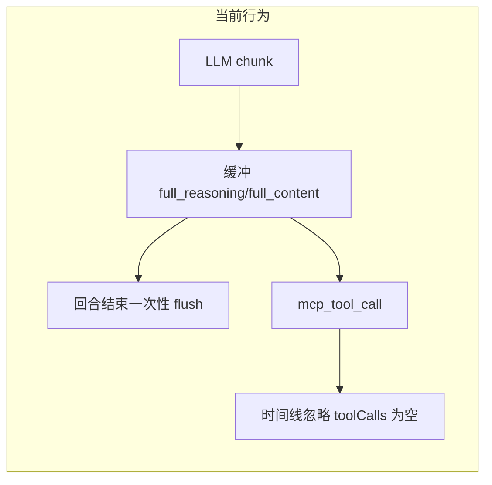

# 前后端「真正流式」改造方案

## 现状与根因

### 后端 (`[chat_session_agent.py](backend/app/agents/chat_session_agent.py)`)

- 在 `_stream_one_round_with_tools` 的 `async for chunk` 循环中：
  - `**reasoning_content**`：在出现 `tool_calls` delta **之前**只写入 `full_reasoning`，**不向客户端 yield**（约 243–250 行仅在 `seen_tool_delta` 为真时才 `reasoning_delta`）。
  - `**content`**：同样在 `seen_tool_delta` 之前不推流。
- 当本回合 **无 `tool_calls`** 时，通过 `[_flush_buffered_as_final_sse](backend/app/agents/chat_session_agent.py)` 把整段缓冲一次性打成 `reasoning`/`content` 的 `start` + `finish_streaming_type`，**主消息区没有逐 token 的 `continue`**（与 `[stream_final_response_sse](backend/app/agents/utils/streaming_llm.py)` 行为不一致）。
- 首段 `tool_calls` delta 到达时，会把**整段** `full_reasoning` 用 `[_flush_pre_tool_reasoning_to_mcp](backend/app/agents/chat_session_agent.py)` 一次性打出；若改为按 chunk 流式，需**删除或条件化**该整段 flush，否则会**重复**。

### 前端

- `[fetchEventSource](frontend/src/services/chat.ts)` 已是按 SSE 事件解析，**无额外缓冲**；瓶颈不在 fetch 层。
- `[useTimelineMessages](frontend/src/pages/ChatPage/components/ChatMessage/components/ToolCallBlock/hooks.ts)` 对 `role === "assistant"` 只遍历 `message.toolCalls` 里的每一项生成时间线；若流式阶段 assistant 的 `**toolCalls: []`**（尚未聚合出 call id），**循环 0 次**，`[ToolCallItemContent](frontend/src/pages/ChatPage/components/ChatMessage/components/ToolCallBlock/ToolCallItemContent.tsx)` **永远不会展示**这段 `reasoningContent`/`content`。这是「后端发了 `mcp_tool_call` 但界面仍像一次性出来」的关键原因之一。
- `[StreamMessage](frontend/src/interfaces/apiRequest.ts)` 里 `reasoning` 的 `status` 未包含 `"continue"`，与后端 `[stream_final_response_sse](backend/app/agents/utils/streaming_llm.py)` 已发出的协议不一致（运行时仍能 append，但类型与可维护性差）。
- `[appendMcpToolCallToLastMessage](frontend/src/store/slices/chatSlice.ts)` 中 `streaming` 分支要求 `tc.length > 0`；若首包是 **纯 content**、没有先出现 `reasoning_delta`，可能**无法**挂上 assistant 占位（边界情况）。

## 目标行为

- **工具轮次内**：从首个 `reasoning_content` / `content` delta 起即向客户端 yield，延迟接近 LLM chunk，而不是等 `finish_reason`。
- **无 tool_calls 的收尾**：主消息区 `reasoning`/`content` 使用与 `stream_final_response_sse` 相同的 `**start` / `continue` / `done`**，便于 `[appendReasoningToLastMessage](frontend/src/store/slices/chatSlice.ts)` / `[appendContentToLastMessage](frontend/src/store/slices/chatSlice.ts)` 逐段追加；**避免**同一文本既整段进 `mcp_tool_call` 又整段进顶层（消除重复展示与 DB 逻辑混乱）。
- **持久化**：`[get_collected_response](backend/app/services/chat/chat_service.py)` 依赖 `[ChatSessionAgent.format_sse_message](backend/app/agents/chat_session_agent.py)` 在 `reasoning`/`content` 上累加 `self.reasoning`/`self.content`。改造后需保证：**要么**仍通过顶层 `reasoning`/`content` SSE 走 `format_sse_message`，**要么**在回合结束处**显式**把 `full_reasoning`/`full_content` 同步到 `self.reasoning`/`self.content`（与 SSE 不重复累加）。

## 推荐实现路径（分后端 / 前端）

### 1. 后端：`_stream_one_round_with_tools` 内随 chunk 下发

**文件**：`[backend/app/agents/chat_session_agent.py](backend/app/agents/chat_session_agent.py)`

- **Reasoning**：
  - 对每个非空 `reasoning_content` delta **立即** yield（与现有 `seen_tool_delta` 后逻辑一致：`mcp_tool_call` + `status: reasoning_delta` + **本 delta 字符串**，不要等整段拼完再发）。
  - 在**首次**收到 `tool_calls` delta 时：**若**本回合 reasoning 已按 delta 流式下发，则**不要**再调用「把整段 `full_reasoning` 打成一条 `reasoning_delta`」的 flush；仅保留 `merge_tool_call_deltas` 与后续逻辑。
- **Content**：
  - 维护**一条**累计字符串（可与现有 `acc_tool_stream_content` 合并逻辑），每个 `content` delta 立即 yield `mcp_tool_call` 的 `role: assistant` + `status: streaming` + **当前累计全文**（与 256–265 行行为一致，只是去掉 `seen_tool_delta` 门槛）。
  - 若首包为 content、尚无 assistant 占位，由前端补 stub（见下）。
- `**not has_tool_calls` 收尾**：
  - 若本回合已通过顶层 `reasoning`/`content` 流式输出（推荐下面「双通道」策略），则 `_flush_buffered_as_final_sse` 改为只补 `**done`** 或省略；若仍用 mcp 通道流式，则需**显式** `self.reasoning`/`self.content = full`_* 并避免 `_flush_buffered_as_final_sse` 再次把全文打进 `format_sse_message` 导致**双倍**长度。
- **推荐「双通道」策略（减少 UI 重复、主区域也能打字）**：在同一 loop 内，对每段 `reasoning_content` / `content` **同时**：
  - yield `mcp_tool_call`（工具时间线/调试语义保持不变），**且**
  - 用与 `[stream_final_response_sse](backend/app/agents/utils/streaming_llm.py)` 相同的状态机 yield 顶层 `reasoning` / `content`（`start`→`continue`、reasoning→content 阶段切换时 `finish_streaming_type`）。
  - 这样 `[format_sse_message` 重写](backend/app/agents/chat_session_agent.py) 会持续更新 `self.reasoning`/`self.content`，DB 与最终 `[update_assistant_message](backend/app/services/message/message_db.py)` 无需额外分支。代价是**同一段文本**会进 Redux 两处（`toolCalls` 与 `message.reasoning`/`content`）；若产品不能容忍，可改为**仅顶层流式 + 前端时间线从 toolCalls 拆行展示**，需二选一并在计划中定案（默认采用双通道并在 UI 上弱化重复，例如时间线仅展示「调用 xxx」、思考只在 ReasoningBlock —— 可后续再收）。

**更稳妥的单一通道（若不想双写 Redux）**：

- Loop 内**只**发顶层 `reasoning`/`content`（真流式 + `format_sse` 累加）。
- 在**聚合出完整 `tool_calls` 后**，再发一条 `mcp_tool_call` 承载完整 `assistant_message.model_dump()`（与现 311 行一致），前端时间线只显示**带 id 的工具行**；**预工具思考**只在 `[ReasoningBlock](frontend/src/pages/ChatPage/components/ChatMessage/components/ReasoningBlock.tsx)` / 主 Markdown 显示。这样时间顺序与布局（工具块在上、思考在下）需接受「思考在工具块下方」或调整布局顺序（超出本次最小范围时可列为 follow-up）。

**建议**：优先 **单一顶层流式 + 工具结果仍在 mcp_tool_call**，与现有无工具路径体验一致；预工具阶段不再依赖「空 `toolCalls` 的 mcp assistant」进时间线。

### 2. 前端：类型、Redux 与时间线（按所选通道取舍）

**若保留 mcp 流式 + 空 `toolCalls` 也要可见**：

- 修改 `[useTimelineMessages](frontend/src/pages/ChatPage/components/ChatMessage/components/ToolCallBlock/hooks.ts)`：对 `role === "assistant"` 且 `toolCalls.length === 0` 时，插入**一条**占位时间线项（稳定 `key`，如 `preamble-${messages.length}`），展示 `reasoningContent` / `content`；当后续同轮完整 assistant（带 `toolCalls`）到达时，合并或替换策略要定义清楚（避免两条「助手」）。
- `[appendMcpToolCallToLastMessage](frontend/src/store/slices/chatSlice.ts)`：在 `streaming` 且 `tc.length === 0` 时 `push` assistant stub。

**若采用单一顶层流式**：

- 重点补齐 `[apiRequest.ts](frontend/src/interfaces/apiRequest.ts)` 中 `reasoning` 的 `status: "continue"`；确认 `[chat.ts](frontend/src/hooks/chat.ts)` 里 `reasoning` handler 对 `continue` 只 append、不重复 `setReasoning(true)`（当前 else 分支已会 append，可显式处理 `continue` 更易读）。
- 时间线逻辑可不动，预工具思考走 `ReasoningBlock`。

### 3. 代理 / 部署（可选）

- 若生产前有 **Nginx / 网关**，需关闭对 SSE 的响应缓冲（如 `X-Accel-Buffering: no`、proxy_buffering off）。当前 `[chat.py](backend/app/api/chat.py)` 的 `StreamingResponse` 未设这些头，可在实现阶段按需加上。

## 验证建议

- 开启 MCP、触发「先长篇思考再调工具」与「直接回答不调工具」两种请求：浏览器 Network 中 SSE **帧间隔**应随模型 chunk 变化，而非单帧大包。
- 对比无 MCP 路径：行为应与 `stream_final_response_sse` 一致。
- 跑 `[backend` 相关测试](backend) 与 `frontend` 的 `vp lint` / `vp build`（按 AGENTS.md）。

## 风险与决策点

- **布局与时间顺序**：仅顶层流式时，ReasoningBlock 在 ToolCallBlock 下方，与「思考发生在调用工具之前」的叙事可能不一致；若必须严格时间顺序，需扩展时间线展示「空 toolCalls 的 assistant」或调整 `[AssistantMessage.tsx](frontend/src/pages/ChatPage/components/ChatMessage/components/AssistantMessage.tsx)` 组件顺序（产品决策）。

建议在实现前确认：**预工具思考**优先出现在 **ReasoningBlock**（接受顺序）还是 **工具时间线内**（需改 `useTimelineMessages`）。
