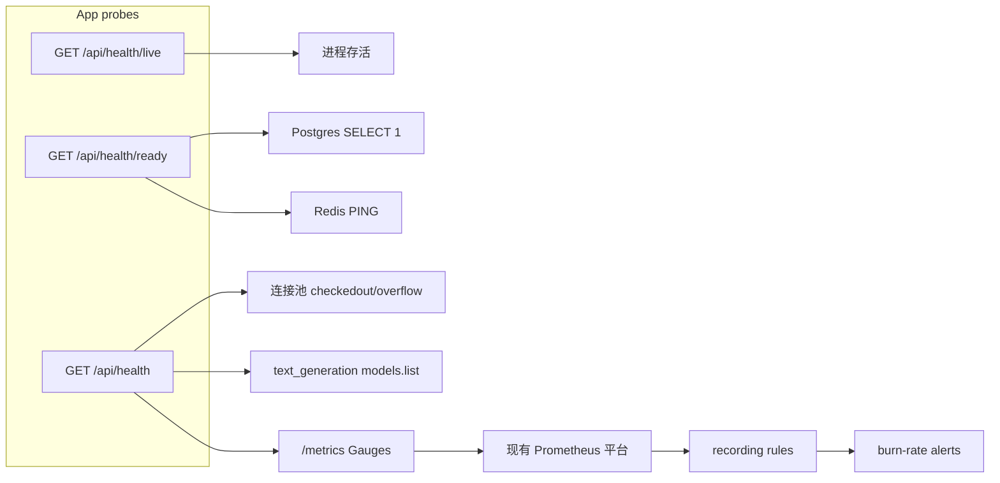

# 服务可用性：深度探活与 SLO 规则

## 范围与约束

- **做**：拆 live/ready、深度探活（DB 池、Redis、LLM）、把探活结果打成 Gauge、提供可粘贴到现有 Prometheus 平台的 recording/alerting YAML。
- **不做**：docker-compose 增加 Prometheus/Alertmanager；不恢复 README 里已不存在的 `/api/health/mcp*`（另开需求）；LLM 探活不做真实对话（避免配额与延迟）。
- 告警规则由运维在现有 Prometheus 平台导入；仓库只提供 YAML + PromQL 文档。



## 1. 拆 live / ready / deep

改 [`backend/app/api/health.py`](backend/app/api/health.py)，探活逻辑抽到新模块 [`backend/app/core/health_probes.py`](backend/app/core/health_probes.py)，避免路由文件变厚。

| 路径 | 用途 | 检查项 | HTTP |
|------|------|--------|------|
| `GET /api/health/live` | liveness | 进程能响应即可 | 始终 200 |
| `GET /api/health/ready` | readiness | Postgres `SELECT 1` + Redis PING | 任一硬依赖失败 → **503** |
| `GET /api/health` | 深度诊断 | 上两项 + DB 池统计 + LLM 可达性 | 硬依赖失败 503；仅 LLM 失败仍 200，`status=degraded` |

要点：

- 现有 `/api/health` 在 Redis 不可用时仍返回 `status: healthy`；ready/deep 必须改成 **硬依赖失败即 503**，否则 Docker/K8s `curl -f` 无法摘流。
- 响应继续用 `ApiResponse` 包一层 `data`，但 503 用 `JSONResponse(status_code=503, ...)`，不要走 `ApiResponse.success`。
- LLM **不作为 ready 条件**：上游 LLM 挂了，重启本进程无济于事，用 Prometheus 告警即可。
- 探活并行：`asyncio.gather`（DB / Redis / LLM），单依赖超时 2–3s。
- L1 缓存：[`backend/app/core/local_cache.py`](backend/app/core/local_cache.py) 的 `health` 目前 `maxsize=1`，多 key 会互相挤掉。改为 `maxsize=8`，TTL 仍 5s；LLM 探活可单独用 30s TTL（配额）。
- [`backend/app/middleware/logging.py`](backend/app/middleware/logging.py) 的 `SKIP_LOGGING_PATHS` 是精确匹配，改为前缀跳过 `/api/health`，避免 live/ready 打满日志。
- [`docker-compose.yml`](docker-compose.yml) backend healthcheck 从 `GET /` 改为 `GET /api/health/live`（liveness，避免 LLM/外部依赖导致容器反复 unhealthy）。前端 `depends_on: service_healthy` 仍表示「进程起来了」，深度失败走告警而不是卡住 compose。

## 2. DB 连接池与 LLM 探活

**Postgres / 连接池**（[`backend/app/core/db.py`](backend/app/core/db.py)）：

- 新增 `probe_db() -> {ok, latency_ms, error}`：`SELECT 1`。
- 新增 `get_pool_stats()`：从 `engine.pool` 读 `size` / `checkedout` / `overflow` / `checkedin`（SQLAlchemy `QueuePool`）。多 worker 下每个进程自己的池，指标带 `pid` label，与现有 [`process_metrics.py`](backend/app/core/process_metrics.py) 一致。

**LLM**（只探 `text_generation` 场景，经 [`resolve_scenario`](backend/app/services/base_service/model_resolver.py)）：

- 用独立 `AsyncOpenAI(..., timeout=3, max_retries=0)` 调 `models.list()`，**不**走真实 chat completion。
- 超时/连接失败/4xx-5xx → `llm: unavailable`，deep 标 `degraded`。
- 部分厂商可能不实现 `/models`：失败时记 `error` 字段，不要再发 completion 重试。

**Redis**：复用现有 `ping_redis()`。

## 3. 把探活打成 Prometheus Gauge

新增 [`backend/app/core/health_metrics.py`](backend/app/core/health_metrics.py)，由 live/ready/deep **顺带更新**（不另开采集线程，避免 LLM 被双重探测）。指标需 multiprocess-safe（Gauge + `pid` 或无 pid 的 0/1 由各 worker 各自写入，文档说明 scrape 聚合方式）。

| 指标 | 含义 |
|------|------|
| `health_dependency_up{component="postgres\|redis\|llm"}` | 1 正常 / 0 失败 |
| `health_probe_latency_seconds{component=...}` | 最近一次探活耗时 |
| `db_pool_size` / `db_pool_checked_out` / `db_pool_overflow` | 本 worker 连接池 |

在 [`backend/docs/PROMETHEUS_METRICS.md`](backend/docs/PROMETHEUS_METRICS.md) 追加这些指标名与标签。

`Instrumentator` 默认已有 `http_requests_total` / `http_request_duration_seconds`（handler/method/status），SLO 直接用它们，不必再包一层 HTTP 计数。

## 4. SLO / 错误预算规则（给现有 Prometheus 平台）

新增目录 [`deploy/prometheus/`](deploy/prometheus/)（平台侧导入，不进应用进程）：

- [`deploy/prometheus/recording_rules.yml`](deploy/prometheus/recording_rules.yml)
- [`deploy/prometheus/alerting_rules.yml`](deploy/prometheus/alerting_rules.yml)
- [`backend/docs/SLO.md`](backend/docs/SLO.md)：目标、PromQL、导入步骤、本月剩余预算怎么看

**默认 SLO（写在 YAML 注释里，平台可改）：月可用性 99.9%** → 错误预算约 43.2 分钟/月。

Recording（排除 `/metrics` 与 `/api/health*`）：

```promql
# 5m 可用性 SLI
slo:http_availability:ratio_5m =
  sum(rate(http_requests_total{handler!~"/metrics|/api/health.*",status!~"5.."}[5m]))
  /
  sum(rate(http_requests_total{handler!~"/metrics|/api/health.*"}[5m]))

# 30d 可用性（错误预算消耗）
slo:http_availability:ratio_30d = ...[30d] 同结构

# 剩余错误预算（1=满，0=耗尽）
slo:http_error_budget:remaining_30d =
  (slo:http_availability:ratio_30d - 0.999) / (1 - 0.999)
```

Alerting（多窗口 burn rate，避免短暂抖动）：

- **critical**：1h burn ≈ 14.4x 且 5m 仍在烧（约 2% 月预算/小时）
- **warning**：6h burn ≈ 6x 且 30m 仍在烧
- 依赖：`health_dependency_up{component="postgres|redis"} == 0` 持续 2m
- 依赖：`health_dependency_up{component="llm"} == 0` 持续 5m（warning）
- 连接池：`db_pool_checked_out / (db_pool_size + db_pool_overflow) > 0.9` 持续 5m
- 延迟：聊天 handler p95 > 10s（warning；handler 名以实际上线 `/metrics` 为准，文档里写核对步骤）

`SLO.md` 明确：规则需按平台 job/instance label 加上 `job="chat-agent-backend"`（或你们现有 job 名）再导入。

## 5. 测试

新增 [`backend/tests/api/test_health.py`](backend/tests/api/test_health.py)：

- live 在依赖全挂时仍 200
- ready：mock DB/Redis 失败 → 503；都成功 → 200
- deep：LLM 失败 → 200 + `degraded`，body 含 pool stats
- L1：health namespace 可同时缓存 redis/db/llm 而不互相覆盖

探活用 mock，不打真实 LLM / 云库。

## 不改动

- Langfuse、MCP health、自定义 chat TTFT 直方图（可后续迭代）
- 生产 Prometheus 平台上的实际导入（文档给出步骤，由运维执行）
