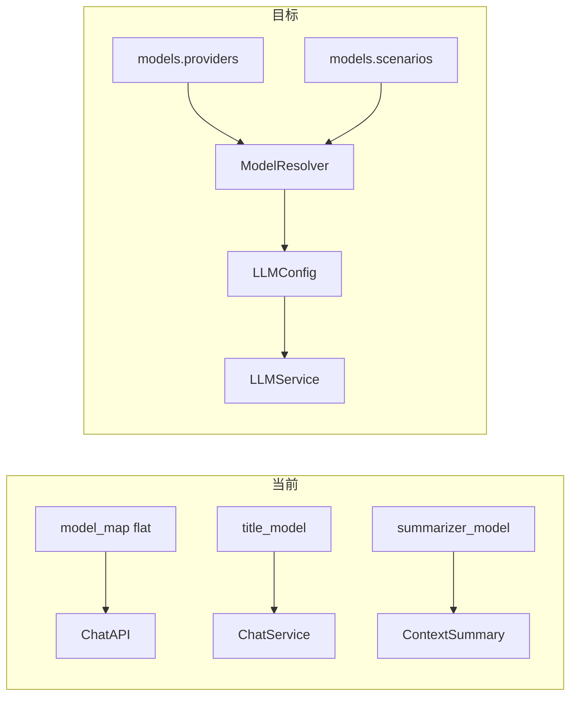
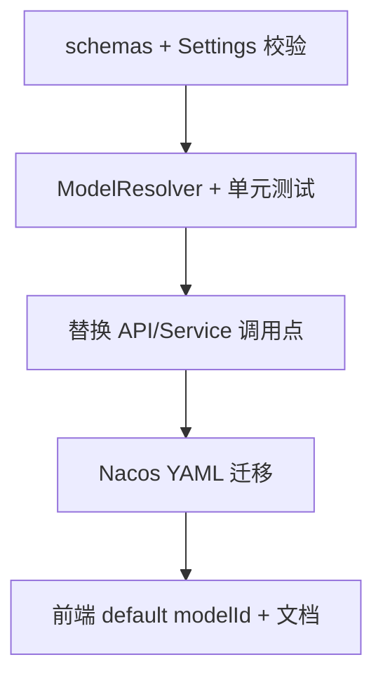

# 模型配置层级结构改造计划

## 现状与目标



| 维度 | 当前 | 目标 |
|------|------|------|
| 聊天模型列表 | `model_map` 全量键（含 `default`） | `scenarios.text_generation` 的 `default_model` + `alternatives` |
| 用户 `model_id` | `default`、`glm-5.1` 等 flat 键 | `qwen/qwen3.6-plus`（`provider/model_key`） |
| 标题生成 | `settings.title_model` 或回退 `default` | `scenarios.title_generation.default_model` |
| 窗口外摘要 | `settings.summarizer_model` | `scenarios.summarization.default_model` |
| Embedding | `embedding_model`（独立） | **不变**，仍顶层独立字段 |
| API 失败降级 | 无 | **本次不做**；`alternatives` 仅驱动前端可选列表 |

参考目标结构：[backend/tests/test/config.py](backend/tests/test/config.py)（`MODELS_CONFIG`）。

---

## 1. 新 YAML 形态（Nacos / 本地）

在 [backend/nacos-data/config/ai-chat-dev@@DEFAULT_GROUP@@](backend/nacos-data/config/ai-chat-dev@@DEFAULT_GROUP@@) 用顶层 `models` 替换 `model_map`、`title_model`、`summarizer_model`（`embedding_model` 保留原位置）。

示例骨架（字段名与 Python 示例对齐，值按现有 Nacos 迁移）：

```yaml
models:
  providers:
    dashscope:  # 共享同一 api_base 的模型可归为一个 provider
      base_url: "https://dashscope.aliyuncs.com/compatible-mode/v1"
      api_key: "sk-..."
      options:
        timeout: 120
        max_retries: 3
      models:
        kimi-k2.6:
          name: "Kimi K2.6"
          description: "..."
          context_limit: 256000
          capabilities: ["text", "image"]
        glm-5.1:
          name: "GLM 5.1"
          capabilities: ["text"]
        # ... 其余 qwen/glm/kimi 条目
    deepseek:
      base_url: "https://api.deepseek.com/v1"
      api_key: "sk-..."
      models:
        deepseek-v4-flash: { ... }
        deepseek-v4-pro: { ... }

  scenarios:
    text_generation:
      description: "通用对话"
      default_model: "dashscope/kimi-k2.6"   # 原 model_map.default
      alternatives:
        - "dashscope/glm-5.1"
        - "dashscope/qwen3.6-plus"
        - "deepseek/deepseek-v4-flash"
        # ...
    title_generation:
      default_model: "dashscope/qwen3.5-flash"  # 原 title_model
    summarization:
      default_model: "dashscope/qwen3.5-flash"  # 原 summarizer_model
    # compression / image / coding / planning：可先写入配置，调用方后续再接
    image:
      description: "图像理解"
      default_model: "dashscope/qwen3.6-plus"  # 支持 image capability 的模型
```

**Provider 命名建议**：按 API 端点聚合（如 `dashscope`、`deepseek`），`models` 下键为供应商 **API model_name**（与现有 `model_name` 字段一致），避免与展示名 `name` 混淆。

**capabilities → image_support**：`"image" in capabilities` 等价于当前 `image_support: true`（供 [backend/app/api/chat.py](backend/app/api/chat.py) 图片校验与 [backend/app/api/models.py](backend/app/api/models.py) 列表）。能力枚举统一为 `text`、`image`（不再使用 `vision`）。

---

## 2. Pydantic 模型与 Settings

在 [backend/app/schemas/config.py](backend/app/schemas/config.py) 新增：

- `ProviderModelMeta`：`name`, `description`, **`context_limit: int`（必填，`gt=0`）**, `capabilities: list[Literal["text","image",...]]`（YAML 缺省应导致 Settings 校验失败）
- `ProviderConfig`：`base_url`, `api_key`, `options: dict`, `models: dict[str, ProviderModelMeta]`
- `ScenarioConfig`：`description`, `default_model: str`, `alternatives: list[str] = []`
- `ModelsConfig`：`providers`, `scenarios`

修改 [backend/app/core/config.py](backend/app/core/config.py)：

- 删除：`model_map`, `title_model`, `summarizer_model`
- 新增：`models: ModelsConfig`
- 删除 `validate_model_map`；新增校验，例如：
  - 每个 `scenarios.*.default_model` / `alternatives` 必须能解析为 `provider/model`
  - 引用的 provider 与 model 键必须存在
  - 至少存在 `text_generation`、`title_generation`、`summarization` 场景

保留 `LLMConfig` 作为 **运行时解析结果**，在现有字段基础上 **新增必填 `context_limit: int`**（由 resolver 从 `ProviderModelMeta` 写入）。`LLMService` / `BaseAgent` 构造签名可不变；内部统一 `TokenCalculator(model_name, llm_config.context_limit)`。

`EmbeddingModelConfig` 同步增加必填 `context_limit`（顶层 `embedding_model` 仍在 Settings，与 `models` 并列）。

删除 `SummarizerModelConfig`（不保留类型别名）：从 [backend/app/schemas/config.py](backend/app/schemas/config.py) 移除类定义，清理 [backend/app/core/config.py](backend/app/core/config.py) 等处 import；标题/摘要等场景均通过 `ModelResolver.resolve_scenario` 得到 `LLMConfig`。

---

## 3. ModelResolver（核心解析层）

新增模块：[backend/app/services/base_service/model_resolver.py](backend/app/services/base_service/model_resolver.py)（与 `llm_service.py`、`embedding_service.py` 同层）。

职责：

| 方法 | 行为 |
|------|------|
| `resolve_model_ref(ref: str) -> LLMConfig` | 解析 `provider/model_key`：合并 provider 的 `base_url`/`api_key`/`options`，`model_name` = model_key，`title`/`description`/`context_limit` 来自 meta，`image_support` 来自 capabilities |
| `resolve_scenario(name: str) -> LLMConfig` | 读 `scenarios[name].default_model` 再 `resolve_model_ref` |
| `list_text_generation_models() -> list[tuple[str, LLMConfig]]` | `default_model` + `alternatives` 去重保序，返回 `(model_id, config)` 供 API |

在 `Settings` 加载后构造单例或通过 `settings.models` + 纯函数实现；`reload_settings()` 后自动生效（与现有 Nacos 热更新一致）。

**`api_key`**：与现网一致，Nacos / 本地 YAML 中 **直接使用明文** `api_key`（如 `sk-...`）。本次 **不实现** 环境变量名占位或 `os.environ` 解析；[backend/tests/test/config.py](backend/tests/test/config.py) 迁移为 fixture 时也改为明文或测试用假 key，不再用 `DASHSCOPE_API_KEY` 这类 env 名占位。

---

## 4. 调用点替换（后端）

| 文件 | 改动 |
|------|------|
| [backend/app/api/chat.py](backend/app/api/chat.py) | `_resolve_llm_config(model_id)` → `ModelResolver.resolve_model_ref(model_id)`；默认 `model_id` 改为 `text_generation` 场景的 default ref（或要求客户端必传，与 breaking 策略一致） |
| [backend/app/api/models.py](backend/app/api/models.py) | 列表来源改为 `list_text_generation_models()`，不再遍历整个 `model_map`；`model_id` 字段为 `provider/model` |
| [backend/app/services/chat/chat_service.py](backend/app/services/chat/chat_service.py) | 标题：`resolve_scenario("title_generation")` 替代 `title_model or model_map["default"]` |
| [backend/app/services/conversation/context_summary_service.py](backend/app/services/conversation/context_summary_service.py) | `resolve_scenario("summarization")` 替代手写 `SummarizerModelConfig` → `LLMConfig` |
| [backend/app/schemas/chat.py](backend/app/schemas/chat.py) | 更新 `model_id` 字段描述；`default` 改为场景默认 ref（如 `dashscope/kimi-k2.6`） |

**Token 上下文上限（本次必做）**：

- [backend/app/utils/token.py](backend/app/utils/token.py)：`TokenCalculator.__init__(model: str, context_limit: int)`，`context_limit` **必填**；`get_max_context_tokens()` **直接返回** `self._context_limit`，不再查 `MODEL_LIMITS`。
- 调用方改造（均需显式传入 `context_limit`）：
  - [backend/app/services/base_service/llm_service.py](backend/app/services/base_service/llm_service.py)：`TokenCalculator(llm_config.model_name, llm_config.context_limit)`
  - [backend/app/services/chat/chat_service.py](backend/app/services/chat/chat_service.py)、[backend/app/agents/tool_executor.py](backend/app/agents/tool_executor.py)：从对应 `LLMConfig` / `model_name` 解析链取得 `context_limit` 后传入
  - [backend/app/utils/context_compactor.py](backend/app/utils/context_compactor.py)、[backend/app/services/chat_upload/kb_chunk_embedding.py](backend/app/services/chat_upload/kb_chunk_embedding.py)：在 [backend/app/schemas/config.py](backend/app/schemas/config.py) 的 `EmbeddingModelConfig` 增加必填 `context_limit`，由 `settings.embedding_model.context_limit` 传入（与 chat 模型一致，避免无参构造）
- 删除 `TokenCalculator.MODEL_LIMITS` 及 `get_max_context_tokens()` 内的硬编码回退逻辑。
- Nacos 迁移：每个 `models.providers.*.models.*` 与 `embedding_model` 均补齐 `context_limit`（可参考迁移前 `MODEL_LIMITS` 常量或厂商文档，迁移完成后删除该表）。

未接线的场景（`compression`、`image`、`coding`、`planning`）：仅校验配置合法性，不在本次改调用链。其中 `image` 场景预留给「按图像理解选模」等后续逻辑，与 capability `image` 命名一致。

---

## 5. 前端（破坏性同步）

| 文件 | 改动 |
|------|------|
| [frontend/src/store/slices/modelsSlice.ts](frontend/src/store/slices/modelsSlice.ts) | 占位 `modelId` 改为新 default ref（与 Nacos `text_generation.default_model` 一致） |
| [frontend/src/pages/ChatPage/components/ChatInput/hooks.ts](frontend/src/pages/ChatPage/components/ChatInput/hooks.ts) | 校验逻辑已按 `modelId` 列表匹配，无需结构变更 |
| [frontend/README.md](frontend/README.md)、[backend/README.md](backend/README.md) | 更新 `model_id` 说明与示例 |

前端 **接口形状不变**（`modelId` / `imageSupport` 等），仅 ID 字符串变化。

---

## 6. 配置迁移对照（当前 Nacos → 新结构）

基于 [nacos 片段](backend/nacos-data/config/ai-chat-dev@@DEFAULT_GROUP@@:11-73)：

- `model_map.default` (kimi-k2.6 @ dashscope) → `dashscope/kimi-k2.6` + `text_generation.default_model`
- 其余 `model_map` 键 → 同 provider 下 `models.<model_name>` + 加入 `text_generation.alternatives`；**每个 model 必须写 `context_limit`**
- `title_model` (qwen3.5-flash) → `title_generation.default_model: dashscope/qwen3.5-flash`
- `summarizer_model` → `summarization.default_model`（同模型可复用 ref）
- `embedding_model`：保留顶层字段，并增加必填 `context_limit`

部署顺序：先发布支持新 schema 的后端 + 更新 Nacos，再发前端；避免旧前端传 `default` 而后端只认 `provider/model`。

---

## 7. 测试与文档

- 将 [backend/tests/test/config.py](backend/tests/test/config.py) 提升为正式 fixture：例如 `tests/fixtures/models_config.yaml` + `tests/test_model_resolver.py`；示例中 `capabilities` 使用 `image`（非 `vision`），场景键为 `image`（非 `vision`）
- 覆盖：
  - ref 解析、capabilities（`image`）→ image_support、`context_limit` 写入 `LLMConfig` 并驱动 `TokenCalculator`
  - 缺少 `context_limit` 的 YAML/Settings 加载失败
  - scenario 解析
  - 非法 ref / 缺失 scenario 的 Settings 校验失败
- 若有集成测试依赖 `model_map`，改为注入最小 `models` YAML
- 更新 [backend/AGENTS.md](backend/AGENTS.md) 中过时的 `response_model` / `tool_call_model` 描述（若仍存在）

运行：`cd backend && make lint && make test`（排除需真实 key 的 `mcp_demo`）。

---

## 8. 实施顺序（建议 PR 切分）



单 PR 也可，但 **D 与 C 需同部署窗口**，否则线上配置与代码不一致。

---

## 风险与不在范围

- **已存会话/消息中的旧 `model_id`**：若 DB 或 metadata 存了 `glm-5.1`，历史记录展示可能需兼容层（本次按你的选择不做 alias）；若有持久化字段，需产品确认是否一次性迁移或仅影响新请求。
- **密钥**：与现网一致，Nacos 中 `providers.*.api_key` 保持明文；环境变量占位不在本次范围。
- **fallback_chain 自动重试**：明确留到后续；本次 `alternatives` 仅列表。
- **未使用 scenarios**：配置可预置，不增加运行时分支。
