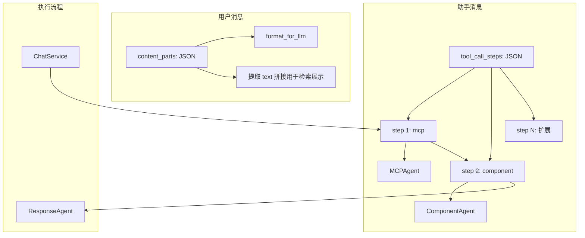

# Message 表数据库结构重设计方案

## 一、现状分析

### 1.1 用户消息（content）现状

- **存储**：`[backend/app/models/message_db.py](backend/app/models/message_db.py)` 中 `content: str` 仅支持纯文本
- **API**：`[backend/app/schemas/chat.py](backend/app/schemas/chat.py)` 的 `ChatRequest.content: str`、`[backend/app/api/chat.py](backend/app/api/chat.py)` 直接接收 JSON body
- **已有能力**：项目已有 [FileService](backend/app/services/base_service/file_service.py)（头像上传到 COS）、`[backend/app/api/file.py](backend/app/api/file.py)`

### 1.2 工具调用现状与问题

- **当前结构**：`tool_calls`（MCP）+ `component_tool_calls`（组件渲染）两个独立字段
- **执行顺序**：在 `[chat_service.py](backend/app/services/chat/chat_service.py)` 中硬编码为：MCP → Component → Response Generation
- **依赖关系**：ComponentToolsAgent 依赖 MCP 的输出（`mcp_tool_call_messages`）作为输入
- **问题**：预设顺序、难以扩展新工具类型或调整阶段

---

## 二、设计方案

### 2.1 用户消息：支持多模态内容

采用 **Content Parts 模式**（对齐 OpenAI 多模态消息格式），同时保留对纯文本的兼容。

#### 2.1.1 数据模型

```python
# 新增 schema（[backend/app/schemas/content.py](backend/app/schemas/content.py)）
class TextContentPart(BaseModel):
    type: Literal["text"]
    text: str

class ImageUrlContentPart(BaseModel):
    type: Literal["image_url"]
    image_url: dict  # {"url": "...", "detail": "auto"|"low"|"high"}

class FileContentPart(BaseModel):
    type: Literal["file"]
    file: dict  # {"url": "...", "filename": "...", "mime_type": "..."}

ContentPart = TextContentPart | ImageUrlContentPart | FileContentPart
```

#### 2.1.2 MessageDb 表结构变更


| 原字段                    | 变更                                                                     |
| ---------------------- | ---------------------------------------------------------------------- |
| `content`              | **删除**，迁移后移除                                                           |
| **新增** `content_parts` | `JSON`，格式为 `[ContentPart, ...]`；纯文本时为 `[{"type":"text","text":"..."}]` |


**数据迁移**：

- 存量数据：将 `content` 迁移至 `content_parts`，即 `content_parts = [{"type": "text", "text": content}]`（若 content 为空则 `[]`）
- 迁移完成后删除 `content` 列
- 检索与展示：从 `content_parts` 中提取所有 `type="text"` 的 `text` 拼接

#### 2.1.3 API 与存储

- **ChatRequest**：统一使用 `content_parts: list[ContentPart]`（纯文本时传 `[{"type":"text","text":"..."}]`）
- **LLM 调用**：在 `format_chat_message_for_llm` 等逻辑中，将 `content_parts` 转为 OpenAI 所需的 `content: list[dict]` 格式

#### 2.1.4 文件/图片存储与上传（按 conversation_id 隔离）

所有用户上传的图片、PDF、文档等均存于 `uploads` 目录，无单独目录区分。

**路径规范**：


| 用途             | 路径                                                                             |
| -------------- | ------------------------------------------------------------------------------ |
| 物理路径           | `data/conversations/{conversation_id}/user-data/uploads/xxx.png`               |
| 虚拟路径（Agent 使用） | `/mnt/user-data/uploads/xxx.png`                                               |
| HTTP 访问        | `/api/conversations/{conversation_id}/artifacts/mnt/user-data/uploads/xxx.png` |


**图片处理**：以原始格式保存，不做 Markdown 转换。上传成功后返回结构：

```json
{
  "filename": "photo.png",
  "virtual_path": "/mnt/user-data/uploads/photo.png",
  "artifact_url": "/api/conversations/{conversation_id}/artifacts/mnt/user-data/uploads/photo.png"
}
```

**PDF / 文档处理**：

1. **存储**：原始文件保存到 `uploads` 目录
2. **自动转 Markdown**：使用 markitdown（基于 pdfminer、pdfplumber）转为 `.md`，保存于同一 `uploads` 目录，命名 `xxx.md`
3. **失败处理**：转换失败时仅保留原始文件，不生成 `.md`
4. **返回结构**（上传成功后返回前端）：

```json
{
  "filename": "document.pdf",
  "virtual_path": "/mnt/user-data/uploads/document.pdf",
  "artifact_url": "/api/conversations/{conversation_id}/artifacts/mnt/user-data/uploads/document.pdf",
  "markdown_file": "document.md",
  "markdown_virtual_path": "/mnt/user-data/uploads/document.md",
  "markdown_artifact_url": "/api/conversations/{conversation_id}/artifacts/mnt/user-data/uploads/document.md"
}
```

前端将 `artifact_url`（图片/原始文件）或 `markdown_artifact_url`（PDF 等，供 Agent 读取 Markdown）拼入 `content_parts`。

---

### 2.2 助手回复：工具调用可扩展结构

采用 **按步骤（Step）组织的工具调用** 结构，用步骤列表显式表达执行顺序，便于扩展。

#### 2.2.1 数据结构

```python
# backend/app/schemas/tool_call.py（新建）
class ToolCallStep(BaseModel):
    """单个工具调用步骤"""
    step_type: str  # "mcp" | "component" | 未来扩展（如 "retrieval", "code"）
    tool_calls: list[ToolUseMessage | ToolResultMessage]  # 即现有 ToolMessage 列表
    duration: float | None = None

# MessageDb 新字段
tool_call_steps: list[dict] | None  # JSON: list[ToolCallStep]
```

#### 2.2.2 MessageDb 表结构变更


| 原字段                             | 变更                                                    |
| ------------------------------- | ----------------------------------------------------- |
| `tool_calls`                    | **废弃**（迁移后删除或标记 deprecated）                           |
| `component_tool_calls`          | **废弃**                                                |
| `tool_calls_duration`           | **废弃**                                                |
| `component_tool_calls_duration` | **废弃**                                                |
| **新增** `tool_call_steps`        | `JSON`，格式为 `[{step_type, tool_calls, duration}, ...]` |


**存储示例**：

```json
[
  {"step_type": "mcp", "tool_calls": [...], "duration": 2.5},
  {"step_type": "component", "tool_calls": [...], "duration": 0.8}
]
```

#### 2.2.3 执行逻辑调整

- **ChatService**：改为按 `tool_call_steps` 顺序执行，每个 step 根据 `step_type` 分发到对应 Agent（mcp / component / 未来）
- **CollectedResponse**：聚合时遍历 `tool_call_steps`，收集所有 tool_calls 及 duration
- **依赖关系**：Component 步骤仍可声明依赖前序 mcp 步骤的输出，通过 step 顺序隐式保证

---

## 三、数据迁移策略

### 3.1 Alembic 迁移

1. **content → content_parts**
  - 新增列 `content_parts`（JSON）
  - 数据迁移：`content_parts = [{"type": "text", "text": content}]`（content 为空时用 `""`）
  - 业务切到 `content_parts` 后，删除 `content` 列
2. **tool_calls / component_tool_calls → tool_call_steps**
  - 新增列 `tool_call_steps`（JSON nullable）
  - 数据迁移：

```python
steps = []
if tool_calls:
    steps.append({"step_type": "mcp", "tool_calls": tool_calls, "duration": tool_calls_duration})
if component_tool_calls:
    steps.append({"step_type": "component", "tool_calls": component_tool_calls, "duration": component_tool_calls_duration})
```

- 兼容期双写，验证后删除 `tool_calls`、`component_tool_calls`、`tool_calls_duration`、`component_tool_calls_duration`

### 3.2 影响范围（需修改的文件）


| 模块     | 文件                                          | 变更要点                                                                                      |
| ------ | ------------------------------------------- | ----------------------------------------------------------------------------------------- |
| 模型     | `backend/app/models/message_db.py`                  | 新增 content_parts、tool_call_steps；删除 content，废弃 tool_calls 等                               |
| Schema | `backend/app/schemas/content.py`                    | ContentPart（新建）                                                                           |
| Schema | `backend/app/schemas/chat.py`                       | ChatRequest、ChatMessageItem、CollectedResponse（引用 ContentPart）                             |
| Schema | `backend/app/schemas/tool_call.py`                  | ToolCallStep（新建）                                                                          |
| 消息服务   | `backend/app/services/message/message_db.py`        | 读写新字段、create_user_message 支持 content_parts                                                |
| 对话服务   | `backend/app/services/chat/chat_service.py`         | 按 tool_call_steps 驱动执行、Collect 聚合                                                         |
| Agent  | `mcp_tools_agent`、`component_tools_agent`   | 接口保持，由 ChatService 按 step 调用                                                              |
| 工具     | `backend/app/utils/message.py`                      | format_chat_message_for_llm 支持 content_parts                                              |
| API    | `backend/app/api/chat.py`、`backend/app/api/conversation.py` | Chat 接收 content_parts；新增 `POST /api/conversations/{id}/uploads` 及 `GET .../artifacts/...` |
| 历史     | `backend/app/utils/history_truncate.py`             | token 计算考虑 content_parts                                                                  |


---

## 四、架构示意




---

## 五、实施顺序建议

1. **Phase 1**：工具调用重构（tool_call_steps）
  - 新增字段与迁移脚本
  - 修改 ChatService、CollectedResponse、message_db 读写
  - 兼容期双写，验证后移除旧字段
2. **Phase 2**：多模态用户消息（content_parts）
  - 新增 content_parts 列与 ContentPart schema
  - 扩展 ChatRequest、消息创建、format_for_llm
  - 实现 2.1.4 文件/图片上传（按 conversation 隔离、PDF 转 Markdown、artifact 访问）
3. **Phase 3**：清理与优化
  - 删除废弃列
  - 更新 token 统计、历史截断逻辑以支持 content_parts

