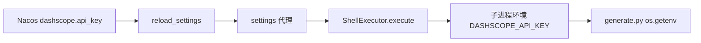

# 从 Nacos 热更新注入 DASHSCOPE_API_KEY

## 结论

不把 `DASHSCOPE_API_KEY` 写进 `.env` 或镜像。密钥以 Nacos 里 `models.providers.dashscope.api_key` 为准。Nacos 监听已经会 `reload_settings()`，[`settings`](backend/app/core/config.py) 是指向最新实例的代理。每次 shell 启动时读这个字段，写进子进程环境，[`generate.py`](backend/skills/public/image-generation/scripts/generate.py) 继续用 `os.getenv("DASHSCOPE_API_KEY")`，技能脚本不用改。

轮换后不需要重建容器。正在跑的那一次仍用旧 key；下一次 `shell_exec` 用新 key。

## 数据流

当前缺口：[`LocalSandboxExecutor`](backend/app/sandbox/local_executor.py) 只复制进程已有的 `os.environ`。Nacos 的 `api_key` 在 Settings 里，不会进入 `os.environ`，所以脚本看不到，轮换也不会反映到子进程。

## 实现

在 [`backend/app/mcp/mcp_servers/shell_mcp/executor.py`](backend/app/mcp/mcp_servers/shell_mcp/executor.py) 的 `execute` 里，把密钥并进 `request.env`（覆盖 `_build_shell_env` 的结果，local 与 docker 都走这条）：

- 读取 `settings.models.providers["dashscope"].api_key`，去掉空白。
- 非空时设置 `DASHSCOPE_API_KEY`。local 后端里 `request.env` 盖在 `os.environ` 之上，因此容器里过期的同名变量不会赢过 Nacos。
- 字段缺失或为空时不写入。local 后端仍继承进程里已有的 `DASHSCOPE_API_KEY`（本地没有 Nacos 时的退路）；docker 后端本来就没有这份环境，行为不变。
- 只注入这一把平台密钥，不要把整个 Settings 或 `os.environ` 倒进沙箱。

`generate.py` 和 SKILL.md 不改。多租户共用 Nacos 上这一把 dashscope key。

## 测试

在现有 shell executor 测试旁加用例（可 mock `settings.models`）：

- provider `dashscope.api_key` 非空时，`ExecutionRequest.env` 含 `DASHSCOPE_API_KEY`。
- 把 Settings 换成另一把 key 后再 `execute`，请求里是新值（模拟 `reload_settings` 之后）。
- `api_key` 为空时，不把空字符串写进 env。

## 不采用

- 根目录 `.env` / `backend/.env`：改完要重建容器，且会压住 Nacos 轮换后的新 key（环境变量优先级高于 Nacos）。
- 改 `generate.py` 去读 Nacos：技能在子进程里跑，不应再连配置中心。
