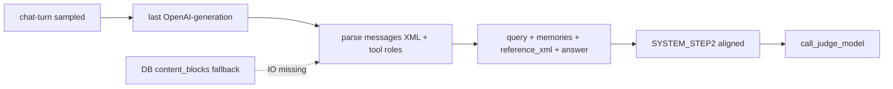

# 线上 Batch Eval 裁判输入补齐方案

## 问题与目标

当前链路 [`BatchEvalService._batch_judge`](backend/app/services/eval/batch_eval_service.py) 只用 `chat-turn` 的 `input`/`output`，并读取不存在的 `metadata.retrieved_contexts`，导致裁判几乎在「无参考资料」下盲评。

**目标（线上坏例发现）**：裁判输入对齐离线 [`run_judge_eval.build_judge_input`](backend/scripts/run_judge_eval.py) / [`SYSTEM_STEP2`](backend/scripts/auto_annotate_eval.py)。

**明确不做**：
- 不把 `user_memories` 写入 root `chat-turn` metadata
- 不分别下钻 `memory-search` / `kb-rag-build` / tool span（被下方简化路径取代）
- 不为裁判单独改 `kb-rag-build` 埋点（RAG 正文已在最终 generation 的 user XML `<attachment_context>` 中）
- 线上 **不** 自动生成 `ground_truth_points`（WITH_GOLD 仍由离线评估集承担）

## 简化结论：用最后一条 OpenAI-generation

生产 trace 里，**当前轮最终回答**对应的最后一条 `OpenAI-generation` 的 `input.messages` 已包含模型实际看到的：

| 内容 | 在 messages 中的位置 |
|------|----------------------|
| 原始 query | 当前轮 `user` 消息内 `<user_message><query>`（见 [`user_prompt.py`](backend/app/prompts/user_prompt.py)） |
| RAG / 附件派生 | 同条 user XML 的 `<attachment_context>` |
| user_memories | 同条 user XML 的 `<tool_call_context><user_memories>` |
| 多轮工具结果 | 同 turn 内后续 `role=tool`（及中间 assistant tool_calls） |
| 最终回答 | 该 generation 的 `output`（或仍可用 chat-turn `output` 作交叉校验） |

这与离线 [`sync_eval_to_langfuse_dataset.find_last_generation`](backend/scripts/sync_eval_to_langfuse_dataset.py) + [`extract_messages_for_judge`](backend/scripts/run_judge_eval.py) 同一信息源，**一次按 `trace_id` 拉 observations 即可**，无需拼多个业务 span。



### 选取与解析规则

1. **选取**：`observations.get_many(trace_id=..., fields="core,io")`，过滤 `type == GENERATION`，按 `start_time` 取最后一条（与 sync 脚本一致；`fields=io` 时 name 可能为空，勿依赖 `name=OpenAI-generation`）。
2. **解析 input**：去掉 `tools` 大字段；遍历 `messages`：
   - 从**最后一条带 `<query>` 的 user content** 抽出 query、`<user_memories>`、`<attachment_context>`（历史轮次的 user 可忽略或只取本 turn——以 chat-turn 时间窗口 / 最后一条含 query 的 user 为准）
   - 收集本 turn 内所有 `role=tool` 的 content → 拼 `<参考资料>`（对齐 `extract_messages_for_judge` / `_build_context_xml`）
3. **answer**：优先 generation `output` 文本；若为空则回退 chat-turn `output`。
4. **不要**把整段 system prompt / tools schema 塞进裁判（噪声大、易超长）。
5. **截断**：reference 合计约 8–12k chars；answer 约 2–4k。

### 降级

- 无 GENERATION 或 IO 拉取失败 → 仅用 chat-turn `input`/`output`，打 warning。
- 可选 DB 兜底：有 `conversation_id` 时从 assistant `content_blocks` 抽 `tool_result`（对齐 [`build_eval_from_db`](backend/scripts/build_eval_from_db.py)），仅在 generation 解析出的 reference 为空时启用。

## 1. 新增 Judge 输入组装模块

新增 [`backend/app/services/eval/judge_input_builder.py`](backend/app/services/eval/judge_input_builder.py)：

```python
@dataclass
class JudgeInput:
    query: str                 # 可含 <user_memories>
    answer: str
    reference_xml: str         # attachment_context + tool results
    source_flags: dict         # last_generation | db_fallback | chat_turn_only
```

实现要点：
- 复用 / 内联与 `run_judge_eval.extract_messages_for_judge` + query user XML 解析同类的逻辑（**不强制大改离线 scripts**；线上模块自洽，形状对齐即可）
- 对 sampled traces **按需**拉 last generation（semaphore），不要对未采样全量 chat-turn 二次全拉

## 2. 统一裁判 Prompt（线上）

改 [`backend/app/evaluators/judge_evaluator.py`](backend/app/evaluators/judge_evaluator.py)：

- 无 gold 路径对齐 offline `SYSTEM_STEP2`：**有参考资料以参考资料为事实依据**；correctness + completeness；专有名词逐字核对
- 保留 `ground_truth` / WITH_GOLD 分支供离线复用；线上 `_batch_judge` 不传 gold
- 拼装形状对齐 `build_judge_input`

## 3. 接入 BatchEvalService

改 [`_batch_judge`](backend/app/services/eval/batch_eval_service.py)：

```text
judge_input = await builder.build_from_trace(trace)
call_judge_model(
  query=judge_input.query,
  answer=judge_input.answer,
  retrieved_contexts=judge_input.reference_xml,
  llm_caller=...,
)
```

`judge_scores` 建议附带 `context_sources`（便于坏例排查）。

## 4. 文档与测试

- 更新 [`batch_eval_worker_design.md`](backend/docs/batch_eval_worker_design.md)：上下文来自 last GENERATION messages，非 `metadata.retrieved_contexts`
- 单元测试：假 GENERATION messages（含 query / memories / attachment_context / tool）→ `JudgeInput`；无 generation 降级；prompt 拼装快照

## 范围边界

| 项 | 本期 |
|----|------|
| 多 span 分别下钻 memory/kb/tool | 否（改用 last generation） |
| kb-rag-build 写正文埋点 | 否（非裁判必需） |
| memory → root metadata | 否 |
| 线上 auto_annotate ground_truth | 否 |
| 离线 scripts 大重构 | 否 |
