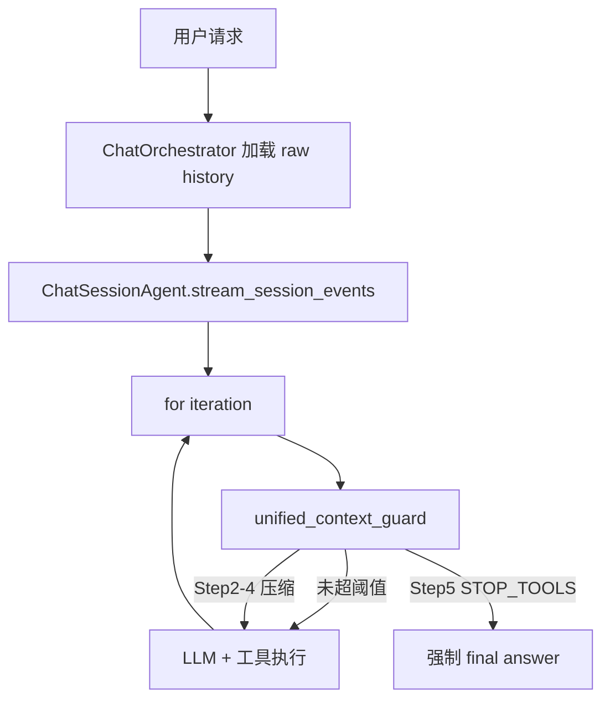

# 历史消息上下文压缩优化 — 实施计划

依据 [docs/context-management-optimization-plan.md](docs/context-management-optimization-plan.md)，对齐现有代码入口：

- A 检查点：[`HistoryContextService.prepare_history_messages`](backend/app/services/chat/history_context_service.py)（orchestrator 每请求一次）
- B 检查点：[`ChatSessionAgent._check_round_context_budget`](backend/app/agents/chat_session_agent.py)（工具轮后 80% 硬停）

目标架构：



阈值（统一总 prompt）：

```text
reserved_output = min(llm_config.max_output_tokens, unified_guard.max_output_tokens)
context_threshold = context_limit - reserved_output - buffer_tokens(13000)
# 例：128K 模型、推断 max_output=8192、guard 封顶 8192 → threshold ≈ 106808
```

### LLMConfig.max_output_tokens（按上下文窗口推断）

在 [`config.py`](backend/app/schemas/config.py) / [`model_resolver.py`](backend/app/services/base_service/model_resolver.py)：

1. **`ProviderModelMeta`** 新增可选字段 `max_output_tokens: int | None = None`（Nacos 可显式覆盖）。
2. **`LLMConfig`** 新增必填 `max_output_tokens: int`（运行时一定有值）。
3. **`_build_llm_config`**：`meta.max_output_tokens` 有值则用；否则 `infer_max_output_tokens(meta.context_limit)`。

推断函数（放 `model_resolver.py` 或 `app/utils/token.py`）：

```python
def infer_max_output_tokens(context_limit: int) -> int:
    """按上下文窗口档位推测默认输出预留（对齐常见模型能力）。"""
    if context_limit <= 8_192:
        return max(1_024, context_limit // 4)   # 8K → 2K
    if context_limit <= 32_768:
        return 4_096
    if context_limit <= 131_072:
        return 8_192                            # 64K / 128K → 8K
    return 16_384                               # 200K+ → 16K
```

守卫侧 `UnifiedContextGuardConfig.max_output_tokens`（默认 8192）作为 **封顶**：`reserved_output = min(model, guard_cap)`，对齐优化文档 `min(model_max_output, 8192)`。

### 与优化文档对照（遗漏补齐）

**已覆盖**：统一检查点、Step1–5 分级降级、动态 token 窗口、结构化摘要、自压缩、反抖动、Redis 锁、文件清单、三阶段交付、§七不做项；`model_max_output` 经 LLMConfig 落地。

**有意偏离（已确认）**：

- 旧配置直接删除，不做「保留兼容」/`effective_context_threshold` 回退（用户要求）。
- 不新增 `compressed_content` / 压缩状态字段。

**原计划偏弱、现补齐的点**：

1. **保留 `WindowOutSummaryConfig`**（`enabled` / `summary_max_tokens`）——Step 3 仍依赖，不随 `HistoryWindowConfig` 删除。
2. **Step 3 `remaining_budget` 公式写死**：`context_threshold - count(system) - count(current_user) - count(tool_rounds)`，再 `split_history_by_token_budget`。
3. **Step 4 压缩目标尺寸**：head-tail 各保留约 500 字符（可配置为 `tool_result_compress_keep_head_chars` / `_tail_chars`，默认 500/500）；门闩仍为 `tool_result_compress_threshold_chars=1000`。
4. **`unified_guard.enabled=false`**：无旧配置可回退时，行为定义为 **跳过守卫（不压缩、不停工具）**，仅依赖 L1 硬上限；打 warning 日志。不实现文档 §4.3 的旧比例回退。
5. **token 计数范围**：与文档一致，只计 `system + history + current_user + tool_rounds`；**不计** tools JSON schema（与现状 B 检查点一致）。若日后需计入，另开任务。

---

## Phase 1：统一检查点（核心，2–3 天）

### 1.1 配置

**模型侧**（见上节）：`ProviderModelMeta.max_output_tokens`（可选）+ `LLMConfig.max_output_tokens`（推断或显式）+ `infer_max_output_tokens`；单测覆盖各 `context_limit` 档位与显式覆盖。

在 [`backend/app/schemas/config.py`](backend/app/schemas/config.py) 的 `ChatContextConfig` 下新增 `UnifiedContextGuardConfig`：

- `enabled=True`（`false` 时跳过守卫，见上方对照说明）
- `buffer_tokens=13000`
- `max_output_tokens=8192`（**封顶**：`reserved_output = min(llm.max_output_tokens, 此项)`）
- `keep_recent_tool_results=2`
- `tool_result_compress_threshold_chars=1000`（见下方与 `max_chars` 的分层说明）
- `tool_result_compress_keep_head_chars=500`、`tool_result_compress_keep_tail_chars=500`（Step 4 head-tail 保留量）
- 反抖动 / 锁字段：`anti_thrash_failure_threshold`、`anti_thrash_recovery_seconds`、`lock_timeout_seconds`（Phase 3 接线）

**保留**（不删）：`WindowOutSummaryConfig`（`window_out_summary.enabled` / `summary_max_tokens`），供 Step 3 使用。

**与 `ToolResultHardLimitConfig.max_chars`（默认 30_000）不冲突**——时机与语义不同，串联互补：

| 配置 | 层级/时机 | 语义 |
|------|-----------|------|
| `tool_result_hard_limit.max_chars` | L1，工具刚返回时 | **单条写入硬上限**：超则落盘预览/头尾截断，结果入库前最多约 30K 字符 |
| `unified_guard.tool_result_compress_threshold_chars` | 守卫 Step 4，LLM 调用前且仍超总阈值 | **可压缩候选门闩**：仅当 `len(content) > 1000` 才进入 size-aware 再压缩；保护小结果（错误码、状态）不被误压 |

典型路径：工具结果先被 L1 压到 ≤30K → 进入 tool_rounds → 总 prompt 仍超限且 Step 2/3 不够时，Step 4 再从 >1K 的旧结果里按大小降序二次压缩。两者都可同时生效，无需互斥或对齐数值。

**删除不再使用的旧配置（不做向后兼容保留）：**

| 删除项 | 位置 | 原因 |
|--------|------|------|
| `HistoryWindowConfig` 整类（含 `token_ratio`、`max_rounds`） | [`config.py`](backend/app/schemas/config.py) | 窗口改由动态 token 预算驱动 |
| `ChatContextConfig.history_window` | 同上 | 随上项删除 |
| `ChatContextConfig.tool_round_context_limit_ratio` | 同上 | 被 `unified_guard` 阈值公式替代 |

同步清理引用：

- [`chat_service.py`](backend/app/services/chat/chat_service.py)：构造 agent 时传入 `unified_guard`，去掉 `tool_context_limit_ratio=...`
- [`chat_session_agent.py`](backend/app/agents/chat_session_agent.py)：删除构造参数 / 成员 `tool_context_limit_ratio`
- [`history_context_service.py`](backend/app/services/chat/history_context_service.py)：删除对 `history_window_config` / `split_history_by_rounds` / `truncate_in_window_by_round_tokens` 的依赖
- [`history_truncate.py`](backend/app/utils/history_truncate.py)：若 `split_history_by_rounds` / `truncate_in_window_by_round_tokens` 无其他调用方则一并删除；保留/新增 `split_history_by_token_budget`
- [`TOOL_RESULT_AND_CONTEXT.md`](backend/docs/TOOL_RESULT_AND_CONTEXT.md) 与优化方案文档中的旧字段说明一并更新

Nacos / `.env` 中若存在 `CHAT_CONTEXT__HISTORY_WINDOW__*` 或 `CHAT_CONTEXT__TOOL_ROUND_CONTEXT_LIMIT_RATIO`，删除即可（本地 nacos dump 当前无这些键）。

### 1.2 拆分压缩原语（供守卫按需调用）

重构 [`history_context_service.py`](backend/app/services/chat/history_context_service.py)，从现有 `compress_history_messages` / 摘要逻辑抽出可独立调用的函数（保持现有 summary 替换 + head-tail 行为）：

| 函数 | 职责 |
|------|------|
| `compress_history_tool_results(history)` | Step 2：所有历史轮 `ToolResultBlock`（summary 优先，否则超阈值截断）；同步压缩非最新轮 `tool_use` args |
| `split_history_by_token_budget(history, budget)` | 新增于 [`history_truncate.py`](backend/app/utils/history_truncate.py)：`budget = remaining_budget`（见上）；从最新轮往旧累加，返回 `(in_window, out_of_window)` |
| `generate_window_out_summary(...)` | Step 3：受 `window_out_summary.enabled` 控制；增量合并摘要 + persist（复用现有 id-set 增量逻辑）；从 base 移除窗口外消息并注入摘要 |
| `compress_tool_round_messages(tool_rounds, keep_recent, threshold, keep_head, keep_tail)` | Step 4：size-aware，对 `[:-keep_recent]` 中 `len>threshold` 的结果按长度降序，逐条 head-tail（默认 500/500），达标即停 |

**Schema 决策：不新增 `compressed_content` / 压缩状态字段。**

对齐现有 L2 行为与 [`ToolResultMessage`](backend/app/schemas/llm.py) 已有能力：

| 对象 | 做法 | 说明 |
|------|------|------|
| 历史 `ToolResultBlock` | 组装副本上：有 `summary` 则 `content = summary`，否则 head-tail 写回 `content`；清空副本上的 `summary` / `structured_content_for_display` | DB 原文不变；`summary` 已是压缩形态，无需第二字段 |
| 历史 `ToolUseBlock` | 组装副本上截断 `arguments_text`（及同步 `arguments_json`） | 无独立摘要字段；截断后缀 `...[truncated]` 自描述 |
| 当前轮 `ToolResultMessage`（Step 4） | 原地改写内存中的 `content`（head-tail） | 仅影响后续 LLM 组装；SSE 已发出的原文不回改；L1 落盘原文仍可 `read_file` |
| 当前轮 `ToolUseMessage` | Step 4 不压 tool_use args（只压旧 tool results） | 与优化文档一致 |

不新增字段的原因：

1. 守卫改的是 **LLM 组装副本 / 本轮内存消息**，不是双写存储模型。
2. `ToolResultMessage.summary` 已覆盖「压缩版」语义；再加 `compressed_content` 会造成「发给 LLM 用哪个」的歧义。
3. 幂等：历史每次从 DB 重载再压；当前轮对已截断文本再 head-tail 基本无害。若需防重复标记，沿用 L1 文案标记（`内容已截断` / `full output persisted`）即可，不必新 enum。
4. 前端展示继续用 DB/`structured_content_for_display`；压缩是模型侧预算手段，不要求 UI 状态位。

删除 `prepare_history_messages` 的 A 管道职责：orchestrator 只加载 DB history + 已有 `summary_before_window`；压缩与摘要全部由 agent 层 `unified_context_guard` 触发。

### 1.3 统一守卫接入 agent

在 [`chat_session_agent.py`](backend/app/agents/chat_session_agent.py)：

1. 新增 `async def unified_context_guard(...)`，对 `base_prompt_messages`（可原地更新 history/summary 注入）+ `session_output.tool_round_messages` 执行 Step 1–5。
2. 在 `for iteration` 内、`_stream_tool_round_events` **之前**调用；`_stream_final_round_events` 前同样调用（对齐「每次 LLM 调用前」）。
3. Step 5 返回停工具信号时，走现有 final answer 分支。
4. **删除** `_check_round_context_budget` 及工具轮后的硬停调用（L213–226）。

守卫需能更新注入到 user prompt 的 `window_out_summary`（Step 3 生成后刷新 `base_prompt_messages` 中的 user 内容，或维护可变 summary 引用后重建 base）。

### 1.4 简化 orchestrator

[`chat_orchestrator.py`](backend/app/services/chat/chat_orchestrator.py) L354–373：

- 去掉 `prepare_history_messages` 的完整 A 管道。
- 改为：读 history → 读已有 `ConversationContextDb.summary_before_window` → 传入 agent。
- 调整/保留 tracing span 字段（`prepared_count` → `history_count` 等）。

同步更新 mock：[`test_chat_orchestrator_tracing.py`](backend/tests/services/chat/test_chat_orchestrator_tracing.py)。

### 1.5 Phase 1 测试

- 更新 [`test_history_context_service.py`](backend/tests/services/chat/test_history_context_service.py) 适配新原语 API。
- 新增 [`backend/tests/agents/test_unified_context_guard.py`](backend/tests/agents/test_unified_context_guard.py)：
  - 未超阈值：无压缩
  - 仅 Step 2 即达标
  - Step 3 触发摘要（mock `ContextSummaryService`）
  - Step 4 size-aware（大结果先压、小结果保留）
  - Step 5 返回 STOP
  - 阈值公式：`limit - 8192 - 13000`

验证：`cd backend && make test -- --ignore=tests/mcp_demo`

---

## Phase 2：摘要质量（约 1 天）

### 2.1 结构化模板

重写 [`user_prompt.py`](backend/app/prompts/user_prompt.py) 中 `WINDOW_OUT_SUMMARY_MERGE_PROMPT` 为文档 §3.3 的 6 段模板（用户核心需求 / 已完成 / 进行中 / 待处理 / 关键决策 / 关键上下文）。确认 [`prompt_utils.py`](backend/app/prompts/prompt_utils.py) 渲染入参兼容。

### 2.2 摘要自压缩

在 [`context_summary_service.py`](backend/app/services/conversation/context_summary_service.py) 的 `summarize_merge` 开头：

- `prior_tokens > max_tokens * 1.5` 时先 `_compress_summary(prior, max_tokens // 2)`，再合并。

### 2.3 验证

单元测试 mock LLM：超长 prior 会先压缩；模板渲染含章节标题。长对话质量可后续手动抽检。

---

## Phase 3：反抖动 + 竞态（约 0.5 天）

### 3.1 DB 字段 + 迁移

[`conversation_contexts_db.py`](backend/app/models/conversation_contexts_db.py) 新增：

- `summary_failure_count: int = 0`
- `last_summary_failure_at: datetime | None`

新增 Alembic revision（upgrade/downgrade），遵循仓库迁移规则。

[`ConversationContextDbService`](backend/app/services/conversation/conversation_context_db.py) 增加失败计数增减 / 重置 API。

### 3.2 反抖动

在摘要生成路径（`generate_window_out_summary`）：

- `failure_count >= anti_thrash_failure_threshold(3)` 且距上次失败 `< recovery_seconds(300)` → 跳过 LLM，返回旧摘要
- 成功重置计数；失败递增并记录时间

### 3.3 Redis 锁

复用 [`turn_idempotency_store.py`](backend/app/services/chat/turn_idempotency_store.py) 的 `redis.set(..., nx=True, ex=...)` 模式：

- key：`summary_lock:{conversation_id}`
- 抢锁失败：返回 `None` / 旧摘要，不并行生成
- `finally` 删除锁

### 3.4 测试

- 失败 3 次后进入冷却；冷却结束后可再试
- 锁占用时第二请求不调用 `summarize_merge`

---

## 文档与配置同步

- 更新 [`backend/docs/TOOL_RESULT_AND_CONTEXT.md`](backend/docs/TOOL_RESULT_AND_CONTEXT.md)：L2/L3 与工具轮预算改为统一守卫 + 分级降级；移除 `history_window.*` / `tool_round_context_limit_ratio` 配置表项。
- 配置覆盖统一为 `CHAT_CONTEXT__UNIFIED_GUARD__*`（默认即可上线）。

---

## 明确不做（文档 §七）

磁盘外部化、时间触发 microcompact、prompt cache 保护、全量替换历史、独立 compaction agent —— 均不在本次范围。

---

## 建议交付节奏

| 顺序 | 内容 | 风险 |
|------|------|------|
| PR1 / Phase 1 | 统一守卫 + orchestrator 简化 + 核心单测 | 中（行为面最大） |
| PR2 / Phase 2 | 结构化摘要 + 自压缩 | 低 |
| PR3 / Phase 3 | 迁移 + 反抖动 + Redis 锁 | 低 |

合计约 **3.5–4.5 天**。Phase 1 合入前以 `make lint` + `make test -- --ignore=tests/mcp_demo` 为门禁。
