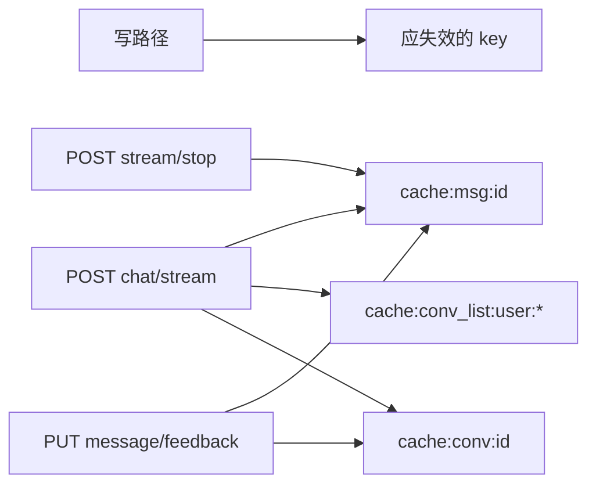

# 缓存方案完备性审查

## 结论

**方向正确，但不完备，不建议按当前文档原样实现。**

覆盖的 6 个读接口与 Cache-Aside + 主动失效思路，和 [docs/benchmark/2026-07-12_qps_benchmark.md](docs/benchmark/2026-07-12_qps_benchmark.md) / 现有 Redis 基础设施匹配。但失效矩阵有遗漏、L1 与多 worker 自相矛盾，落地后会出现跨进程脏读与对话详情短暂不一致。

**本期范围**：
- 正确性：失效矩阵、L1 边界、Nacos 钩子、messages 体量、文案修正
- 工程建议（已纳入本期）：接入层、观测、SCAN/key 规范、ownership 旁注、验收指标
- **不做**：风险加固（jitter / 负缓存 / fail-open / 并发回填）——§8 保留，体验后再改进

---

## 已对齐且合理的部分

- 目标接口与瓶颈表一致：`conversation/list` 最慢，其余为高频读。
- L2 Redis 复用 [`backend/app/core/redis.py`](backend/app/core/redis.py)；不缓存 `POST /chat/stream` 合理。
- `conversation/list` 只用 L2、短 TTL + SCAN 删前缀，符合分页 key 爆炸特征。
- `messages` 不用 L1，避免大 payload 占进程内存，合理。
- 依赖仅增 `cachetools`，成本低。

---

## 必须补齐的缺口（阻塞完备性）

### 1. 失效矩阵不完整

对照真实写路径：

| 写操作 | 文档已失效 | 实际还应失效 | 原因 |
|--------|------------|--------------|------|
| `POST /chat/stream`（含消息落库） | `msg` + `conv_list` | **`cache:conv:{id}`** | [`MessageDbService._touch_conversation`](backend/app/services/message/message_db.py) 会改 `last_message_*`；`ConversationInfo` 含这些字段 |
| `PUT /message/feedback` | 仅 `msg` | **`cache:conv:{id}`**（建议顺带 `conv_list`） | [`message.py`](backend/app/api/message.py) 更新 `conversation.last_message_updated_at` |
| `POST /chat/stream/stop` 及 stream 内 STOPPED/FAILED | 未列 | **`cache:msg:{id}`** | [`chat.py` stop](backend/app/api/chat.py) / orchestrator 会改消息 status |
| `POST /conversation/register`（`is_active=false` 草稿） | 删 list | 可保留现状 | 草稿不进 list；activate 时已删 list |

标题更新：stream 的 `title` 事件由前端再打 `PUT /conversation/update`，该路径文档已覆盖，无需单独为 title agent 加失效。

### 2. L1 用于用户/会话数据与多 worker 冲突

- §2.1 写明用户数据不适用 L1（8 worker 不共享）。
- §3.3 / §4.2–4.3 又对 `user/detail`、`conversation/detail` 使用 L1+L2。
- 写路径只在本进程 `l1_delete`，**其他 worker 的 L1 最多脏读满 TTL（60s/30s）**。

**定案**：用户/会话维数据 **仅 L2**；L1 只保留真正全局且可接受进程内短暂滞后的项：`models`、`health` Redis 状态。

### 3. Nacos 热更新未接到 models 失效

文档写「热更新时 `l1_delete("models")`」，但 [`reload_settings()`](backend/app/core/config.py) / Nacos listener 当前无此钩子。完备方案需在 `reload_settings()` 末尾统一清 `models` L1。

### 4. `messages` 缓存体量未约束

全量消息 + `content_blocks` 进 Redis，长会话可能达数百 KB～数 MB。文档未规定：

- value 大小上限 / 超限跳过缓存
- 或只缓存「列表页精简字段」

否则 Redis 内存与序列化可能抵消收益。

---

## 本期不做：风险加固（单独体验后再改进）

以下项文档 §8 已提及或应知晓，**本期不写入 `cache.py` 接口设计、不实现**：

| 风险 | 现状 | 后续改进方向（体验后） |
|------|------|------------------------|
| 缓存雪崩 | 文档写了 ±10% jitter，示例代码未做 | `l2_set` 内置 TTL 抖动 |
| 缓存穿透 | 仅靠认证，无负缓存 | 明确不缓存 404，或短负缓存 |
| Redis 故障 | 无降级约定 | fail-open：L2 异常回落 DB |
| Cache-Aside 并发回填脏数据 | 未写明 | 注意事项或加锁/版本号 |

修订文档时：保留 §8 风险列表即可，**不要**在伪代码里提前落地上述机制；可加一句「本期仅依赖主动失效 + TTL 兜底，风险加固另立迭代」。

---

## 本期纳入：工程建议（定案）

原「中等优先级」六项已纳入本期文档修订，定案如下：

### 1. 接入层位置

- **读**：service 层提供 `get_or_load_*`（内部 L2 → DB → 回填），API handler 只调 service。
- **写**：在会改数据的 service / orchestrator 路径调用统一 `invalidate_*`（如 `invalidate_conversation(conv_id, user_id)`、`invalidate_messages(conv_id)`），不把失效逻辑散落在各 API handler。
- **原因**：`POST /chat/stream`、stream stop/fail 等不经 conversation/message 写 API，handler 级失效易漏。

### 2. 观测

文档新增「可观测性」小节，落地时至少打结构化日志或计数：

- `cache_hit` / `cache_miss`（按 namespace：user / conv / conv_list / msg / models / health）
- `cache_invalidate`（按 key 前缀）
- L2 读写异常次数（即便本期不做 fail-open，也要先能看见错误）

验收不以 CDN QPS 单点为准，需能对照命中率与 DB 查询下降。

### 3. SCAN 删除与 key 规范

- `l2_delete_pattern`：`SCAN` + `UNLINK`（或 pipeline `UNLINK`），避免逐个同步 `DELETE` 阻塞。
- list key 规范化：`cache:conv_list:{user_id}:{cursor or ""}:{limit}`，首页 cursor 空串写死为 `""`（文档示例写 `cache:conv_list:{user_id}::{limit}` 或显式 `cursor=`），避免 `None`/`null` 不一致导致删不掉。

### 4. 权限（旁注，缓存实现同期处理）

- 在 `conversation/detail`、`messages` 方案旁注明：**缓存落地前（或同 PR）补 `conversation.user_id == token.user_id` ownership check**。
- 缓存 key 仍按 `conv_id`；校验在读缓存前后均需通过，命中缓存也不能跳过归属校验。

### 5. 收益预期与验收指标

- §7 预期效果表加脚注：外网/TLS 仍是端到端主瓶颈；缓存收益体现在 **DB QPS 下降、本地/内网 P50/P99、PG 连接占用**。
- 验收清单改为：本地 gunicorn 压测对比 DB 查询次数 / P99；CDN QPS 仅作参考。

### 6. messages 瓶颈表述

- 现状分析去掉「PG 全表扫描」；改为：**按 `conversation_id` 查询 + `content_blocks` 序列化开销**（已有会话侧索引，瓶颈非缺索引全表扫）。

---

## 文档内部小不一致

- §4.2 写「L1 + L2」，§2.1 又禁用户 L1 → 按上文定案统一为 L2 only。
- §8.4 写「L1 仅 models 与 user_detail」→ 若去掉 user L1，应改为 models + health。
- §5 失效总览缺 `stream/stop` 与 `cache:conv` on stream/feedback。

---

## 建议的文档修订范围（确认后执行）

只改 [docs/cache_design.md](docs/cache_design.md)，不写代码：

1. 修正分层：L1 = models + health；L2 = user / conv detail / list / messages。
2. 补全 §5 失效表（stream → conv；feedback → conv；stream/stop → msg）。
3. 伪代码：service 层 get-or-load + `invalidate_*`；`l2_delete_pattern` 用 SCAN+UNLINK；list key cursor 规范化；`reload_settings` 清 models；messages 大小阈值；**不**加 jitter / fail-open / 负缓存。
4. 新增可观测性小节（命中/失效/L2 错误）。
5. detail/messages 旁注 ownership check（读缓存不跳过）。
6. §8 保留风险说明，标注「风险加固另立迭代」。
7. §7 验收改为 DB 压力 / 本地 P99；修正「全表扫描」表述。

修订后该方案可视为 **本期读接口缓存目标完备**；风险加固与 chat stream 内部 DB 热路径（history / context / memory）均 out of scope。
