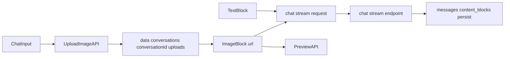

# 聊天图片上传与 ImageBlock 支持实施计划

## 目标与约束
- 支持聊天框上传图片，上传成功后返回 `ImageBlock`（`{ id, type: "image", url, mimeType?, name?, size? }`）。
- 后端提供：会话内图片上传接口 + 预览接口。
- 本地落盘目录固定为 `data/conversations/{conversation_id}/uploads/`。
- 聊天发送时前端提交 `content_blocks: [ImageBlock, TextBlock]`；后端先做透传与持久化，LLM 仍按文本处理。

## 变更范围
- 后端协议与接口
  - 扩展 `ContentBlock`：在 [backend/app/schemas/chat.py](backend/app/schemas/chat.py) 增加 `ImageBlock` 并纳入 `ContentBlock` 联合类型。
  - 新增会话上传/预览 schema（建议放在 [backend/app/schemas/conversation.py](backend/app/schemas/conversation.py) 或同目录新文件）。
  - 在 [backend/app/api/conversation.py](backend/app/api/conversation.py) 增加：
    - `POST /api/conversation/{conversation_id}/uploads/image`
    - `GET /api/conversation/{conversation_id}/uploads/{filename}/preview`
- 后端存储实现
  - 新增会话上传服务（建议 `backend/app/services/conversation/conversation_upload_service.py`）：
    - 校验 `conversation_id` 是否存在。
    - 校验 MIME/扩展名（仅图片）。
    - 生成安全文件名并写入 `data/conversations/{conversation_id}/uploads/`。
    - 返回可预览 URL 与 `ImageBlock`。
  - 预览接口使用 `FileResponse` 返回文件，并做路径穿越防护（禁止 `..`、只允许 uploads 目录内文件）。
- 前端类型与 API
  - 在 [frontend/src/interfaces/contentBlock.ts](frontend/src/interfaces/contentBlock.ts) 增加 `ImageBlock`，并更新 `ContentBlock` 联合。
  - 在 [frontend/src/services/file.ts](frontend/src/services/file.ts) 增加会话图片上传 API（`multipart/form-data`）。
- 前端聊天输入与发送
  - 在 [frontend/src/pages/ChatPage/components/ChatInput/index.tsx](frontend/src/pages/ChatPage/components/ChatInput/index.tsx) 增加图片上传入口与本地预览列表（发送前可移除）。
  - 在 [frontend/src/hooks/chat.ts](frontend/src/hooks/chat.ts) 发送消息时组装：`contentBlocks = [...imageBlocks, textBlock]`。
  - 保持现有文本字段用于输入框显示与快捷编辑。
- 前端消息展示
  - 在 [frontend/src/pages/ChatPage/components/ChatMessage/UserMessage/index.tsx](frontend/src/pages/ChatPage/components/ChatMessage/UserMessage/index.tsx) 渲染用户消息中的 `ImageBlock`（文本+图片并存展示）。
  - 维持助手内容渲染逻辑不变（本需求不要求助手输出图片块）。

## 数据流（实施后）

## 验收标准
- 上传图片后，接口返回 `ImageBlock`，其中 `url` 可直接在前端预览。
- 聊天发送请求中包含 `ImageBlock + TextBlock`，后端不报 schema 错误并成功落库。
- 历史消息回显时，用户消息可看到已上传图片。
- 非图片文件、非法路径、不存在会话 ID 返回明确错误。

## 风险与防护
- 路径安全风险：必须做文件名白名单与路径归一化校验。
- 文件体积风险：接口需限制最大大小，避免内存暴涨。
- 兼容性风险：`extract_user_text` 保持只提取 `TextBlock`，避免影响当前 LLM 调用链路。
