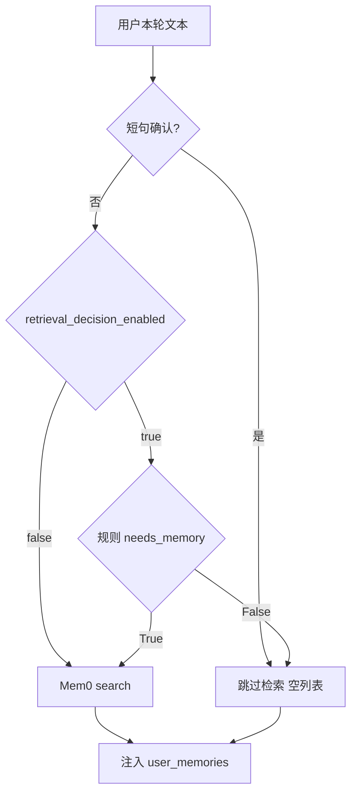

# 问答前记忆检索决策（规则闸门）

本项不是 Dream 治理层（merge/supersede），也**不调用小模型**。检索侧用正则判断当前问题是否需要个人记忆，减少把无关记忆打进 `<user_memories>` 的噪声。**不区分 `agent_mode`**，普通模式与 Agent 模式同一套规则。

## 现状

[`ChatOrchestrator`](backend/app/services/chat/chat_orchestrator.py) 在每轮流式开始前调用 `memory_search`。现有跳过条件只有：

- 请求预注入 `ChatRequest.memories`
- `task_action` 为 continue/summarize
- [`ChatService._is_simple_ack_query`](backend/app/services/chat/chat_service.py)：「好的 / ok / 继续」等短句

其余问题一律 `MemoryService.search()`。



## 决策默认值

- **不区分 `agent_mode`**：所有模式统一跑规则（除非总开关关闭）。
- **只看当前用户问题**（不含历史）。
- **默认检索**：规则未命中 SKIP/MEMORY 时返回 True（宁可多查不漏查）。
- **可选总开关**：`retrieval_decision_enabled` 默认 `True`；设为 `False` 时不跑规则，直接 search。
- **不引入 LLM / 新 models.scenario / 超时**。

## 规则（实现口径）

新增 [`backend/app/services/user/memory_retrieval_decision.py`](backend/app/services/user/memory_retrieval_decision.py)，纯函数 `needs_memory(query: str) -> bool`。正则在**模块导入时编译**（`re.compile`），热路径不再反复 `re.search` 编译。

判定顺序：

1. `strip` + `lower`；长度 `< 5` → `False`（短消息大概率不需要记忆）
2. 命中 `SKIP_PATTERNS`：若同时命中任一 `MEMORY_PATTERNS` → `True`，否则 `False`
3. 命中 `MEMORY_PATTERNS` → `True`
4. 默认 → `True`

```python
SKIP_PATTERNS = [
    r"什么是|what is|how does|explain|定义|区别",
    r"帮我写|write a|implement|debug|fix this|报错|error",
    r"翻译|translate|convert|格式化",
    r"^(好的|ok|thanks|谢谢|嗯|yes|no|对|是的)[\s。!.]*$",
    r"计算|calculate|算一下|\d+\s*[+\-*/]\s*\d+",
]

MEMORY_PATTERNS = [
    r"我之前|上次|之前说过|remember|previously|last time",
    r"推荐|recommend|建议.*我|for me",
    r"继续|continue|接着|then what",
    r"我的|my |我喜欢|I prefer|I like",
]
```

与现有 `_is_simple_ack_query` 的关系：短句确认仍作为第一层过滤（不检索）；未命中短句后再跑 `needs_memory`。`继续` 二字长度 `< 5`，规则层也会判 False，与现网短句跳过一致；英文 `continue` 会走 MEMORY 模式判 True。

Langfuse：可选轻量 span `memory-retrieval-decision`（`query`、`needed`、命中类别 skip/memory/default/short），无 LLM 调用。

## 实现

### 1. 配置

扩展 [`MemoryConfig`](backend/app/schemas/config.py)：

- `retrieval_decision_enabled: bool = True`（总开关：关则不跑规则，直接 search）

不改 Nacos `models.scenarios`，不加 timeout / scenario / agent_mode 相关字段。`memory_config` 可靠代码默认值。

### 2. 接入点

编排层 **不改** `MemorySearch` Protocol 签名（无需传 `agent_mode`）。预注入 memories / `task_action` 跳过逻辑不变。

[`ChatService._search_user_memories`](backend/app/services/chat/chat_service.py) 流程：

1. 空查询 / `_is_simple_ack_query` → 直接 `[]`
2. `retrieval_decision_enabled` 为 false → 直接 search
3. 开关开启 → `needs_memory(query)`；False → `[]`
4. True → 现有 `memory_service.search`

### 3. 文档与测试

- 更新 [`backend/docs/用户管理.md`](backend/docs/用户管理.md)：闸门顺序、规则默认检索、总开关；**不写 agent_mode 分流**。
- 单测（表驱动覆盖 `needs_memory`）：
  - 短消息 / 知识问答 / 写代码 / 翻译 / 计算 → False
  - 「我之前…」「推荐…给我」「我的偏好」及 SKIP+MEMORY 同时命中 → True
  - 未命中任何模式（如天气）→ True
  - 规则 False → 不调 `MemoryService.search`
  - 总开关关闭 → 直接 search（不跑规则）
- 不把治理层（merge/supersede/审计）纳入本次范围。
