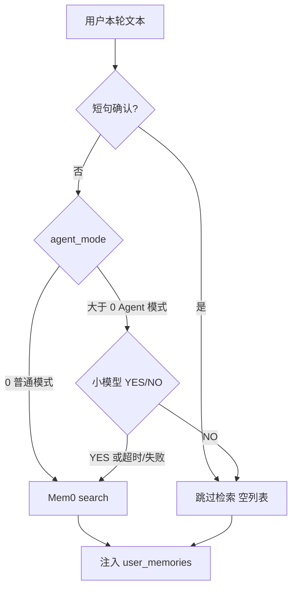

# 问答前记忆检索决策（最小方案）

本项不是 Dream 治理层（merge/supersede），而是检索侧第一道闸门：减少通用问答把无关记忆打进 `<user_memories>` 的噪声，并避免无谓的 Mem0 `search`。

## 现状

[`ChatOrchestrator`](backend/app/services/chat/chat_orchestrator.py) 在每轮流式开始前调用 `memory_search`。现有跳过条件只有：

- 请求预注入 `ChatRequest.memories`
- `task_action` 为 continue/summarize
- [`ChatService._is_simple_ack_query`](backend/app/services/chat/chat_service.py)：「好的 / ok / 继续」等短句

其余问题一律 `MemoryService.search()`。仓库已有原型 [`backend/scripts/bench_memory_classifier.py`](backend/scripts/bench_memory_classifier.py)（英文 YES/NO、禁用 thinking、`max_tokens=5`）。



## 决策默认值

- **按 `agent_mode` 决定是否调用分类器**（与现网其它分流一致，用 `> 0` 判定 Agent 模式）：
  - `agent_mode == 0`（普通问答）：**不调**分类器，短句过滤后直接 `search`（保持现状 TTFT）。
  - `agent_mode > 0`（Agent 模式）：**调用**分类器，NO 则跳过检索。
- **只看当前用户问题**（不含历史）。跟问如「那我的呢？」可能漏检，作为 v1 已知限制。
- **串行**：Agent 模式下先分类再决定是否 search。
- **失败放行**：超时、解析失败、场景缺失 → 仍 search。
- **可选总开关**：`retrieval_decision_enabled` 默认 `True`（允许 Agent 模式走分类）；设为 `False` 时即使 Agent 模式也不调分类器，直接 search。

## 实现

### 1. 配置

扩展 [`MemoryConfig`](backend/app/schemas/config.py)：

- `retrieval_decision_enabled: bool = True`（总开关：关则任何模式都不调分类器）
- `retrieval_decision_timeout_seconds: float = 1.5`（卡住则放行检索）
- `retrieval_decision_scenario: str = "memory_retrieval"`

是否调用分类器的**主条件是 `chat_request.agent_mode`**，不是把开关默认当成全局开启。

Nacos 增加**可选**场景（不加入 `required_scenarios`，避免旧配置启动失败）：

- [`backend/nacos-data/config/ai-chat-dev@@DEFAULT_GROUP@@`](backend/nacos-data/config/ai-chat-dev@@DEFAULT_GROUP@@)
- [`backend/nacos-data/config/ai-chat-prod@@DEFAULT_GROUP@@`](backend/nacos-data/config/ai-chat-prod@@DEFAULT_GROUP@@)

```yaml
scenarios:
  memory_retrieval:
    description: "问答前是否检索用户记忆"
    default_model: "dashscope/qwen3.7-flash"
```

`qwen3.7-flash` 已在 providers 中，且与 `title_generation` / `summarization` 同模型。场景缺失时回退 `title_generation`（已是必填场景）。

`memory_config` 可只靠代码默认值，不必强制改 YAML；需要时再加总开关/超时覆盖。

### 2. 分类服务

新增 [`backend/app/services/user/memory_retrieval_decision.py`](backend/app/services/user/memory_retrieval_decision.py)，职责仅 YES/NO：

- 用 `resolve_scenario(retrieval_decision_scenario)` 拿 flash 模型；缺失则 `title_generation`
- `LLMService.call_llm_api(..., stream=False, max_tokens=5, extra_body=禁用 thinking, temperature 若 API 支持则 0)`
- 外层 `asyncio.wait_for(..., timeout=...)`，避免 `llm_reliability` 重试把 TTFT 拉长
- 解析：`strip` 后 `YES` / `NO`（兼容前后缀噪声）；无法解析 → 视为需要检索
- `CancelledError` 向上抛；其它异常打 warning 后放行
- Langfuse span `memory-retrieval-decision`：`query`、`decision`（yes/no/timeout/error）、耗时

Prompt 沿用 bench 口径（只输出 YES/NO），放到 [`backend/app/prompts/`](backend/app/prompts/) 或该服务常量即可。

### 3. 接入点

[`MemorySearch` Protocol](backend/app/services/chat/chat_orchestrator.py) 与调用处增加 `agent_mode: int`，由 orchestrator 传入 `chat_request.agent_mode`。预注入 memories / `task_action` 跳过逻辑不变。

[`ChatService._search_user_memories`](backend/app/services/chat/chat_service.py) 流程：

1. 空查询 / 短句确认 → 直接 `[]`（不调分类器）
2. `retrieval_decision_enabled` 为 false **或** `agent_mode == 0` → 直接 search
3. `agent_mode > 0` 且开关开启 → 调分类器；NO → `[]`
4. YES / 失败放行 → 现有 `memory_service.search`

`ChatService.__init__` 里构造一次分类服务（或惰性创建）。

### 4. 文档与测试

- 更新 [`backend/docs/用户管理.md`](backend/docs/用户管理.md)：闸门顺序、`agent_mode` 分流、失败放行、配置项。
- 单测：
  - 解析 YES/NO/脏输出
  - 短句不调 LLM
  - `agent_mode == 0` → 不调分类器，直接 search
  - `agent_mode > 0` 且分类 NO → 不调 `MemoryService.search`
  - `agent_mode > 0` 且 YES / timeout / 异常 → 仍 search
  - 总开关关闭 → 即使 Agent 模式也不调分类器
- 不把治理层（merge/supersede/审计）纳入本次范围。
