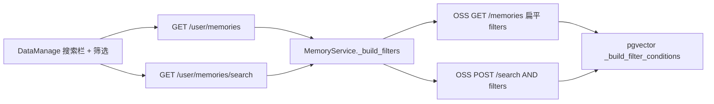

# 记忆管理增加状态 / 类型 / 时间筛选

当前记忆管理页（[`DataManage.tsx`](frontend/src/components/Layout/components/DataManage.tsx)）只有关键词输入：无关键词走 `GET /user/memories`，有关键词走 `GET /user/memories/search`。后端 [`MemoryService.search`](backend/app/services/user/memory_service.py) / [`get_memories`](backend/app/services/user/memory_service.py) 的 Mem0 `filters` 目前只有 `user_id`。

现网是自建 OSS（[`/Users/apple/Desktop/code/mem0`](/Users/apple/Desktop/code/mem0)）。筛选项同时作用在**列表**和**搜索**：无关键词时也能按状态/类型/时间翻页。

落地顺序：先合 mem0（HTTP + pgvector + 测试）并部署 OSS，再改 chat-agent；否则列表筛选 query 会被丢掉、时间范围会 `float()` 失败。

## 要不要改 mem0 源码

**要改，但是小补丁**，仓库是 [`/Users/apple/Desktop/code/mem0`](/Users/apple/Desktop/code/mem0)。不改 Dream 治理 / 写入。chat-agent 只拼 AND filters **不够**：列表 HTTP 收不到这些字段，时间范围在 pgvector 上会把 ISO 当数字 `float()`。不改的退路是拉页后再本地滤，**分页 `count` 会错**，不做。

| 能力 | 要不要改 mem0 |
|------|----------------|
| 关键词搜索的状态 / 类型精确匹配（`POST /search` 已有 `filters`） | 不必新写检索引擎 |
| 筛「生效」用已有 `latest_only=true` | 不必新字段 |
| 筛「已合并 / 已归档」加已有 `include_merged=true` | 不必改源码 |
| `GET /memories` 透传状态 / 类型 / 时间 | **必须改 HTTP** |
| `created_at` ISO `gte`/`lte` | **必须改 pgvector** |
| 筛「普通」（缺省无 `memory_kind`） | **必须改 pgvector SQL** |
| `POST /memories` | **不要当列表** |

## mem0 OSS 改动计划

仓库：[`/Users/apple/Desktop/code/mem0`](/Users/apple/Desktop/code/mem0)。`Memory.get_all` 已把 `filters` 交给 `vector_store.list`，**不必改** [`mem0/memory/main.py`](file:///Users/apple/Desktop/code/mem0/mem0/memory/main.py) 的治理决策。`get_all` **不会**走 `_process_metadata_filters`，列表必须传**扁平** filters，不要套 `AND: [...]`。`POST /search` 可以套 `AND`。

### 1. HTTP：`GET /memories` 透传筛选

文件：[`server/main.py`](file:///Users/apple/Desktop/code/mem0/server/main.py) 的 `get_all_memories`（约 L592）。

现状只组 `user_id` / `run_id` / `agent_id`。增加可选 Query（均默认 `None`）：

- `governance_status: Optional[str]`：`active` / `merged` / `superseded` / `archived`
- `memory_kind: Optional[str]`：`pattern` / `ordinary`（`ordinary` 只作查询值，不写入 payload）
- `created_from` / `created_to`：ISO-8601 字符串

并入 `filters` 的规则：

```python
filters = {k: v for k, v in {"user_id": user_id, "run_id": run_id, "agent_id": agent_id}.items() if v}
if governance_status:
    filters["governance_status"] = governance_status
if memory_kind == "pattern":
    filters["memory_kind"] = "pattern"
elif memory_kind == "ordinary":
    filters["memory_kind"] = {"ne": "pattern"}
if created_from or created_to:
    created = {}
    if created_from:
        created["gte"] = created_from
    if created_to:
        created["lte"] = created_to
    filters["created_at"] = created
```

可见性 flag（已有参数，不要新造）：

- `governance_status` 为 `merged` 或 `archived` 且调用方未显式传 `include_merged` 时，默认 `include_merged=true`（否则结果恒空）
- 筛 `active` 时 chat-agent 会再传 `latest_only=true`；mem0 不必根据 status 自动改 `latest_only`
- 非法 `governance_status` / `memory_kind` → 400
- `created_from` 与 `created_to` 都有且 from > to → 400
- **不要**改 `POST /memories`（写入）

`POST /search` 已转发 `filters` / `latest_only` / `include_merged`，本项不改路由；时间范围与「普通」依赖下面的 pgvector 补丁，search 才会一起生效。

### 2. pgvector：`_build_filter_conditions`

文件：[`mem0/vector_stores/pgvector.py`](file:///Users/apple/Desktop/code/mem0/mem0/vector_stores/pgvector.py)。该函数同时服务 `list()` / `count()` / `search()` / `keyword_search()`，改一处列表和搜索都受益。

**2a. 时间字段走 timestamptz（对齐 Qdrant `DatetimeRange`）**

现状：`OPERATOR_SQL_MAP` 的 `gt`/`gte`/`lt`/`lte` 一律 `(payload->>%s)::numeric`，且 `float(op_value)`。ISO 会失败。`list()` 的 `before_created_at` 已是 `(payload->>'created_at')::timestamptz`，只用于 keyset，不能当闭区间。

约定：

- 时间键：`created_at`、`updated_at`
- 判定 ISO：字符串且能被 `datetime.fromisoformat`（允许末尾 `Z`）解析，或 `YYYY-MM-DD`
- 这些键的 `gt`/`gte`/`lt`/`lte` 用 `(payload->>%s)::timestamptz`，参数保持字符串，**不要** `float()`
- 其它键（`price` / `score`）继续 numeric + `float()`，现有测试不能破
- 同一字段混用 ISO 与数字 → `ValueError`（与 Qdrant 行为对齐）

**2b. `memory_kind` 缺省当普通**

`payload->>'memory_kind' != 'pattern'` 在 SQL 里遇 NULL 为 unknown，行被丢掉。对 `memory_kind` 的 `ne` / `nin`（以及 `$not` 里的等值）使用：

```sql
COALESCE(payload->>'memory_kind', '') IS DISTINCT FROM 'pattern'
```

`eq` / `in` 精确匹配 `pattern` 保持现状（NULL 本来就不该命中模式）。

不要改 `_visibility_sql_conditions` 的 `latest_only` / `include_merged` 语义。

### 3. mem0 测试

[`tests/test_server_params.py`](file:///Users/apple/Desktop/code/mem0/tests/test_server_params.py)：

- `GET /memories?user_id=u1&governance_status=merged` → `get_all` 的 `filters` 含 `governance_status=merged`，且 `include_merged is True`
- `memory_kind=pattern` → `filters["memory_kind"] == "pattern"`
- `memory_kind=ordinary` → `filters["memory_kind"] == {"ne": "pattern"}`
- `created_from` + `created_to` → `filters["created_at"] == {"gte": ..., "lte": ...}`
- 非法 enum / from>to → 400
- 无新 query 时 `filters` 仍只有 `user_id`（回归 #4955）

[`tests/vector_stores/test_pgvector.py`](file:///Users/apple/Desktop/code/mem0/tests/vector_stores/test_pgvector.py)：

- `created_at: {gte, lte}` ISO → SQL 含 `::timestamptz`，params 为字符串不是 float
- `price: {gte: 100}` 仍 `::numeric` 且 `100.0`
- `memory_kind: {ne: "pattern"}` → `COALESCE` / `IS DISTINCT FROM`，不要裸 `!=`
- `$not: [{memory_kind: "pattern"}]` 同样不丢 NULL 行（若走 `_build_filter_conditions`）

### mem0 不改

- `POST /memories` 写入、Dream `server/governance/`、`governance_filters.py` 的打标语义
- `Memory.search` / `get_all` 的 Python 可见性逻辑（继续靠 `latest_only` / `include_merged`）
- Qdrant 实现（已有 ISO DatetimeRange）
- 商业版 Platform API

Platform 列表仍是 POST body `filters`；chat-agent 对 Platform 转发同一套语义，时间比较由商业版负责。



## 筛选语义

| 筛选项 | UI | 传给后端 | 转给 OSS |
|--------|----|----------|----------|
| 状态 | 单选可清空：生效 / 已合并 / 已取代 / 已归档 | `governanceStatus` | **生效**：`latest_only=true`（已把缺省当 active）。**已合并 / 已归档**：`include_merged=true` + `governance_status` 精确匹配。**已取代**：`governance_status=superseded`（默认可见，不必 include_merged） |
| 类型 | 单选可清空：普通 / 模式 | `memoryKind`：`ordinary` 或 `pattern` | `pattern` 精确匹配；**普通**依赖 mem0 对缺省 `memory_kind` 的 COALESCE |
| 创建时间 | `DatePicker.RangePicker`（按天） | `createdFrom` / `createdTo` ISO | 扁平 `created_at: {gte, lte}`（依赖 pgvector timestamptz 补丁）；前端把本地日界转成 ISO |

聊天链路的 `MemoryService.search` 不传这些参数，行为不变。

## 后端

1. 在 [`backend/app/schemas/user.py`](backend/app/schemas/user.py) 增加筛选入参类型（可与 Query 共用）：
   - `MemoryGovernanceStatus` 已有
   - 类型筛选用 `Literal["ordinary", "pattern"]`（`ordinary` 仅作查询值，不写入记忆）
2. [`GET /user/memories`](backend/app/api/user.py) 与 [`GET /user/memories/search`](backend/app/api/user.py) 增加可选 Query：`governance_status`、`memory_kind`、`created_from`、`created_to`。校验 `created_from <= created_to`。
3. 在 [`MemoryService`](backend/app/services/user/memory_service.py) 抽出 `_build_filters(user_id, ...)`：
   - `search()`：body 用 `AND` 拼 `user_id` + 筛选项（search 会 `_process_metadata_filters`）
   - Platform 列表：POST body `filters` 同样带上
   - OSS 列表：**继续 GET `/memories`**，把筛选做成 query（`governance_status` / `memory_kind` / `created_from` / `created_to` / `latest_only` / `include_merged`）。依赖上面的 mem0 HTTP 透传，不要 POST `/memories`。
4. 管理端搜索不要用聊天的 `search_limit=5`。`GET /user/memories/search` 显式传更大的 `limit`（例如 50），避免筛完只剩 5 条。不改聊天配置。
5. 补 [`backend/tests/services/user/test_memory_service.py`](backend/tests/services/user/test_memory_service.py)：覆盖 filters 拼装（active/ordinary/时间范围）以及 search / Platform list / OSS 请求 body。

## 前端

1. [`frontend/src/interfaces/user.ts`](frontend/src/interfaces/user.ts) 扩展 `MemoryListParams`，并给 search 同样的筛选字段。
2. [`profileAPI.getMemories` / `searchMemories`](frontend/src/services/user.ts) 透传 params（axios 已会 snake_case）。
3. [`DataManage.tsx`](frontend/src/components/Layout/components/DataManage.tsx)：
   - 搜索框下方或同一行增加 `Select`（状态、类型）+ `DatePicker.RangePicker`，风格对齐 [`BadCasesTab.tsx`](frontend/src/pages/AdminBadCasesPage/BadCasesTab.tsx) 的筛选条
   - `useMemoryList` 把筛选纳入请求；任一筛选变化重置到第 1 页并立即请求（不必等关键词 debounce）
   - 有关键词走 search，无关键词走 list，**两边都带筛选**
   - 空态：有关键词或任一筛选时用「未找到相关记忆」

## 不改

- 聊天记忆检索、写入、Dream 治理决策
- 搜索结果仍按 Mem0 score 排序；列表仍按 `created_at` 倒序
- 不在本任务做搜索分页（search 仍一次性返回，表格分页切本地已返回集合）
- 不改 OSS `POST /memories`（写入）路径
