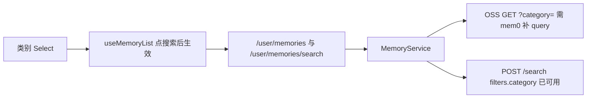

# 前端记忆管理增加 category 筛选项

表格列已经展示 `category`（个人核心 / 偏好 / 兴趣 / 状态 / 知识 / 其他），但 [`DataManage.tsx`](frontend/src/components/Layout/components/DataManage.tsx) 的筛选栏只有状态、类型、日期。列表走服务端分页，筛选项必须透传到 mem0。

## mem0 源码确认（`/Users/apple/Desktop/code/mem0`）

`category` 已是一等 payload 字段（[`mem0/memory/categories.py`](/Users/apple/Desktop/code/mem0/mem0/memory/categories.py) 六类；[`PROMOTED_PAYLOAD_KEYS`](/Users/apple/Desktop/code/mem0/mem0/memory/governance_filters.py) 会提升到响应顶层）。**核心过滤引擎不用改**：

- **pgvector**：[`_build_filter_conditions`](/Users/apple/Desktop/code/mem0/mem0/vector_stores/pgvector.py) 对任意 payload 键做 `payload->>'category' = %s`。`memory_kind` 才有 COALESCE 特判，`category` 走通用等值即可。
- **search**：[`POST /search`](/Users/apple/Desktop/code/mem0/server/main.py) 已原样转发 `filters`；测试里已有 `filters={"category": "food"}`。chat-agent `_build_filters` 追加 `{"category": "state"}` 即可，无需改 search 路由。
- **`Memory.get_all` / `search`**：filters 透传到向量库，不剥离 `category`。
- **不必改**：`categories.py`、decay、backfill、`assign_*_category`、pgvector 运算符表。

**唯一缺口：列表 HTTP 层。** [`GET /memories`](/Users/apple/Desktop/code/mem0/server/main.py) 的 `_scoped_list_filters` 目前只合并 `governance_status` / `memory_kind` / `created_from|to`，没有 `category` query。chat-agent OSS 列表走 query 而不是 body filters，不补这一项，管理页类别筛选对分页列表无效。

mem0 改动范围（对齐 `memory_kind`）：

1. `_scoped_list_filters` + `get_all_memories` 增加 `category: Optional[str] = Query(None)`。
2. 用 `MEMORY_CATEGORIES` 校验，非法值 400（与 governance_status / memory_kind 一致）。
3. 有值时 `filters["category"] = category`（精确等值，不做 COALESCE）。
4. [`tests/test_server_params.py`](/Users/apple/Desktop/code/mem0/tests/test_server_params.py) 的 `TestGetMemoriesPayloadFilters` 补合法转发 + 非法 400。

`misc` 只匹配 `payload.category == "misc"`。缺字段在管理页显示「—」，不纳入「其他」。这与 pgvector 精确等值一致；`resolve_category()` 把缺省/未知当作 misc 仅用于 decay，**本次不把该语义扩到 SQL**（否则才需要给 category 加 COALESCE，超出筛选范围）。

## 前端（chat-agent）

在 [`frontend/src/interfaces/user.ts`](frontend/src/interfaces/user.ts) 的 `MemoryListParams` / `MemorySearchParams` 增加可选 `category?: MemoryCategory`。

在 [`DataManage.tsx`](frontend/src/components/Layout/components/DataManage.tsx) 按现有筛选模式接入（草稿态 + 点「搜索」才应用到请求）：

- 用 `MEMORY_CATEGORY_LABELS` 生成 `MEMORY_CATEGORY_FILTER_OPTIONS`（placeholder「类别」，`allowClear`）。
- `useMemoryList` 增加 `category` / `appliedCategory`，写入 `memoryFilterParams`、`fetchMemories`、`hasFilters`、`submitSearch`。
- 在状态/类型那一组 `Select` 旁加第三个下拉；桌面宽度约 130px。移动端仍走 `grid-cols-2`，第三项换行。

## chat-agent 后端

与 `memory_kind` 同一套转发：

1. [`backend/app/schemas/user.py`](backend/app/schemas/user.py) 增加 `MemoryCategory` Literal。`MemoryListItem.category` 仍为 `str | None`。
2. [`backend/app/api/user.py`](backend/app/api/user.py) 的 list / search 增加 `category` Query，传给 `MemoryService`。
3. [`memory_service.py`](backend/app/services/user/memory_service.py)：
   - `_build_filters` 追加 `{"category": category}`（search 与 Platform 列表；mem0 search 已支持）。
   - `_get_memories_oss` 增加 query `category=`（依赖上面的 mem0 GET 改动）。

## 测试与验证

- mem0：`GET /memories?user_id=&category=state` 进入 `get_all(filters=...)`；非法 category 400。
- chat-agent：[`test_memory_service.py`](backend/tests/services/user/test_memory_service.py) 覆盖 `_build_filters` 与 OSS list/search 转发。
- 浏览器：记忆管理页选类别搜索、与状态/类型组合、清空后再搜。
