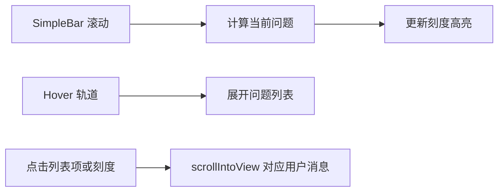

# 问题导航时间轴

## 交互约定

- **默认收起**：消息列表右侧中部只显示短横刻度（胶囊形）。当前可视范围内的问题用 `--color-primary`（`#2356f6`），其余为浅灰。
- **Hover 展开**：轨道左侧弹出白底圆角卡片，列出每条 user message 的截断摘要；刻度仍贴在右侧并对齐对应行。
- **点击**：滚动 SimpleBar 容器到对应 user message（`block: start`，顶部留一点 padding）。
- **出现条件**：至少 2 条 user message；小屏（`useIsSmallScreen`，宽度 ≤ 768）不渲染（hover 体验差、空间不够）。
- **无文本消息**：`getMessageTextFromBlocks` 为空时，摘要回退为「附件」。



## 挂载位置

改 [ChatMessageList.tsx](frontend/src/pages/ChatPage/components/ChatMessage/ChatMessageList.tsx)：SimpleBar 外包一层 `relative flex-1 h-0`，时间轴作为**兄弟节点**绝对定位在右侧，避免跟消息一起滚动。

```tsx
<div className="relative flex-1 h-0 min-h-0">
  <SimpleBar ...>{/* 现有消息 + AutoScroll + FloatButtonBottom */}</SimpleBar>
  <QuestionTimeline messages={messages} containerRef={containerRef} />
</div>
```

时间轴只覆盖消息列表区域，不会压到下方 `ChatInput`。与右下角「回到底部」按钮分区：时间轴垂直居中，互不重叠。

## 组件结构

新增 [QuestionTimeline](frontend/src/pages/ChatPage/components/ChatMessage/components/QuestionTimeline/index.tsx)（样式用 Tailwind + 少量 CSS module，动画/阴影放 module）。

- 从 `messages` 过滤 `role === "user"`，用已有 [`getMessageTextFromBlocks`](frontend/src/interfaces/contentBlock.ts) + `lodash-es` 的 `truncate` 生成摘要（约 20 字，空白压成单行）。
- 轨道：`absolute right-2 top-1/2 -translate-y-1/2 z-20`，收起时宽约 16–24px 作为易 hover 热区。
- 每一行：`flex items-center justify-end`；左侧摘要 `overflow-hidden`，收起时宽度/透明度 0，hover 整轨时展开。
- 列表容器：白底、圆角、轻阴影、项间分割线（对齐图一）。
- 刻度：短横胶囊，等间距，不随文档高度做 minimap 映射。

## 锚定与滚动

给 [UserMessage](frontend/src/pages/ChatPage/components/ChatMessage/UserMessage/index.tsx) 根节点加 `id={`user-message-${message.id}`}`，供查询。

当前项：监听 `containerRef` 的 `scroll`（`passive` + `useThrottleFn` 100ms，与 `FloatButtonBottom` 一致），取 `offsetTop <= scrollTop + 80` 的最后一条 user message。

点击滚动：在 SimpleBar 节点上 `scrollTo({ top: el.offsetTop - 12, behavior: "smooth" })`，比依赖 window 的 `scrollIntoView` 更稳。

## 不改动的范围

- 不改 ChatPage 布局 / Splitter / 预览面板。
- 不改 AutoScroll、发送与消息 store。
- 不做移动端 tap 展开（小屏直接隐藏）。
