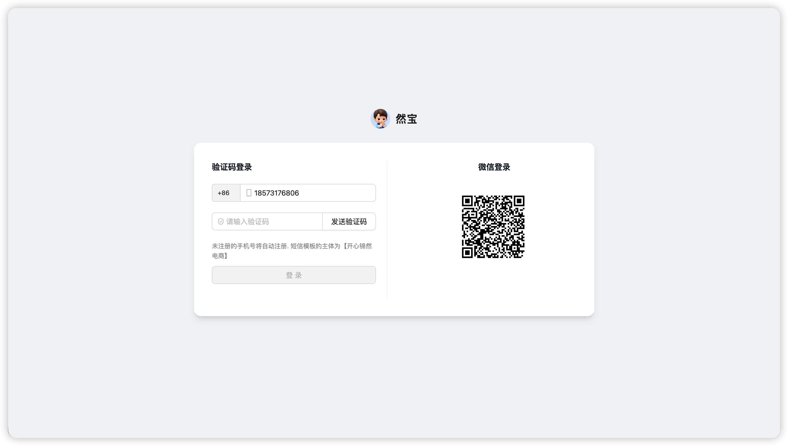
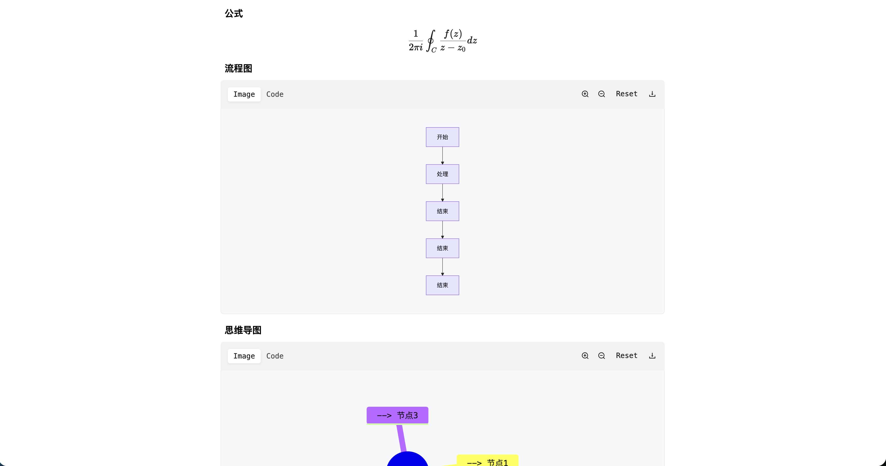
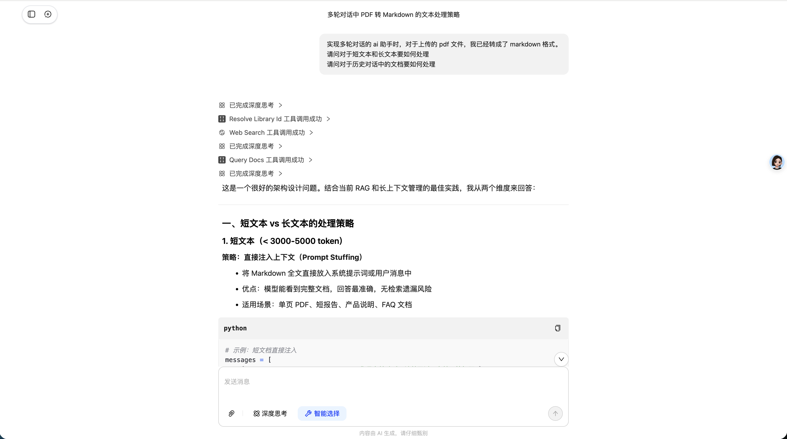
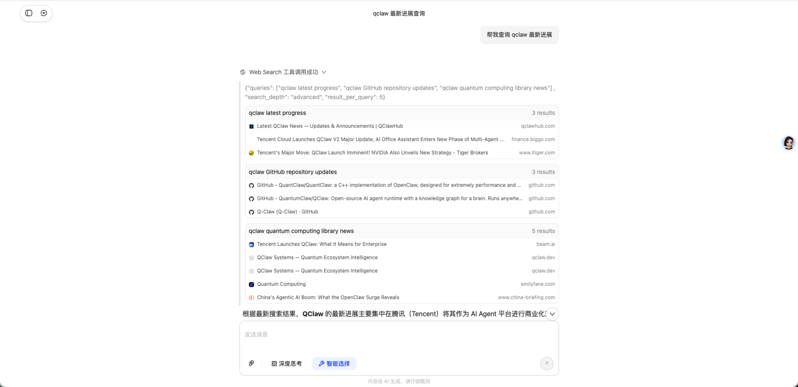
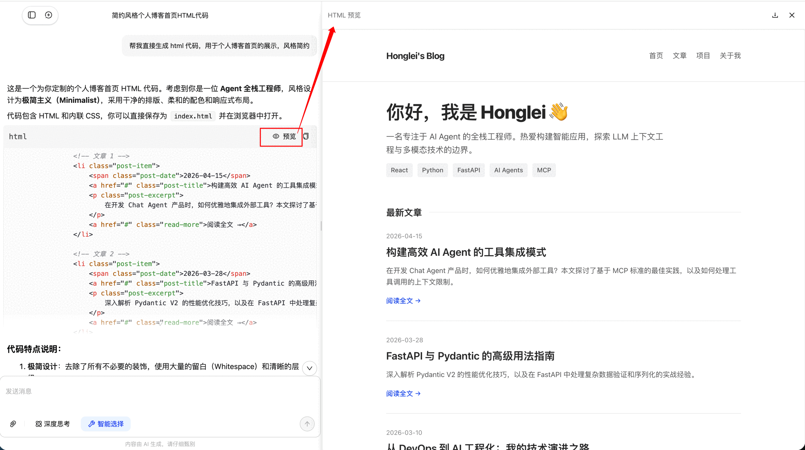
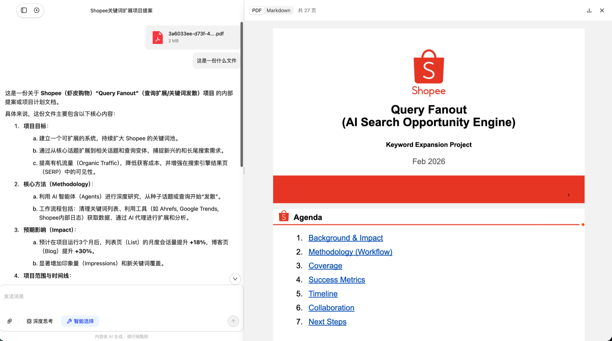
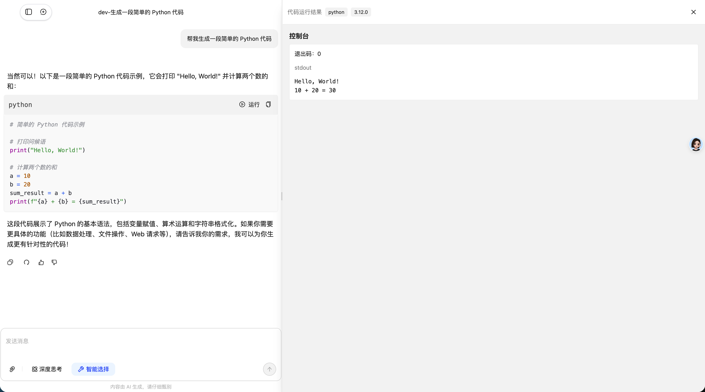

# Chat Agent

本仓库名为 **chat-agent**，提供 AI 对话能力：前后端分离架构，支持流式问答、多轮会话、MCP 工具调用、用户认证与会话持久化。

## 功能概览

- 流式对话：SSE 实时返回推理过程和回复内容
- 会话管理：创建、分页查询、编辑、删除、加载历史消息
- 用户认证：短信登录、微信登录、JWT 鉴权
- MCP 工具：Context7、天气、联网搜索、代码执行、时间、IP 定位
- 组件工具：后端可按条件组装组件数据，前端动态渲染

## 界面预览

### 登录

支持验证码登录与微信扫码登录。



### 功能点概览

#### 1) 丰富的 Markdown 渲染

支持流程图展示与 LaTeX 公式展示，便于技术内容表达与文档阅读。



#### 2) 多轮工具调用

支持在一次对话中连续调用多个工具，逐步完成复杂任务。



#### 3) 工具结果可视化

工具输出可结构化展示，结果更直观、可读性更高。



#### 4) 友好的用户交互

支持 PDF 预览、HTML 预览与代码执行，覆盖常见对话交互场景。







## 技术栈

- 后端：FastAPI + SQLModel + Alembic + PostgreSQL（pgvector）+ fastmcp
- 前端：React 19 + TypeScript + Ant Design 6 + Redux Toolkit + Vite+
- 部署：Docker Compose（postgres + backend + frontend）

## 快速开始（Docker Compose）

1. 准备环境变量：

```bash
cp docker-compose.env.example .env
```

2. 启动服务：

```bash
docker compose up -d --build
```

3. 访问地址：

- 前端：`http://localhost:3000`
- 后端：`http://localhost:8000`
- OpenAPI：`http://localhost:8000/docs`

## 本地开发

### 后端

```bash
cd backend
uv sync --extra dev --group dev
make dev
```

### 前端

```bash
cd frontend
source ~/.vite-plus/env
vp install
vp dev
```

默认端口：
- 前端 `3000`
- 后端 `8000`

## 核心接口（当前实现）

- 聊天：`POST /api/chat/stream`
- 会话：`/api/conversation/*`
- 认证：`/api/auth/*`
- 用户：`/api/user/*`
- 消息：`DELETE /api/message/delete/{message_id}`
- 文件：`POST /api/file/upload_avatar`
- 健康检查：`/api/health`、`/api/health/mcp`、`/api/health/mcp_config`

## 目录结构

```text
.
├── backend/                 # FastAPI 服务
├── frontend/                # React + Vite+ 应用
├── docs/                    # 业务与架构文档
├── docker-compose.yml
├── docker-compose.env.example
└── deploy.sh
```

## 文档导航

- 根文档索引：`docs/README.md`
- 后端说明：`backend/README.md`
- 前端说明：`frontend/README.md`
