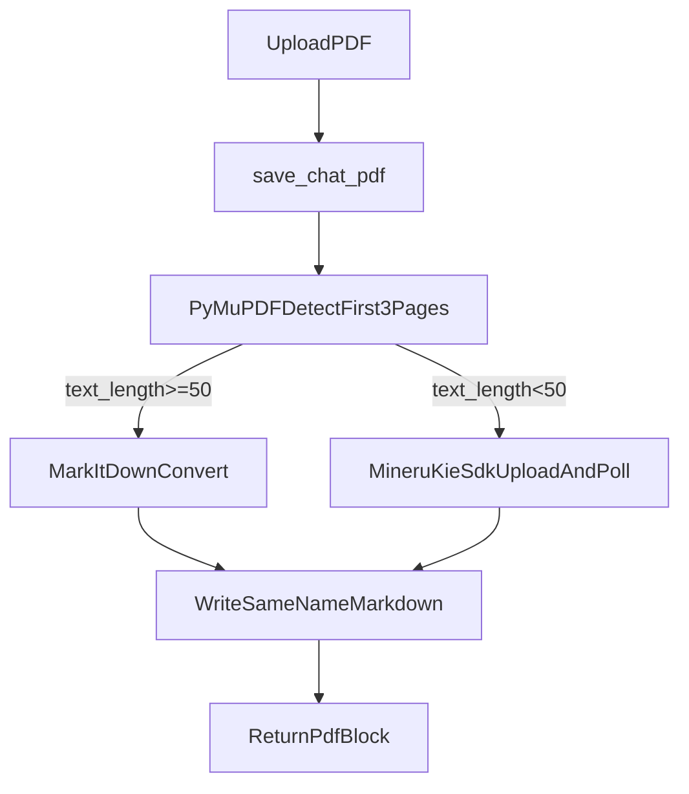

# PDF 上传后自动生成 Markdown

## 目标
在现有 PDF 上传流程中，落盘 `xxx.pdf` 后同步生成同目录同名 `xxx.md`，并将“PDF 转 Markdown”能力封装为独立 class，避免业务逻辑散落在上传函数中。

## 现状与切入点
- 当前上传入口在 [`/Users/apple/Desktop/code/chat-agent/backend/app/services/base_service/chat_pdf_service.py`](/Users/apple/Desktop/code/chat-agent/backend/app/services/base_service/chat_pdf_service.py)，`save_chat_pdf()` 只做 MIME 校验、落盘、返回 `PdfBlock`。
- 上传分发在 [`/Users/apple/Desktop/code/chat-agent/backend/app/services/base_service/chat_attachment_service.py`](/Users/apple/Desktop/code/chat-agent/backend/app/services/base_service/chat_attachment_service.py)，PDF 路由已固定到 `save_chat_pdf()`。
- 配置模型在 [`/Users/apple/Desktop/code/chat-agent/backend/app/schemas/config.py`](/Users/apple/Desktop/code/chat-agent/backend/app/schemas/config.py)，目前无 PDF 转换相关配置。

## 实现方案
1. 新增独立转换类（核心）
- 新建文件：[`/Users/apple/Desktop/code/chat-agent/backend/app/services/base_service/pdf_markdown_converter.py`](/Users/apple/Desktop/code/chat-agent/backend/app/services/base_service/pdf_markdown_converter.py)
- 设计 `PdfMarkdownConverter`，职责拆分为：
  - `detect_pdf_kind(pdf_path) -> text|scan`：用 PyMuPDF 统计前 3 页文本字符总量，`text_length < 50` 判定为扫描型。
  - `convert_text_pdf_with_markitdown(pdf_path) -> str`：文本型走 MarkItDown。
  - `convert_scan_pdf_with_mineru_kie_sdk(pdf_path) -> str`：扫描型走 MinerU KIE SDK，按 SDK 的上传与结果轮询流程拿 markdown。
  - `convert_pdf_to_markdown(pdf_path) -> str`：统一策略编排。
  - `save_markdown(markdown_text, md_path)`：统一写盘（UTF-8）。

2. 接入 MinerU（使用 mineru-kie-sdk）
- 按 SDK 流程实现：
  - 初始化 `MineruKIEClient(base_url, pipeline_id, timeout)`。
  - 上传文件：`upload_file(pdf_path)`。
  - 轮询结果：`get_result(file_ids, timeout, poll_interval)`。
  - 从 SDK 返回结果中提取 markdown 相关字段并标准化为字符串输出。
- 失败策略按你的选择执行：任何 MinerU 失败都抛出异常，导致本次 PDF 上传整体失败。

3. 扩展配置模型
- 在 [`/Users/apple/Desktop/code/chat-agent/backend/app/schemas/config.py`](/Users/apple/Desktop/code/chat-agent/backend/app/schemas/config.py) 增加 `PdfMarkdownConfig`（建议字段）：
  - `enabled`
  - `scan_text_threshold`（默认 50）
  - `detect_pages`（默认 3）
  - `mineru_kie_base_url`（默认 `https://mineru.net/api/kie`）
  - `mineru_kie_pipeline_id`
  - `poll_interval_seconds`、`poll_timeout_seconds`
- 在顶层 `Settings` / 配置读取链路中接入该配置（含 `.env` 的 `__` 嵌套读取能力）。

4. 改造上传流程调用转换器
- 修改 [`/Users/apple/Desktop/code/chat-agent/backend/app/services/base_service/chat_pdf_service.py`](/Users/apple/Desktop/code/chat-agent/backend/app/services/base_service/chat_pdf_service.py)：
  - 在 `dest.write_bytes(chunk)` 后，构造 `md_path = dest.with_suffix('.md')`。
  - 调用 `PdfMarkdownConverter` 执行转换并写入 markdown。
  - 转换异常时记录结构化日志并抛出 `HTTPException`（400/502），符合“上传失败”的业务要求。

5. 依赖与可维护性
- 在 [`/Users/apple/Desktop/code/chat-agent/backend/pyproject.toml`](/Users/apple/Desktop/code/chat-agent/backend/pyproject.toml) 增加依赖：
  - `markitdown`
  - `pymupdf`
  - `mineru-kie-sdk`
- 日志中增加关键字段：`pdf_kind`、`mineru_file_ids`、`mineru_pipeline_id`、`elapsed_ms`，便于后续排障。

## 数据流（简图）

## 验证与测试计划
- 单元测试（优先 mock 外部 API）
  - 文本型 PDF：走 MarkItDown，生成 `.md`。
  - 扫描型 PDF：走 MinerU 成功，生成 `.md`。
  - 扫描型 PDF：MinerU 失败，上传整体失败。
  - 文本检测边界：`49/50` 字符阈值行为正确。
- 集成验证
  - 通过现有上传 API [`/Users/apple/Desktop/code/chat-agent/backend/app/api/file.py`](/Users/apple/Desktop/code/chat-agent/backend/app/api/file.py) 上传样例 PDF，确认 `uploads` 目录出现同名 `.pdf + .md`。
