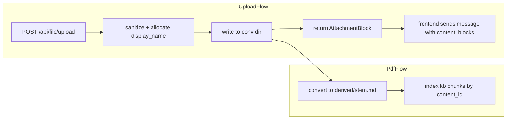
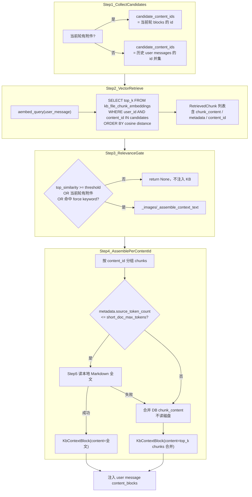

# 上传目录结构调整计划（v2）

## 结论：可以移除两张附件表

**可行。** 在新目录结构下，附件的「会话归属 + 展示名 + 路径 + 内容 ID」已由以下两者承载，无需额外索引表：

| 职责 | 新来源 |
|------|--------|
| 附件元数据（name、mime、size、url、storage_key、content_id） | `messages.content_blocks` 中的 `ImageBlock` / `PdfBlock` / `MarkdownBlock` |
| 物理文件 | `data/user_data/{user_id}/uploads/{conversation_id}/...` |
| RAG 向量索引 | `kb_file_chunk_embeddings`（按 `user_id + content_id`） |

移除 `attachment_files`、`conversation_attachments` 后：

- 上传流程：校验会话 → 写盘 → 返回 `AttachmentBlock`（前端随消息一并持久化）
- VFS 列表：扫描当前会话 uploads 目录（不再 JOIN DB）
- 预览/读文件：由 `storage_key` 直接解析物理路径（校验路径在 user uploads 下且不逃逸）
- 删除 `upsert_attachment_file`、`mount_conversation_attachment`、`resolve_file_ref`（后者当前无调用方）

**取舍：**

- 上传后若用户未发送消息，文件仍留在磁盘（与会话目录下 orphan 文件）；可后续加清理任务，不在本 PR 范围
- RAG 读全文 Markdown 需结合**当前会话** message blocks 定位 `storage_key`（见第 5 节）

---

## 目标目录结构

| 文件类型 | 磁盘路径 | storage_key（相对 `uploads/`） |
|---------|---------|-------------------------------|
| 图片 / PDF / Markdown | `{backend_root}/data/user_data/{user_id}/uploads/{conversation_id}/{display_name}` | `{conversation_id}/{display_name}` |
| PDF 派生 Markdown | `.../uploads/{conversation_id}/derived/{stem}.md` | `{conversation_id}/derived/{stem}.md` |

示例（PDF 为 `report.pdf`）：

```
data/user_data/u1/uploads/conv-abc/report.pdf
data/user_data/u1/uploads/conv-abc/derived/report.md
```

预览 URL：

```
/api/file/preview/{user_id}/{conversation_id}/{display_name}
/api/file/preview/{user_id}/{conversation_id}/derived/report.md
```

`storage_version` 从 `2` 升至 `3`。



---

## 1. 核心路径模块改造

**文件：[`app/services/chat_upload/attachment.py`](app/services/chat_upload/attachment.py)、[`image.py`](app/services/chat_upload/image.py)、[`markdown.py`](app/services/chat_upload/markdown.py)、[`pdf.py`](app/services/chat_upload/pdf.py)**

### 1.1 路径 API

- `get_conversation_upload_dir(user_id, conversation_id) -> Path`
- `build_conversation_storage_key(conversation_id, display_name) -> str`
- `build_derived_markdown_storage_key(conversation_id, pdf_display_name) -> str` → `{conv_id}/derived/{stem}.md`
- `allocate_unique_display_name(conversation_id, display_name) -> str` — **基于文件系统**检测同目录重名，追加 `(1)`、`(2)`…
- `shared_upload_file_path(user_id, storage_key)` — 新 regex + 路径逃逸校验
- `STORAGE_VERSION = 3`

### 1.2 删除的 DB 逻辑

- 删除 `upsert_attachment_file`、`mount_conversation_attachment`
- 删除 `resolve_file_ref`（无外部引用）
- 删除对 `AttachmentFileDb` / `ConversationAttachmentDb` 的 import 与查询
- `save_chat_*` 的 `db` 参数仅用于校验 `ConversationDb` 归属（可选保留）

### 1.3 上传行为

| 行为 | 旧 | 新 |
|-----|----|----|
| `conversation_id` | 可选 | **必填** |
| 元数据持久化 | attachment 表 + message | **仅 message content_blocks** |
| 去重 | 全局 content-hash | 见 **§1.4 去重逻辑** |

### 1.4 去重逻辑（三层）

#### 层 1：磁盘文件 — 会话内 display_name 碰撞

- 路径：`uploads/{conversation_id}/{display_name}`
- `allocate_unique_display_name()` 扫描当前会话目录，重名则追加 `(1)`、`(2)`…
- **不做内容级 dedup**：相同内容也会落盘为新文件（若 display_name 不同或已占用）

#### 层 2：content_id — 内容 SHA-256（标识，非路径）

- 上传处理后计算 SHA-256 → `AttachmentBlock.id` / `content_id`
- 不参与存储路径；用于 RAG 关联与 block 引用

#### 层 3：RAG embedding — 用户级 content_id 幂等跳过

**变更点（相对当前实现）：** 当前 `index_uploaded_text_chunks` 会先 `DELETE (user_id, file_id)` 再重新 embedding；新方案改为 **存在则跳过**。

[`index_uploaded_text_chunks`](app/services/chat_upload/kb_chunk_embedding.py) 流程：

1. 计算/传入 `content_id`
2. **先查询** `kb_file_chunk_embeddings`：`WHERE user_id = ? AND content_id = ? LIMIT 1`
3. 若已有记录 → **直接 return**（打 log：`embedding_skipped=True`，不调用 embedding API，不写入 DB）
4. 若无记录 → 分块 → embedding → 批量 INSERT（**不再先 DELETE**）

适用：PDF、Markdown 上传；图片不上 embedding。

#### 典型场景

| 场景 | 磁盘 | content_id | embedding |
|------|------|------------|-----------|
| **A. 同会话两次上传相同 report.pdf** | `report.pdf` + `report(1).pdf` | 相同 | **第二次跳过**（DB 已有同 user+content_id） |
| **B. 不同会话上传相同 PDF** | 各会话各一份 | 相同 | **第二次及以后跳过** |
| **C. 同会话上传不同内容的 report.pdf** | 后者为 `report(1).pdf`（若同名） | 不同 | 各自 embedding 一次 |
| **D. 图片** | display_name 碰撞规则 | 有 hash | 不涉及 embedding |

**说明：** 场景 A/B 跳过 embedding 时，PDF 转 Markdown **仍执行**（为当前会话写入 `derived/{stem}.md` 或 `derived/{stem}(1).md`），仅向量入库步骤跳过。

---

## 2. VFS / File MCP

**文件：[`app/vfs/resolver.py`](app/vfs/resolver.py)、[`app/vfs/mapper.py`](app/vfs/mapper.py)、[`app/vfs/uploads_provider.py`](app/vfs/uploads_provider.py)**

### 2.1 物理根目录

```python
USER_DATA_ROOT / user_id / "uploads" / workspace_id  # workspace_id == conversation_id
```

虚拟路径不变：

```
/uploads/report.pdf        -> .../uploads/{conv_id}/report.pdf
/uploads/derived/report.md -> .../uploads/{conv_id}/derived/report.md
```

### 2.2 UploadsProvider 重写

- **不再查询** `conversation_attachments` / `attachment_files`
- 扫描 `get_conversation_upload_dir(user_id, conversation_id)`：
  - 顶层文件 → `/uploads/{filename}`
  - `derived/*.md` → `/uploads/derived/{filename}`
- mime/size 从 `stat()` + 扩展名推断；`storage_key` 由路径规则生成

---

## 3. 移除 attachment 表

### 3.1 删除模型与引用

- 删除 [`app/models/attachment_file_db.py`](app/models/attachment_file_db.py)
- 删除 [`app/models/conversation_attachment_db.py`](app/models/conversation_attachment_db.py)
- 更新 [`app/models/__init__.py`](app/models/__init__.py)

### 3.2 Alembic schema migration

```sql
DROP TABLE conversation_attachments;
DROP TABLE attachment_files;
```

（先 drop 子表 `conversation_attachments`，再 drop `attachment_files`）

---

## 4. kb_file_chunk_embeddings：`file_id` → `content_id`

### 4.1 背景

当前 `file_id` 实际存的是 **内容 SHA-256**（与 `AttachmentBlock.id` / `content_id` 同义），重命名仅为语义对齐，**数据值无需变更**。

### 4.2 变更范围

| 文件 | 变更 |
|------|------|
| [`app/models/kb_file_chunk_embedding_db.py`](app/models/kb_file_chunk_embedding_db.py) | 字段 `file_id` → `content_id` |
| [`app/services/chat_upload/kb_chunk_embedding.py`](app/services/chat_upload/kb_chunk_embedding.py) | 参数/列名 `file_id` → `content_id`；入库前 `exists(user_id, content_id)` 则 skip；移除 delete-then-insert |
| [`app/services/chat/kb_rag_context_service.py`](app/services/chat/kb_rag_context_service.py) | SQL `file_id` → `content_id`；`RetrievedChunk.file_id` → `content_id` |
| [`app/utils/multimodal.py`](app/utils/multimodal.py) | `collect_attachment_file_ids` → `collect_attachment_content_ids`（可选，语义统一） |
| [`app/services/chat/chat_orchestrator.py`](app/services/chat/chat_orchestrator.py) | 调用处同步重命名 |

### 4.3 Alembic

```sql
ALTER TABLE kb_file_chunk_embeddings RENAME COLUMN file_id TO content_id;
-- 重命名索引与唯一约束：
-- uq_kb_file_chunk_embeddings_user_file_chunk_idx → ..._user_content_chunk_idx
-- ix_kb_file_chunk_embeddings_file_id → ..._content_id
-- ix_kb_file_chunk_embeddings_user_file → ..._user_content
```

---

## 5. 文档 RAG：召回 chunk 后的上下文组装与读盘链路

本节显式描述 [`KbRagContextService`](app/services/chat/kb_rag_context_service.py) 从向量召回到注入 LLM 的完整路径，以及**何时读本地磁盘**。

### 5.1 端到端流程

入口：[`chat_orchestrator._build_kb_context_blocks`](app/services/chat/chat_orchestrator.py)



**关键结论：**

- **向量召回阶段**：只读 `kb_file_chunk_embeddings`，`chunk_content` 已在库内，**不读磁盘**。
- **长文档**（`source_token_count > short_doc_max_tokens`）：组装阶段仍**只用 DB chunks**，**不读磁盘**。
- **短文档优化**：才尝试读本地 Markdown 全文；读失败则 **fallback 到 DB chunks**。

### 5.2 Step 1：候选 content_id 来源

[`collect_attachment_content_ids`](app/utils/multimodal.py)（计划重命名）从 message blocks 提取：

| block 类型 | 收集的 id |
|-----------|----------|
| `MarkdownBlock` | `block.id`（= content_id / SHA-256） |
| `PdfBlock` | `block.id`；若存在 `block.markdown`，也收集 `block.markdown.id` |

当前轮有附件时**仅绑定本轮** id，避免历史附件干扰检索（现有逻辑保留）。

### 5.3 Step 2–3：向量检索与相关性门控

SQL（列名迁移后为 `content_id`）：

```sql
SELECT content_id, chunk_idx, chunk_content, metadata, (embedding_vector <=> :query_vector) AS distance
FROM kb_file_chunk_embeddings
WHERE user_id = :user_id AND content_id IN (:candidate_content_ids)
ORDER BY embedding_vector <=> :query_vector
LIMIT :top_k
```

门控条件（任一满足则继续）：

- `1 - distance >= relevance_score_threshold`
- 当前轮有附件（`current_turn_has_attachment`）
- 用户 query 命中 `force_rag_keyword_patterns`

### 5.4 Step 4–5：组装 — 短文档读盘链路（新方案）

移除 `attachment_files` 后，**不能**再用 `content_id` 拼 `uploads/derived/{hash}.md`。读盘必须经 **message block → storage_key → 物理路径**。

#### 5.4.1 新增辅助函数

在 [`attachment.py`](app/services/chat_upload/attachment.py) 或 [`multimodal.py`](app/utils/multimodal.py) 增加：

```python
def resolve_storage_key_for_content_id(
    content_id: str,
    *,
    content_blocks: list[ContentBlock],
    history_messages: list[ChatMessage],
) -> str | None:
    """在当前轮 blocks + 历史 user messages 中，按 id 查找 Markdown 的 storage_key。"""
```

查找顺序（先当前轮，再 history 从新到旧）：

1. `MarkdownBlock` 且 `block.id == content_id` → 返回 `block.storage_key`
2. `PdfBlock` 且 `block.markdown.id == content_id` → 返回 `block.markdown.storage_key`
3. 未找到 → `None`

#### 5.4.2 读盘步骤（`_read_full_markdown_text` 改造）

```
输入: user_id, content_id, conversation_id, content_blocks, history_messages

1. storage_key = resolve_storage_key_for_content_id(...)
2. if storage_key is None → log warning → return None（fallback chunks）
3. path = shared_upload_file_path(user_id, storage_key)
   # 例: data/user_data/{uid}/uploads/{conv_id}/derived/report.md
4. if not path.is_file() → log warning → return None
5. return path.read_text(encoding="utf-8").strip()
```

#### 5.4.3 调用链参数透传

| 层级 | 新增/变更参数 |
|------|-------------|
| [`chat_orchestrator._build_kb_context_blocks`](app/services/chat/chat_orchestrator.py) | 传入 `conversation_id`（已有）、`content_blocks`、`history_messages` |
| `build_context_block_content(...)` | + `conversation_id`, `content_blocks`, `history_messages` |
| `_assemble_context_text(...)` | 同上，传给 `_read_full_markdown_text` |
| `_read_full_markdown_text(...)` | 使用 §5.4.2 逻辑，**删除**对 `resolve_markdown_path_for_content_id` 的依赖 |

#### 5.4.4 读盘示例

```
content_id     = 7f83b165...（PDF 内容 SHA-256）
storage_key    = conv-abc/derived/report.md        ← 来自 PdfBlock.markdown.storage_key
物理路径       = {backend_root}/data/user_data/u1/uploads/conv-abc/derived/report.md
预览 URL       = /api/file/preview/u1/conv-abc/derived/report.md
```

同 content_id 在会话 B 也有上传时，embedding 共用，但读全文时取**当前会话** history 里匹配 block 的 `storage_key`（通常为 `conv-b/derived/report.md`）。

### 5.5 Fallback 与边界

| 情况 | 行为 |
|------|------|
| 找不到 block / 无 `storage_key` | fallback：用 DB `chunk_content` 合并 |
| 文件不存在 / 读盘 OSError | 同上 |
| 长文档 | 不尝试读盘，始终用 chunks |
| 迁移窗口期 v2 块无新 storage_key | data migration 必须先回写 blocks；可选 `shared_upload_file_path` v2 hash 路径 fallback |

### 5.6 删除/废弃

- 删除 `resolve_markdown_path_for_content_id`（或仅保留 v2 fallback 至迁移完成）
- `RetrievedChunk.file_id` 重命名为 `content_id`（§4）

向量检索仍按 `(user_id, content_id IN candidate_content_ids)`，与目录结构无关。同 content_id 多次上传共用一套 chunk 向量（§1.4 层 3 skip 规则）。

---

## 6. 历史数据迁移

### 6.1 文件搬迁（不再迁移 attachment 表）

数据源改为 **`messages.content_blocks`** + 旧磁盘路径：

1. 遍历所有 user messages 中的 attachment blocks（v2：`storage_key` 为 `raw/{hash}.ext`）
2. 按 block 所属 `conversation_id`（来自 message → conversation）计算 v3 `storage_key`：
   - 用 block.`name` 作 display_name，会话内做重名 `(1)` 分配
   - PDF 派生：`{conv_id}/derived/{stem}.md`
3. 从旧路径复制到新路径
4. 回写 block 的 `storage_key`、`url`、`storage_version=3`

### 6.2 kb 列重命名

Alembic `RENAME COLUMN`（值不变）。

### 6.3 迁移后清理

删除 `uploads/raw/`、`uploads/derived/` 下 orphan 文件；DROP 两张 attachment 表。

### 6.4 双读兼容（可选，迁移窗口期）

`shared_upload_file_path` 在 v3 路径不存在时 fallback v2 `raw/{hash}` 路径。

---

## 7. API 约束

[`app/api/file.py`](app/api/file.py)：

- `conversation_id: str = Form(...)` 必填
- 预览接口不变：`GET /preview/{user_id}/{storage_key:path}`

---

## 8. 测试计划

| 场景 | 说明 |
|-----|------|
| 上传写盘路径 | `{conv}/{display_name}` |
| 同会话重名 `(1)` | 文件系统碰撞 |
| PDF → `derived/{stem}.md` | pdf flow |
| UploadsProvider 目录扫描 | 替代 DB 列表 |
| kb `content_id` 检索 | rag service |
| 同 content_id 二次上传 skip embedding | kb_chunk_embedding 单测 |
| RAG 短文档读盘：block.storage_key → 物理路径 | kb_rag_context_service 单测 + fallback chunks |
| Alembic | drop attachment 表 + rename kb 列 + message"message blocks 驱动的文件搬迁 |

---

## 9. 风险与注意事项

- **上传未发送消息**：文件在磁盘但无 message 引用；VFS 仍可见（目录扫描），Agent 可读
- **同 content_id 跨会话/同会话重复上传**：embedding 按 `user_id + content_id` **只建一次**，后续上传 skip；磁盘仍各有一份；全文读取依赖当前会话 block 的 `storage_key`
- **embedding metadata**：跳过时不会更新 `metadata_json.file_name`（保留首次入库时的文件名）；RAG 展示名以 chunk metadata 为准
- **回滚**：DROP 表不可逆；执行前备份 DB + `data/user_data/`

---

## 实施顺序

1. 路径 API v3 + 上传去 DB 化
2. kb `file_id` → `content_id`（模型 + 服务层，可与 1 并行）
3. VFS 目录扫描 + resolver 会话级 root
4. Alembic：kb 列重命名 + drop attachment 表
5. 数据迁移（message blocks 驱动文件搬迁）
6. 测试 + 清理 v2 fallback
