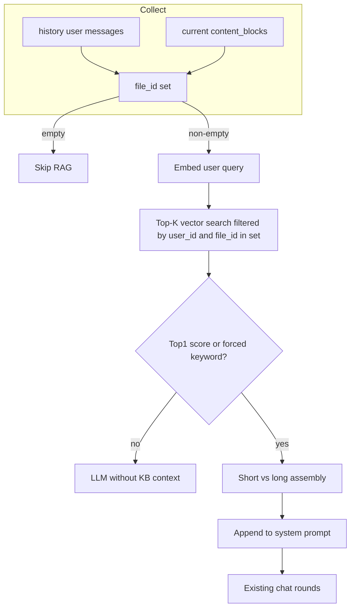

# 会话内文档 RAG（MarkdownBlock / PdfBlock）集成方案

## 现状与缺口

- 用户消息已支持 [`MarkdownBlock` / `PdfBlock`](backend/app/schemas/chat.py)（含 PDF 内嵌 `markdown`）。
- [`ChatSessionAgent.stream_session_events`](backend/app/agents/chat_session_agent.py) 中用户侧仅通过 [`extract_user_text_with_attachment_placeholder`](backend/app/utils/multimodal.py) + [`build_user_content_for_llm`](backend/app/utils/multimodal.py) 组装占位符，**未注入任何检索上下文**。
- 向量数据写在 [`kb_file_chunk_embeddings`](backend/app/models/kb_file_chunk_embedding_db.py)，由 [`index_uploaded_text_chunks`](backend/app/services/base_service/kb_file_chunk_embedding_service.py) 在 PDF 转 Markdown 后入库；**metadata 中已有** `source_token_count` 等，可用于短/长文档分支。
- **会话隔离（你已选定的语义）**：不上传时绑定 `conversation_id`。改为 **仅检索「本会话消息里出现过的附件 `file_id`」** —— 利用消息表 [`MessageDb.content_blocks`](backend/app/models/message_db.py) JSON 与当前请求的 `chat_request.content_blocks`，自然限定在同一 `conversation_id` 拉起的 `history_messages` 内，避免跨会话误检。

## 架构数据流（与方案文档对齐）

## 实现要点

### 1. 收集候选 `file_id`

- 新增小工具函数（建议放在 [`app/utils/multimodal.py`](backend/app/utils/multimodal.py) 或独立 `app/utils/kb_attachment_ids.py`）：
  - 从 `list[ContentBlock]` 中解析：`PdfBlock.id`、`MarkdownBlock.id`、以及 `PdfBlock.markdown.id`（若存在）。
  - 对 [`ChatMessage`](backend/app/schemas/chat.py) 列表：仅处理 **role=user**（必要时含带附件的 tool 结果可后续扩展），`normalize_content_blocks` 后复用上述逻辑。
- 在 [`ChatSessionAgent.stream_session_events`](backend/app/agents/chat_session_agent.py) 中合并 **当前请求** + **`history_messages`** 的集合；若为空则 **不发起向量查询**（符合「无文档则不走 RAG」，也避免全库扫用户向量）。

### 2. Top-K 检索 + 分数门控（One-Shot）

- 新增服务模块，例如 [`app/services/chat/kb_rag_context_service.py`](backend/app/services/chat/kb_rag_context_service.py)（或 `app/services/base_service/` 下若更偏基础设施）：
  - 使用现有 [`EmbeddingService.aembed_query`](backend/app/services/base_service/embedding_service.py) 生成查询向量。
  - 使用 **PostgreSQL + pgvector** 对 `kb_file_chunk_embeddings` 做查询：`WHERE user_id = :uid AND file_id IN :file_ids`，按 **余弦距离**（pgvector 的 `<=>`）排序 `LIMIT k`。
  - **分数**：将 Top-1 距离转为相似度（例如对归一化向量常用 `1 - distance`；实现时与 pgvector 语义一致并写清注释）。
  - **门控**：若 Top-1 相似度 **低于** 可配置阈值（默认如 **0.65**），则丢弃整批结果 **除非** 命中「显式指令」正则（见下）。
- 配置：扩展 [`KbFileRagConfig`](backend/app/schemas/config.py) / [`Settings`](backend/app/core/config.py)，例如：`retrieval_top_k`、`relevance_score_threshold`、`short_doc_max_tokens`（对应方案中 3000~4000 token 量级）、`force_rag_keyword_patterns`（字符串列表，编译为正则）。

### 3. 检索后组装（短/长）

- 对门控通过后的命中行，**按 `file_id` 分组**。
- 从任一分块行的 `metadata_json["source_token_count"]` 读取全文 token 数（各块相同）：
  - **短文档**（≤ `short_doc_max_tokens`）：从磁盘读取 **完整 Markdown**（路径规则与 PDF 流程一致：`user_upload_dir(user_id) / f"{file_id}.md"`，与 [`chat_pdf_service`](backend/app/services/base_service/chat_pdf_service.py) 一致），整文注入，**不用片段拼接**。
  - **长文档**：仅拼接该 `file_id` 下 **本次检索命中的 `chunk_content`**（按 `chunk_idx` 或检索顺序去重），避免整文溢出。
- 将多块内容格式化为单一可读片段（如按文件分节），作为 **「参考文档」** 字符串返回。

### 4. 注入 LLM 的位置

- 扩展 [`get_merged_system_prompt_for_chat_session`](backend/app/prompts/prompt_utils.py)（或在其返回后再拼接），增加可选参数 **`kb_context: str | None`**：有则追加固定模板片段（简短说明：仅基于参考文档作答、勿编造）。
- 在 [`ChatSessionAgent.stream_session_events`](backend/app/agents/chat_session_agent.py) 中，在构造 `system_prompt` **之前** 调用新 RAG 服务；将结果并入 system，再进入现有 MCP/无工具分支。**不改变** `tool_guided_user_message` / `build_user_content_for_llm` 的结构，除非后续希望把全文塞进 user（不推荐）。

### 5. 查询文本与「显式指令」

- **检索用 query**：优先使用 [`extract_user_text`](backend/app/schemas/chat.py)（纯用户输入）；若为空再回退到占位符或短字符串，避免仅用 `"[用户发送了 PDF 文件]"` 做语义检索（可在日志中打 warning）。
- **强制走 RAG**：对 `extract_user_text` 结果跑 `force_rag_keyword_patterns`；命中则 **跳过分数门控**，仍使用 Top-K 结果做组装（与方案一致）。

### 6. 独立 `.md` 上传（可选后续）

- 当前 [`save_chat_attachment`](backend/app/services/base_service/chat_attachment_service.py) 仅 PDF→[`save_chat_pdf`](backend/app/services/base_service/chat_pdf_service.py) 或图片；**独立 Markdown 文件上传若尚未实现**，则历史里不会出现纯 `MarkdownBlock`，但不影响 PDF 链路。若需要同等能力，可另增 `save_chat_markdown` + 调用 `index_uploaded_text_chunks`，与本方案正交。

### 7. 测试

- 单元测试：file_id 收集（含嵌套 `markdown`）、空集合跳过、门控与强制关键词分支；可对组装逻辑做 mock，不对真实 PG 强依赖。
- 有集成环境时：单测或手工验证「同用户多会话」仅当前会话附件参与过滤。

## 关键文件一览

| 区域 | 文件 |
|------|------|
| 收集 file_id | 新建 util 或扩展 [`multimodal.py`](backend/app/utils/multimodal.py) |
| 向量检索与组装 | 新建 `kb_rag_context_service.py`（建议 [`app/services/chat/`](backend/app/services/chat/)） |
| 配置 | [`app/schemas/config.py`](backend/app/schemas/config.py) `KbFileRagConfig` 扩展字段 |
| Prompt | [`app/prompts/prompt_utils.py`](backend/app/prompts/prompt_utils.py) |
| 接入点 | [`app/agents/chat_session_agent.py`](backend/app/agents/chat_session_agent.py)（`stream_session_events` 开头） |
| DB | **无需新表**；沿用现有 `kb_file_chunk_embeddings` |

## 风险与注意

- **首轮仅附件无文字**：query 过弱可能导致门控失败；依赖强制关键词或产品侧提示用户输入具体问题。
- **短文档读盘**：需保证 `{file_id}.md` 存在（与索引同源）；若缺失应降级为 chunk 文本并打日志。
- **pgvector SQL**：使用参数化查询，避免字符串拼接；维度与 [`EMBEDDING_DIMENSION`](backend/app/models/kb_file_chunk_embedding_db.py) 一致。
