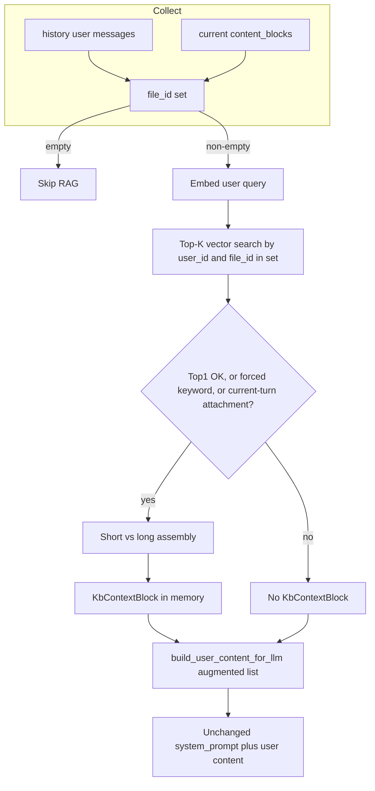

# 会话内文档 RAG（最终合并版）

本文档合并并取代 `.cursor/plans/会话_kb_rag_集成_c2edd410.plan.md` 与 `会话_kb_rag_集成_c0e3cd10.plan.md`，作为唯一实施说明。

## 目标

- 支持用户消息中含 [`MarkdownBlock` / `PdfBlock`](backend/app/schemas/chat.py) 时的真正「基于上传文档」问答。
- **会话隔离**：不上传时绑定 `conversation_id`；仅检索 **本会话内消息中出现过的附件 `file_id`**（当前请求 `content_blocks` + `history_messages` 中 role=user 的块），避免跨会话误检与全用户向量扫库。
- **注入方式**：**不修改** [`get_merged_system_prompt_for_chat_session`](backend/app/prompts/prompt_utils.py)；使用内存中的 **`KbContextBlock`**，经 [`build_user_content_for_llm`](backend/app/utils/multimodal.py) 进入 **user** 侧；**不落库**。

## 现状与缺口

- [`ChatSessionAgent.stream_session_events`](backend/app/agents/chat_session_agent.py) 仅用 [`extract_user_text_with_attachment_placeholder`](backend/app/utils/multimodal.py) + [`build_user_content_for_llm`](backend/app/utils/multimodal.py)，**未注入检索上下文**。
- 向量在 [`kb_file_chunk_embeddings`](backend/app/models/kb_file_chunk_embedding_db.py)，由 [`index_uploaded_text_chunks`](backend/app/services/base_service/kb_file_chunk_embedding_service.py) 在 PDF 转 Markdown 后写入；`metadata_json` 含 **`source_token_count`**，供短/长文档分支。
- 消息表 [`MessageDb.content_blocks`](backend/app/models/message_db.py) 存 JSON，可用于从历史 user 消息解析附件 id。

## 核心设计决策（摘要）

| 项目 | 决策 |
|------|------|
| 上传 API | 不改动；仍按 user_id + file_id 存向量 |
| 会话范围 | 由 **会话内出现的 file_id 集合** 过滤检索，非 conversation_id 写库 |
| 分数门控 | 默认：Top-1 低于 `relevance_score_threshold` 则丢弃，除非强制关键词；**当前请求 `content_blocks` 中含 PdfBlock/MarkdownBlock（本轮有上传）则无视阈值，仍保留 Top-K 组装** |
| 上下文注入 | **`KbContextBlock` + user 渲染**，不改 system |
| 持久化 | 用户消息入库 **仅**客户端原始 `content_blocks`，不含 `KbContextBlock` |

## 架构数据流

## 实现要点

### 1. 收集候选 `file_id`

- 工具函数（[`app/utils/multimodal.py`](backend/app/utils/multimodal.py) 或 `app/utils/kb_attachment_ids.py`）：
  - 从 `list[ContentBlock]` 解析：`PdfBlock.id`、`MarkdownBlock.id`、`PdfBlock.markdown.id`（若存在）。
  - 对 [`ChatMessage`](backend/app/schemas/chat.py) 列表：仅 **role=user**，`normalize_content_blocks` 后复用。
- [`ChatSessionAgent.stream_session_events`](backend/app/agents/chat_session_agent.py)：合并 **当前请求 + history_messages**；集合为空则 **不发起向量查询**。

### 2. Top-K 检索 + 分数门控（One-Shot）

- 新建例如 [`app/services/chat/kb_rag_context_service.py`](backend/app/services/chat/kb_rag_context_service.py)：
  - [`EmbeddingService.aembed_query`](backend/app/services/base_service/embedding_service.py) 生成查询向量。
  - PostgreSQL + pgvector：`WHERE user_id = :uid AND file_id IN :file_ids`，按 `<=>` 排序 `LIMIT k`。
  - Top-1 转相似度（如 `1 - distance`，注释写明与 pgvector 语义一致）。
  - **门控**：低于阈值则丢弃结果，**除非**满足以下任一条件则**仍保留 Top-K 结果并进入组装**：
    - 命中强制关键词（见 §6）；或
    - **本轮有上传**：当前请求的 `content_blocks`（`normalize_content_blocks` 后）中存在 `PdfBlock` 或 `MarkdownBlock` 即视为本轮带附件，**跳过阈值**，仍用本次检索得到的 Top-K 进入组装。
- 配置：扩展 [`KbFileRagConfig`](backend/app/schemas/config.py)：`retrieval_top_k`、`relevance_score_threshold`（如 0.65）、`short_doc_max_tokens`、`force_rag_keyword_patterns`；**不**增加 system 侧 kb 配置。

### 3. 检索后组装（短/长）

- 门控通过后按 `file_id` 分组。
- `metadata_json["source_token_count"]`：
  - **短文档**（≤ 阈值）：磁盘读 **`user_upload_dir(user_id) / "{file_id}.md"`**（与 [`chat_pdf_service`](backend/app/services/base_service/chat_pdf_service.py) 一致），全文注入。
  - **长文档**：仅用本次命中行的 `chunk_content`（去重排序），避免整文溢出。
- 输出合并为单一参考文档字符串，再封装入 `KbContextBlock`（可在 block 内或渲染时加简短说明：请仅依据参考内容作答等）。

### 4. `KbContextBlock` 与 LLM 组装

- 在 [`app/schemas/chat.py`](backend/app/schemas/chat.py) 定义 `KbContextBlock`（如 `type: "kb_context"`、`content: str`）。
- **联合类型**：出于兼容成本考虑，将 **`KbContextBlock` 并入对外 `ContentBlock`**（扩展 `ContentBlock` 联合类型），**不**再单独维护 `ContentBlockForLlm` 等仅 Agent 内部别名，避免两套块列表与校验分叉。
- **API 安全**：若用户请求可反序列化出 `kb_context`，必须 **剥离或拒绝**，仅服务端构造。
- [`extract_user_text`](backend/app/schemas/chat.py) **只统计 `TextBlock`**，不得把 `KbContextBlock` 当作 query，以免影响记忆检索与 RAG query。
- 扩展 [`build_user_content_for_llm`](backend/app/utils/multimodal.py) / `_build_text_content`：`KbContextBlock` 排在 **前**（或与 `leading_text` 的相对顺序按产品固定），输出仍为 string 或多段 text（与 image 分支兼容）。

### 5. [`chat_session_agent.py`](backend/app/agents/chat_session_agent.py) 接入顺序

1. 检索 query：`extract_user_text` 优先；空则弱回退（占位符），日志 warning。
2. 有 KB 时：`blocks_for_llm = [KbContextBlock(...), *chat_request.content_blocks]`。
3. `user_message_content = build_user_content_for_llm(blocks_for_llm, leading_text=tool_guided_user_message, include_text_blocks=False)`（按需微调）。
4. `system_prompt = get_merged_system_prompt_for_chat_session(...)` **无 kb 参数**。
5. 持久化路径：**只保存** API 原始 `content_blocks`，不写入 `KbContextBlock`。

### 6. 强制关键词与 query

- **强制走 RAG**（跳过分数门控、仍用 Top-K 组装）：
  - 对 `extract_user_text` 匹配 `force_rag_keyword_patterns`；或
  - **本轮有上传**（同 §2）：避免仅附件、弱 query 时 Top-1 过低导致无 KB 上下文。

### 7. 独立 `.md` 上传（可选、正交）

- [`save_chat_attachment`](backend/app/services/base_service/chat_attachment_service.py) 当前仅 PDF 走向量索引；纯 Markdown 上传若未实现，历史里可无独立 `MarkdownBlock`，不影响 PDF 主路径。后续可另增 `save_chat_markdown` + `index_uploaded_text_chunks`。

### 8. 测试

- 收集（含嵌套 markdown）、空集跳过、门控（含本轮有上传跳过阈值）、强制关键词；组装 mock，弱化真实 PG 依赖。
- `build_user_content_for_llm` 含 `KbContextBlock` 的顺序与内容；可选断言落库无 `kb_context`。
- 集成环境可验证同用户多会话隔离。

## 关键文件一览

| 区域 | 文件 |
|------|------|
| file_id 收集 | 新建 util 或扩展 [`multimodal.py`](backend/app/utils/multimodal.py) |
| `KbContextBlock` | [`app/schemas/chat.py`](backend/app/schemas/chat.py) |
| user 侧渲染 | [`app/utils/multimodal.py`](backend/app/utils/multimodal.py) |
| 向量检索与组装 | 新建 [`app/services/chat/kb_rag_context_service.py`](app/services/chat/kb_rag_context_service.py) |
| 配置 | [`app/schemas/config.py`](backend/app/schemas/config.py) |
| 接入 | [`app/agents/chat_session_agent.py`](backend/app/agents/chat_session_agent.py) |
| System 提示 | [`prompt_utils.py`](backend/app/prompts/prompt_utils.py) **不增加 kb 注入** |
| DB | **无新表**；[`kb_file_chunk_embeddings`](backend/app/models/kb_file_chunk_embedding_db.py) |

## 风险与注意

- **首轮仅附件无文字**：query 可能偏弱；**本轮有上传时已跳过阈值保留 Top-K**，一般仍可注入上下文；极端情况（如索引未就绪）仍依赖日志与降级路径。
- **短文档读盘**：`{file_id}.md` 缺失时降级为 chunk 并打日志。
- **pgvector**：参数化查询；维度与 [`EMBEDDING_DIMENSION`](backend/app/models/kb_file_chunk_embedding_db.py) 一致。
- **客户端伪造 kb_context**：必须校验剥离。
- **Token 预算**：长 KB 在 user 侧占用上下文，与 [`_check_round_context_budget`](backend/app/agents/chat_session_agent.py) 交互；必要时后续再做截断。
