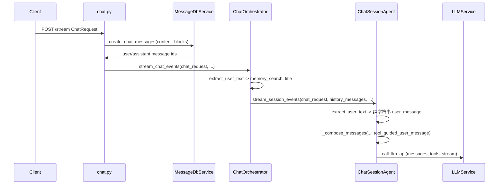

# 问答流程与图片消息支持分析

## 现有流程（与 [`app/api/chat.py`](app/api/chat.py) 相关）

要点：

- **入口**：[`ChatRequest`](backend/app/schemas/chat.py) 的 `content_blocks` 已包含 `TextBlock | ImageBlock | ...`（[`ImageBlock`](backend/app/schemas/chat.py) 含 `url` / `mime` / `size`，`url` 为站内路径如 `/api/file/image/preview/...`）。
- **持久化**：[`MessageDbService.create_chat_messages`](backend/app/services/message/message_db.py) 把完整 `content_blocks` 写入 DB，**图片元数据已落库**。
- **缺口 A**：[`ChatSessionAgent.stream_session_events`](backend/app/agents/chat_session_agent.py) 使用 `extract_user_text(chat_request.content_blocks)`，**仅拼接 `TextBlock`**，随后 [`BaseAgent._compose_messages`](backend/app/agents/base.py) 追加 `{"role": "user", "content": user_message}`，**`content` 始终是字符串**。
- **缺口 B**：历史侧 [`format_chat_message_for_llm`](backend/app/protocols/chat_messages.py) 用 `collect_content_from_block_payloads`（即只拼 `TextBlock`），**历史用户消息里的图片也不会进 LLM**。
- **缺口 C**：[`MCPToolSession`](backend/app/agents/mcp_tool_execution.py) 与工具策略只依赖 `user_message: str`；[`tool_call_policy.apply_iteration_hints`](backend/app/agents/tool_call_policy.py) 通过 [`update_last_user_message`](backend/app/utils/message.py) **把最后一条 user 的 `content` 整块替换为字符串**。若将来 `content` 为多模态数组，**必须只改文本部分或合并到 text 段**，否则会破坏结构。
- **上传**：[`POST /api/file/image/upload`](backend/app/api/file.py) + [`save_chat_image`](backend/app/services/base_service/chat_image_service.py) 已返回 `ImageBlock`，前端只需在 `content_blocks` 里带上即可。

## 为何「有 ImageBlock 仍看不到图」

模型 API（OpenAI 兼容）需要 `content` 为 **多段内容数组**（例如 `text` + `image_url`），或等价字段。当前实现始终传 **纯文本**，因此即使用户上传了图片，**视觉模型也收不到像素信息**。

### 图片编码策略（已定）

- **仅使用 base64**：对每个 `ImageBlock`，在服务端解析其站内 `url` 对应磁盘文件，读取字节后拼成 **`data:{mime};base64,{...}`**，填入 OpenAI 兼容字段 `{"type": "image_url", "image_url": {"url": "<data URL>"}}`。
- **不使用**公网可访问的图片 URL、不依赖可配置 public base URL；避免模型侧 HTTP 拉取失败与鉴权问题。

## 建议实现方向（按优先级）

### 1. 将 `content_blocks` 转为 LLM 多模态 `content`

- 新增工具函数（建议放在 [`app/schemas/chat.py`](backend/app/schemas/chat.py) 或 `app/utils/` 下专用模块）：输入 `list[ContentBlock]`，输出 OpenAI 风格的 `content`：`str | list[dict]`。
  - `TextBlock` → `{"type": "text", "text": ...}`。
  - `ImageBlock` → `{"type": "image_url", "image_url": {"url": "<data:image/...;base64,...>"}}`（**仅 base64 data URL**）。
- **路径解析**：`ImageBlock.url` 为站内路径（如 `/api/file/image/preview/{user_id}/{filename}`），在构建 LLM 请求时解析为与 [`preview_chat_image`](backend/app/api/file.py) / [`save_chat_image`](backend/app/services/base_service/chat_image_service.py) 一致的本地路径并读文件。
- 调用应发生在**构建发给 LLM 的 messages 之前**（可异步，因涉及读文件与 base64 编码）。

### 2. 当前轮：改 `ChatSessionAgent` 与 `BaseAgent._compose_messages`

- 不再仅用 `extract_user_text` 作为最终 user 内容；改为用上面的转换函数，把「工具引导文案」与多模态内容组合：
  - 沿用 [`get_user_message_for_tool_calls`](backend/app/prompts/prompt_utils.py) 生成 **长文本**（含 MCP 说明等），作为多模态的 **第一段 text**；
  - 其后追加 `ImageBlock` 对应的 `image_url` 段（**url 值为 base64 data URL**）。
- [`BaseAgent._compose_messages`](backend/app/agents/base.py) 需支持最后一个 user 的 `content` 为 **字符串或 list**（OpenAI 客户端支持）。

### 3. 历史：`format_chat_message_for_llm`

- 当 `role` 为 user 且 `content_blocks` 中存在 `ImageBlock` 时，**不要**只返回拼接文本；应生成与上述一致的多模态 `content`（图片段同样 **仅 base64 data URL**）。
- 若历史用户消息含工具相关块，[`BaseAgent._format_history_message_for_llm`](backend/app/agents/base.py) 当前分支主要针对 assistant；user 侧走 `format_chat_message_for_llm` 即可，**此处是修改重点**。

### 4. 工具轮次与 `update_last_user_message`

- [`update_last_user_message`](backend/app/utils/message.py) 与 [`apply_iteration_hints`](backend/app/agents/tool_call_policy.py) 在 `content` 为 list 时，应 **定位 text 段并拼接 hints**，而不是把整个 `content` 设为单个字符串。
- [`_stream_final_round_events`](backend/app/agents/chat_session_agent.py) 里 `final_user_message` 若会覆盖最后 user，同样需兼容多模态。

### 5. 记忆与标题（`extract_user_text`）

- [`ChatOrchestrator.run_chat_turn`](backend/app/services/chat/chat_orchestrator.py) 中 `memory_search` 与标题仍用 `extract_user_text`：**纯图时 query 为空**。
  - 可选：用固定占位（如 `"[用户发送了图片]"`）、或跳过记忆检索、或后续再加「图片描述」模型（超出最小改动范围时可文档化）。

### 6. Token 与上下文预算

- [`TokenCalculator.count_message_tokens`](backend/app/utils/token.py) 在 `content` 为 **list** 时，当前会走 `json.dumps(content)` 的分支可能不准确；建议对 `content` 为 list 时显式 `json.dumps` 或估算，避免工具轮预算判断偏差。

### 7. 模型与配置

- **前提**：主模型（应答/工具调用所用模型）**支持视觉**（OpenAI 兼容多模态），实现中按此假设直接发送多模态消息。
- 在配置或文档中写明上述前提即可；**不在服务端实现**「无视觉能力时的拒绝请求或降级为纯文本」等分支。

## 涉及文件（实现时）

| 区域 | 文件 |
|------|------|
| Schema / 转换 | [`app/schemas/chat.py`](backend/app/schemas/chat.py) |
| LLM 消息格式 | [`app/protocols/chat_messages.py`](backend/app/protocols/chat_messages.py) |
| 消息组装 | [`app/agents/base.py`](backend/app/agents/base.py) |
| 会话 Agent | [`app/agents/chat_session_agent.py`](backend/app/agents/chat_session_agent.py) |
| 工具策略 | [`app/agents/tool_call_policy.py`](backend/app/agents/tool_call_policy.py) |
| 工具函数 | [`app/utils/message.py`](backend/app/utils/message.py) |
| 图片路径 | [`app/services/base_service/chat_image_service.py`](backend/app/services/base_service/chat_image_service.py)、[`app/api/file.py`](backend/app/api/file.py) |
| Token | [`app/utils/token.py`](backend/app/utils/token.py) |

## 小结

- **数据与 API**：已支持图片块与上传；**模型侧**尚未接多模态。
- **核心工作**：`content_blocks` → OpenAI 多模态 `content` + **服务端读文件 → base64 data URL（唯一图片载体）**；扩展 **当前轮与历史** 的 user 消息格式；**工具轮次** 更新 user 时保留图片段；**记忆/标题** 处理无文本场景；主模型为 **vision（OpenAI 多模态）** 的说明与配置；**不做**无视觉降级。
