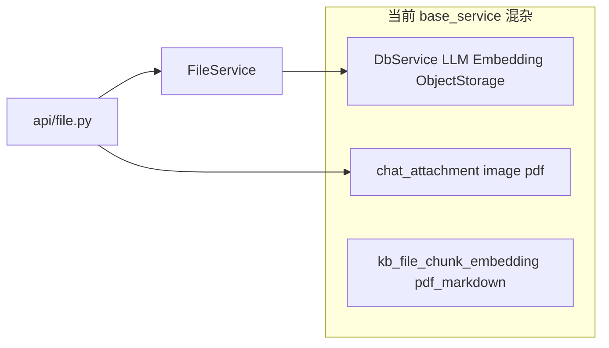

# 文件上传与 `base_service` 分层整改计划

## 现状问题

[`app/services/base_service/__init__.py`](backend/app/services/base_service/__init__.py) 将目录定义为「基础设施服务」（外部系统、DB、存储、Embedding、LLM）。但实际还包含大量**业务域**代码：

| 模块 | 职责 | 与「基础设施」的关系 |
|------|------|----------------------|
| [`chat_attachment_service.py`](backend/app/services/base_service/chat_attachment_service.py) | 用户上传目录、文件名校验、预览 URL、`save_chat_attachment` 分发 | 业务：对话附件契约 |
| [`chat_image_service.py`](backend/app/services/base_service/chat_image_service.py) | PIL 缩放/编码等 | 业务 |
| [`chat_pdf_service.py`](backend/app/services/base_service/chat_pdf_service.py) | PDF 落盘、转 Markdown、调用 KB 分块索引 | 业务 + RAG |
| [`pdf_markdown_converter.py`](backend/app/services/base_service/pdf_markdown_converter.py) | PDF→MD 转换 | 业务/工具 |
| [`kb_file_chunk_embedding_service.py`](backend/app/services/base_service/kb_file_chunk_embedding_service.py) | 分块写入 `kb_file_chunk_embeddings` | 业务 + DB |

[`app/api/file.py`](backend/app/api/file.py) 中：

- **聊天附件**（`/upload`、`/preview/...`）依赖上述 `chat_*` 链。
- **头像**（`/upload_avatar`）依赖 [`FileService`](backend/app/services/base_service/file_service.py)，内部仅用 [`ObjectStorageService`](backend/app/services/base_service/object_storage_service.py) + 临时文件，更符合「基础设施 + 薄编排」，留在 `base_service` 合理。

**引用面（迁出后需统一改 import）：**

- API：[`app/api/file.py`](backend/app/api/file.py)
- 工具：[`app/utils/multimodal.py`](backend/app/utils/multimodal.py)（`user_upload_file_path`）
- 对话 RAG：[`app/services/chat/kb_rag_context_service.py`](backend/app/services/chat/kb_rag_context_service.py)（`get_user_upload_dir`）
- 测试：[`tests/test_pdf_markdown_flow.py`](backend/tests/test_pdf_markdown_flow.py)（mock 路径需同步）

**注意：** `save_chat_attachment` 内对 `chat_image` / `chat_pdf` 使用**函数内延迟 import**，迁包后需保留该模式，避免循环依赖。

---

## 目标结构（推荐）

新建独立包，与 [`AGENTS.md`](backend/AGENTS.md) 中「按领域分包」一致，且避免与 [`app/utils/file.py`](backend/app/utils/file.py) 在命名上混淆：

**推荐包名：`app/services/chat_upload/`**（表示「对话场景下的上传与处理」，不包含头像 COS 流程）

建议模块划分（文件名可按团队习惯微调）：

- `attachment.py` — 由原 `chat_attachment_service.py` 迁入（路径、校验、预览 URL、`save_chat_attachment`）
- `image.py` — 原 `chat_image_service.py`
- `pdf.py` — 原 `chat_pdf_service.py`
- `pdf_markdown_converter.py` — 原样迁入或略改名
- `kb_chunk_embedding.py` — 原 `kb_file_chunk_embedding_service.py`（可选缩短文件名）

`base_service` **保留**：`db_service`、`embedding_service`、`llm_service`、`object_storage_service`、`file_service`（头像），以及 `__init__.py` 中对外导出列表与现状一致（仅去掉已迁出的模块引用）。

**路径常量：** `chat_attachment_service` 里 `_BACKEND_ROOT = Path(__file__).resolve().parents[3]` 在迁入 `app/services/chat_upload/attachment.py` 后，**目录深度不变**（仍为 backend 根），一般无需改计算方式；迁包后做一次本地路径冒烟（上传 + 预览）即可确认。

---

## 头像 `FileService` 的两种处理方式（选其一）

| 方案 | 做法 | 适用 |
|------|------|------|
| A（改动小） | `FileService` 继续放在 `base_service/file_service.py`，仅改 import 为 `from app.services.chat_upload...`（若 pdf 仍依赖 embedding 等，注意单向依赖：chat_upload → base_service 允许） | 快速落地 |
| B（更贴领域） | 将 `upload_avatar` 迁到例如 `app/services/user/avatar_service.py`，`FileService` 类可删除或变薄；`base_service` 只暴露 `ObjectStorageService` | 用户域更清晰 |

整改第一阶段建议 **方案 A**，减少并行重构面；若后续用户模块已有清晰边界，再执行 B。

---

## 实施步骤（建议顺序）

1. **新建** `app/services/chat_upload/` 与 `__init__.py`（可显式 `__all__` 导出对外 API，便于其它层引用）。
2. **移动** 上述 5 个业务文件到新包，**批量修正** 包内互引与对外 import（`app.services.base_service.chat_*` → `app.services.chat_upload.*`）。
3. **更新** `api/file.py`、`multimodal.py`、`kb_rag_context_service.py` 及 `tests/test_pdf_markdown_flow.py` 中的导入路径；测试中 monkeypatch 的模块字符串（如 `app.services.base_service.pdf_markdown_converter`）改为新路径。
4. **删除** `base_service` 下已迁走的旧文件（或在一版内保留薄 shim `from app.services.chat_upload.xxx import *` 以兼容外部 fork——若仓库无此类需求可直接删）。
5. **运行** `make lint`、`make test`（至少包含 `tests/test_pdf_markdown_flow.py` 与 `tests/test_multimodal_kb_rag.py` 若存在相关用例），必要时 `make check`。
6. **文档**：若团队维护架构说明，在 [`backend/AGENTS.md`](backend/AGENTS.md) 的 `services/` 结构小节增加一行「`chat_upload/`：对话附件上传与 PDF/KB 处理」即可（非必须，按你们文档规范）。

---

## 风险与约束

- **循环依赖：** 保持 `attachment.save_chat_attachment` 内延迟 import；`pdf` 模块若依赖 `embedding_service` / DB，应单向：`chat_upload` → `base_service` / `models`，避免 `base_service` 再 import `chat_upload`。
- **搜索遗漏：** 全仓库 `rg "base_service\.(chat_|kb_file|pdf_markdown)"` 复查。
- **命名冲突：** 避免新建 `app/services/file/` 与 `app/utils/file` 在口头沟通中混淆；`chat_upload` 更不易歧义。

---

## 验收标准

- `base_service` 不再包含 `chat_*`、`kb_file_chunk_embedding`、`pdf_markdown_converter` 等业务文件。
- `/api/file/upload`、预览、PDF 流程与 KB 索引行为与迁包前一致（测试通过 + 手动上传一轮）。
