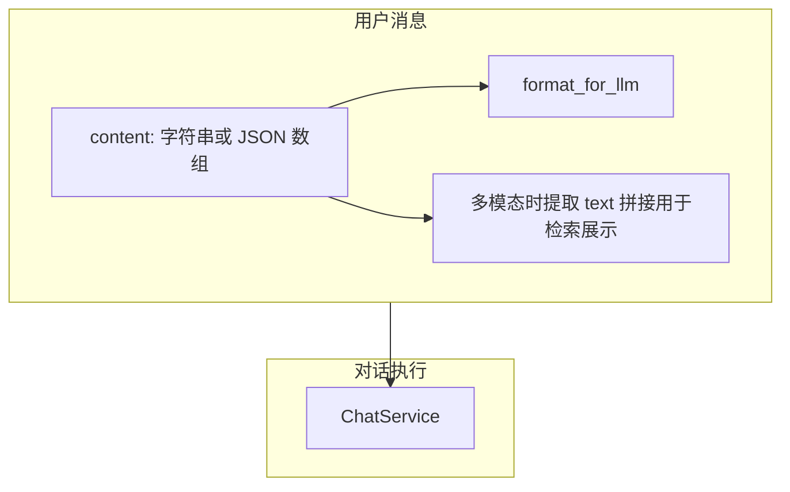

# 用户问题支持图片、文件消息

## 一、现状分析

### 1.1 用户消息（content）现状

- **存储**：`[app/models/message_db.py](app/models/message_db.py)` 中 `content: str` 仅支持纯文本
- **API**：`[app/schemas/chat.py](app/schemas/chat.py)` 的 `ChatRequest.content: str`、`[app/api/chat.py](app/api/chat.py)` 直接接收 JSON body
- **已有能力**：项目已有 [FileService](app/services/base_service/file_service.py)（头像上传到 COS）、`[app/api/file.py](app/api/file.py)`

---

## 二、设计方案

### 2.1 用户消息：支持多模态内容

采用 **Content Parts 语义**（对齐 OpenAI 多模态消息格式），**序列化进单一字段 `content`**：纯文本仍为字符串；多模态时为 JSON 数组 `[ContentPart, ...]`。**不新增 `content_parts` 列**。

#### 2.1.1 数据模型

```python
class FileObject(BaseModel):
    conversation_id: str = Field(..., description="对话 ID")
    filename: str = Field(..., description="文件名")
    stored_filename: str = Field(..., description="存储文件名")
    mime_type: str = Field(..., description="文件 MIME 类型")
    virtual_path: str = Field(..., description="虚拟路径")
    artifact_url: str = Field(..., description="文件 URL")
    markdown_file: str | None = Field(None, description="Markdown 文件")
    markdown_virtual_path: str | None = Field(None, description="Markdown 虚拟路径")
    markdown_artifact_url: str | None = Field(None, description="Markdown 文件 URL")


# 新增 schema（[app/schemas/content.py](app/schemas/content.py)）
class TextContentPart(BaseModel):
    type: Literal["text"]
    text: str

class ImageContentPart(BaseModel):
    type: Literal["image"]
    image: FileObject

class FileContentPart(BaseModel):
    type: Literal["file"]
    file: FileObject

ContentPart = TextContentPart | ImageContentPart | FileContentPart
```

#### 2.1.2 MessageDb 表结构变更


| 字段        | 变更                                                                                                                                         |
| --------- | ------------------------------------------------------------------------------------------------------------------------------------------ |
| `content` | **保留**列名不变；语义扩展为 **字符串或 JSON**：纯文本时为普通字符串；多模态时为 JSON 序列化后的 `[ContentPart, ...]`（纯文本等价亦可表示为 `[{"type":"text","text":"..."}]`，由实现约定是否统一归一化）。 |


**数据迁移**：

- 存量数据：无需迁列；原有纯文本 `content` 保持不变。
- **应用层读写时区分字符串与 JSON**（多模态内容以 JSON 字符串写入同一列；数据库列保持现有字符串类型即可）。
- 检索与展示：若 `content` 解析为 JSON 数组，则提取所有 `type="text"` 的 `text` 拼接；若为普通字符串则直接使用。

#### 2.1.3 API 与存储

- **ChatRequest**：`content` 支持 **字符串** 或 **多模态数组**（`list[ContentPart]` / 与前端约定的 JSON）；纯文本沿用字符串即可。
- **LLM 调用**：在 `format_chat_message_for_llm` 等逻辑中，若 `content` 为多模态数组则转为 OpenAI 所需的 `content: list[dict]`；若为字符串则保持单段文本消息格式。

#### 2.1.4 文件/图片存储与上传（按 conversation_id 隔离）

所有用户上传的图片、PDF、文档等均存于 `uploads` 目录，无单独目录区分。

**路径规范**（路径中与落盘文件名一致的一段使用 `**stored_filename`**，避免与用户原始 `filename` 混淆）：


| 用途             | 路径                                                                                       |
| -------------- | ---------------------------------------------------------------------------------------- |
| 物理路径           | `data/conversations/{conversation_id}/user-data/uploads/{stored_filename}`               |
| 虚拟路径（Agent 使用） | `/mnt/user-data/uploads/{stored_filename}`                                               |
| HTTP 访问        | `/api/conversations/{conversation_id}/artifacts/mnt/user-data/uploads/{stored_filename}` |


**图片处理**：以原始格式保存，不做 Markdown 转换。上传成功后返回 **FileObject**（与 2.1.1 字段一致），示例：

```json
{
  "conversation_id": "{conversation_id}",
  "filename": "photo.png",
  "stored_filename": "7f3a2b1c.png",
  "mime_type": "image/png",
  "virtual_path": "/mnt/user-data/uploads/7f3a2b1c.png",
  "artifact_url": "/api/conversations/{conversation_id}/artifacts/mnt/user-data/uploads/7f3a2b1c.png",
  "markdown_file": null,
  "markdown_virtual_path": null,
  "markdown_artifact_url": null
}
```

**PDF / 文档处理**：

1. **存储**：原始文件保存到 `uploads` 目录，文件名为 `stored_filename`
2. **自动转 Markdown**：使用 markitdown（基于 pdfminer、pdfplumber）转为 `.md`，保存于同一 `uploads` 目录；**Markdown 文件名与 `stored_filename` 同主名**（如 `9e4d8c2a.pdf` → `9e4d8c2a.md`）
3. **失败处理**：转换失败时仅保留原始文件，不生成 `.md`，此时 `markdown_file` / `markdown_virtual_path` / `markdown_artifact_url` 均为 `null`
4. **返回结构**（上传成功后返回前端，**FileObject**）：

```json
{
  "conversation_id": "{conversation_id}",
  "filename": "document.pdf",
  "stored_filename": "9e4d8c2a.pdf",
  "mime_type": "application/pdf",
  "virtual_path": "/mnt/user-data/uploads/9e4d8c2a.pdf",
  "artifact_url": "/api/conversations/{conversation_id}/artifacts/mnt/user-data/uploads/9e4d8c2a.pdf",
  "markdown_file": "9e4d8c2a.md",
  "markdown_virtual_path": "/mnt/user-data/uploads/9e4d8c2a.md",
  "markdown_artifact_url": "/api/conversations/{conversation_id}/artifacts/mnt/user-data/uploads/9e4d8c2a.md"
}
```

前端将完整 **FileObject**（图片/文件 part 中的 `image` / `file`）拼入 `content` 的多模态 JSON（ContentPart 数组）；展示用 `filename`，请求资源用 `artifact_url` / `markdown_artifact_url`（路径均基于 `stored_filename`）。

---

## 三、数据迁移策略

### 3.1 Alembic 迁移

1. **扩展 `content` 承载能力**（不新增 `content_parts`）
  - 数据库列类型不强制变更；**应用层读写时区分字符串与 JSON**（多模态以 JSON 字符串写入同一列）。
  - 存量数据：保持现有纯文本行不变；新写入的多模态数据以 JSON 形式存入同一列。

### 3.2 影响范围（需修改的文件）


| 模块     | 文件                                          | 变更要点                                                                                      |
| ------ | ------------------------------------------- | ----------------------------------------------------------------------------------------- |
| 模型     | `app/models/message_db.py`                  | `content` 支持字符串或 JSON（序列化/反序列化或 Union 类型）                                                 |
| Schema | `app/schemas/content.py`                    | ContentPart（新建）                                                                           |
| Schema | `app/schemas/chat.py`                       | ChatRequest、ChatMessageItem、CollectedResponse：`content` 可为 str 或多模态结构                     |
| 消息服务   | `app/services/message/message_db.py`        | 读写 `content`、create_user_message 支持多模态                                                    |
| 对话服务   | `app/services/chat/chat_service.py`         | 用户消息路径解析 `content`（字符串 vs JSON）                                                           |
| 工具     | `app/utils/message.py`                      | format_chat_message_for_llm 支持多模态 `content`                                               |
| API    | `app/api/chat.py`、`app/api/conversation.py` | Chat 接收扩展后的 `content`；新增 `POST /api/conversations/{id}/uploads` 及 `GET .../artifacts/...` |
| 历史     | `app/utils/history_truncate.py`             | token 计算考虑多模态 `content`                                                                   |


---

## 四、架构示意




---

## 五、实施顺序建议

1. **Phase 1**：多模态用户消息（复用 `content`）
  - ContentPart schema；**无需** Alembic 改列类型，依赖应用层解析字符串与 JSON
  - 扩展 ChatRequest、消息读写、`format_for_llm`（字符串与 JSON 数组分支）
  - 实现 2.1.4 文件/图片上传（按 conversation 隔离、PDF 转 Markdown、artifact 访问）
2. **Phase 2**：清理与优化
  - 统一归一化策略（例如是否将纯文本统一为单段 text part，可选）
  - 更新 token 统计、历史截断逻辑以支持多模态 `content`
