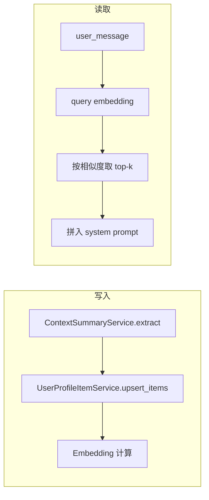

# 用户画像事实/偏好语义检索方案

## 现状与目标

- **现状**：`[UserProfileDb](app/models/user_profile_db.py)` 使用 `facts`、`preferences` 两个 JSON 数组存储；`[_build_user_context_system_fragment](app/prompts/prompt_utils.py)` 在生成回答时一次性读入全部事实与偏好并拼入 system prompt。
- **问题**：事实/偏好多时 token 增加；部分内容与当前 query 无关。
- **目标**：单条存储（text + type）+ embedding；按 query 做语义检索，只注入 top-k 相关项。

## 架构概览

- **写入**：归纳得到 facts/preferences 列表后，按条写入新表并计算、落库 embedding。
- **读取**：用当前 `user_message` 做 query，embed 后与对应用户的条目做相似度检索，取 top-k 再拼入 prompt。

## 一、数据模型

### 1. 新表 `user_profile_items`

- **表名**：`user_profile_items`
- **字段**：
  - `id`：主键（UUID 或自增）
  - `user_id`：用户 ID，与 `user_profiles.user_id` 一致，建索引
  - `text`：TEXT，单条事实或偏好内容
  - `type`：SMALLINT，1=事实(fact)，2=偏好(preference)
  - `embedding`：语义向量。当前项目未使用 pgvector，建议用 **JSONB 存 float 数组**（如 `[0.1, -0.2, ...]`），便于迁移与多数据库兼容；若后续引入 pgvector 可再加向量列并建索引
  - `created_at`：可选，便于排序与排查
- **约束**：建议对 `(user_id, text, type)` 做 UNIQUE，避免重复插入同一条。

### 2. 与现有 `user_profiles` 的关系

- 保留 `user_profiles` 表（仍可保留 `updated_at` 等），**不再使用** `facts`/`preferences` 字段的读写逻辑。
- 所有“按条”的读写均走 `user_profile_items`；`user_profiles` 可在后续迁移中删除 `facts`/`preferences` 列或整表收缩，本方案不依赖这两列。

## 二、嵌入与检索

- **模型**：与现有 [ContextCompactor](app/utils/context_compactor.py) 一致，使用 `settings.embedding_model`（DashScopeEmbeddings），保证与知识库/压缩逻辑同一套 embedding 空间。
- **写入时**：每条 `text` 写入前调用 embedding 接口得到向量，存入 `embedding`。
- **检索时**：
  - 用当前 **user_message** 作为 query，调用同一 embedding 得到 query 向量。
  - 仅加载该 **user_id** 下的所有 `user_profile_items`（条数通常不多），在应用内计算 query 与各条 `embedding` 的相似度（如余弦或点积）。
  - 按相似度排序，分别取 **facts（type=1）** 与 **preferences（type=2）** 的 top-k（如各 5 条或总共 10 条，可配置），再拼成「已知用户事实」「用户偏好」两段注入 system prompt。

**为何不用 FAISS/Chroma 存用户画像**：每条按 user_id 过滤后数据量小，直接查 DB 并在内存中算相似度即可，实现简单、无额外组件；若以后数据量变大再考虑 pgvector 或独立向量库。

## 三、调用链改动

### 1. 生成 system prompt 时传入 query

- `[get_system_prompt_for_response_generation](app/prompts/prompt_utils.py)` 增加参数 `**user_message: str | None = None**`。
- 其内部调用的 `**_build_user_context_system_fragment**` 增加参数 `**query: str | None = None**`，并将 `user_message` 传入为 `query`。
- 在 [ResponseGenerationAgent.stream_execute](app/agents/response_generation_agent.py) 中，已有 `user_message`，调用时传入：
`get_system_prompt_for_response_generation(..., user_message=user_message)`。

这样，只有在「响应生成」阶段会做语义检索，且用的是用户当前输入，与现有流程一致。

### 2. `_build_user_context_system_fragment` 内逻辑

- 若 `query` 为空或未传：可 **回退**为「不注入事实/偏好」或「仅注入会话摘要」；如需兼容旧逻辑，也可临时按 user_id 拉取全部 items 注入（不推荐长期保留）。
- 若 `query` 非空：
  - 调用新服务：**按 user_id + query 做语义检索**，得到两条列表：`relevant_facts`、`relevant_preferences`。
  - 用与当前相同的文案格式拼成「已知用户事实」「用户偏好」两段，拼入 system 片段；会话摘要（user_context）逻辑不变。

## 四、服务层

### 1. 新建 `UserProfileItemService`（或放在现有 UserProfileService 内）

- **add_item(user_id, text, type)**：插入一条，并计算 embedding 写入。若存在 `(user_id, text, type)` 则跳过或更新（upsert）。
- **get_relevant_items(user_id, query, top_k_facts, top_k_preferences)**：
  - 用配置的 embedding 模型对 `query` 做一次 embed；
  - 从 DB 取出该 user_id 下所有 `user_profile_items`（embedding 非空）；
  - 在内存中计算 query 与每条 embedding 的相似度，按 type 分组取 top-k，返回 `(list[str], list[str])`，供 prompt 拼接。
- **batch_upsert_items(user_id, facts, preferences)**：供归纳逻辑调用，对 `facts`/`preferences` 列表逐条 add_item（内部去重可用 unique 约束或先查再插）。

### 2. Embedding 复用

- 在服务内依赖 `settings.embedding_model`，实例化与 [ContextCompactor](app/utils/context_compactor.py) 相同的 embedding 客户端（如 DashScopeEmbeddings）。
- 单条/多条文本用 `embed_documents([...])`，query 用 `embed_query(query)`，维度与现有压缩/检索一致。

### 3. 写入端改造（归纳后落库）

- 当前 [chat_service 异步摘要](app/services/chat/chat_service.py) 中：
`ContextSummaryService.extract_user_facts_preferences` 得到 `(facts, preferences)`，再调用 `UserProfileService.upsert_user_profile(user_id, facts=..., preferences=...)` 整表覆盖。
- **改为**：
调用 **UserProfileItemService.batch_upsert_items(user_id, facts, preferences)**，不再写 `user_profiles.facts/preferences`。
`batch_upsert_items` 内对每条 `text` + `type` 做 upsert 并写入 embedding。

## 五、数据迁移与兼容

### 1. Alembic 迁移

- 新增表 `user_profile_items`（上述字段 + unique 约束）。
- 可选：在同一个或后续迁移中，将现有 `user_profiles` 中 `facts`/`preferences` 的既有数据迁移到 `user_profile_items`（每条一条记录，type 1/2），此时 `embedding` 可为 NULL。

### 2. 未 backfill 的 embedding

- 若迁移后部分行为 `embedding IS NULL`：
  - **方案 A**：检索时只参与「有 embedding 的条」做相似度排序；未 backfill 的条本轮不注入，后台或定时任务再补算 embedding。
  - **方案 B**：在 `get_relevant_items` 中，若发现某条为 NULL，则当场计算 embedding 并 update 该行，再参与本次排序（懒 backfill）。
- 推荐 **方案 B**，实现简单且逐步补齐数据。

### 3. 旧列处理

- 不再读写 `user_profiles.facts`/`user_profiles.preferences` 后，可在后续版本用迁移删除这两列，或保留仅作备份直至确认无需求。

## 六、配置与安全

- **top-k**：建议在配置中增加项（如 `user_profile.top_k_facts`、`user_profile.top_k_preferences`，默认各 5），便于按 token 预算调整。
- **无结果**：当某用户没有任何 items 或检索后列表为空时，与现在行为一致，不追加「已知用户事实」「用户偏好」段落即可。
- **性能**：按 user_id 过滤后行数有限，单次检索只做一次 query embed + 内存排序，延迟可控；若以后单用户条数很大，再考虑 pgvector 或分页/截断。

## 七、实现顺序建议

1. **模型与迁移**：新增 `UserProfileItem` 模型与 `user_profile_items` 表，Alembic 迁移；可选：迁移旧 `facts`/`preferences` 到新表（embedding 先为 NULL）。
2. **Embedding 与检索**：封装「单条/query embed」与「按 user_id 取条 + 相似度排序」逻辑，实现 `UserProfileItemService.get_relevant_items` 与 `add_item`/`batch_upsert_items`。
3. **Prompt 与调用链**：`get_system_prompt_for_response_generation` 与 `_build_user_context_system_fragment` 增加 `user_message`/`query`，在 fragment 内调用 `get_relevant_items` 并拼装两段文案；ResponseGenerationAgent 传入 `user_message`。
4. **写入端**：chat_service 中归纳后改为调用 `batch_upsert_items`，不再调用 `upsert_user_profile(..., facts=..., preferences=...)`。
5. **配置与 backfill**：增加 top-k 配置；对 embedding 为 NULL 的条实现懒 backfill 或一次性脚本。

按上述顺序即可在不大改现有对话流程的前提下，实现「按 query 语义检索、只注入相关事实/偏好」的目标，并控制 token、提高相关性。
