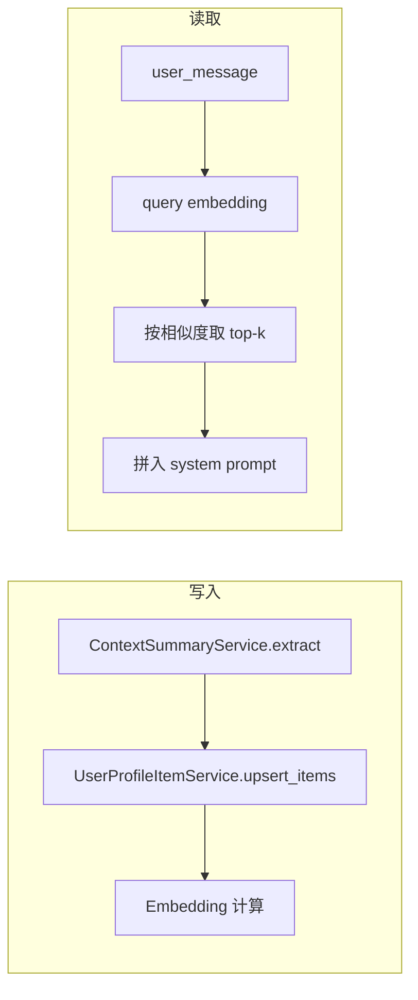

# 用户画像事实/偏好语义检索方案

## 现状与目标

- **现状**：`[UserProfileDb](app/models/user_profile_db.py)` 使用 `facts`、`preferences` 两个 JSON 数组存储；`[_build_user_context_system_fragment](app/prompts/prompt_utils.py)` 在生成回答时一次性读入全部事实与偏好并拼入 system prompt。
- **问题**：事实/偏好多时 token 增加；部分内容与当前 query 无关。
- **目标**：单条存储（text + type）+ embedding；按 query 做语义检索，只注入 top-k 相关项。

## 可行性评估

- **核心优势**：精准控 Token（全量→动态检索）、相关性提升（语义优于关键词）、架构解耦（独立表便于 pgvector/多模态）、渐进迁移（双表并存可灰度）。
- **需重点关注的约束**：
  - **延迟**：Query 时 1 次 Embedding API + DB 查询 + 内存计算，可接受（&lt;200ms），需考虑 Embedding 超时降级。
  - **成本**：每条事实/偏好写入时都调 Embedding API，需预估用户增长与批量归纳时的集中调用。
  - **一致性**：`(user_id, text, type)` UNIQUE 在 text 较长时易冲突，建议对 text 做归一化（去空格/小写）或对归一化结果做 hash 后建唯一索引。
  - **冷启动**：新用户或刚迁移数据无 embedding，采用懒 backfill，并需防止并发重复计算。

## 架构概览

- **写入**：归纳得到 facts/preferences 列表后，按条写入新表并计算、落库 embedding。
- **读取**：用当前 `user_message` 做 query，embed 后与对应用户的条目做相似度检索，取 top-k 再拼入 prompt。

## 一、数据模型

### 1. 新表 `user_profile_items`

- **表名**：`user_profile_items`
- **字段**：
  - `id`：主键（UUID 或自增）
  - `user_id`：用户 ID，与 `user_profiles.user_id` 一致，建索引
  - `text`：TEXT，单条事实或偏好内容
  - `type`：SMALLINT，1=事实(fact)，2=偏好(preference)
  - `embedding`：语义向量。当前项目未使用 pgvector，建议用 **JSONB 存 float 数组**（如 `[0.1, -0.2, ...]`），便于迁移与多数据库兼容；若后续引入 pgvector 可再加向量列并建索引
  - `**embedding_model**`：VARCHAR(50)，记录向量对应的模型版本（如 `dashscope-text-embedding-v2`），检索时只使用与当前配置一致的数据；模型升级时需触发全量或渐进重算（**P0**）
  - `**confidence**`：FLOAT，可选。事实提取的置信度（如 0.95），低置信度条目在重排时可降权（**P2**）
  - `**source_msg_id**`：VARCHAR(100)，可选。溯源：从哪条消息提取，便于修正（**P2**）
  - `created_at`：写入时间，便于排序与排查
  - `**updated_at**`：TIMESTAMP，最后更新时间，用于时序召回与清理冷数据
  - `**is_active**`：BOOLEAN DEFAULT true，软删除，而非物理删除
- **约束**：对 **归一化后的唯一键** 做 UNIQUE，避免长 text 导致约束失效。建议对 `text` 做归一化（去首尾空格、可选小写）后计算 `text_normalized_hash`（如 SHA256 前 64 字符），对 `(user_id, text_normalized_hash, type)` 建 UNIQUE；或直接对 `(user_id, text, type)` 建 UNIQUE 并约定写入前归一化。

### 2. 与现有 `user_profiles` 的关系

- 保留 `user_profiles` 表（仍可保留 `updated_at` 等），**不再使用** `facts`/`preferences` 字段的读写逻辑。
- 所有“按条”的读写均走 `user_profile_items`；`user_profiles` 可在后续迁移中删除 `facts`/`preferences` 列或整表收缩，本方案不依赖这两列。

## 潜在风险与应对

| 风险                                                        | 应对                                                                                |
| --------------------------------------------------------- | --------------------------------------------------------------------------------- |
| **Embedding 模型一致性**：更换模型后新旧向量语义空间不同，检索质量骤降                | 表中增加 `embedding_model` 字段；检索时只使用与当前配置一致的数据；模型升级时触发全量或渐进重算（**P0**）                 |
| **“相关但不相关”**：如用户问“今天天气怎样”却召回“用户住在北京”，浪费 Token             | 引入**相关性阈值**：余弦相似度低于阈值（如 0.7，可配置）的条目不注入（**P0**）；可选按类别标签先规则过滤再语义排序                  |
| **并发写入冲突**：异步摘要多次触发导致重复计算 embedding 或违反唯一约束               | 使用数据库 **ON CONFLICT DO UPDATE** 做 UPSERT；对同一用户的归纳任务做队列串行化或分布式锁，避免并发写入相同条目（**P0**） |
| **长文本截断**：部分 Embedding 模型有输入长度限制（如 512 tokens），超长被截断后语义丢失 | 写入前检查 text 长度，超长时做截断或语义分割/摘要压缩；可选增加 `text_hash` 或 `original_text` 便于调试（**P1**）    |

## 二、嵌入与检索

- **模型**：与现有 [ContextCompactor](app/utils/context_compactor.py) 一致，使用 `settings.embedding_model`（DashScopeEmbeddings），保证与知识库/压缩逻辑同一套 embedding 空间；写入时将当前模型名写入 `embedding_model`，检索时仅使用 `embedding_model` 与当前配置一致的行。
- **写入时**：每条 `text` 写入前做长度检查（超长截断或分割），调用 embedding 接口得到向量，存入 `embedding` 与 `embedding_model`。
- **检索时**：
  - 用当前 **user_message** 作为 query，调用同一 embedding 得到 query 向量（可加**超时**，超时则进入降级）。
  - 仅加载该 **user_id** 下、`embedding_model` 匹配且 `is_active=true` 的 `user_profile_items`，在应用内计算 query 与各条 `embedding` 的相似度（余弦或点积）。
  - **相关性阈值**：相似度低于配置阈值（如 0.7）的条目不参与注入，避免“相关但不相关”（**P0**）。
  - 按相似度排序，分别取 **facts（type=1）** 与 **preferences（type=2）** 的 top-k（如各 5 条，可配置），再拼成「已知用户事实」「用户偏好」两段注入 system prompt。

**为何不用 FAISS/Chroma 存用户画像**：按 user_id 过滤后数据量小，直接查 DB 并在内存中算相似度即可，实现简单、无额外组件；若以后数据量变大再考虑 pgvector 或独立向量库。

### 分层检索策略（P1 强烈建议）

在“单路语义 top-k”基础上增加**时序补偿**，避免刚更新的偏好被语义过滤掉：

1. **语义召回**：按相似度取 `top_k * 2` 条候选。
2. **时序补偿**：最近 N 条（如 3 条，按 `updated_at`）强制加入候选，排除已在语义候选中的 id。
3. **去重与重排**：合并后按相似度重排，取最终 top_k；可选对低 `confidence` 条目降权（P2）。

### 降级方案（P1）

在 `get_relevant_items` 中实现多级降级，保证主链路可用：

1. **正常**：语义检索 + 阈值过滤 + 可选时序补偿，注入 top-k。
2. **Embedding 服务超时/异常**：降级为按 `updated_at` 取最近 N 条，或无画像注入（与无结果表现一致）。
3. **DB 异常**：不注入任何画像，保证响应生成不因画像失败而失败。

### 长文本处理（P1）

- 写入前检查 `text` 长度（按字符或 token）；超过模型限制（如 512 tokens）时：截断并写入，或做语义分割为多条写入；可选记录 `original_text` 或 `text_hash` 便于调试。

## 三、调用链改动

### 1. 生成 system prompt 时传入 query

- `[get_system_prompt_for_response_generation](app/prompts/prompt_utils.py)` 增加参数 `**user_message: str | None = None**`。
- 其内部调用的 `**_build_user_context_system_fragment**` 增加参数 `**query: str | None = None**`，并将 `user_message` 传入为 `query`。
- 在 [ResponseGenerationAgent.stream_execute](app/agents/response_generation_agent.py) 中，已有 `user_message`，调用时传入：
`get_system_prompt_for_response_generation(..., user_message=user_message)`。

这样，只有在「响应生成」阶段会做语义检索，且用的是用户当前输入，与现有流程一致。

### 2. `_build_user_context_system_fragment` 内逻辑

- 若 `query` 为空或未传：可 **回退**为「不注入事实/偏好」或「仅注入会话摘要」；如需兼容旧逻辑，也可临时按 user_id 拉取全部 items 注入（不推荐长期保留）。
- 若 `query` 非空：
  - 调用新服务：**按 user_id + query 做语义检索**，得到两条列表：`relevant_facts`、`relevant_preferences`。
  - 用与当前相同的文案格式拼成「已知用户事实」「用户偏好」两段，拼入 system 片段；会话摘要（user_context）逻辑不变。

## 四、服务层

### 1. 新建 `UserProfileItemService`（或放在现有 UserProfileService 内）

- **add_item(user_id, text, type, ...)**：插入一条，写入前对 text 做归一化与长度检查；计算 embedding 并写入 `embedding`、`embedding_model`。使用数据库 **ON CONFLICT DO UPDATE**（基于 `(user_id, text_normalized_hash, type)` 或 `(user_id, text, type)`）做 upsert，避免先查后插的竞态（**P0**）。
- **get_relevant_items(user_id, query, top_k_facts, top_k_preferences)**：
  - 对 query 做一次 embed（可加超时）；超时/异常则降级为按 `updated_at` 取最近 N 条或不注入（**P1**）。
  - 从 DB 取出该 user_id 下、`embedding_model` 与当前配置一致且 `is_active=true` 的 items；对 `embedding IS NULL` 的条做**懒 backfill**（当场计算并 update），需加**并发控制**：对同一 user_id 的 backfill 用分布式锁或进程内锁，避免同一行被多请求重复计算（**P0**）。
  - 在内存中计算 query 与每条 embedding 的相似度，**过滤掉相似度低于阈值的条目**（**P0**）；按 type 分组取 top-k；若采用分层检索，则先语义取 top_k*2，再补最近 N 条，去重重排后取最终 top_k（**P1**）。
  - 返回 `(list[str], list[str])`，供 prompt 拼接。
- **batch_upsert_items(user_id, facts, preferences)**：供归纳逻辑调用，对列表逐条 add_item；对**同一用户的归纳任务做队列串行化或分布式锁**，避免并发写入相同条目导致重复计算与唯一约束冲突（**P0**）。

### 2. Embedding 复用与缓存（P2 可选）

- 在服务内依赖 `settings.embedding_model`，实例化与 [ContextCompactor](app/utils/context_compactor.py) 相同的 embedding 客户端（如 DashScopeEmbeddings）。
- 单条/多条文本用 `embed_documents([...])`，query 用 `embed_query(query)`，维度与现有压缩/检索一致。
- **Query Embedding 缓存**：用户连续提问时，若 query 与上一轮相似（如编辑距离或 embedding 相似度），可复用上一轮 query vector，减少 API 调用（**P2**）。
- **用户画像缓存**：单用户 items 通常 &lt;100 条，可缓存在 Redis（TTL 如 5 分钟），减少 DB 压力（**P2**）。

### 3. 写入端改造（归纳后落库）

- 当前 [chat_service 异步摘要](app/services/chat/chat_service.py) 中：
`ContextSummaryService.extract_user_facts_preferences` 得到 `(facts, preferences)`，再调用 `UserProfileService.upsert_user_profile(user_id, facts=..., preferences=...)` 整表覆盖。
- **改为**：
调用 **UserProfileItemService.batch_upsert_items(user_id, facts, preferences)**，不再写 `user_profiles.facts/preferences`。
`batch_upsert_items` 内对每条 `text` + `type` 做 **ON CONFLICT DO UPDATE** 的 upsert 并写入 embedding；归纳任务按 user 串行化或加锁，避免并发冲突。

## 五、数据迁移与兼容

### 1. Alembic 迁移

- 新增表 `user_profile_items`（含 id、user_id、text、type、embedding、embedding_model、created_at、updated_at、is_active，以及可选 confidence、source_msg_id、text_normalized_hash；unique 约束基于归一化后唯一键）。
- 可选：在同一个或后续迁移中，将现有 `user_profiles` 中 `facts`/`preferences` 的既有数据迁移到 `user_profile_items`（每条一条记录，type 1/2），此时 `embedding`、`embedding_model` 可为 NULL，由懒 backfill 或脚本补齐。

### 2. 未 backfill 的 embedding

- 若迁移后部分行为 `embedding IS NULL`：
  - **方案 A**：检索时只参与「有 embedding 的条」做相似度排序；未 backfill 的条本轮不注入，后台或定时任务再补算 embedding。
  - **方案 B**：在 `get_relevant_items` 中，若发现某条为 NULL，则当场计算 embedding 并 update 该行，再参与本次排序（懒 backfill）。
- 推荐 **方案 B**，实现简单且逐步补齐数据；**懒 backfill 时需对同一 user_id 或同一行加锁**，防止并发重复计算（**P0**）。

### 3. 旧列处理

- 不再读写 `user_profiles.facts`/`user_profiles.preferences` 后，可在后续版本用迁移删除这两列，或保留仅作备份直至确认无需求。

## 六、配置与安全

- **top-k**：配置项（如 `user_profile.top_k_facts`、`user_profile.top_k_preferences`，默认各 5），便于按 token 预算调整。
- **相关性阈值**：配置项（如 `user_profile.relevance_threshold`，默认 0.7），余弦相似度低于该值的条目不注入（**P0**）。
- **无结果**：当某用户没有任何 items 或检索后列表为空时，与现在行为一致，不追加「已知用户事实」「用户偏好」段落即可。
- **性能**：按 user_id 过滤后行数有限，单次检索只做一次 query embed + 内存排序，延迟可控；若以后单用户条数很大，再考虑 pgvector 或分页/截断。

## 评估与监控

- **离线**：抽样人工标注「query–检索结果」的相关性，计算 NDCG@k，验证语义检索质量。
- **在线**：上线前建议小流量 **A/B 测试**，对比「全量注入」与「语义检索」的：
  - Token 消耗量（预期下降约 30–60%）
  - 用户满意度/任务完成率（不应下降）
  - 响应延迟 P99（含 Embedding 调用与 DB）
- **监控**：Embedding 超时率、降级触发次数、懒 backfill 冲突次数，便于发现模型/并发问题。

## 七、实现顺序建议

1. **模型与迁移**：新增 `UserProfileItem` 模型与 `user_profile_items` 表（含 `embedding_model`、`updated_at`、`is_active` 等）；Alembic 迁移；可选：迁移旧 `facts`/`preferences` 到新表（embedding 先为 NULL）；约定 text 归一化与唯一约束。
2. **写入端改造**：实现 `UserProfileItemService.add_item` / `batch_upsert_items`（ON CONFLICT DO UPDATE + 归纳任务串行化/锁）；chat_service 归纳后改为调用 `batch_upsert_items`，不再写 `user_profiles.facts/preferences`。
3. **检索逻辑**：封装「单条/query embed」与「按 user_id 取条 + 相似度排序 + 阈值过滤」；实现 `get_relevant_items`（含超时降级、懒 backfill 及 backfill 并发控制）；可选实现分层检索（语义 + 最近 N 条）。
4. **Prompt 集成**：`get_system_prompt_for_response_generation` 与 `_build_user_context_system_fragment` 增加 `user_message`/`query`，在 fragment 内调用 `get_relevant_items` 并拼装两段文案；ResponseGenerationAgent 传入 `user_message`。
5. **配置与 backfill**：增加 top-k、相关性阈值等配置；对 embedding 为 NULL 的条实现懒 backfill（含并发控制）或一次性脚本；长文本截断/分割（P1）。
6. **上线前**：小流量 A/B 测试验证检索质量与 Token/延迟；按需接入 P2（confidence、缓存、监控看板）。

### 修改建议清单（按优先级）

- **P0（必须）**：`embedding_model` 字段防模型混用；懒 backfill 与 batch_upsert 的并发控制（唯一约束 + ON CONFLICT DO UPDATE + 队列/锁）；检索结果相关性阈值过滤。
- **P1（强烈建议）**：分层检索（语义 + 时序）；Embedding 超时降级；长文本截断/预警。
- **P2（锦上添花）**：`confidence` 字段与低置信度降权；用户画像/query embedding 缓存（Redis）；可视化后台（某用户画像条目及相似度分布）。

按上述顺序即可在不大改现有对话流程的前提下，实现「按 query 语义检索、只注入相关事实/偏好」的目标，并控制 token、提高相关性，同时覆盖可行性、风险与优化建议。
