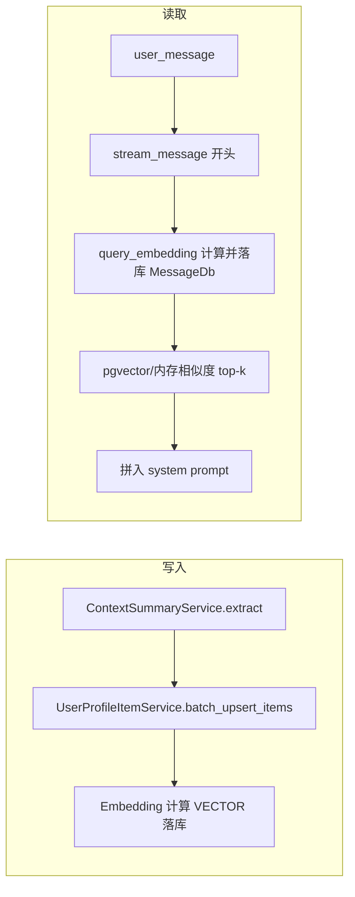

# 用户画像事实/偏好语义检索方案（最终版）

## 现状与目标

- **现状**：原 `UserProfileDb`（user_profiles 表）使用 `facts`、`preferences` 两个 JSON 数组存储；`_build_user_context_system_fragment` 在生成回答时一次性读入全部事实与偏好并拼入 system prompt。
- **问题**：事实/偏好多时 token 增加；部分内容与当前 query 无关。
- **目标**：单条存储（text + type）+ **pgvector VECTOR 存 embedding**；**MessageDb 增加 query_embedding/embedding_model**；**在 stream_message 开头生成并落库 query_embedding**；按 query 做语义检索只注入 top-k 相关项；**query 为空或未传时不注入事实/偏好**；**删除 user_profiles 表**，新建 user_profile_items，软删除用 **deleted_at**（datetime，有值=已删除）。

## 可行性评估

- **核心优势**：精准控 Token（全量→动态检索）、相关性提升（语义优于关键词）、架构解耦（独立表 + pgvector）、删除旧表简化模型。
- **需重点关注的约束**：
  - **延迟**：Query 时 1 次 Embedding API + DB 查询 + 内存/向量检索，可接受（<200ms），需考虑 Embedding 超时降级。
  - **成本**：每条事实/偏好写入时都调 Embedding API，需预估用户增长与批量归纳时的集中调用。
  - **一致性**：`(user_id, text, type)` 或归一化 hash 唯一；embedding_model 与当前配置一致才参与检索。
  - **冷启动**：新用户或刚迁移数据无 embedding，采用懒 backfill，并需防止并发重复计算。

## 架构概览

- **写入**：归纳得到 facts/preferences 后，按条写入 `user_profile_items`，embedding 用 **VECTOR** 存储。
- **读取**：在 **stream_message 开头**用当前 user_message 计算 query_embedding，写入对应用户消息的 MessageDb；若 query 非空则用 query/query_embedding 做语义检索，取 top-k 拼入 prompt；**query 为空或未传则不注入事实/偏好**。

---

## 一、数据模型

### 1. 启用 pgvector

- **依赖**：[pyproject.toml](pyproject.toml) 增加 `pgvector>=0.3.0`（或与当前环境兼容的版本）。
- **迁移**：在首条使用向量的迁移中执行 `op.execute("CREATE EXTENSION IF NOT EXISTS vector")`。
- **SQLAlchemy**：`from pgvector.sqlalchemy import Vector`，列类型 `Vector(维度)`，维度与 Embedding 模型一致（如 1536），可配置或写死在模型注释中。

### 2. MessageDb 新增字段（[app/models/message.py](app/models/message.py)）

- **query_embedding**：向量类型，对应 pgvector 的 `Vector(维度)`，可为 NULL；仅对用户消息有意义，在 stream_message 开头计算后写入。
- **embedding_model**：VARCHAR(64) 或等价，记录生成 query_embedding 的模型名，可为 NULL。
- 迁移：为表 `messages` 增加上述两列。

### 3. 新表 `user_profile_items`（替代 user_profiles）

- **表名**：`user_profile_items`。
- **字段**：
  - `id`：主键（UUID 或自增）
  - `user_id`：用户 ID，建索引
  - `text`：TEXT，单条事实或偏好内容
  - `type`：SMALLINT，1=事实(fact)，2=偏好(preference)
  - **embedding**：语义向量，使用 **pgvector 的 VECTOR(维度)** 存储
  - **embedding_model**：VARCHAR(50)，记录向量对应模型版本，检索时只使用与当前配置一致的数据（P0）
  - **deleted_at**：TIMESTAMP WITH TIME ZONE，**nullable**；有值表示删除时间，无值表示未删除（**不再使用 is_active**）
  - `created_at`、`updated_at`：写入与更新时间
  - 可选：confidence（P2）、source_msg_id（P2）、text_normalized_hash（唯一约束用）
- **约束**：对归一化后的唯一键建 UNIQUE（如 `(user_id, text_normalized_hash, type)`），避免长 text 冲突；可为 embedding 建 pgvector 索引（如 ivfflat）便于后续检索。

### 4. 删除 user_profiles 表

- **迁移**：`DROP TABLE IF EXISTS user_profiles;`
- **代码**：删除 [app/models/user_profile_db.py](app/models/user_profile_db.py)，从 [app/models/**init**.py](app/models/__init__.py) 移除 UserProfileDb。
- 所有原「事实/偏好」读写改为基于 `user_profile_items` 的 UserProfileItemService；UserProfileService 仅保留 **user_context**（会话摘要）相关逻辑，或与 UserProfileItemService 合并后统一入口。

---

## 二、嵌入与检索

- **模型**：与现有 [ContextCompactor](app/utils/context_compactor.py) 一致，使用 `settings.embedding_model`（如 DashScopeEmbeddings）；写入时将当前模型名写入 `embedding_model`，检索时仅使用 `embedding_model` 与当前配置一致且 **deleted_at IS NULL** 的行。
- **写入时**：每条 text 写入前做长度检查（超长截断或分割），调用 embedding 得到向量，存入 **VECTOR** 列与 `embedding_model`。
- **检索时**：
  - 用当前 **user_message** 作为 query（或复用已写入 MessageDb 的 query_embedding），与对应用户的 **VECTOR** 做相似度计算（pgvector 支持 `<->` / `<=>` 等；或在应用内余弦/点积）。
  - 仅加载该 user_id 下、embedding_model 匹配且 **deleted_at IS NULL** 的 user_profile_items。
  - **相关性阈值**：相似度低于配置阈值（如 0.7）的条目不参与注入（P0）。
  - 按相似度排序，分别取 facts（type=1）与 preferences（type=2）的 top-k，拼成「已知用户事实」「用户偏好」两段注入 system prompt。

### 分层检索（P1）

- 语义召回取 `top_k * 2` 条候选；按 `updated_at` 最近 N 条时序补偿；合并去重重排后取最终 top_k。

### 降级方案（P1）

- 正常：语义检索 + 阈值过滤 + 可选时序补偿。
- Embedding 超时/异常：降级为按 updated_at 取最近 N 条或不注入。
- DB 异常：不注入任何画像。

### 长文本处理（P1）

- 写入前检查 text 长度；超过模型限制时截断或语义分割；可选 original_text/text_hash。

---

## 三、调用链改动

### 1. stream_message 开头生成 query_embedding 并落库

- **stream_response** 已持有 `user_message_id`，需将 **user_message_id** 传入 **stream_message**（例如增加参数 `user_message_id: str | None = None`）。
- 在 [ChatService.stream_message](app/services/chat/chat_service.py) **开头**（阶段1 MCP 工具调用之前）：
  - 若 `user_message_id` 非空且 **user_message**（`chat_request.content`）非空（strip 后）：
    - 调用当前 embedding 的 `embed_query(user_message)` 得到 query_embedding。
    - 调用 MessageService 的 **update_user_message_embedding(user_message_id, query_embedding, embedding_model)** 更新对应用户消息的 `query_embedding`、`embedding_model`。
  - 若未传 user_message_id 或 query 为空：不计算、不落库；下游按「query 为空」处理。
- **MessageService** 需新增方法：`update_user_message_embedding(user_message_id, query_embedding, embedding_model)`，仅更新 MessageDb 的上述两字段。

### 2. 生成 system prompt 时传入 query

- `get_system_prompt_for_response_generation` 增加参数 **user_message: str | None = None**。
- `_build_user_context_system_fragment` 增加参数 **query: str | None = None**，并将 user_message 传入为 query。
- [ResponseGenerationAgent.stream_execute](app/agents/response_generation_agent.py) 调用时传入 `user_message=user_message`。

### 3. `_build_user_context_system_fragment` 内逻辑

- **若 query 为空或未传**：**不注入事实/偏好**；仅保留与会话摘要（user_context）相关的逻辑。
- **若 query 非空**：
  - 调用 UserProfileItemService.get_relevant_items(user_id, query, top_k_facts, top_k_preferences)（或传入已计算的 query_embedding 避免重复计算，视实现而定）。
  - 用与当前相同的文案格式拼成「已知用户事实」「用户偏好」两段，拼入 system 片段；会话摘要逻辑不变。

---

## 四、服务层

### 1. UserProfileItemService

- **add_item(user_id, text, type, ...)**：插入一条，text 归一化与长度检查；计算 embedding 写入 **VECTOR** 与 embedding_model；使用 **ON CONFLICT DO UPDATE** 做 upsert（P0）。
- **get_relevant_items(user_id, query, top_k_facts, top_k_preferences)**：
  - 对 query 做一次 embed（可加超时）；超时/异常则降级为按 updated_at 取最近 N 条或不注入（P1）。
  - 从 DB 取出该 user_id 下、embedding_model 一致且 **deleted_at IS NULL** 的 items；对 embedding IS NULL 的条做懒 backfill（含并发控制）（P0）。
  - 相似度计算（pgvector 或内存）、阈值过滤、按 type 取 top-k；可选分层检索（P1）。
  - 返回 `(list[str], list[str])`，供 prompt 拼接。
- **batch_upsert_items(user_id, facts, preferences)**：归纳后调用，逐条 add_item；同一用户归纳任务串行化或加锁（P0）。

### 2. 归纳写入改造（chat_service）

- [chat_service](app/services/chat/chat_service.py) 的 `_run_window_out_and_profile_tasks` 中，将 `UserProfileService.upsert_user_profile(user_id, facts=..., preferences=...)` 改为 **UserProfileItemService.batch_upsert_items(user_id, facts, preferences)**，不再写 user_profiles。

### 3. Embedding 复用与缓存（P2 可选）

- 服务内复用 settings.embedding_model，与 ContextCompactor 同一套客户端；query 用 embed_query；可选 Redis 缓存 query embedding / 用户画像 items。

---

## 五、数据迁移与兼容

1. **pgvector**：`CREATE EXTENSION IF NOT EXISTS vector`（在首条使用向量的迁移中）。
2. **MessageDb**：新增 query_embedding（VECTOR）、embedding_model 列。
3. **user_profile_items**：新建表（含 VECTOR embedding、embedding_model、**deleted_at**）；唯一约束与可选 text_normalized_hash。
4. **user_profiles**：若有存量 facts/preferences，可先迁移到 user_profile_items（每条一条记录，embedding 先 NULL，后续懒 backfill）；然后 **DROP TABLE user_profiles**。
5. **旧代码**：删除 UserProfileDb 及所有对其引用；事实/偏好统一走 UserProfileItemService。

---

## 六、配置与安全

- **top-k**：user_profile.top_k_facts、user_profile.top_k_preferences（默认各 5）。
- **相关性阈值**：user_profile.relevance_threshold（默认 0.7）。
- **无结果 / query 为空**：不追加「已知用户事实」「用户偏好」段落。
- **VECTOR 维度**：与 Embedding 模型输出一致，避免混用。

---

## 七、潜在风险与应对

| 风险                   | 应对                                                 |
| -------------------- | -------------------------------------------------- |
| Embedding 模型一致性      | embedding_model 字段；检索只用与当前配置一致的数据；模型升级时全量/渐进重算（P0） |
| “相关但不相关”             | 相关性阈值过滤（P0）；可选规则/标签预过滤                             |
| 并发写入 / 懒 backfill 冲突 | ON CONFLICT DO UPDATE + 归纳串行化或锁（P0）                |
| 长文本截断                | 写入前长度检查与截断/分割（P1）                                  |
| pgvector 扩展未安装       | 迁移中显式 CREATE EXTENSION；部署文档说明依赖                    |

---

## 八、实现顺序建议

1. **pgvector 与 MessageDb**：添加 pgvector 依赖；迁移中 CREATE EXTENSION；MessageDb 增加 query_embedding、embedding_model 及迁移。
2. **user_profile_items 与删除 user_profiles**：新建 UserProfileItemDb（VECTOR、deleted_at）；迁移建表；可选迁移旧 user_profiles 数据到新表；迁移 DROP user_profiles；删除 UserProfileDb 及引用。
3. **UserProfileItemService**：实现 add_item、batch_upsert_items、get_relevant_items（含阈值、懒 backfill 与并发控制）；chat_service 归纳改为 batch_upsert_items。
4. **stream_message 与 MessageService**：stream_message 增加 user_message_id 参数；开头计算 query_embedding 并调用 MessageService.update_user_message_embedding；stream_response 传入 user_message_id。
5. **Prompt 集成**：get_system_prompt_for_response_generation 与 _build_user_context_system_fragment 增加 user_message/query；query 为空不注入事实/偏好；query 非空调用 get_relevant_items 拼两段；ResponseGenerationAgent 传入 user_message。
6. **配置与优化**：top-k、相关性阈值；P1 分层检索与降级；P2 可选 confidence、缓存。
7. **测试与上线**：A/B 测试 Token/延迟/满意度；监控 Embedding 超时与 backfill 冲突。

### 修改建议清单（按优先级）

- **P0（必须）**：pgvector + VECTOR；MessageDb query_embedding/embedding_model；user_profile_items 含 deleted_at；删除 user_profiles；stream_message 开头生成并落库 query_embedding；query 为空不注入；embedding_model 防混用；懒 backfill 与 batch_upsert 并发控制；相关性阈值过滤。
- **P1（强烈建议）**：分层检索；Embedding 超时降级；长文本截断/预警。
- **P2（锦上添花）**：confidence 与降权；用户画像/query embedding 缓存；监控看板。

以上为合并原方案与六点修订后的最终方案，可直接按实现顺序拆分为开发任务执行。
