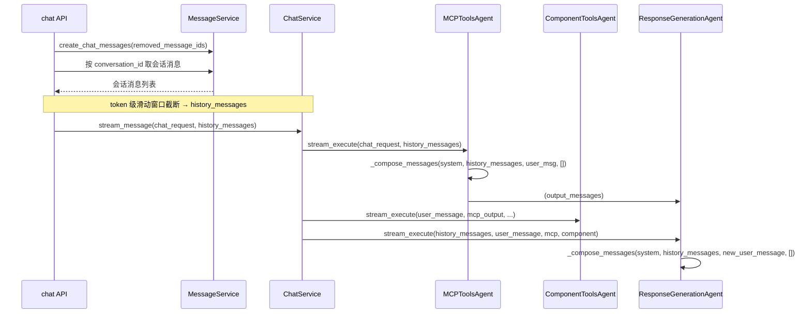

# AI 聊天助手上下文压缩方案

## 一、当前处理流程与现状

- **历史来源（采用后端主导）**：**由后端自己处理当前会话的 history**。前端不再传 `history_ids` 来决定滑动窗口；后端根据 `conversation_id` 从 DB 拉取该会话的消息（如通过 [conversation_service.get_messages](app/services/conversation_service.py) 或等价逻辑），得到「当前会话全部历史消息」，再在组装发给 LLM 的 messages 前按 **token 级滑动窗口**（策略 B）截断，超出预算的**前面**部分不加入本次请求。API 契约上可保留 `removed_message_ids` 用于删除/重试等；`history_ids` 可废弃或改为可选。
- **历史如何进 LLM**：[BaseAgent._compose_messages](app/agents/base.py) 用 [format_chat_message_for_llm](app/utils/message.py) 把每条 `ChatMessageItem` 转成仅 `role` + `content`（以及可选的 `reasoning`），**历史中的 tool_calls / component_tool_calls 并未传给模型**，只传了助手文本内容。
- **现有压缩**：[ContextCompactor](app/utils/context_compactor.py) 仅用于 MCP **工具返回的 markdown 结果**（按 query 相关性 + token 阈值裁剪），不涉及对话历史或用户画像。

---

## 二、方案要点

### 1. 记录用户聊天过程中的事实与偏好

**目标**：在对话中持续积累「用户是谁、偏好什么」，供后续轮次 system 或首条上下文使用，减少重复询问并保持人格化。

**存储（采用方案 A：双表）**：

- **用户级表 `user_profile**`（跨会话复用）
  - 主键：`user_id`。
  - 字段：`facts`（JSON 数组或文本）、`preferences`（JSON 数组或文本）、`updated_at`。
  - 用途：所有会话共用；**用户创建新会话时无需复制**，只要按 `user_id` 查即可复用该用户在其他会话中已积累的事实与偏好。
- **会话级表 `user_context**`（仅本会话）
  - 主键：`(user_id, conversation_id)`。
  - 字段：`summary_before_window`、`recent_summary`、`updated_at`（仅存本对话的窗口外摘要，不存 facts/preferences）。
  - 用途：窗口外消息摘要等仅对当前会话有意义的内容。

**跨会话复用**：事实与偏好具有**用户级**属性（如「在北京工作」「偏好简短回答」），因此放在 `user_profile`。新会话组装 system 时按 **user_id** 查询 `user_profile` 即可注入已知事实与偏好，无需从其他会话复制或迁移。

**内容结构示例**：

- `facts: list[str]`：从多轮中提炼的可信事实（如「在北京工作」「用 Python 3.10」）。
- `preferences: list[str]`：偏好（如「偏好简短回答」「不要用代码块」）。

**生成与使用**：

- **异步归纳**：在 [ChatService.stream_message](app/services/chat_service.py) 流程结束、助手消息落库后，触发一次「归纳本轮+历史事实/偏好」的 LLM 调用（或队列任务），写入或更新 **user_profile** 表中对应 **user_id** 的记录（merge 或 replace，按产品需求）。
- **使用时机**：任意会话（含新创建的）请求时，在 [get_system_prompt_for_response_generation](app/prompts/prompt_utils.py) 或 MCP 的 system 组装处：① 按 **user_id** 查 **user_profile**，若存在 facts/preferences 则格式化为片段拼入 system；② 再按 **user_id + conversation_id** 查 **user_context** 注入本会话摘要（见下节）。
- **实现注意**：归纳 prompt 要明确「仅输出可验证事实与明确偏好、不要编造」。可与「超出窗口的摘要」共用同一套 long-term context 逻辑（见下）。

---

### 2. 超出滑动窗口的聊天消息如何处理（采用策略 B）

**采用策略 B：后端做 token 级滑动窗口**

- **流程**：
  1. 后端按 **conversation_id** 拉取当前会话的消息列表（时间顺序），得到「当前会话全部历史」（不含本轮尚未落库的当前用户消息，或包含则在下文预算中单独计）。
  2. 在组装发给 LLM 的 `messages` 前做 **token 预算**：预留 system、user_profile 与 user_context 注入、当前用户消息、当前轮工具消息（MCP/组件）、以及为回复预留的 token；用 [TokenCalculator.count_messages_tokens](app/utils/token.py) 对历史消息从**新到旧**累加，超出预算的**前面**（更早的）消息不再加入本次请求，得到本次使用的 **history_messages**。
  3. 可选：把「被截掉」的旧消息交给异步任务做摘要，写入 **user_context** 表（会话级）的 `summary_before_window` / `recent_summary`，下次请求时在 system 中注入，使窗口外的信息以压缩形式存在。
- **落点**：
  - **截断逻辑**：在 chat API 内，拿到会话消息列表后、调用 ChatService.stream_message 前，增加一步「按 token 预算从新到旧截断得到 history_messages」；或由 ChatService/Agent 在 _compose_messages 前接收「完整会话消息」并在此处做截断。建议集中在**单一处**（如新工具函数 `truncate_history_by_tokens(messages, reserved_tokens)`）便于复用（MCP 与 Response 两处可共用）。
  - **配置**：在 CompressionConfig 或等价配置中增加 `max_history_tokens`（或 `history_token_budget`），便于按环境/模型调参。
  - 摘要写入（可选）：在 [MessageService.update_assistant_message](app/services/message_service.py) 之后或 ChatService 流式收尾处，若有被截断的旧消息，可调用 `context_summary_service` 归纳并更新 **user_context** 表（user_id + conversation_id，仅会话级摘要）。
  - 读 summary：在 system 组装处根据 **user_id + conversation_id** 读 **user_context** 并拼进 system。

**窗口外消息摘要管道（截断 → 摘要 → 写入 user_context → 下次注入 system）**

- **触发时机**：在完成「轮数 + token 截断」并得到本次 `history_messages` 后，若存在**被截掉的旧消息**（即会话消息列表中去掉本次保留部分后剩余的消息），则触发本管道；可在 [MessageService.update_assistant_message](app/services/message_service.py) 之后或 chat 流式收尾处调用，**异步执行**，不阻塞本次响应。
- **输入**：被截断的旧消息列表（按时间从旧到新），以及当前 `user_id`、`conversation_id`；可从截断逻辑的返回值或 ChatService/API 层传递（例如截断函数返回 `(history_messages, truncated_messages)`）。
- **摘要生成**：由 `context_summary_service`（或等价模块）负责：将 `truncated_messages` 拼接成一段文本，调用 LLM 生成简短摘要（或先规则/模板压缩再 LLM 润色），产出为一段自然语言摘要，控制长度（如不超过 `summary_max_tokens`）。Prompt 要点：要求模型归纳「用户问了什么、助手答了什么」的关键信息，不编造；可复用与「用户事实/偏好」归纳相近的 long-term context 风格。
- **写入 user_context**：表为 **user_context**（user_id + conversation_id 唯一，仅存会话级摘要）。将摘要写入 `**summary_before_window**` 或 `**recent_summary**`（前者表示「窗口外更早的摘要」，后者可为「最近一次截断产生的摘要」）；若该行不存在则 insert，存在则 update 对应字段及 `updated_at`。可与「用户事实/偏好」的异步归纳**合并为同一次任务**：同一请求下先写 **user_profile** 的 facts/preferences，再写 **user_context** 的本摘要，或统一在一个 service 内顺序执行。
- **下次注入 system**：在组装 system 的环节（如 [get_system_prompt_for_response_generation](app/prompts/prompt_utils.py) 的调用链、或 MCP system 组装处），根据 **user_id + conversation_id** 查询 **user_context**，若存在 `summary_before_window` / `recent_summary` 则取出；将该摘要作为固定格式的一段拼入 system，例如：「以下是本对话中较早轮次的摘要，供参考：\n{摘要内容}」。注意在 token 预算中预留该段长度（或对摘要本身做最大 token 限制）。至少要在**响应生成**的 system 中注入；若希望 MCP 工具决策也利用长期上下文，可在 MCP 的 system 中同样注入。
- **配置**：CompressionConfig（或等价）中可增加 `window_out_summary_enabled`（是否开启本管道）、`summary_max_tokens`（摘要最大 token，写入与注入时共用），便于关闭或调参。

---

### 3. 滑动窗口内历史工具调用消息如何处理

**结论（已采用）**：**方案 3（最近 1 轮完整 tool 消息）+ 更早消息按 token 分流**。最近 1 轮展开为完整 assistant（tool_calls）+ tool（result）；更早消息中 token < 2K 原样保留，token ≥ 2K 则用规则/模板生成简短结构化摘要并存入字段 `**tool_calls_summary**`，组装时仅注入摘要。摘要不必用 LLM，以规则/模板为主。

**现状**：`format_chat_message_for_llm` 只保留 `role` + `content`，历史里 assistant 的 `tool_calls` 与对应的 tool 结果**完全没有**进入 LLM。因此「窗口内」的模型看到的只有历史用户句与助手**文本**。

**可选方案（参考）**：

- **方案 1：保持现状**
  - 窗口内历史助手消息只保留 content。
  - 优点：实现零改动、token 最省。
  - 缺点：模型不知道「之前调过哪些工具、结果大概是什么」，可能重复调用或忘记已获得的信息。
- **方案 2：窗口内保留「工具调用的精简表示」**
  - 对滑动窗口内的每条助手消息，若存在 `tool_calls` / `component_tool_calls`，不直接传原始 tool 消息，而是生成**一段简短摘要**（例如「调用了 web_search、tavily，得到 X 条结果」或「调用了 weather，返回某地气温」）拼到该条 assistant 的 `content` 末尾，或作为单独一段注入。
  - 这样 LLM 仍只收到 user/assistant 两种 role，但能感知「之前用过工具以及结论概要」，且 token 可控。
- **方案 3：窗口内最近 1～2 轮保留完整 tool 消息**
  - 在 [BaseAgent._compose_messages](app/agents/base.py) 中，对 `history_messages` 里**最近若干条**助手消息，若含 tool_calls，则将其展开为标准的 assistant（tool_calls）+ tool（result）消息再追加到 messages。
  - 需要把 `ChatMessageItem` 中的 `tool_calls` 与 DB 中存储的 tool result 对应起来（若当前没有存 result，需在落库时一起存）。
  - 更占 token，但信息最完整，适合「必须避免重复调用」的场景。

**采用方案（方案 3 + 更早消息按 token 分流）**：

1. **最近 1 轮**：采用 **方案 3**，保留**完整**工具消息。即：对滑动窗口内「最近一轮」含工具调用的助手消息，在组装 messages 时展开为标准的 assistant（tool_calls）+ tool（result），原样传给 LLM。需确保 DB 中已存有 tool result（与 tool_calls 对应）；若当前落库未存 result，需在 [MessageService](app/services/message_service.py) / MessageDb 中补充存储并在拉取历史时一并返回。
2. **窗口内更早的消息**：按**单条消息 token 数**分流——
  - **token < 2K**：原样保留（若含 tool_calls，同样展开为完整 assistant + tool 消息）。
  - **token ≥ 2K**：不做完整展开，而是生成**简短结构化摘要**（规则/模板，例如「调用了 web_search、tavily，得到 X 条结果」或「调用了 weather，返回某地气温」），将摘要内容存入该条消息的**单独字段 `tool_calls_summary**`（MessageDb 增加 `tool_calls_summary: str | None`）；组装 history 时，若该条有 `tool_calls_summary` 则只注入该摘要（拼到 assistant 的 content 或作为单独一段），不注入完整 tool 内容。

**实现要点**：

- **存储**：MessageDb 为含工具调用的消息增加字段 `**tool_calls_summary**`（`str | None`），用于存「简短结构化摘要」。当某条历史消息 token ≥ 2K 时，用规则/模板生成摘要并写入该字段（可在落库时同步生成，或首次超阈值时生成并写回）。
- **组装逻辑**：在 [BaseAgent._compose_messages](app/agents/base.py) 或共用的 history 格式化处：① 识别「最近 1 轮」的助手消息（含 tool_calls）→ 展开为完整 assistant + tool 消息；② 对更早的含 tool_calls 的消息，若存在 `tool_calls_summary` 则仅注入该摘要（拼到 assistant content 或单独一段），若无且 token < 2K 则原样展开。
- **阈值**：2K token 可配置（CompressionConfig 中 `tool_message_summary_threshold_tokens = 2000`），便于调参。

**LLM 摘要**：不必作为默认。简短结构化摘要以**规则/模板**为主（工具名 + 「得到 N 条结果」或关键 result 片段）。若后续语义不足，再对部分长 result 或长期上下文引入 LLM 摘要，且建议**异步落库时**完成并写入 `tool_calls_summary`。

---

## 三、与现有组件的衔接

| 组件 | 衔接方式 |

|------|----------|

| **ContextCompactor** | 继续只负责「单次 MCP 工具返回」的 markdown 压缩；不用于对话历史。若将来对「长摘要」也做相关性裁剪，可再抽象一层共用一个 compress_by_relevance 方法。 |

| **TokenCalculator** | 用于：(1) 对会话历史做 **token 级滑动窗口**截断（策略 B，核心）；(2) 工具摘要的 `max_tool_summary_tokens` 控制；(3) 摘要/事实注入后总 prompt 的预估与告警。 |

| **CompressionConfig** | 可扩展字段，例如 `history_summary_enabled`、`user_context_enabled`、`max_history_tokens`、`tool_summary_max_tokens`、`**tool_message_summary_threshold_tokens**`（如 2000）、`**window_out_summary_enabled**`（是否开启窗口外摘要管道）、`**summary_max_tokens**`（窗口外摘要最大 token），便于按环境关闭或调参。 |

| **ChatMessageItem / MessageDb** | 已有 `tool_calls`、`component_tool_calls`、`message_metadata`；需补充 **tool result 存储**（以便最近 1 轮完整展开）及 `**tool_calls_summary**` 字段（存更早消息、token≥2K 时的结构化摘要）。事实/偏好存 **user_profile** 表（user_id）；会话级摘要存 **user_context** 表（user_id + conversation_id）。 |

---

## 四、建议实施顺序

1. **用户事实与偏好（方案 A 双表）**：新建 **user_profile** 表（主键 user_id，存 facts/preferences）+ **user_context** 表（主键 user_id + conversation_id，仅存 summary_before_window / recent_summary）；归纳逻辑写 **user_profile**；组装 system 时按 user_id 查 user_profile 注入事实/偏好、按 (user_id, conversation_id) 查 user_context 注入本会话摘要。新会话自然复用 user_profile，无需复制。
2. **滑动窗口内工具调用**：采用方案 3——最近 1 轮完整 tool 消息；更早消息按 token 分流（< 2K 原样，≥ 2K 用规则/模板生成摘要并存入 `**tool_calls_summary**`）；补充 MessageDb 的 tool result 存储及 `tool_calls_summary` 字段；在 _compose_messages 或共用 history 组装处实现上述逻辑。
3. **历史由后端处理 + token 级滑动窗口（策略 B）**：后端按 conversation_id 拉取会话消息；实现 `truncate_history_by_tokens`（或等价），在组装 messages 前按 token 预算从新到旧截断得到 history_messages；配置 `max_history_tokens`。可选：被截断的旧消息异步摘要写入 **user_context**（会话级），并在 system 中注入。

这样在不改变现有流式协议与 API 的前提下，完成「记录事实与偏好」「后端 token 级滑动窗口（策略 B）」「窗口内工具消息：最近 1 轮完整 + 更早按 token 分流并用 tool_calls_summary 存储摘要」的上下文压缩方案，并与现有 [chat_service](app/services/chat_service.py) 流程和配置兼容。

---

## 五、技术方案 ToDo

### 1. 配置与存储基础

- **CompressionConfig 扩展**：在 [app/schemas/config.py](app/schemas/config.py) 的 CompressionConfig 中增加 `max_history_tokens`、`max_history_rounds`（默认 5）、`tool_message_summary_threshold_tokens`（默认 2000）、`window_out_summary_enabled`、`summary_max_tokens`；在 [app/core/config.py](app/core/config.py) 中确保加载。
- **user_profile 表（方案 A 用户级）**：设计并新建表 `user_profile`，主键 `user_id`，字段含 `user_id`、`facts`（JSON/文本）、`preferences`（JSON/文本）、`updated_at`；用于跨会话复用的事实与偏好；编写 Alembic 迁移并执行。
- **user_context 表（方案 A 会话级）**：设计并新建表 `user_context`，主键或唯一键 `(user_id, conversation_id)`，字段含 `user_id`、`conversation_id`、`summary_before_window`、`recent_summary`、`updated_at`（仅存本会话的窗口外摘要，不存 facts/preferences）；编写 Alembic 迁移并执行。
- **MessageDb 扩展**：为 messages 表增加 `tool_calls_summary`（str | None），并（若当前未存）增加 **tool result 存储**（使每条 assistant 的 tool_calls 能对应到 tool 结果内容）；编写 Alembic 迁移并执行。
- **ChatMessageItem / 拉取历史**：若新增字段或 tool result 存储，同步更新 [app/schemas/chat.py](app/schemas/chat.py) 的 ChatMessageItem 及 [app/services/conversation_service.py](app/services/conversation_service.py) 或 message_service 的拉取逻辑，使历史消息包含 tool result 与 `tool_calls_summary`。

### 2. 历史由后端处理 + 轮数与 token 截断

- **按 conversation_id 拉取历史**：在 chat API 流程中改为按 `conversation_id` 拉取会话消息（如调用 conversation_service.get_messages），不再依赖前端传 `history_ids` 决定窗口；API 保留 `removed_message_ids`，`history_ids` 废弃或可选。
- **轮数截断**：实现 `truncate_by_rounds(messages, max_rounds)`（或等价），从新到旧只保留最近 N 轮（一轮 = 一条 user + 对应 assistant 及其间 tool 等），默认 `max_history_rounds = 5`。
- **token 截断**：实现 `truncate_history_by_tokens(messages, reserved_tokens)`（或合并为 `truncate_history_by_rounds_and_tokens(messages, max_rounds, reserved_tokens)`），在轮数截断结果上从新到旧按 token 累加，超出预算的更早消息丢弃，返回 `(history_messages, truncated_messages)` 便于后续摘要管道使用。
- **截断接入**：在 chat API 内、调用 ChatService.stream_message 前（或 ChatService/Agent 入口处），先拉取会话消息，再执行「先轮数后 token」截断，将 `history_messages` 传入 ChatService；在 token 预算中预留 system、user_profile + user_context 注入、当前用户消息、当前轮工具消息、回复预留。

### 3. 用户事实与偏好（方案 A：user_profile 用户级）

- **归纳逻辑**：实现 `context_summary_service`（或等价）中的「用户事实/偏好」归纳：输入本轮+历史消息（或仅窗口内+user_profile 现有内容），调用 LLM 产出结构化 facts / preferences；Prompt 明确「仅输出可验证事实与明确偏好、不要编造」。
- **写入 user_profile**：在 ChatService 流式结束、助手消息落库后，**异步**触发归纳并按 `user_id` 写入或更新 **user_profile** 表（insert or update，merge 或 replace 按产品需求）；若与「窗口外摘要」共用任务，可在同一异步流程内先写 user_profile，再写 user_context 摘要。
- **注入 system**：在 [get_system_prompt_for_response_generation](app/prompts/prompt_utils.py) 或 MCP system 组装处：① 根据 **user_id** 查询 **user_profile**，若存在 facts/preferences 则格式化为片段拼入 system（新会话与旧会话均复用）；② 再根据 user_id + conversation_id 查询 user_context 注入本会话摘要（见下一节）。请求链路需能取得 `user_id`（如从 JWT 或 conversation 关联）。

### 4. 窗口外消息摘要管道（user_context 会话级）

- **触发与输入**：在 `update_assistant_message` 之后或 chat 流式收尾处，若截断返回的 `truncated_messages` 非空，则**异步**调用窗口外摘要管道，传入 `truncated_messages`、`user_id`、`conversation_id`。
- **摘要生成**：在 context_summary_service 中实现：将 truncated_messages 拼接成文本，调用 LLM 生成简短摘要（或规则+LLM），长度不超过 `summary_max_tokens`；Prompt 归纳「用户问了什么、助手答了什么」且不编造。
- **写入 user_context**：将摘要写入 **user_context**（仅会话级）的 `summary_before_window` 或 `recent_summary`；若该行不存在则 insert，否则 update 对应字段与 `updated_at`；可与「用户事实/偏好」写入合并为同一次异步任务（先写 user_profile，再写 user_context）。
- **下次注入 system**：在响应生成（及可选 MCP）的 system 组装处，根据 user_id + conversation_id 读取 **user_context** 的 summary 字段，以固定格式（如「以下是本对话中较早轮次的摘要，供参考：\n{摘要内容}」）拼入 system；在 token 预算中预留该段。
- **配置**：尊重 `window_out_summary_enabled`、`summary_max_tokens`，未开启则不触发摘要生成与注入。

### 5. 滑动窗口内历史工具调用（方案 3 + token 分流）

- **最近 1 轮完整展开**：在 BaseAgent._compose_messages 或共用 history 格式化处，识别「最近 1 轮」的含 tool_calls 的助手消息，将其展开为标准的 assistant（tool_calls）+ tool（result）消息并追加到 messages；依赖 MessageDb 与拉取逻辑已提供 tool result。
- **更早消息：token < 2K 原样**：对窗口内更早的含 tool_calls 的消息，若单条 token < `tool_message_summary_threshold_tokens`，则同样完整展开（assistant + tool）加入 messages。
- **更早消息：token ≥ 2K 用摘要**：若单条 token ≥ 2K，则不展开；若该条已有 `tool_calls_summary` 则只将摘要拼到 assistant content（或单独一段）注入；若无则用规则/模板生成简短结构化摘要（如「调用了 web_search、tavily，得到 X 条结果」），并写回 MessageDb 的 `tool_calls_summary`（可同步或异步），再注入该摘要。
- **摘要生成规则**：实现规则/模板生成 tool_calls_summary（工具名 + 「得到 N 条结果」或关键 result 片段），无 LLM；可选后续为长 result 增加异步 LLM 摘要并写回。
- **MCP 与 Response 共用**：上述 history 组装逻辑在 MCPToolsAgent 与 ResponseGenerationAgent 共用的 _compose_messages 或独立工具函数中复用，保证两处对历史工具消息的处理一致。

### 6. 联调与配置

- **端到端**：从「按 conversation_id 拉取 → 轮数+token 截断 → stream_message(history_messages) → 窗口内工具消息按方案 3 组装」全链路联调；验证 **user_profile**（事实/偏好）与 **user_context**（会话摘要）的读写及 system 注入；验证新会话能复用 user_profile 中的事实与偏好。
- **文档与配置示例**：在 README 或配置说明中补充 `max_history_rounds`、`max_history_tokens`、`tool_message_summary_threshold_tokens`、`window_out_summary_enabled`、`summary_max_tokens` 的说明与推荐值。
