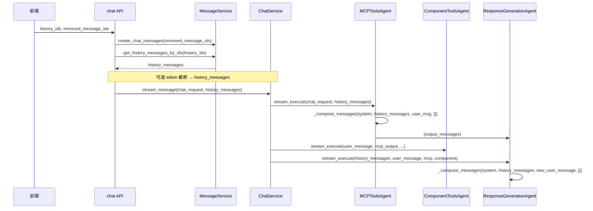

# AI 聊天助手上下文压缩方案（最终版）

## 计划更新汇总

相对初版计划，本次最终版做两处约定更新：

| 更新项        | 原约定                                                                              | 最终约定                                                                                                                                                                            |
| ---------- | -------------------------------------------------------------------------------- | ------------------------------------------------------------------------------------------------------------------------------------------------------------------------------- |
| **历史来源**   | 后端主导：后端按 `conversation_id` 拉取会话全部消息，再按 token 截断；`history_ids` 可废弃或可选。            | **前端主导**：前端传 `history_ids` 决定本次使用的历史消息；后端按 `history_ids` 从 DB 拉取对应消息，再在组装前做可选 token 级截断。API 保留 `history_ids`（必传或约定必传）与 `removed_message_ids`。                                   |
| **消息摘要存储** | 窗口内更早、token≥2K 的工具消息摘要存入 MessageDb 的 `**tool_calls_summary**` 字段（assistant 消息上）。 | **ToolResultMessage.summary**：每条工具结果摘要存放在对应 **ToolResultMessage** 的 **summary** 字段；若持久化，则 DB 中 tool result 记录含 **summary** 字段，不再使用 assistant 消息上的 `tool_calls_summary`。 |

其余方案（用户事实/偏好双表、窗口外摘要管道、最近 1 轮完整 + 更早按 token 分流等）不变。

### 实施进度（已跑通：截断 + 窗口内工具摘要）

| 任务                       | 状态    | 说明                                                                                                                                                           |
| ------------------------ | ----- | ------------------------------------------------------------------------------------------------------------------------------------------------------------ |
| CompressionConfig 扩展     | ✅ 已完成 | 已增加 `max_history_tokens`、`max_history_rounds`、`tool_message_summary_threshold_tokens`（[app/schemas/config.py](app/schemas/config.py)）                        |
| 历史截断（轮数 + token）         | ✅ 已完成 | [app/utils/history_truncate.py](app/utils/history_truncate.py)：`truncate_history_by_rounds_and_tokens`、`count_chat_message_tokens`、`truncate_text_to_tokens` |
| 截断接入 stream_response     | ✅ 已完成 | [app/services/chat_service.py](app/services/chat_service.py)：拉取后先截断再 `process_history_messages`                                                              |
| process_history_messages | ✅ 已完成 | 窗口内最近 1 轮完整 tool；其他轮用 summary / content（≤2K）/ 截断；返回扁平列表供 _compose_messages                                                                                   |
| 用户事实与偏好（双表）              | ✅ 已完成 | user_profile、user_context 表及归纳与 system 注入                                                                                                                    |
| 窗口外摘要管道                  | ✅ 已完成 | 截断旧消息 → 摘要 → user_context → system 注入                                                                                                                        |
| tool result 含 summary 落库 | ✅ 已完成 | 持久化时 tool_calls JSON 已含 summary；可选写回截断生成的 summary 为后续增强                                                                                                      |

---

## 一、当前处理流程与现状

- **历史来源（采用前端主导）**：**由前端决定本次上下文包含哪些历史消息**。前端传 `history_ids`（本次要使用的历史消息 ID 列表）；后端根据 `history_ids` 从 DB 拉取对应消息（如 [message_service.get_history_messages_by_ids](app/services/message_service.py)），得到 `history_messages`，再在组装发给 LLM 的 messages 前可做 **token 级截断**（从新到旧累加，超出预算的更早消息不加入）。API 保留 `removed_message_ids` 用于删除/重试等；`history_ids` 为前端必传或约定必传。
- **历史如何进 LLM**：[BaseAgent._compose_messages](app/agents/base.py) 用 [format_chat_message_for_llm](app/utils/message.py) 把每条 `ChatMessageItem` 转成仅 `role` + `content`（以及可选的 `reasoning`），**历史中的 tool_calls / component_tool_calls 并未传给模型**，只传了助手文本内容。
- **现有压缩**：[ContextCompactor](app/utils/context_compactor.py) 仅用于 MCP **工具返回的 markdown 结果**（按 query 相关性 + token 阈值裁剪），不涉及对话历史或用户画像。

---

## 二、方案要点

### 0. history_messages 处理流程（落点：process_history_messages）

对 **history_messages** 的统一处理建议放在 [ChatService.process_history_messages](app/services/chat_service.py) 中完成，在「按 history_ids 拉取 → 传入 stream_message」之间调用，保证后续 MCP / 响应生成使用的已是处理后的历史。

**1. 滑动窗口内的工具调用**

- **a. 近 1 轮**：使用**完整工具调用**。即对滑动窗口内「最近一轮」含工具调用的助手消息，保留完整 assistant（tool_calls）+ tool（result），原样参与后续 _compose_messages。
- **b. 其他轮**：工具调用统一使用 **summary** 参与组装：
  - 若该条 **ToolResultMessage.summary** 已有内容，则**直接使用**该 summary（不传完整 content）。
  - 若 **summary 无内容**，则看 **content**：
    - content 未超出 2K token：**直接将 content 作为 summary 使用**（即本轮组装时等价于用 content，但不改持久化里的 summary 字段，仅本次使用）。
    - content 超出 2K token：对 content **进行截断**（或规则/模板生成简短摘要），用截断/摘要结果作为本次注入内容；可选写回 **ToolResultMessage.summary** 或 DB 中 tool result 的 summary 字段供后续复用。

**2. 滑动窗口外的工具调用**

- **a. 忽略**：滑动窗口外的**工具调用**（assistant 的 tool_calls 及对应 tool result）**不进入**本次发给 LLM 的 messages，即窗口外不传任何 tool 消息。
- **b. 摘要处理**：对滑动窗口外的**整段内容**（用户句 + 助手句等）做摘要，写入 **user_context**（如 `summary_before_window` / `recent_summary`），在 system 中注入；摘要管道与触发时机见下文「超出滑动窗口的聊天消息如何处理」。

上述「窗口内近 1 轮完整 + 其他轮用 summary / content / 截断」与「窗口外忽略工具调用 + 内容摘要」的逻辑，均在 **process_history_messages** 内实现（或由该入口调用统一工具函数），保证一处处理、下游一致使用。

---

### 1. 记录用户聊天过程中的事实与偏好

**目标**：在对话中持续积累「用户是谁、偏好什么」，供后续轮次 system 或首条上下文使用，减少重复询问并保持人格化。

**存储（采用方案 A：双表）**：

- **用户级表 `user_profile**`（跨会话复用）
  - 主键：`user_id`。
  - 字段：`facts`（JSON 数组或文本）、`preferences`（JSON 数组或文本）、`updated_at`。
  - 用途：所有会话共用；**用户创建新会话时无需复制**，只要按 `user_id` 查即可复用该用户在其他会话中已积累的事实与偏好。
- **会话级表 `user_context**`（仅本会话）
  - 主键：`(user_id, conversation_id)`。
  - 字段：`summary_before_window`、`recent_summary`、`updated_at`（仅存本对话的窗口外摘要，不存 facts/preferences）。
  - 用途：窗口外消息摘要等仅对当前会话有意义的内容。

**跨会话复用**：事实与偏好具有**用户级**属性（如「在北京工作」「偏好简短回答」），因此放在 `user_profile`。新会话组装 system 时按 **user_id** 查询 `user_profile` 即可注入已知事实与偏好，无需从其他会话复制或迁移。

**内容结构示例**：

- `facts: list[str]`：从多轮中提炼的可信事实（如「在北京工作」「用 Python 3.10」）。
- `preferences: list[str]`：偏好（如「偏好简短回答」「不要用代码块」）。

**生成与使用**：

- **异步归纳**：在 [ChatService.stream_message](app/services/chat_service.py) 流程结束、助手消息落库后，触发一次「归纳本轮+历史事实/偏好」的 LLM 调用（或队列任务），写入或更新 **user_profile** 表中对应 **user_id** 的记录（merge 或 replace，按产品需求）。
- **使用时机**：任意会话（含新创建的）请求时，在 [get_system_prompt_for_response_generation](app/prompts/prompt_utils.py) 或 MCP 的 system 组装处：① 按 **user_id** 查 **user_profile**，若存在 facts/preferences 则格式化为片段拼入 system；② 再按 **user_id + conversation_id** 查 **user_context** 注入本会话摘要（见下节）。
- **实现注意**：归纳 prompt 要明确「仅输出可验证事实与明确偏好、不要编造」。可与「超出窗口的摘要」共用同一套 long-term context 逻辑（见下）。

---

### 2. 超出滑动窗口的聊天消息如何处理（采用策略 B）

**采用策略 B：后端在「前端给到的历史」上做 token 级截断**

- **流程**：
  1. 后端根据前端传入的 **history_ids** 拉取对应消息列表（时间顺序），得到本次可用的 **history_messages**（不含本轮尚未落库的当前用户消息，或包含则在下文预算中单独计）。
  2. 在组装发给 LLM 的 `messages` 前做 **token 预算**：预留 system、user_profile 与 user_context 注入、当前用户消息、当前轮工具消息（MCP/组件）、以及为回复预留的 token；用 [TokenCalculator.count_messages_tokens](app/utils/token.py) 对历史消息从**新到旧**累加，超出预算的**前面**（更早的）消息不再加入本次请求，得到本次实际使用的 **history_messages**。
  3. 可选：把「被截掉」的旧消息交给异步任务做摘要，写入 **user_context** 表（会话级）的 `summary_before_window` / `recent_summary`，下次请求时在 system 中注入，使窗口外的信息以压缩形式存在。
- **落点**：
  - **截断逻辑**：在 chat API 内，拿到按 history_ids 拉取的消息列表后、调用 ChatService.stream_message 前，增加一步「按 token 预算从新到旧截断得到 history_messages」；或由 ChatService/Agent 在 _compose_messages 前接收「前端给到的历史」并在此处做截断。建议集中在**单一处**（如新工具函数 `truncate_history_by_tokens(messages, reserved_tokens)`）便于复用（MCP 与 Response 两处可共用）。
  - **配置**：在 CompressionConfig 或等价配置中增加 `max_history_tokens`（或 `history_token_budget`），便于按环境/模型调参。
  - 摘要写入（可选）：在 [MessageService.update_assistant_message](app/services/message_service.py) 之后或 ChatService 流式收尾处，若有被截断的旧消息，可调用 `context_summary_service` 归纳并更新 **user_context** 表（user_id + conversation_id，仅会话级摘要）。
  - 读 summary：在 system 组装处根据 **user_id + conversation_id** 读 **user_context** 并拼进 system。

**窗口外消息摘要管道（截断 → 摘要 → 写入 user_context → 下次注入 system）**

- **触发时机**：在完成「轮数 + token 截断」并得到本次 `history_messages` 后，若存在**被截掉的旧消息**（即按 history_ids 拉取的消息列表中去掉本次保留部分后剩余的消息），则触发本管道；可在 [MessageService.update_assistant_message](app/services/message_service.py) 之后或 chat 流式收尾处调用，**异步执行**，不阻塞本次响应。
- **输入**：被截断的旧消息列表（按时间从旧到新），以及当前 `user_id`、`conversation_id`；可从截断逻辑的返回值或 ChatService/API 层传递（例如截断函数返回 `(history_messages, truncated_messages)`）。
- **摘要生成**：由 `context_summary_service`（或等价模块）负责：将 `truncated_messages` 拼接成一段文本，调用 LLM 生成简短摘要（或先规则/模板压缩再 LLM 润色），产出为一段自然语言摘要，控制长度（如不超过 `summary_max_tokens`）。Prompt 要点：要求模型归纳「用户问了什么、助手答了什么」的关键信息，不编造；可复用与「用户事实/偏好」归纳相近的 long-term context 风格。
- **写入 user_context**：表为 **user_context**（user_id + conversation_id 唯一，仅存会话级摘要）。将摘要写入 `summary_before_window` 或 `recent_summary`（前者表示「窗口外更早的摘要」，后者可为「最近一次截断产生的摘要」）；若该行不存在则 insert，存在则 update 对应字段及 `updated_at`。可与「用户事实/偏好」的异步归纳**合并为同一次任务**：同一请求下先写 **user_profile** 的 facts/preferences，再写 **user_context** 的本摘要，或统一在一个 service 内顺序执行。
- **下次注入 system**：在组装 system 的环节（如 [get_system_prompt_for_response_generation](app/prompts/prompt_utils.py) 的调用链、或 MCP system 组装处），根据 **user_id + conversation_id** 查询 **user_context**，若存在 `summary_before_window` / `recent_summary` 则取出；将该摘要作为固定格式的一段拼入 system，例如：「以下是本对话中较早轮次的摘要，供参考：\n{摘要内容}」。注意在 token 预算中预留该段长度（或对摘要本身做最大 token 限制）。至少要在**响应生成**的 system 中注入；若希望 MCP 工具决策也利用长期上下文，可在 MCP 的 system 中同样注入。
- **配置**：CompressionConfig（或等价）中可增加 `window_out_summary_enabled`（是否开启本管道）、`summary_max_tokens`（摘要最大 token，写入与注入时共用），便于关闭或调参。

---

### 3. 滑动窗口内历史工具调用消息如何处理

**结论（已采用）**：**方案 3（最近 1 轮完整 tool 消息）+ 更早消息按 token 分流**。最近 1 轮展开为完整 assistant（tool_calls）+ tool（result）；更早消息中 token < 2K 原样保留，token ≥ 2K 则用规则/模板生成简短结构化摘要并存入 **ToolResultMessage.summary**，组装时仅注入该摘要。摘要不必用 LLM，以规则/模板为主。

**现状**：`format_chat_message_for_llm` 只保留 `role` + `content`，历史里 assistant 的 `tool_calls` 与对应的 tool 结果**完全没有**进入 LLM。因此「窗口内」的模型看到的只有历史用户句与助手**文本**。

**可选方案（参考）**：

- **方案 1：保持现状**：窗口内历史助手消息只保留 content。优点：实现零改动、token 最省。缺点：模型不知道「之前调过哪些工具、结果大概是什么」，可能重复调用或忘记已获得的信息。
- **方案 2：窗口内保留「工具调用的精简表示」**：对滑动窗口内的每条助手消息，若存在 `tool_calls` / `component_tool_calls`，不直接传原始 tool 消息，而是生成**一段简短摘要**拼到该条 assistant 的 `content` 末尾，或作为单独一段注入；LLM 仍只收到 user/assistant 两种 role，但能感知「之前用过工具以及结论概要」，且 token 可控。
- **方案 3：窗口内最近 1～2 轮保留完整 tool 消息**：在 [BaseAgent._compose_messages](app/agents/base.py) 中，对 `history_messages` 里**最近若干条**助手消息，若含 tool_calls，则将其展开为标准的 assistant（tool_calls）+ tool（result）消息再追加到 messages；需把 `ChatMessageItem` 中的 `tool_calls` 与 DB 中存储的 tool result 对应起来。更占 token，但信息最完整。

**采用方案（方案 3 + 更早消息按 summary / content / 截断）**：

1. **最近 1 轮**：保留**完整**工具消息。即：对滑动窗口内「最近一轮」含工具调用的助手消息，在组装 messages 时展开为标准的 assistant（tool_calls）+ tool（result），原样传给 LLM。需确保 DB 中已存有 tool result（与 tool_calls 对应）；若当前落库未存 result，需在 [MessageService](app/services/message_service.py) / MessageDb 中补充存储并在拉取历史时一并返回。
2. **窗口内其他轮**：工具调用统一使用 **ToolResultMessage.summary** 参与组装（详见上文「history_messages 处理流程」）：
  - **summary 有内容**：直接使用该 summary，不传完整 content。
  - **summary 无内容**：若 **content** 未超出 2K token，则**直接将 content 作为 summary 使用**（仅本次注入，可不写回持久化）；若 content 超出 2K token，则对 content **进行截断**（或规则/模板生成简短摘要），用截断/摘要结果作为本次注入内容，可选写回 **ToolResultMessage.summary** 或 DB tool result 的 summary 字段供后续复用。

**实现要点**：

- **落点**：上述「窗口内近 1 轮完整 + 其他轮用 summary / content / 截断」逻辑在 [ChatService.process_history_messages](app/services/chat_service.py) 中实现；下游 [BaseAgent._compose_messages](app/agents/base.py) 或共用 history 格式化处消费已处理后的 `history_messages`。
- **存储**：摘要存放在 **ToolResultMessage.summary**（内存/流式结构）；若历史持久化到 DB，则每条 tool result 对应一条记录，该记录带 **summary** 字段。当某条历史 tool result content 超出 2K 且无 summary 时，可截断或生成摘要并写回 summary（可在 process_history_messages 内同步完成，或异步落库时写回）。
- **组装逻辑**：在 process_history_messages 内：① 识别「最近 1 轮」的助手消息（含 tool_calls）→ 保留完整 assistant + tool 消息；② 对更早的含 tool_calls 的消息，若 ToolResultMessage 有 **summary** 则仅保留/注入该 summary，若无则按 content 是否超出 2K 决定「直接用 content 作为 summary」或「截断/摘要后注入」。
- **阈值**：2K token 可配置（CompressionConfig 中 `tool_message_summary_threshold_tokens = 2000`），便于调参。

**LLM 摘要**：不必作为默认。简短结构化摘要以**规则/模板**为主（工具名 + 「得到 N 条结果」或关键 result 片段）。若后续语义不足，再对部分长 result 引入 LLM 摘要，且建议**异步落库时**完成并写入 **ToolResultMessage.summary**（及 DB tool result 的 summary 字段）。

---

## 三、与现有组件的衔接

| 组件                                                      | 衔接方式                                                                                                                                                                                                                                                                      |
| ------------------------------------------------------- | ------------------------------------------------------------------------------------------------------------------------------------------------------------------------------------------------------------------------------------------------------------------------- |
| **ContextCompactor**                                    | 继续只负责「单次 MCP 工具返回」的 markdown 压缩；不用于对话历史。若将来对「长摘要」也做相关性裁剪，可再抽象一层共用一个 compress_by_relevance 方法。                                                                                                                                                                             |
| **TokenCalculator**                                     | 用于：(1) 对会话历史做 **token 级截断**（在前端给到的 history 上）；(2) 工具摘要的 `max_tool_summary_tokens` 控制；(3) 摘要/事实注入后总 prompt 的预估与告警。                                                                                                                                                         |
| **CompressionConfig**                                   | 可扩展字段，例如 `history_summary_enabled`、`user_context_enabled`、`max_history_tokens`、`tool_summary_max_tokens`、`tool_message_summary_threshold_tokens`（如 2000）、`window_out_summary_enabled`、`summary_max_tokens`，便于按环境关闭或调参。                                                    |
| **ChatMessageItem / MessageDb / ToolResultMessage** | 已有 `tool_calls`、`component_tool_calls`、`message_metadata`；需补充 **tool result 存储**（含 **summary** 字段，与 [ToolResultMessage.summary](app/schemas/llm.py) 对应）以便最近 1 轮完整展开及更早消息注入摘要。事实/偏好存 **user_profile** 表（user_id）；会话级摘要存 **user_context** 表（user_id + conversation_id）。 |
| **ChatService.process_history_messages**                | 统一处理 history_messages 的入口：窗口内近 1 轮完整工具调用、其他轮用 summary（有则用，无则 content≤2K 用 content、>2K 截断）；窗口外忽略工具调用并对内容做摘要。在「按 history_ids 拉取 → stream_message」之间调用。                                                                                                                      |

---

## 四、建议实施顺序

1. **用户事实与偏好（方案 A 双表）**：新建 **user_profile** 表（主键 user_id，存 facts/preferences）+ **user_context** 表（主键 user_id + conversation_id，仅存 summary_before_window / recent_summary）；归纳逻辑写 **user_profile**；组装 system 时按 user_id 查 user_profile 注入事实/偏好、按 (user_id, conversation_id) 查 user_context 注入本会话摘要。新会话自然复用 user_profile，无需复制。
2. **滑动窗口内工具调用**：在 [process_history_messages](app/services/chat_service.py) 内实现——最近 1 轮完整 tool 消息；其他轮用 **summary**（有则直接使用，无则 content 未超 2K 时直接将 content 作为 summary 使用，超 2K 时截断后注入，可选写回 **ToolResultMessage.summary**）；补充 MessageDb 的 tool result 存储（含 summary）；窗口外忽略工具调用并对内容做摘要写入 user_context。
3. **历史由前端主导 + token 级截断（策略 B）**：前端传 **history_ids**，后端按 history_ids 拉取消息；实现 `truncate_history_by_tokens`（或等价），在组装 messages 前按 token 预算从新到旧截断得到 history_messages；配置 `max_history_tokens`。可选：被截断的旧消息异步摘要写入 **user_context**（会话级），并在 system 中注入。

这样在不改变现有流式协议与 API 的前提下，完成「记录事实与偏好」「前端主导历史 + 后端 token 级截断」「窗口内工具消息：最近 1 轮完整 + 更早按 token 分流并用 ToolResultMessage.summary 存储摘要」的上下文压缩方案，并与现有 [chat_service](app/services/chat_service.py) 流程和配置兼容。

---

## 五、技术方案 ToDo

### 1. 配置与存储基础

- **CompressionConfig 扩展** ✅ 已完成：在 [app/schemas/config.py](app/schemas/config.py) 的 CompressionConfig 中已增加 `max_history_tokens`（默认 32000）、`max_history_rounds`（默认 5）、`tool_message_summary_threshold_tokens`（默认 2000）；[app/core/config.py](app/core/config.py) 已加载。待补充：`window_out_summary_enabled`、`summary_max_tokens`。
- **user_profile 表（方案 A 用户级）**：设计并新建表 `user_profile`，主键 `user_id`，字段含 `user_id`、`facts`（JSON/文本）、`preferences`（JSON/文本）、`updated_at`；用于跨会话复用的事实与偏好；编写 Alembic 迁移并执行。
- **user_context 表（方案 A 会话级）**：设计并新建表 `user_context`，主键或唯一键 `(user_id, conversation_id)`，字段含 `user_id`、`conversation_id`、`summary_before_window`、`recent_summary`、`updated_at`（仅存本会话的窗口外摘要）；编写 Alembic 迁移并执行。
- **MessageDb / tool result 存储**：增加 **tool result 存储**（使每条 assistant 的 tool_calls 能对应到 tool 结果内容），且每条 tool result 记录含 **summary** 字段（与 ToolResultMessage.summary 对应）；若当前未存，编写 Alembic 迁移并执行。
- **ChatMessageItem / 拉取历史**：若新增 tool result 存储（含 summary），同步更新 [app/schemas/chat.py](app/schemas/chat.py) 的 ChatMessageItem 及 [app/services/conversation_service.py](app/services/conversation_service.py) 或 message_service 的拉取逻辑，使历史消息包含 tool result 及其 **summary**。

### 2. 历史由前端主导 + 轮数与 token 截断 ✅ 已完成

- **按 history_ids 拉取历史**：已保持按 [message_service.get_history_messages_by_ids](app/services/message_service.py) 拉取；API 保留 `removed_message_ids`、`history_ids`。
- **轮数 + token 截断**：已实现 [app/utils/history_truncate.py](app/utils/history_truncate.py) 中 `truncate_history_by_rounds_and_tokens(messages, max_rounds, max_tokens, token_calculator)`，返回 `(kept_messages, truncated_messages)`；含 `count_chat_message_tokens`、`truncate_text_to_tokens`。
- **截断接入**：已在 [ChatService.stream_response](app/services/chat_service.py) 内、`get_history_messages_by_ids` 之后、`process_history_messages` 之前执行截断，将截断后的 `history_messages` 传入 `process_history_messages` 再 `stream_message`。

### 3. 用户事实与偏好（方案 A：user_profile 用户级）

- **归纳逻辑**：实现 `context_summary_service`（或等价）中的「用户事实/偏好」归纳：输入本轮+历史消息（或仅窗口内+user_profile 现有内容），调用 LLM 产出结构化 facts / preferences；Prompt 明确「仅输出可验证事实与明确偏好、不要编造」。
- **写入 user_profile**：在 ChatService 流式结束、助手消息落库后，**异步**触发归纳并按 `user_id` 写入或更新 **user_profile** 表（insert or update，merge 或 replace 按产品需求）；若与「窗口外摘要」共用任务，可在同一异步流程内先写 user_profile，再写 user_context 摘要。
- **注入 system**：在 [get_system_prompt_for_response_generation](app/prompts/prompt_utils.py) 或 MCP system 组装处：① 根据 **user_id** 查询 **user_profile**，若存在 facts/preferences 则格式化为片段拼入 system（新会话与旧会话均复用）；② 再根据 user_id + conversation_id 查询 user_context 注入本会话摘要（见下一节）。请求链路需能取得 `user_id`（如从 JWT 或 conversation 关联）。

### 4. 窗口外消息摘要管道（user_context 会话级）

- **触发与输入**：在 `update_assistant_message` 之后或 chat 流式收尾处，若截断返回的 `truncated_messages` 非空，则**异步**调用窗口外摘要管道，传入 `truncated_messages`、`user_id`、`conversation_id`。
- **摘要生成**：在 context_summary_service 中实现：将 truncated_messages 拼接成文本，调用 LLM 生成简短摘要（或规则+LLM），长度不超过 `summary_max_tokens`；Prompt 归纳「用户问了什么、助手答了什么」且不编造。
- **写入 user_context**：将摘要写入 **user_context**（仅会话级）的 `summary_before_window` 或 `recent_summary`；若该行不存在则 insert，否则 update 对应字段与 `updated_at`；可与「用户事实/偏好」写入合并为同一次异步任务（先写 user_profile，再写 user_context）。
- **下次注入 system**：在响应生成（及可选 MCP）的 system 组装处，根据 user_id + conversation_id 读取 **user_context** 的 summary 字段，以固定格式（如「以下是本对话中较早轮次的摘要，供参考：\n{摘要内容}」）拼入 system；在 token 预算中预留该段。
- **配置**：尊重 `window_out_summary_enabled`、`summary_max_tokens`，未开启则不触发摘要生成与注入。

### 5. history_messages 处理流程（process_history_messages） ✅ 已完成

- **落点**：已在 [ChatService.process_history_messages](app/services/chat_service.py) 内实现；在「按 history_ids 拉取 → 截断 → stream_message」之间调用，MCP / 响应生成共用处理后的历史。
- **滑动窗口内的工具调用**：① 近 1 轮使用**完整工具调用**（assistant + tool result 原样保留）；② 其他轮使用 **summary**：若 ToolResultMessage.summary 有内容则直接使用，若无则 content ≤ 2K 用 content、>2K 用 `truncate_text_to_tokens` 截断后注入（本次未写回 DB）。
- **滑动窗口外的工具调用**：当前仅做截断，被截掉的消息未做摘要；窗口外摘要管道（写入 user_context、system 注入）待实施。
- **MCP 与 Response 共用**：process_history_messages 返回扁平列表（ChatMessageItem | ToolUseMessage | ToolResultMessage），由 BaseAgent._compose_messages 逐条 format_chat_message_for_llm，两处共用。

### 6. 滑动窗口内历史工具调用（方案 3 + summary/content/截断，摘要存 ToolResultMessage.summary） ✅ 已完成

- **最近 1 轮完整展开**：已在 process_history_messages 内识别「最近 1 轮」含 tool_calls 的助手消息，保留完整 assistant + tool（result）；历史来自 get_history_messages_by_ids，tool result 已在 MessageDb.tool_calls 中。
- **其他轮：用 summary，无则 content 或截断**：已实现——有 summary 用 summary，无则 content ≤ 2K 用 content、>2K 用 truncate_text_to_tokens 截断后注入；当前未写回 DB。
- **摘要/截断规则**：当前为按 token 截断（truncate_text_to_tokens）；规则/模板或 LLM 摘要写回 ToolResultMessage.summary 为可选后续。

### 7. 联调与配置

- **端到端**：截断 + 窗口内工具摘要已跑通：前端传 history_ids → get_history_messages_by_ids → truncate_history_by_rounds_and_tokens → process_history_messages → stream_message；历史以扁平列表进入 _compose_messages。待联调：**user_profile** / **user_context** 的读写及 system 注入。
- **文档与配置示例**：待在 README 或配置说明中补充 `max_history_rounds`、`max_history_tokens`、`tool_message_summary_threshold_tokens` 的说明与推荐值；`window_out_summary_enabled`、`summary_max_tokens` 待配置扩展后补充。

