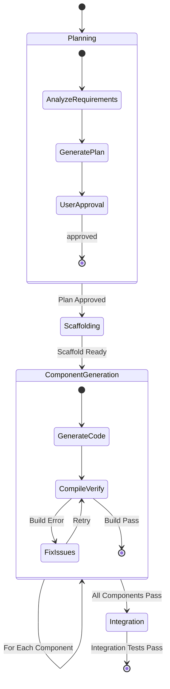

# Frontend Codegen Pipeline

## 核心思想

将“一次性生成代码”转换为“多阶段、可验证、有反馈闭环”的工程流程。
每个阶段都有明确 Definition of Done（DoD），且必须通过阶段栅栏后才能进入下一阶段。

## 适用触发场景

- 用户要求从 0 到 1 生成前端项目
- 用户提到 code generation、脚手架、逐组件生成、集成验证
- 用户希望 Agent 以“生成 -> 验证 -> 修复”的闭环交付结果

## 执行总原则

1. 阶段顺序固定：Planning -> Scaffolding -> ComponentGeneration -> Integration
2. 每阶段必须执行验证动作，验证失败必须进入修复循环
3. 不允许跳过“用户确认”栅栏（Planning 阶段结束后必须等待确认）
4. 默认最小实现优先，不做超出需求的功能扩展
5. 不自动执行 `git add` / `git commit` / `git push`，除非用户明确要求

## 状态机（必须遵循）



## 持久化状态（必须维护）

在项目工作空间的根目录维护 `.codegen/state.json`，用于中断恢复与阶段推进。

推荐结构：

```json
{
  "stage": "planning | scaffolding | component-generation | integration | completed",
  "updatedAt": "ISO-8601 timestamp",
  "components": [
    {
      "name": "ComponentName",
      "status": "pending | building | done | failed",
      "retries": 0,
      "dependencies": ["OptionalComponentA"]
    }
  ],
  "artifacts": {
    "planFile": ".codegen/plan.md",
    "logFile": ".codegen/codegen.log",
    "scaffoldFiles": []
  }
}
```

每次进入新阶段、每次组件状态变化、每次修复重试后，都要更新状态文件。

## 阶段 1：规划（Planning）

目标：将模糊需求转化为确定性的工程蓝图，并获得用户确认。

### Agent Loop

1. 分析（Analyze）
   - 解析功能、页面、交互、数据实体、外部依赖约束
2. 规划（Plan）
   - 生成不含具体业务代码的结构化蓝图：
     - 项目结构（如 `src/components/ui`, `src/hooks`, `src/types`）
     - 组件树（职责、层级、Props 接口）
     - 数据流（状态边界、API 边界、组件数据流转）
     - 路由结构（如为多页面）
     - 依赖清单（每个库对应用途）
3. 提案（Propose）
   - 输出 `.codegen/plan.md`
4. 确认（Confirm）
   - 必须中断并等待用户明确确认（如“通过/继续/批准”）

### DoD

- 蓝图完整可执行，且与需求一致
- 用户明确确认通过
- `stage` 更新为 `scaffolding`

## 阶段 2：脚手架（Scaffolding）

目标：把蓝图落成“可运行空壳工程”，并验证环境无阻塞问题。

### Agent Loop

1. 初始化
   - 默认执行（推荐，非交互）：
     - `npx --yes create-vite@latest vite-tmp --template react-ts --no-interactive && cp -r vite-tmp/* vite-tmp/.* . 2>/dev/null && rm -rf vite-tmp`
2. 安装依赖
   - 执行：`npm install`
   - 按蓝图安装 Tailwind/shadcn 所需依赖
3. 配置
   - 配置 Tailwind 内容路径
   - 配置 TypeScript 路径别名（如 `@/`）
   - 初始化 shadcn/ui（如蓝图需要）
4. 验证
   - 验证 `npm run dev` 可启动
   - 检查关键配置文件存在且内容正确
5. 归档
   - 记录脚手架生成/修改文件到 `artifacts.scaffoldFiles`
   - 追加日志到 `.codegen/codegen.log`

### DoD

- 可稳定启动开发服务器
- 样式系统与 UI 基础库可用
- 关键配置文件完整
- `stage` 更新为 `component-generation`

## 阶段 3：逐组件生成（Component-by-Component）

目标：以组件为最小单元，执行“生成 -> 类型校验 -> 修复”的闭环。

### 队列规则

- 组件列表必须按依赖关系排序（先原子组件，再复合组件）
- 一次只处理一个组件（或紧密耦合的小组件组）
- 每处理一个组件都更新 `.codegen/state.json`

### 单组件 Agent Loop

1. 生成代码
   - 按蓝图职责与接口生成 `.tsx`/相关文件
2. 编译验证
   - 执行：`npx tsc --noEmit`
3. 分支决策
   - 通过：标记 `done`，取下一个组件
   - 失败：进入修复循环
4. 修复循环
   - 解析错误并修改代码（如类型不匹配、导入缺失）
   - 重试 `npx tsc --noEmit`
   - 默认最大重试 3 次
   - 超过上限标记 `failed`，暂停并向用户求助

### DoD

- 全部组件状态为 `done`（允许保留已确认的 `failed` 待办）
- `npx tsc --noEmit` 通过
- `stage` 更新为 `integration`

## 阶段 4：集成测试（Integration）

目标：验证组件组合后在构建与运行时均能协同工作。

### Agent Loop

1. 页面组装
   - 在页面/路由文件中集成已完成组件
2. 构建验证
   - 执行：`npm run build`
   - 失败则进入修复循环（可能涉及多个文件）
3. 运行时验证
   - 执行：`npm run dev`
   - 检查启动日志是否有阻塞错误
4. 冒烟检查（环境允许时）
   - 检查主页面可访问（200）且无明显运行时报错
5. 汇总结果
   - 更新状态为 `completed`
   - 记录最终结果到 `.codegen/codegen.log`

### DoD

- `npm run build` 通过
- `npm run dev` 可启动
- 核心链路可访问，无阻塞级运行时错误
- `stage` 更新为 `completed`

## 最终交付清单

Skill 执行完成时，必须交付：

1. 规范文档：`.codegen/plan.md`
2. 状态文件：`.codegen/state.json`
3. 过程日志：`.codegen/codegen.log`
4. 可运行项目：通过类型检查、可构建、可启动
5. 结果汇报：阶段状态、关键文件、验证命令与结果、剩余风险

## 标准汇报模板

```markdown
## 阶段进度
- [x] 阶段 1：Planning
- [x] 阶段 2：Scaffolding
- [x] 阶段 3：Component Generation
- [x] 阶段 4：Integration

## 关键产出
- 规划文档：`.codegen/plan.md`
- 状态文件：`.codegen/state.json`
- 过程日志：`.codegen/codegen.log`
- 新增/修改关键文件：...

## 验证结果
- `npx tsc --noEmit`: pass/fail
- `npm run build`: pass/fail
- `npm run dev`: pass/fail
- 冒烟检查：pass/fail（含说明）

## 风险与待办
- 组件失败项（如有）
- 需要用户决策的问题（如有）
```
