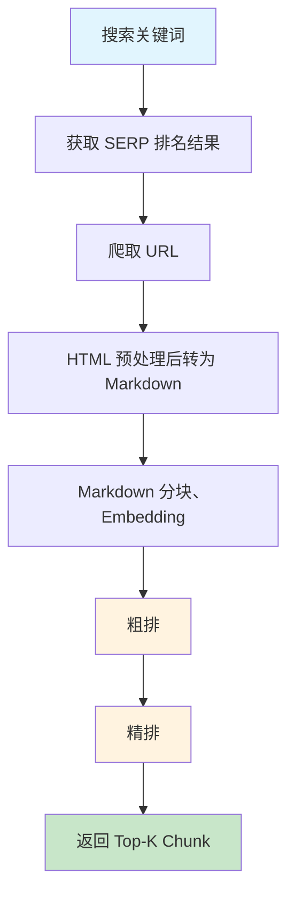

## 检索 confluence 的流程

```mermaid
graph TD
    A[搜索关键词] --> B[获取 SERP 排名结果]
    B --> C[爬取 URL]
    C --> D[HTML 预处理后转为 Markdown]
    D --> E[Markdown 分块、Embedding]
    E --> F[粗排]
    F --> G[精排]
    G --> H[返回 Top-K Chunk]
    
    style A fill:#e1f5fe
    style H fill:#c8e6c9
    style F fill:#fff3e0
    style G fill:#fff3e0
```