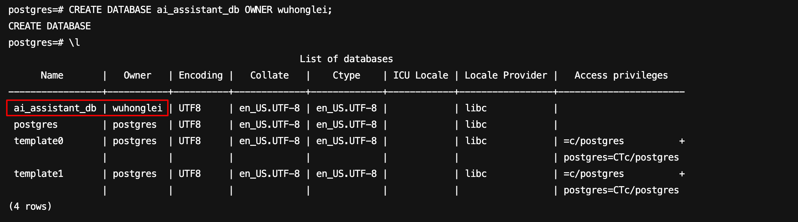

# Mac 安装 PostgreSQL

## 1. 安装 PostgreSQL

```bash
brew install postgresql
```

## 2. 启动 PostgreSQL

```bash
brew services start postgresql
```

## 3. 交互式终端连接 PostgreSQL

```bash
psql -U honglei.wu -d postgres
```

## 4. 创建用户

```sql
CREATE USER wuhonglei WITH PASSWORD 'xxxxxx';
```

## 5. 创建数据库

```sql
CREATE DATABASE ai_assistant_db OWNER wuhonglei;
```



**所有者权限:** 用户 wuhonglei 将获得对 ai_assistant_db 数据库的全部权限:
  - 完全控制权：可以创建、修改、删除数据库中的对象
  - 权限管理：可以授予其他用户访问权限
  - 模式管理：可以在数据库中创建和管理模式

## 6. 数据库连接
mac 上可以使用 `DBeaver`
