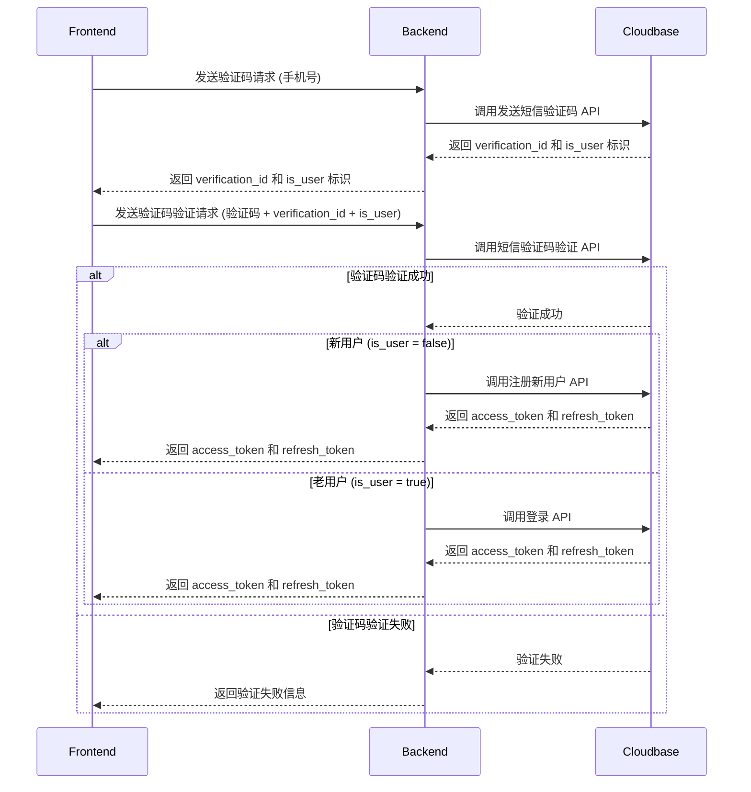

## 用户认证流程

### 用户登录流程图




### 前端 Token 处理说明

#### Token 保存策略

用户登录成功后，前端需要安全地保存 `access_token` 和 `refresh_token`：

1. **localStorage** (推荐用于开发环境)
   - 优点：简单易用，数据持久化
   - 缺点：存在 XSS 攻击风险

2. **sessionStorage** (推荐用于生产环境)
   - 优点：标签页关闭后自动清除，更安全
   - 缺点：标签页关闭后需要重新登录

3. **HttpOnly Cookie** (最安全，推荐生产环境)
   - 服务端设置 HttpOnly Cookie，前端无法直接访问
   - 可以设置 secure、sameSite 等安全属性

#### 推荐的保存方式

```javascript
// 登录成功后保存 token
const handleLoginSuccess = (tokens) => {
  // 保存到 localStorage（开发环境）
  localStorage.setItem('access_token', tokens.access_token);
  localStorage.setItem('refresh_token', tokens.refresh_token);

  // 或者保存到 sessionStorage（生产环境推荐）
  sessionStorage.setItem('access_token', tokens.access_token);
  sessionStorage.setItem('refresh_token', tokens.refresh_token);
};

// 获取 token
const getAccessToken = () => {
  return localStorage.getItem('access_token') || sessionStorage.getItem('access_token');
};

const getRefreshToken = () => {
  return localStorage.getItem('refresh_token') || sessionStorage.getItem('refresh_token');
};
```

#### 请求时携带 Token

后续 API 请求需要在 HTTP Header 中携带 `access_token`：

```javascript
// 在请求拦截器中自动添加 Authorization header
const apiClient = axios.create({
  baseURL: 'https://your-api-domain.com'
});

// 请求拦截器
apiClient.interceptors.request.use(
  (config) => {
    const accessToken = getAccessToken();
    if (accessToken) {
      config.headers.Authorization = `Bearer ${accessToken}`;
    }
    return config;
  },
  (error) => {
    return Promise.reject(error);
  }
);
```

#### Token 过期处理

当 `access_token` 过期时（通常返回 401 状态码），使用 `refresh_token` 获取新的 token：

```javascript
// 响应拦截器处理 token 过期
apiClient.interceptors.response.use(
  (response) => response,
  async (error) => {
    if (error.response?.status === 401) {
      // Token 过期，尝试刷新
      const refreshToken = getRefreshToken();
      if (refreshToken) {
        try {
          const refreshResponse = await axios.post('/auth/refresh', {
            refresh_token: refreshToken
          });

          // 保存新的 token
          handleLoginSuccess(refreshResponse.data);

          // 重试原请求
          error.config.headers.Authorization = `Bearer ${refreshResponse.data.access_token}`;
          return apiClient.request(error.config);
        } catch (refreshError) {
          // 刷新失败，跳转到登录页
          redirectToLogin();
        }
      }
    }
    return Promise.reject(error);
  }
);
```

#### 安全注意事项

1. **永远不要**在前端代码中暴露敏感信息
2. **使用 HTTPS** 传输 token
3. **定期轮换** refresh_token
4. **设置合适的过期时间** access_token（通常 1-2 小时）
5. **在登出时清除**所有存储的 token

### access token 刷新流程图
