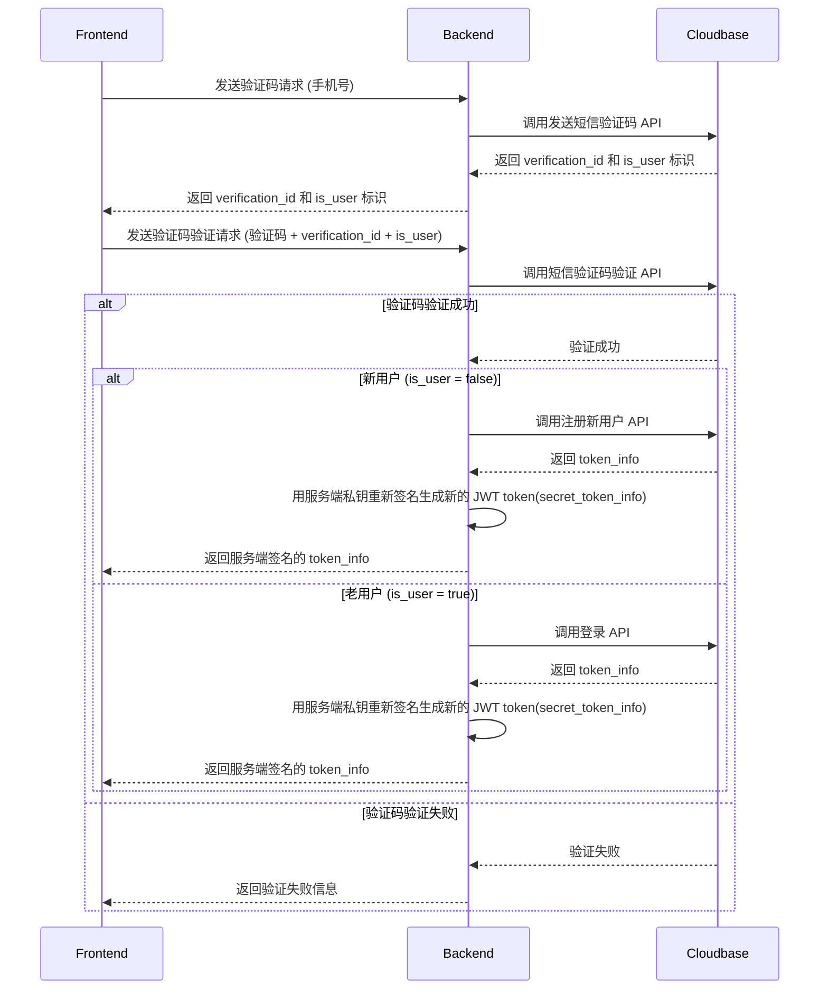

## 用户认证流程

用户认证通过后，cloudbase 返回的 json 数据如下, 后续将该数据统称为 `token_info`,
```json
{
  "token_type": "Bearer",
  "access_token": "eyJhbGciOiJSUzI1NiIsImtpZCI6IjlkMWRjMzFlLWI0ZDAtNDQ4Yi1hNzZmLWIwY2M2M2Q4MTQ5OCJ9.eyJpc3MiOiJodHRwczovL2FpLWFzc2lzdGFudC0wZzIyOWxiNGVkMWUzZTZjLmFwaS50Y2xvdWRiYXNlZ2F0ZXdheS5jb20iLCJzdWIiOiIxOTkwOTgwNjE4MTQ5NjkxMzkyIiwiYXVkIjoiYWktYXNzaXN0YW50LTBnMjI5bGI0ZWQxZTNlNmMiLCJleHAiOjE3NjM1MjkwNjksImlhdCI6MTc2MzUyMTg2OSwiYXRfaGFzaCI6InIuSTFnTUdnVWhSMUtEWTdaTHhBOWZiZyIsInNjb3BlIjoidXNlciBzc28iLCJwcm9qZWN0X2lkIjoiYWktYXNzaXN0YW50LTBnMjI5bGI0ZWQxZTNlNmMiLCJwcm92aWRlcl90eXBlIjoicGhvbmVfbnVtYmVyIiwibWV0YSI6eyJ3eE9wZW5JZCI6IiIsInd4VW5pb25JZCI6IiJ9LCJ1c2VyX2lkIjoiMTk5MDk4MDYxODE0OTY5MTM5MiIsInVzZXJfdHlwZSI6ImV4dGVybmFsIn0.FVIMOvq1hei_ZnJjyUBqWDq_Tno8qWg7s3zGjpAgcYlkpvBnLbuyG_Fn4OhTsU-HyXVILvzqJwP8rYLa78DysBoMgB8p0E-UjqUQBfzjZB0cnbFdo2W56CmAQsap_tVOJ9jMk2fE28UUll93ZEol035oh0Iz9Efx7BYHbC3as0kQ-Qp37TAOiHC7y50__PyxFNWaSaWxJBN7MmMNt9l8PC04XZunjWWMoeKBfWxSfdS7_PoniRcQeqzDZmwWub62I4KXEzDHcA_Qn0RHsNu-83tQei9qv1byo3cI1PpgFybiLlipGQiJSdvlnJ287F0Corlql0Pa1rSG74s6pjF1zg",
  "refresh_token": "m.SmT_ZVyMOmlEwk0OgvMH1jIJpqKKyV8MZbg",
  "expires_in": 7200,
  "sub": "1990980618149691392"
}
```

### 用户登录流程图




### 前端 Token 处理说明

#### 请求时携带 Token

后续 API 请求需要在 HTTP Header 中携带 `secret_token_info`：

```javascript
// 在请求拦截器中自动添加 Authorization header
const apiClient = axios.create({
  baseURL: 'https://your-api-domain.com'
});

// 请求拦截器
apiClient.interceptors.request.use(
  (config) => {
    const jwtToken = getJWTToken();
    if (jwtToken) {
      config.headers.Authorization = `Bearer ${jwtToken}`;
    }
    return config;
  },
  (error) => {
    return Promise.reject(error);
  }
);
```

#### Token 自动刷新（服务端处理）

**服务端自动刷新机制**：当 `secret_token_info` 过期时，服务端会自动使用 `refresh_token` 刷新 token，并在响应头中返回新的 token。前端只需从响应头中获取新 token 并更新即可。

**前端实现**：

```javascript
// 响应拦截器：从响应头获取新 token 并自动更新
apiClient.interceptors.response.use(
  (response) => {
    // 检查响应头中是否有新的 token
    const newSecretTokenInfo = response.headers['x-new-secret-token-info'];

    if (newSecretTokenInfo) {
      // 更新本地存储的 token
      localStorage.setItem('secret_token_info', newSecretTokenInfo);
      // 更新当前请求的 token（用于后续重试）
      if (response.config) {
        response.config.headers.Authorization = `Bearer ${newSecretTokenInfo}`;
      }
    }

    return response;
  },
  async (error) => {
    // 如果服务端返回 401，说明 refresh_token 也过期了，需要重新登录
    if (error.response?.status === 401) {
      // 清除本地 token
      localStorage.removeItem('x-new-secret-token-info');
      // 跳转到登录页
      redirectToLogin();
    }
    return Promise.reject(error);
  }
);

// 请求拦截器：在请求头中携带 refresh_token（可选，也可以从 Cookie 获取）
apiClient.interceptors.request.use(
  (config) => {
    const secretTokenInfo = getSecretTokenInfo();
    if (secretTokenInfo) {
      config.headers.Authorization = `Bearer ${secretTokenInfo}`;
    }

    return config;
  },
  (error) => {
    return Promise.reject(error);
  }
);
```

**优势**：
- ✅ **简化前端逻辑**：前端无需处理 token 刷新逻辑
- ✅ **自动透明刷新**：用户无感知，体验更好
- ✅ **统一管理**：所有刷新逻辑集中在服务端
- ✅ **安全性更高**：refresh_token 不会暴露在前端代码中

#### 安全注意事项

1. **永远不要**在前端代码中暴露敏感信息
2. **使用 HTTPS** 传输 token
3. **在登出时清除** 所有存储的 token

### 后端接口如何验证 Access Token 有效性

后端收到前端请求后，需要验证 `secret_token_info` 的有效性。

#### 服务端重新签名 JWT（最推荐，性能最优）

**核心思路**：服务端接收到 Cloudbase 返回的 token_info 后，用自己的私钥重新签名生成新的 JWT token(secret_token_info)，前端使用这个新 token，服务端可以本地快速验证。

**优势**：
- ✅ **性能最优**：无需每次请求都调用 Cloudbase API
- ✅ **本地验证**：直接验证 secret_token_info 签名和过期时间
- ✅ **可控性强**：可以自定义过期时间和 payload
- ✅ **安全性高**：使用服务端私钥签名，只有服务端能验证

**实现步骤**：将 token_info 转换为 secret_token_info

```python
    secret_token_info = create_secret_token_info(token_info)
    return secret_token_info
```

2. **在登录接口中使用**

```python
from app.api.auth import router
from app.utils.jwt_auth import JWTAuth
from app.models.response import ApiResponse

@router.post("/login")
async def login(login_request: LoginRequest):
    """用户登录"""
    # 1. 调用 Cloudbase 登录 API
    cloudbase_response = await call_cloudbase_login(...)
    
    # 2. 重新签名生成 secret_token_info
    secret_token_info = create_secret_token_info(cloudbase_response)
    
    # 3. 返回给前端
    return ApiResponse.success(data=secret_token_info)
```

3. **验证 token（依赖注入方式）**

```python
from fastapi import Depends, HTTPException, Request
from typing import Annotated
from app.utils.jwt_auth import JWTAuth

# 方案一：带自动刷新的验证函数（推荐）
from fastapi import Response
from app.utils.auth_deps import get_current_user_with_auto_refresh

async def get_secret_token_info(
    request: Request,
    response: Response
) -> dict:
    """从请求头中获取并验证 secret_token_info，支持自动刷新
    
    如果 secret_token_info 过期，会自动使用 refresh_token 刷新，
    并在响应头中返回新的 token。
    """
    # 使用自动刷新功能
    user_info = await get_current_user_with_auto_refresh(request, response)
    
    # 返回完整的 payload（包含 Cloudbase token 信息）
    return {
        "user_id": user_info.get("user_id"),
        "sub": user_info.get("user_id"),  # JWT 标准字段
        "access_token": user_info.get("access_token"),
        "refresh_token": user_info.get("refresh_token"),
    }

# 方案二：不带自动刷新的验证函数（不推荐，仅用于特殊场景）
async def get_secret_token_info_simple(request: Request) -> dict:
    """从请求头中获取并验证 secret_token_info（不自动刷新）"""
    auth_header = request.headers.get('authorization')
    if not auth_header or not auth_header.startswith('Bearer '):
        raise HTTPException(status_code=401, detail="缺少认证令牌")

    secret_token_info = auth_header.replace('Bearer ', '')

    # 本地验证 secret_token_info（无需调用 Cloudbase API）
    payload = JWTAuth.verify_token(secret_token_info, token_type="access")
    
    return payload

# 在需要认证的接口中使用（推荐：带自动刷新）
@router.post("/protected-endpoint")
async def protected_endpoint(
    request: Request,
    response: Response,
    secret_token_info: Annotated[dict, Depends(get_secret_token_info)]
):
    """需要认证的接口，支持自动刷新 token"""
    user_id = secret_token_info["user_id"]
    # 如果 token 过期，服务端会自动刷新并在响应头中返回新 token
    return {"message": f"Hello {user_id}"}

# 不推荐：不带自动刷新的接口
@router.post("/protected-endpoint-simple")
async def protected_endpoint_simple(
    secret_token_info: Annotated[dict, Depends(get_secret_token_info_simple)]
):
    """需要认证的接口，不自动刷新 token（token 过期会直接返回 401）"""
    user_id = secret_token_info.get("sub")
    return {"message": f"Hello {user_id}"}
```

**推荐使用方案一（带自动刷新）的原因**：
1. ✅ **用户体验更好**：token 过期时自动刷新，用户无感知
2. ✅ **前端简化**：前端只需从响应头获取新 token，无需处理刷新逻辑
3. ✅ **统一管理**：所有刷新逻辑集中在服务端，便于维护
4. ✅ **安全性更高**：refresh_token 处理逻辑不暴露在前端

4. **Token 刷新**

```python
@router.post("/refresh")
async def refresh_token(refresh_request: RefreshTokenRequest):
    """刷新 access_token"""
    # 验证 secret_token_info
    payload = JWTAuth.verify_token(
        refresh_request.refresh_token,
        token_type="refresh"
    )
    
    # 使用 Cloudbase 的 refresh_token 获取新的 token
    refresh_token = payload.get("refresh_token")
    new_token_info = await call_cloudbase_refresh(refresh_token)
    
    # 重新签名生成新的 secret_token_info
    new_secret_token_info = create_secret_token_info(new_token_info)
    
    return ApiResponse.success(data=new_secret_token_info)
```

**注意事项**：
- 服务端 token 的 payload 中包含 Cloudbase 的原始 token，用于需要调用 Cloudbase API 的场景
- 服务端 token 的过期时间应该短于 Cloudbase token 的过期时间
- 当服务端 token 过期时，使用 refresh_token 刷新，同时也会刷新 Cloudbase token
