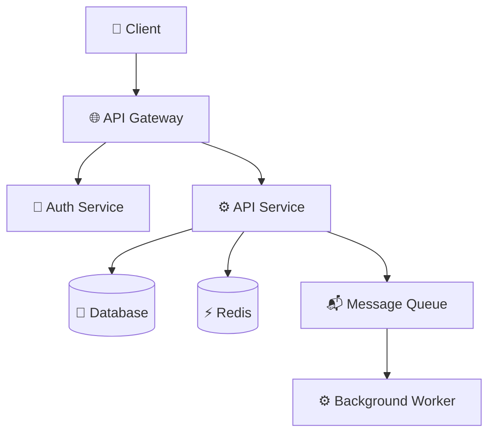

# Mermaid Architect - Comprehensive Diagram & Documentation Skill

**Version 2.0** - Hierarchical architecture with intelligent orchestration

A powerful Claude Code skill for creating Mermaid diagrams and design documents using on-demand guide loading, code-to-diagram generation, and Python utilities.

## Installation

### One-Click Install via Skilz Marketplace

Install this skill instantly from the [Skilz Marketplace](https://skillzwave.ai/skill/SpillwaveSolutions__design-doc-mermaid__design-doc-mermaid__SKILL/):

```bash
skilz install SpillwaveSolutions_design-doc-mermaid/design-doc-mermaid
```

### Manual Installation

Clone directly into your Claude Code skills directory:

```bash
# Navigate to your skills directory
cd ~/.claude/skills

# Clone the repository
git clone https://github.com/SpillwaveSolutions/design-doc-mermaid.git
```

### Verify Installation

After installation, verify the skill is available:

```bash
# List installed skills
ls ~/.claude/skills/design-doc-mermaid

# Or ask Claude Code
# "List my installed skills"
```

## What This Skill Does

**Intelligent Diagram Generation:**
- Activity diagrams (workflows, processes, business logic)
- Deployment diagrams (cloud infrastructure, K8s, serverless)
- Architecture diagrams (system components, microservices)
- Sequence diagrams (API flows, service interactions)
- Complete design documents with embedded diagrams

**Code-to-Diagram Conversion:**
- Extract architecture from Spring Boot applications
- Generate deployment diagrams from configuration files
- Create sequence diagrams from method calls
- Document ETL pipelines and data flows

**Diagram Management:**
- Extract Mermaid diagrams from Markdown files
- Write fenced mermaid blocks or `.mmd` files by default
- Validate diagram syntax with mermaid-cli when asked
- Convert to PNG/SVG only when explicitly requested, or when the target is Confluence, Notion, Word, or PDF

## Quick Start

### Create an Activity Diagram

```
User: "Create an activity diagram for user registration with email verification"
```

The skill will:
1. Load `references/guides/diagrams/activity-diagrams.md`
2. Use the registration pattern template
3. Add Unicode symbols (🔐 for security, 📧 for email, ✅ for success)
4. Apply high-contrast styling
5. Output complete Mermaid diagram

### Generate from Code

```
User: "Here's my Spring Boot application.yml - generate a deployment diagram"
```

The skill will:
1. Analyze configuration (datasource, cache, security)
2. Load `references/guides/diagrams/deployment-diagrams.md`
3. Load `examples/spring-boot/README.md`
4. Map config to cloud resources
5. Generate deployment diagram with resource specs

### Create Design Document

```
User: "Create an API design document for the contacts API"
```

The skill will:
1. Load `assets/api-design-template.md`
2. Load relevant diagram guides (sequence, ER, architecture)
3. Generate complete document with embedded diagrams
4. Save to `docs/design/api-contacts-v1-2025-01-13.md`

## Structure

### Hierarchical Organization

```
mermaid-architect/
├── SKILL.md                          # Main orchestrator with decision tree
├── README.md                         # This file
├── CLAUDE.md                         # Claude Code instructions
│
├── references/                       # Reference materials
│   ├── mermaid-diagram-guide.md     # Legacy general guide
│   └── guides/                       # Specialized guides (load on-demand)
│       ├── diagrams/
│       │   ├── activity-diagrams.md      # ✅ Complete
│       │   ├── deployment-diagrams.md    # ✅ Complete
│       │   ├── architecture-diagrams.md  # ✅ Complete
│       │   └── sequence-diagrams.md      # ✅ Complete
│       ├── code-to-diagram/
│       │   └── README.md                 # ✅ Complete (master guide)
│       ├── unicode-symbols/
│       │   └── guide.md                  # ✅ Complete (100+ symbols)
│       └── troubleshooting.md        # ✅ Complete (28 common errors)
│
├── scripts/                          # Python utilities
│   ├── extract_mermaid.py           # ✅ Extract & validate diagrams
│   └── mermaid_to_image.py          # ✅ Convert to PNG/SVG
│
├── examples/                         # Language-specific patterns
│   ├── spring-boot/                 # ✅ Complete
│   ├── fastapi/                     # ✅ Complete
│   ├── react/                       # ✅ Complete
│   ├── python-etl/                  # ✅ Complete
│   ├── node-webapp/                 # ✅ Complete
│   └── java-webapp/                 # ✅ Complete
│
└── assets/                           # Design document templates
    ├── architecture-design-template.md
    ├── api-design-template.md
    ├── feature-design-template.md
    ├── database-design-template.md
    └── system-design-template.md
```

## Key Features

### 1. Unicode Semantic Symbols

Every diagram uses meaningful Unicode symbols:



**Symbol Categories:**
- Infrastructure: ☁️ 🌐 🔌 📡 🗄️
- Compute: ⚙️ ⚡ 🔄 🚀 💨
- Data: 💾 📦 📊 📈 🗃️
- Messaging: 📨 📬 📤 📥 🐰
- Security: 🔐 🔑 🛡️ 🚪 👤
- Monitoring: 📝 📊 🚨 ⚠️ ✅ ❌

### 2. High-Contrast Styling

All diagrams use accessible, high-contrast colors - see SKILL.md for full details.

### 3. Python Utilities

#### Extract Diagrams

```bash
# List all diagrams in a file
python scripts/extract_mermaid.py document.md --list-only

# Extract to separate .mmd files
python scripts/extract_mermaid.py document.md --output-dir diagrams/

# Validate all diagrams
python scripts/extract_mermaid.py document.md --validate

# Replace diagrams with image references (for Confluence)
python scripts/extract_mermaid.py document.md --replace-with-images \
  --image-format png --output-markdown output.md
```

#### Convert to Images

```bash
# Single file
python scripts/mermaid_to_image.py diagram.mmd output.png

# Custom theme and size
python scripts/mermaid_to_image.py diagram.mmd output.svg \
  --theme dark --background white --width 1200

# Batch convert directory
python scripts/mermaid_to_image.py diagrams/ output/ \
  --format png --recursive

# From stdin
echo "graph TD; A-->B" | python scripts/mermaid_to_image.py - output.png
```

## Requirements

### For Diagram Generation
- Claude Code skill system (automatic)
- Guides and templates (included in this skill)

### For Image Export (only when requested)

Diagram generation does not need mermaid-cli. Install it only to render PNG or SVG:

```bash
# Install mermaid-cli globally
npm install -g @mermaid-js/mermaid-cli

# Verify installation
mmdc --version
```

### For Python Scripts
- Python 3.7+
- No additional packages required (uses stdlib only)

## Learning Path

### New to Mermaid Diagrams?

1. **Start with Activity Diagrams** - Read `references/guides/diagrams/activity-diagrams.md`
2. **Learn Unicode Symbols** - Read `references/guides/unicode-symbols/guide.md`
3. **Try an Example** - Use patterns from `examples/spring-boot/`
4. **Validate Your Work** - Run `python scripts/extract_mermaid.py --validate`

### Need to Document Existing Code?

1. **Identify Framework** - Spring Boot, FastAPI, React, etc.
2. **Load Example Guide** - Read `examples/{your-framework}/README.md`
3. **Match Patterns** - Find similar code patterns in examples
4. **Generate Diagrams** - Use templates from guides
5. **Validate** - Use validation scripts

### Creating Design Documents?

1. **Choose Template Type** - Architecture, API, Feature, Database, or System
2. **Load Template** - Read from `assets/{type}-design-template.md`
3. **Fill Sections** - Replace placeholders with actual content
4. **Add Diagrams** - Load diagram guides as needed for each section
5. **Use Symbols** - Enhance with Unicode symbols throughout
6. **Save** - Place in `docs/design/` with timestamp

## How the Hierarchical System Works

### Traditional Approach (Inefficient)
- Load entire skill documentation (~50KB)
- AI processes all templates and examples
- High token usage
- Slow response time

### Hierarchical Approach (Efficient)
1. **User makes request** → AI analyzes intent
2. **Decision tree activates** → Determines needed guides
3. **Load only what's needed** → Reads specific guide (~2-5KB)
4. **Generate output** → Uses targeted templates
5. **Token efficient** → 10x less context needed

### Example Flow

**User:** "Create deployment diagram for my Docker Compose setup"

**Decision Tree:**
```
1. Analyze: "deployment diagram" + "Docker Compose"
2. Determine: deployment-diagrams.md needed
3. Load: references/guides/diagrams/deployment-diagrams.md (2KB)
4. Find pattern: Docker Compose template exists
5. Generate: Using template + Unicode symbols
6. Output: Complete diagram in <30 seconds
```

**Tokens Used:** ~2,000 (vs ~10,000 with traditional approach)

## Completion Status

✅ **Complete:**
- Hierarchical decision tree orchestrator
- Activity diagram guide with templates
- Deployment diagram guide (AWS, GCP, K8s, serverless, Docker)
- Unicode symbols guide (100+ symbols)
- Extract Mermaid script with validation
- Mermaid to image conversion script
- Spring Boot code-to-diagram examples
- Design document templates (5 types)
- High-contrast styling system

🚧 **In Progress:**
- FastAPI examples
- React component architecture examples
- Python ETL pipeline examples

📋 **Planned:**
- Architecture diagrams guide
- Sequence diagrams guide
- Code-to-diagram master guide
- Node.js/Express examples
- Java web app examples

## Contributing

To add a new diagram type guide:

1. Create guide in `references/guides/diagrams/{type}-diagrams.md`
2. Include:
   - When to use
   - Basic syntax
   - Common patterns (3-5 templates)
   - Unicode symbol examples
   - Best practices
3. Update `SKILL.md` decision tree
4. Add examples with code mappings

To add a new language example:

1. Create directory in `examples/{framework}/`
2. Add `README.md` with:
   - Framework overview
   - Architecture diagram from structure
   - Deployment diagram from config
   - Sequence diagram from code
   - Activity diagram from logic
3. Update `SKILL.md` code-to-diagram table

## License

Part of Claude Code Skills - MIT License

## Related Skills

- **confluence** - Upload diagrams to Confluence
- **plantuml** - Alternative diagram format

## Links

- [GitHub Repository](https://github.com/SpillwaveSolutions/design-doc-mermaid)
- [Skilz Marketplace Listing](https://skillzwave.ai/skill/SpillwaveSolutions__design-doc-mermaid__design-doc-mermaid__SKILL/)
- [Mermaid Official Documentation](https://mermaid.js.org/)

---

**Version:** 2.0.0
**Updated:** 2025-01-13
**Maintained by:** SpillwaveSolutions
