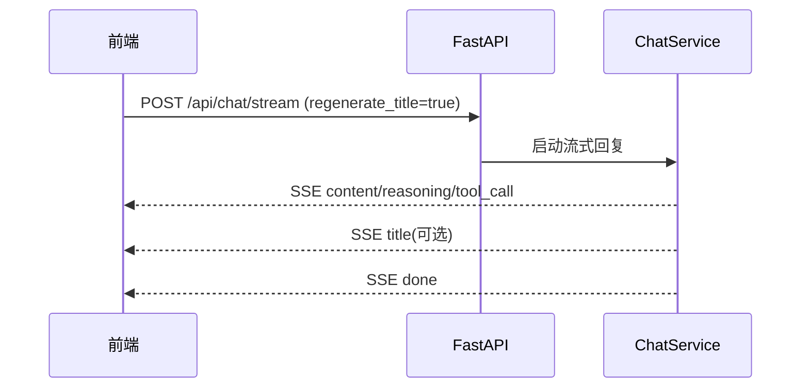
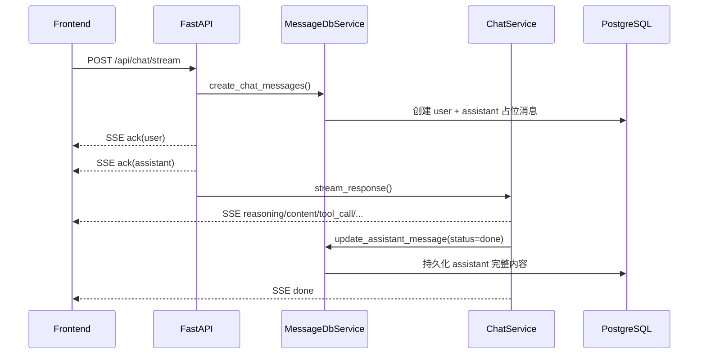

# 会话管理（当前实现）

## 1. 关键接口

- 创建会话：`POST /api/conversation/register`
- 会话列表：`GET /api/conversation/list`
- 会话详情：`GET /api/conversation/detail/{conversation_id}`
- 会话消息：`GET /api/conversation/{conversation_id}/messages`
- 更新标题：`PUT /api/conversation/update/{conversation_id}`
- 删除会话：`DELETE /api/conversation/delete/{conversation_id}`
- 删除消息：`DELETE /api/message/delete/{message_id}`
- 流式对话：`POST /api/chat/stream`

## 2. 标题生成流程

说明：
- 标题由后端在聊天流中按条件触发，并通过 SSE `title` 事件返回；
- 也可由前端后续调用 `PUT /api/conversation/update/{conversation_id}` 手动修改。

## 3. 消息保存与流式返回

说明：
- 当前接口只支持 `POST /api/chat/stream`，不存在 `/api/chat/resume`；
- 消息持久化由后端服务在流式开始与结束时分别写入；
- 前端历史消息通过 `GET /api/conversation/{conversation_id}/messages` 获取。

## 4. 边界与注意事项

- 鉴权：会话和消息接口需要 JWT（`Authorization: Bearer <token>`）；
- 失败处理：流式异常时会返回 SSE `error` 事件；
- 历史文档中出现的 Redis 缓存、`/api/chat/resume`、`/conversations` 路径不属于当前实现。
