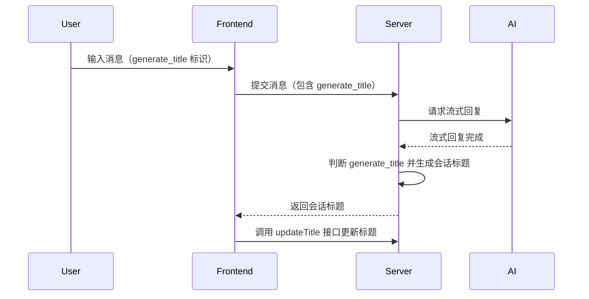
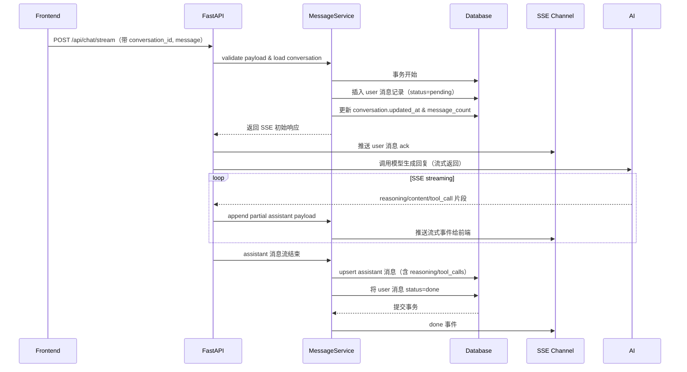

## 会话管理

### 如何生成会话标题

### 如何保存用户消息和助手消息

#### 1. 整体流程说明
- **用户消息**：前端在发送消息前将消息写入本地 Redux 队列并生成临时 ID，随后调用 `POST /api/chat/stream`。后端校验会话状态后，在数据库中创建一条 `role="user"` 的消息记录，状态字段标记为 `pending` 以支持幂等重试。
- **助手消息**：模型回复通过 SSE 按片段传播。服务端为本次回复生成 `assistant` 消息 ID，并在内存中累积 `content`、`reasoning`、`tool_calls`。当流式事件 `done` 到达后，将完整的助手消息一次性落库，并补充与用户消息的关联信息（如 `reply_to`）。
- **会话更新**：每次写入消息时统一更新 `conversation.updated_at`、`conversation.message_count`，并记录最后一条消息摘要，用于对话列表预览。

#### 2. 数据模型扩展
- `messages` 表新增字段：
  - `status`: `pending|done|failed`，默认 `pending`，用于标记消息落库状态。
  - `reply_to`: 关联上一条 user 消息 ID（助手消息使用），方便重试和上下文串联。
  - `tool_calls`: JSONB，存储结构化工具调用。
  - `metadata`: JSONB，记录模型参数、响应耗时、token 统计等。
- `conversation_snapshots`（可选）：存储对话最近 N 条消息摘要，用于快速加载。

#### 3. 后端实现要点
- **分层结构**：`router` 负责请求解析与 SSE 推送，`MessageService` 负责业务流程编排，`MessageRepository` 处理数据库读写。
- **事务控制**：用户消息写入与会话信息更新放在同一事务内；当助手消息入库时再次开启事务，保证消息与统计数据同步提交。
- **幂等策略**：所有消息 ID 均由服务端生成（UUID 或雪花算法）。在断线重传的场景下，前端会附带 `client_message_id`，后端先检查是否存在同一 `client_message_id` 的记录，若已存在则直接返回历史结果。
- **流式缓存**：助手消息的流式片段存储在 Redis（可选）或内存缓冲中，防止长流式响应导致内存上涨，可设置 32KB 块写入数据库草稿表。

#### 4. 前端配合方案
- **状态同步**：`conversationSlice` 维护 `pendingMessages` 与 `messages`，在收到 `pending` 状态的用户消息时立即渲染，等待 SSE `ack` 将其移动到正式消息列表。
- **失败重试**：若 SSE 连接异常，前端展示重试按钮，调用 `POST /api/chat/resume`，附带 `client_message_id`，后端读取未完成的助手消息继续推送。
- **分页加载**：历史消息通过 `GET /api/conversation/{id}/messages?offset=n&limit=m` 增量获取，前端在滚动到顶部时触发懒加载。

#### 5. 异常与监控
- **错误回滚**：若助手生成失败，后端将用户消息状态标记为 `failed` 并写入错误原因；同时通过 SSE `error` 事件通知前端。
- **补偿任务**：引入定时任务扫描 `status="pending"` 且超时的消息，尝试补偿或标记失败。
- **指标采集**：记录消息写入耗时、SSE 时长、失败率，接入 Prometheus 监控。

#### 6. 安全与合规
- 对 `content`、`metadata` 进行脱敏过滤，避免敏感信息直存。
- 数据库层开启行级权限控制，确保仅当前用户能访问其对话数据（多用户扩展预留）。
- 消息内容在静态存储时支持列级加密（如 SQLite 使用 `sqlcipher`，PostgreSQL 使用透明加密）。

