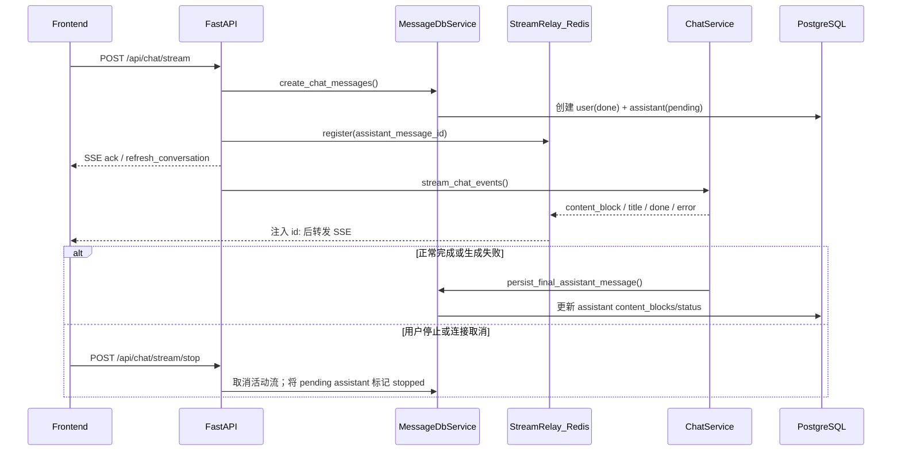

# 会话管理（当前实现）

本文档描述当前仓库中的会话、消息与聊天流式协议。实现入口主要位于：

- 后端：`backend/app/api/conversation.py`、`backend/app/api/chat.py`、`backend/app/api/message.py`
- 流式协议：`backend/app/protocols/chat_messages.py`、`backend/app/services/chat/stream_relay.py`
- 前端消费：`frontend/src/services/chat.ts`、`frontend/src/hooks/chat.ts`

## 1. 关键接口

### 会话

- 创建会话：`POST /api/conversation/register`
- 激活草稿：`PUT /api/conversation/activate/{conversation_id}`
- 会话列表：`GET /api/conversation/list?limit=20&cursor=<opaque>`
- 会话搜索：`GET /api/conversation/search?q=<keyword>&limit=20&cursor=<opaque>`
- 会话详情：`GET /api/conversation/detail/{conversation_id}`
- 会话消息：`GET /api/conversation/{conversation_id}/messages?full_content=false`
- 手动压缩：`POST /api/conversation/{conversation_id}/compress`
- 更新标题：`PUT /api/conversation/update/{conversation_id}`
- 删除会话：`DELETE /api/conversation/delete/{conversation_id}`

会话列表使用 keyset 游标分页。首页不传 `cursor`；后续请求原样回传上一页的
`next_cursor`。`limit` 默认为 20，范围为 1–100：

```json
{
  "conversations": [],
  "next_cursor": "AZ0...",
  "has_more": true,
  "limit": 20
}
```

排序键为 `(last_message_created_at DESC, id DESC)`。游标是服务端生成的 URL-safe
Base64 不透明值，客户端不应解析或自行构造；非空但无法解码的游标返回 HTTP 400。
该接口不支持页码跳转。

#### 会话搜索

按标题与消息正文搜索当前用户的**已激活**会话。实现：`ConversationDbService.search_conversations`。

| 匹配面 | 生产 PostgreSQL | 其它方言（单测 SQLite） |
|--------|-----------------|-------------------------|
| 标题 | `title ILIKE`（转义 `%` `_` `\`） | 同左 |
| 正文 | `content_tsv @@ plainto_tsquery('zhcfg', q)` | `content_text ILIKE` |

正文只索引 `content_blocks` 里 `type=text` 的拼接文本（`content_text` / `content_tsv`）。图片、PDF、工具结果等非 text 块不可搜。仅 `role in (user, assistant)` 且 `status=done` 的消息参与；同一会话去重。

- `q`：1–200 字符（Pydantic）；空串在服务层直接返回空页
- `limit`：默认 20，范围 1–100；`cursor` 语义与列表一致
- 排序仍是 `(last_message_created_at DESC, id DESC)`，**不用** `ts_rank`

命中优先级：标题子串（大小写不敏感）→ 最早一条正文命中消息。`match_type` 为 `title` | `user` | `assistant`。

```json
{
  "conversations": [
    {
      "id": "...",
      "title": "...",
      "match_type": "title",
      "snippet": "",
      "updated_at": "2026-08-01T12:00:00+08:00"
    }
  ],
  "next_cursor": null,
  "has_more": false,
  "limit": 20
}
```

`snippet` 只在正文命中时给出（关键词前后约 40 字）；标题命中可为空。snippet 用子串定位，全文检索命中的词可能与原始 `q` 不完全相同，此时回退到正文前 80 字。

运维与触发器、zhparser 镜像约定见 `docs/CONVERSATION_SEARCH_OPTIMIZATION.md`。

#### 草稿会话与激活

`POST /api/conversation/register` 接受 `is_active`（默认 `true`）。欢迎页在用户**先上传附件**时会创建 `is_active=false` 的草稿，避免空会话出现在侧栏；首条消息发送前再调用 `PUT /api/conversation/activate/{conversation_id}` 将其设为可见。无草稿时欢迎页直接 `register({ is_active: true })`。

列表与搜索都带 `WHERE is_active`；草稿对 `GET /api/conversation/list` / `search` 不可见，但详情 / 消息 / 压缩仍可按 ID 访问（需属主）。

#### 手动全量压缩

`POST /api/conversation/{conversation_id}/compress` 无请求体。后端用 `summarization` 场景模型把当前会话消息摘要写入 `conversation_contexts`：

| 字段 | 含义 |
|------|------|
| `summary_before_window` | 窗口外 / 全量摘要正文 |
| `last_summarized_message_ids` | 已纳入摘要的消息 ID（后续问答会从 LLM history 中剔除） |

聊天记录**仍保留在 `messages` 表与前端界面**；压缩只影响后续模型上下文。实现：`HistoryContextService.compact_full_conversation`。

成功响应 `data`：

```json
{
  "summary": "……",
  "tokens_before": 12800,
  "tokens_after": 640,
  "summarized_message_count": 24
}
```

约束与错误：

| 条件 | 结果 |
|------|------|
| 会话不存在或不属于当前用户 | `404 会话不存在` |
| 存在 `status=pending` 的助手消息 | `409 对话进行中，无法压缩` |
| 会话没有消息 | `400 会话没有可压缩的消息` |
| 摘要 LLM 返回空 | `500 会话压缩失败，请稍后重试` |
| 当前消息 ID 集合已全部摘要过且已有摘要 | 幂等返回已存摘要，**不再调 LLM** |
| 已有摘要且仅有新增消息 | 增量 `summarize_merge`，ID 做 UNION 写入 |

后续 `POST /api/chat/stream` 会 `get_stored_window_summary` + `filter_summarized_history`：已摘要消息不再进入 LLM messages，摘要注入 `window_out_summary`。自动切窗（统一守卫 Step 3）与手动压缩共用同一张表；自动摘要会 UNION 已有 ID，避免覆盖手动全量结果。

前端侧栏确认后调用，超时设为 **120s**（`conversationAPI.compressConversation`）。容器 Nginx 通用 `/api` 读超时仍是 **60s**；长会话压缩可能被网关切断，需为该路径单独放宽，或接受超时后重试（幂等）。

#### 消息列表与 `full_content`

`GET /api/conversation/{conversation_id}/messages` 默认 `full_content=false`：当
`tool_result` 存在 `structured_content_for_display` 时，会省略块内的 `content` /
`summary`，减小列表体积。评估 / replay 需要完整工具结果时传
`full_content=true`。前端聊天页不传该参数（走默认）。

无论 `full_content` 取值如何，列表响应都会从 `message_metadata` **剥离**
`llm_rendered_text`（见下节）。历史加载走 `MessageDbService.get_history_messages_by_ids`，
**保留**该字段供下一轮回放。

#### `llm_rendered_text`（跨轮前缀缓存）

当轮首次 LLM 调用前，`ChatOrchestrator` 用 `get_user_message_for_tool_calls(...)`
渲染发给模型的 user 文本（含 `<user_message>` / `<user_memories>` / `<current_datetime>`
等），写入 `message_metadata.llm_rendered_text`，再原样传给 `ChatSessionAgent`
（Agent **不再**重包）。memories 为空也会写入。无需 DB 迁移（JSON 列已有）。

下一轮 `format_chat_message_for_llm` / `count_chat_message_tokens` 优先读这份快照：
有则作为 `leading_text`（图片仍走 `content_blocks` 的 ImageBlock → base64）；
无快照或空白则回退裸文本 / TextBlock。意图：第 N 轮增强后的 user 消息在第 N+1 轮
字节级复现，前缀缓存可续到上一轮结束。效果数据见
`docs/token_cache/plan_a_llm_rendered_text_report.md`。

### 消息

- 删除消息：`DELETE /api/message/delete/{message_id}`
- 更新助手消息反馈：`PUT /api/message/feedback/{message_id}`

反馈接口仅允许更新当前用户会话中的助手消息。`value` 支持 `default`、`like`、
`dislike`；`reasons` 是多选理由标签，`comment` 是可选自由文本：

```json
{
  "value": "dislike",
  "reasons": ["回答不准确", "没有解决问题"],
  "comment": "引用的版本已经过期"
}
```

更新 `like` 或 `dislike` 时，省略 `reasons` 或 `comment` 会保留该字段的已有值；
传入空数组可清空理由。`comment` 当前无法通过 `null` 单独清空，因为 `null` 与
省略都表示保留已有值。传入 `value=default` 会同时清空理由和评论。

成功响应的 `data` 包含服务端写入的 `updated_at`：

```json
{
  "value": "dislike",
  "updated_at": "2026-07-18T12:00:00+08:00",
  "reasons": ["回答不准确", "没有解决问题"],
  "comment": "引用的版本已经过期"
}
```

点踩侧效应（异步、失败不阻断反馈接口）：

- `value=dislike` → 入 Bad Case 队列（`source=thumb_down`）
- 从 `dislike` 改回 `value=default` → dismiss 该消息下仍为 `pending` 的 thumb_down 条目

复核 API 见 `backend/docs/EVAL_OPS.md`（`/api/eval/bad-cases`）。

### 聊天

- 流式对话：`POST /api/chat/stream`
- 断线续流：`POST /api/chat/stream/resume`
- 停止流式对话：`POST /api/chat/stream/stop`
- 模型列表：`GET /api/chat/models`

`POST /api/chat/stream` 会先创建用户消息与助手占位消息，再通过 SSE 返回生成过程。若请求中包含图片块，后端会校验所选模型的 `image_support`，不支持图片输入时返回 `400 当前模型不支持图片输入`。

当前轮发给模型的 `<current_datetime>` **冻结为该用户消息的 `created_at`**（本地时区 `YYYY-MM-DD HH:MM:SS 星期X`），由 `ChatOrchestrator` 传入 `ChatSessionAgent._turn_datetime`。记忆检索 / RAG / 守卫重建都复用同一字符串，避免中间步骤把时间往后推。不要把时间写进 system prompt（会打穿前缀缓存）。历史 user 消息**尚未**补 `<current_datetime>`；方案与差异见 `docs/history-datetime-injection-plan.md`。

可选 `task_action`（仅 Agent 模式生效，普通模式忽略）：

| 值 | 行为 |
|----|------|
| 省略 / `null` | 正常工具循环；Agent 模式预算 **90** 轮，普通模式 **10** 轮 |
| `continue` | 追加续跑预算 **50** 轮；第一轮注入「用户已确认继续」notice |
| `summarize` | **跳过工具循环**，基于已有历史直接总结 |

`task_action` 为 `continue` / `summarize` 时跳过 Mem0 检索（按钮文案不是新查询）。前端检查点按钮发送的用户正文分别为「请继续执行剩余工作。」与「到此为止，请基于已有内容生成总结。」。轮次常量见 `MCPToolSession`。

## 2. 消息内容模型

当前 `messages` 表不再使用旧的 `content` / `reasoning` / `tool_calls` 独立列保存主体内容，消息正文统一在 `content_blocks` JSON 字段中表示。搜索冗余列：`content_text`（TextBlock 纯文本拼接）、`content_tsv`（`zhcfg` tsvector，仅生产 PostgreSQL 有意义）。常见块类型包括：

- 用户侧：`text`、`image`、`pdf`、`markdown`
- 助手侧：`text`、`thinking`、`tool_use`、`tool_result`

运行时状态字段：

- `status`：`pending | stopped | done | failed`
- `reply_to`：助手消息关联的用户消息 ID
- `message_metadata`：请求配置、回复关系等元数据。用户消息会写入 `llm_rendered_text`（当轮发给 LLM 的完整 user 文本，**仅内部回放**；列表 API 已剥离）与可选 `user_memories`（供 eval replay）。Agent 触达轮次上限时助手消息还会写入 `iteration_checkpoint`（`iterations_used` / `continue_budget`）
- `feedback`：助手消息反馈，包含 `value`、`updated_at`、`reasons` 和 `comment`

附件块可携带可选 `token_size`（上传时按 embedding tokenizer 计算；历史数据可能缺省）。`agent_mode=0` 时，问答仅处理**当前轮**附件：短文档注入全文，长文档在问答阶段按需 embedding 后做 RAG；不再扫描 `history_ids` 中的历史附件。

## 3. 流式协议（SSE）

后端统一通过 `data:` 行发送 JSON，不使用 `event:` 行。客户端应解析 `data` 中的 `type` 字段分发事件。每条 SSE 帧还会带标准 `id:` 行（1-based 整数），用于断点续传：

```text
id: 1
data: {"type":"ack","data":{...}}

id: 4
data: {"type":"content_block","data":{"op":"append","block":{...}}}
```

`id` 由 Redis 版 `StreamRelay` 在写入 Redis Stream 时分配，客户端通过请求头 `Last-Event-ID` 回传游标。前端会把服务端的 snake_case 字段转换为 camelCase。

### 3.1 事件类型

| 类型 | 说明 |
|------|------|
| `ack` | 用户消息或助手占位消息已创建，`data` 为消息对象 |
| `refresh_conversation` | 会话列表中的会话信息需要刷新 |
| `title` | 后端生成会话标题，通常由 `regenerate_title=true` 触发 |
| `content_block` | 内容块增量，承载正文、思考、工具调用和工具结果 |
| `done` | 本轮生成完成，助手消息已持久化 |
| `error` | 本轮生成失败 |

历史文档中的 `mcp_tool_call`、`reasoning`、`content` 顶层事件已不是现网协议；这些信息现在通过 `content_block.data` 表达。

### 3.2 `content_block` 增量

`content_block.data.op` 支持：

- `append`：追加一个完整内容块，例如 `text`、`thinking`、`tool_use`、`tool_result`
- `delta`：向指定块追加文本增量
- `tool_delta`：向指定 `tool_use` 块追加工具参数增量
- `finalize_round`：一轮工具/模型交互结束
- `done`：内容块流结束

前端类型定义见 `frontend/src/interfaces/contentBlock.ts`。

### 3.3 `done` 与 `error`

后端 `done.data` 原始字段：

- `content_length`
- `reasoning_length`
- `tool_calls_length`
- `updated_at` / `last_message_updated_at`
- `iteration_checkpoint`（可选）：仅 Agent 模式触达本 turn 工具轮次上限时出现

```json
{
  "conversation_id": "...",
  "assistant_message_id": "...",
  "content_length": 420,
  "reasoning_length": 0,
  "tool_calls_length": 12,
  "updated_at": "...",
  "last_message_updated_at": "...",
  "iteration_checkpoint": {
    "iterations_used": 90,
    "continue_budget": 50
  }
}
```

`iteration_checkpoint` 同时写入该助手消息的 `message_metadata`，刷新页面后仍可渲染「继续执行 / 到此为止」按钮。前端解析后为 camelCase：`contentLength`、`iterationCheckpoint.iterationsUsed` 等。

`error.data` 至少包含：

- `content`：错误信息
- `conversation_id`：生成阶段异常时会携带

## 4. 断线续流

### 4.1 请求

```http
POST /api/chat/stream/resume
Last-Event-ID: 12
Content-Type: application/json
Last-Event-ID: 12

{
  "assistant_message_id": "assistant-message-id"
}
```

`Last-Event-ID` 为客户端最近成功消费的 SSE `seq`；请求体只包含要续流的 `assistant_message_id`。

后端会校验：

1. `assistant_message_id` 对应消息存在且角色为 `assistant`
2. 该消息所属会话属于当前登录用户
3. Redis 中仍存在该助手消息对应的流缓冲（TTL 内）

### 4.2 Redis 数据模型

| Key | 类型 | 用途 |
|-----|------|------|
| `chat:sse:stream:{assistant_message_id}` | Stream | SSE 事件 payload |
| `chat:sse:meta:{assistant_message_id}` | Hash | `status`（`pending` / `stopped` / `done` / `failed`）/ `created_at` / `last_event_id` |
| `chat:sse:seq:{assistant_message_id}` | String | event_id 单调递增计数器（INCR） |
| `chat:turn:{user_id}:{conversation_id}:{client_turn_id}` | String | turn 幂等记录（JSON 或 `pending`） |

### 4.3 边界

- 续流缓冲存储在 **Redis Stream**，可跨 worker / 进程共享（需 Redis 可达）。
- **不设条数上限**；整 key 靠 TTL 过期删除（活跃默认 2h，`close` 后默认 30min）。
- meta `status` 与 DB `MessageStatus` 语义对齐：`pending` 可写入；`stopped` / `done` / `failed` 为终态，不再 append。
- 生成完成后流标记 `done`（或失败时 `failed`），TTL 缩短；过期后续流接口返回空 SSE。
- 用户 stop 时任意 worker 将 meta 设为 `status=stopped`；持有 producer 的 worker 轮询到后取消任务。同 worker 仍有本地 task cancel 快路径。
- 前端从历史消息恢复时无法得知精确 `Last-Event-ID`，会从 `0` 开始尝试续传仍在活动中的助手流。
- `client_turn_id` 幂等缓存也在 Redis，相同 turn 的重试不会重复创建用户/助手消息。

## 5. 消息保存与流式返回



正常完成时，助手消息以 `done` 写入；生成失败时以 `failed` 写入。用户主动停止或连接取消时，助手消息可能以 `stopped` 持久化；取消发生在生成协程内时，后端会先同步已聚合的 `content_blocks` 再更新消息，避免已生成的文本、思考或工具块丢失。

## 6. 标题生成流程

- 触发条件：`POST /api/chat/stream` 且 `regenerate_title=true`
- 返回事件：`title`
- 也可由前端调用 `PUT /api/conversation/update/{conversation_id}` 手动修改

## 7. Nginx / 反向代理（SSE）

容器前端入口配置见 `frontend/nginx.conf`：

| location | 超时 | 缓冲 | 用途 |
|----------|------|------|------|
| `^~ /api` | `proxy_read/send_timeout 60s` | 默认 | 普通 API |
| `= /api/chat/stream` | `600s` | `proxy_buffering off` + `X-Accel-Buffering: no` | 主聊天 SSE |

要点：

- 精确匹配 `location = /api/chat/stream` 必须单独配置长超时并关闭缓冲，否则长对话会被 60s 切断或整段缓冲后才推给浏览器。
- `/api/chat/stream/resume` 与 `/api/chat/stream/stop` **落在** 通用 `/api`（60s）。续流若可能超过 60s，需在网关为 resume 增加同类 SSE 规则，或接受超时后由客户端重试 resume。
- `POST /api/conversation/{id}/compress` 同样走通用 `/api`（60s）。前端客户端超时是 120s，长会话摘要可能先被网关 60s 切断；需要时为 compress 单独放宽，或依赖幂等重试。
- 外层若还有 Nginx Proxy Manager / CDN，同样需要关闭缓冲并放宽读超时，否则前端仍会表现为「流卡住后断开」。

## 8. 常见坑

- 鉴权：会话、消息、聊天与模型列表接口都需要 JWT（`Authorization: Bearer <token>`）。
- `GET /api/conversation/{conversation_id}/messages` 在 `detail` 路由之前注册，路径不要写成旧的 `/conversations`。
- 需要完整 `tool_result.content` 时必须显式 `full_content=true`（默认会为结构化展示省略正文）。
- 会话搜索不是向量语义搜索：标题仍是 ILIKE 子串；正文在生产走 zhparser/`zhcfg` 全文检索（`plainto_tsquery`），单测 SQLite 回退 `content_text` ILIKE。空 `q` 会被校验拒绝。
- 换 PostgreSQL 镜像必须带 zhparser（`chat-agent-postgres:pg18-zhparser`）。迁移 `i2j3k4l5m6n7` 在扩展不可用时会失败；**勿** `docker compose down -v`。
- `<current_datetime>` 冻结在 user 消息 `created_at`，守卫重建不得重新取“现在”。
- SSE 客户端不要按 `event:` 分发事件，应从 `data` JSON 的 `type` 字段分发；续传游标使用 SSE `id:` / `Last-Event-ID`。
- 续流接口路径是 `/api/chat/stream/resume`，不是 `/api/chat/resume`。
- 多 worker 部署时必须保证 Redis 可达，否则 SSE 缓冲与 turn 幂等不可用。
- 生产 Gunicorn **不要**启用 `--preload`（Nacos gRPC fork 后可能 SIGSEGV）；见 `backend/docs/PROMETHEUS_METRICS.md`。
- 会话列表 / 搜索的 `cursor` 是不透明游标，不要缓存后自行改写，也不要继续发送旧的
  `offset` 参数。
- 反馈增量更新中，省略 `reasons` / `comment` 表示保留旧值；`value=default`
  才会同时清空两个字段，并可能 dismiss 点踩 Bad Case。
- 助手消息在生成中为 `pending`；`done` 表示完整生成已写入，`stopped` 表示用户停止或连接取消后已尽力保存当前已聚合内容。
- `stop` 通过 Redis meta `status=stopped` 跨 worker 生效；同 worker 仍走本地 producer task cancel。DB 落库由 orchestrator 的 `CancelledError` 收尾（含部分 `content_blocks`），stop 端点仅在仍为 `pending` 时做兜底。
- 欢迎页草稿用 `is_active=false`，列表/搜索看不到；发送首条消息前必须 `activate`，否则用户会以为会话丢失。
- 手动压缩不删消息，只写 `conversation_contexts` 并从后续 LLM history 剔除已摘要 ID；有 `pending` 助手消息时返回 409。
- Agent 触达 90 轮后会进入检查点而不是直接结束；用户须再发带 `task_action=continue|summarize` 的一轮。普通模式 10 轮上限后直接强制 final answer，无检查点。
- `task_action` 仅 Agent 模式生效；续跑 notice 只注入该 turn 的第一轮工具循环。
- `message_metadata.llm_rendered_text` 只给历史回放与 token 计数用，不要从
  `GET .../messages` 读取或回传前端。旧消息没有快照时会回退裸文本，跨轮前缀会断裂
  （这是方案落地前的基线行为，不是 bug）。
- 不要在 Agent / 守卫里重新调用 `get_user_message_for_tool_calls` 覆盖已固化文本，
  否则与落库快照不一致，前缀缓存失效。
